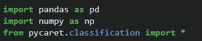
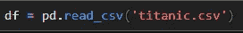
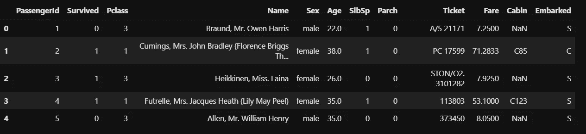
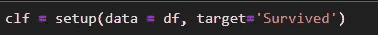
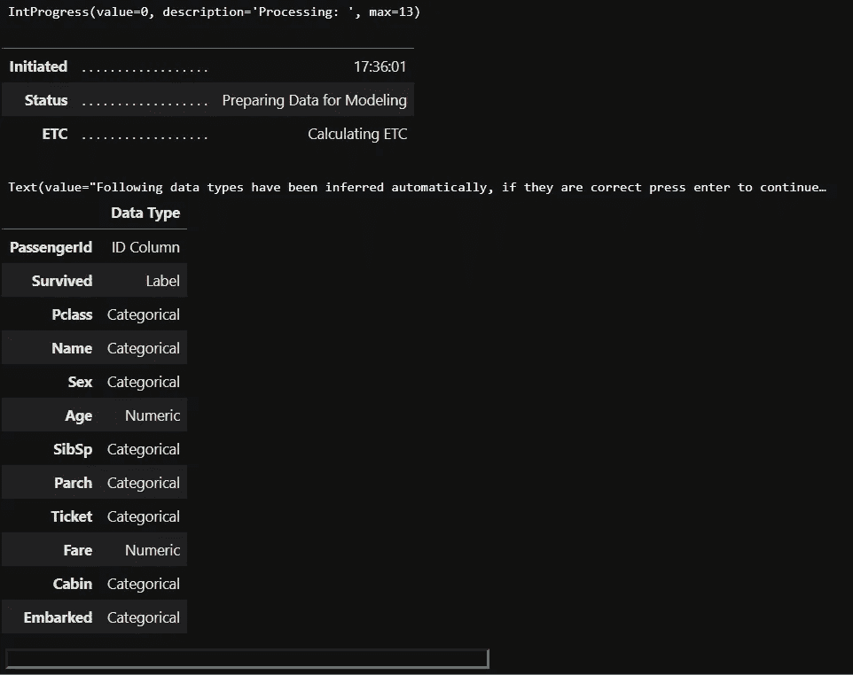
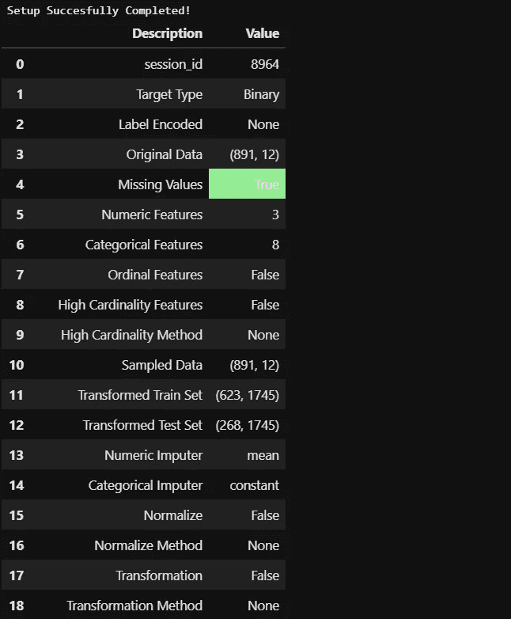
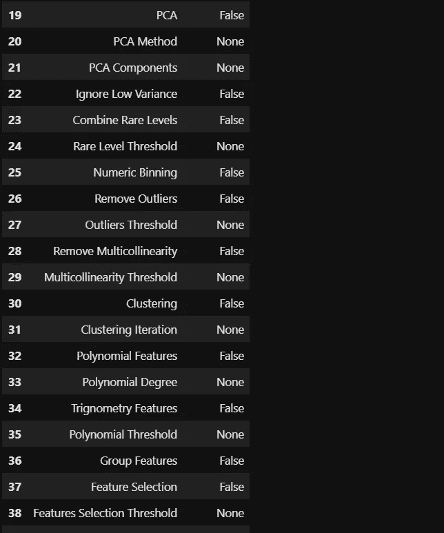
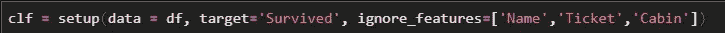
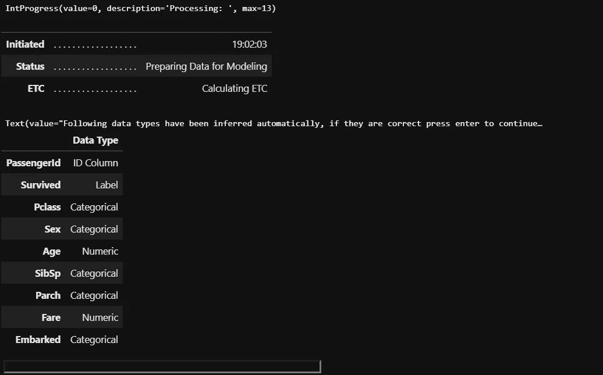
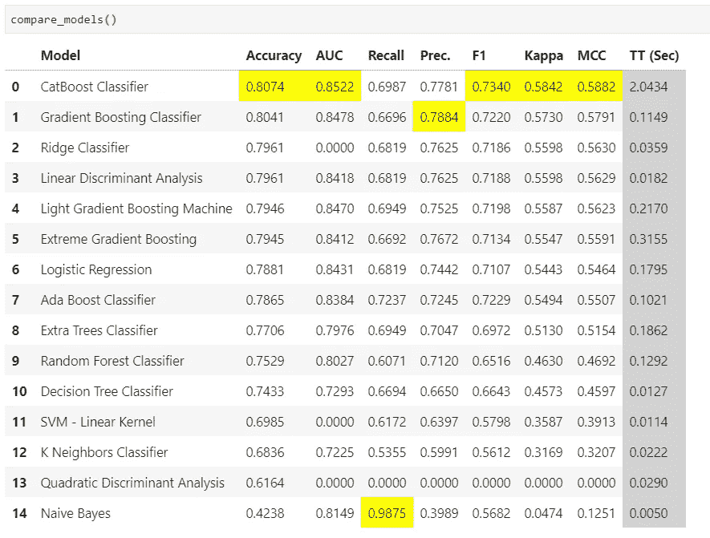

# PyCaret:机器学习的综合体

> 原文：<https://towardsdatascience.com/pycaret-the-machine-learning-omnibus-dadf6e230f7b?source=collection_archive---------33----------------------->

## …满足您所有机器学习需求的一站式商店

照片由[阿什利·特雷瑟万](https://unsplash.com/@ashtree?utm_source=unsplash&utm_medium=referral&utm_content=creditCopyText)在 [Unsplash](https://unsplash.com/s/photos/one-stop-shop?utm_source=unsplash&utm_medium=referral&utm_content=creditCopyText) 拍摄

任何机器学习项目之旅都是从加载数据集开始，到结束(继续？！)最终确定用于预测未知数据和生产部署的最佳模型或模型集合。

作为机器学习的实践者，我们知道在达到最佳预测性能结果的过程中会有几个中途停留点。这些中间步骤包括探索性数据分析(EDA)、数据预处理——缺失值处理、异常值处理、改变数据类型、编码分类特征、数据转换、特征工程/选择、采样、训练-测试分离等。举几个例子，在我们开始建模、评估和预测之前。

我们最终导入了几十个 python 包来帮助我们做到这一点，这意味着要熟悉每个包中多个函数调用的语法和参数。

你是否希望有一个单一的包可以用一致的语法界面处理整个端到端的旅程？我当然有！

## 输入 PyCaret

这些愿望通过`PyCaret`包得到了回应，现在随着`pycaret2.0`的发布，它变得更加令人敬畏。

从这篇文章开始，我将发布一系列关于`pycaret`如何帮助我们快速完成一个 ML 项目的各个阶段的文章。

## 装置

安装轻而易举，几分钟内即可完成，所有依赖项也已安装完毕。建议使用虚拟环境安装，如 [python3 virtualenv](https://docs.python.org/3/tutorial/venv.html) 或 [conda environments](https://docs.conda.io/projects/conda/en/latest/user-guide/tasks/manage-environments.html) 以避免与其他预安装的软件包冲突。

`pip install pycaret==2.0`

一旦安装完毕，我们就可以开始了！我们将包导入到我们的笔记本电脑环境中。这里我们将讨论一个分类问题。类似地，可以为涉及回归、聚类、异常检测、NLP 和关联规则挖掘的场景导入相应的 PyCaret 模块。

我们将使用来自 kaggle.com 的`titanic`数据集。你可以从[这里](https://www.kaggle.com/c/titanic/data)下载数据集。

让我们使用`head()`函数检查数据集的前几行:

## 设置

`pycaret`的`setup()`函数只需一行代码就可以完成大部分——所有的修正工作，这些繁重的工作通常需要几十行代码才能完成！

我们只需要传递数据帧并指定目标特性的名称作为参数。setup 命令生成以下输出。

`setup`推断出了数据集中要素的数据类型，非常有用。如果我们同意，我们需要做的就是点击`Enter`。否则，如果您认为由`setup`推断的数据类型不正确，那么您可以在底部的字段中键入`quit`，然后返回到`setup`函数进行更改。我们将很快看到如何做到这一点。现在，让我们点击`Enter`，看看会发生什么。

输出续。,

产出续下

输出结束

咻！在一行看似无害的代码中，似乎发生了很多事情！让我们来盘点一下:

*   已检查缺失值
*   已识别的数字和分类特征
*   从原始数据集创建训练和测试数据集
*   具有平均值的连续要素中的估算缺失值
*   具有常数值的分类特征中的估算缺失值
*   完成标签编码
*   ..似乎还有许多其他选择，包括异常值处理、数据缩放、特征变换、降维、多重共线性处理、特征选择和处理不平衡数据等。！

但是嘿！第 11 和 12 行是什么？训练和测试数据集中的特征数量是 1745？似乎是标签编码变得疯狂的一个例子，很可能来自于分类特征，如`name`、`ticket`和`cabin`。在本文和下一篇文章中，我们将探讨如何根据我们的需求控制设置，以主动解决这种情况。

## 定制`setup`

首先，我们如何从模型构建中排除像上面三个特征这样的特征？我们在`setup`函数的`ignore_features`参数中传递我们想要排除的变量。需要注意的是，ID 和 DateTime 列在推断时会被自动设置为在建模时被忽略。

请注意下面的`pycaret`，在要求我们确认时，已经放弃了上面提到的 3 个特性。让我们点击`Enter`并继续。

在结果输出中(截断版本如下所示)，我们可以看到设置后，数据集形状现在更易于管理，只对剩余的更相关的分类特征进行标签编码:

在本系列的下一篇文章中，我们将详细讨论进一步的数据预处理任务，我们可以使用`pycaret`的这个`setup`函数通过传递额外的参数在数据集上实现这些任务。

但是在我们走之前，让我们用`compare_model()`函数来对`pycaret`惊人的模型比较能力做一个闪影。

在各种分类指标上比较模型性能。

嘣！所有需要做的只是`compare_models()`获得 15 个分类建模算法的结果，这些算法在交叉验证的各种分类指标之间进行比较。一目了然，我们可以看到`CatBoost`分类器在大多数指标上表现最佳，其中`Naive-Bayes`在召回率上表现良好，而`Gradient Boosting`在精确度上表现良好。每个指标中表现最佳的型号会由`pycaret`自动突出显示。

根据我们感兴趣的模型评估指标,`pycaret`有助于我们直接放大表现最佳的模型，我们可以使用超参数进一步调整这些模型。在接下来的文章中会有更多的介绍。

总之，我们已经简要了解了`pycaret`如何通过最少的代码结合关键数据预处理阶段的广泛而全面的定制，帮助我们快速完成 ML 项目生命周期。

您可能也会对我的其他文章感兴趣，这些文章介绍了在探索性数据分析(EDA)和可视化中使用最少的代码来交付最大的结果的优秀包。

 [## 使用 SmartEDA 开发的 EDA

### 探索性数据分析——更智能、更快速的方式..

towardsdatascience.com](/eda-in-r-with-smarteda-eae12f2c6094)  [## 拼凑——下一代 ggplots

### 进一步扩展 ggplot2 的多功能性..

towardsdatascience.com](/patchwork-the-next-generation-of-ggplots-1fcad5d2ba8a) 

感谢您的阅读，并希望听到您的反馈。干杯！