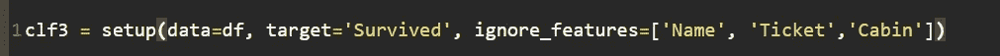
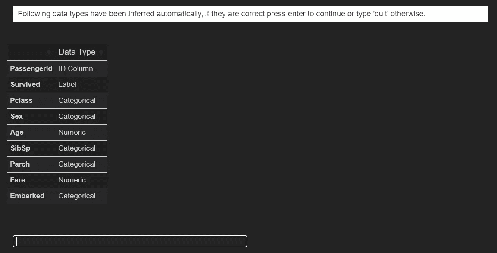
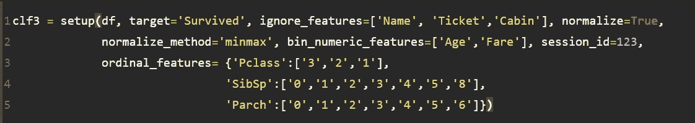
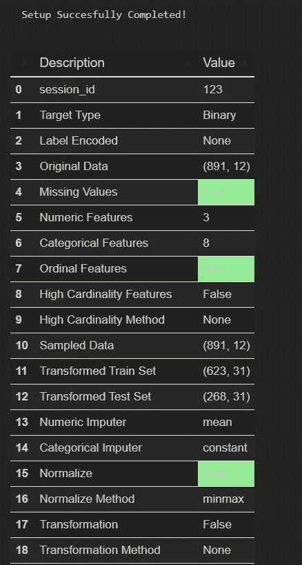
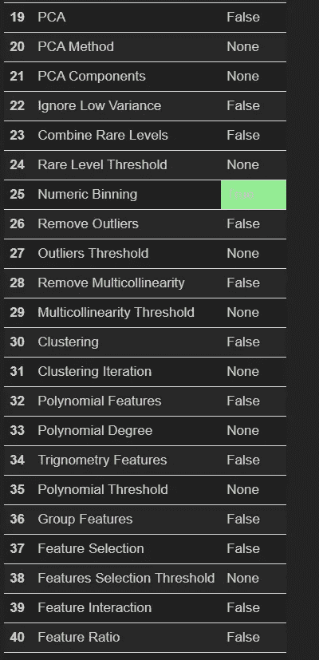
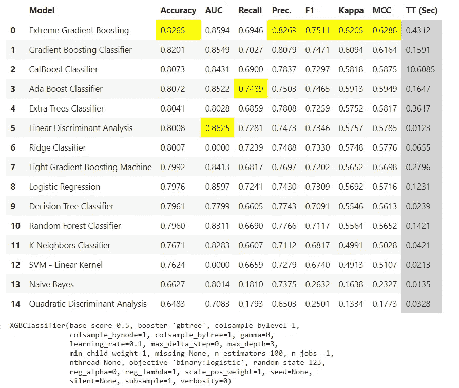
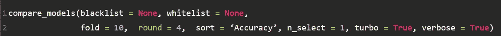

# PyCaret:机器学习综合教程—第 2 部分

> 原文：<https://towardsdatascience.com/pycaret-the-machine-learning-omnibus-part-2-87c7d0756f2b?source=collection_archive---------31----------------------->

…满足您所有机器学习需求的一站式商店。

## 数据预处理和模型比较

阿什利·特雷瑟万在 [Unsplash](https://unsplash.com/s/photos/one-stop-shop?utm_source=unsplash&utm_medium=referral&utm_content=creditCopyText) 上拍摄的照片

这是关于 python 中令人惊叹的`pycaret`包的系列文章的第二篇，它用少得可笑的代码行实现了对 ML 项目生命周期的几乎每个阶段的快速跟踪和自动化。**如果您错过了第一部分，请单击下面的链接，我们在其中简要介绍了初始设置，它仅用一行代码就完成了数据预处理的所有方面，并将我们带到建模阶段。**

 [## PyCaret:机器学习的综合体

### ..满足您所有机器学习需求的一站式商店

towardsdatascience.com](/pycaret-the-machine-learning-omnibus-dadf6e230f7b) 

在本文中，我们将查看几个可以传递给`setup()`函数的参数，以进一步控制由`pycaret`完成的预处理。默认情况下，`setup`函数只需要数据帧和我们想要预测其类别标签的目标特征。但是，由函数自动推断的要素数据类型可能并不总是正确的。在某些情况下，我们可能需要介入。例如，在我们正在使用的泰坦尼克号数据集中，`setup`函数正确地将`Pclass`(乘客等级)、`SibSp`(船上的兄弟姐妹&配偶)和`Parch`(船上的父母和子女)与`sex`一起推断为分类特征。`pycaret`将自动对分类特征进行一键编码，在这种情况下，将对`Pclass`、`Sibsp`、`Parch`和`sex`进行编码。然而，除了`sex`之外的这些特征都有其固有的等级顺序(普通性),对它们进行标记编码以捕捉等级顺序更为合适。

因此，在下面的输出中，在运行`setup`时，我们键入`Quit`并通过将下面列出的附加参数传递给`setup`函数来解决这个问题。注意，我们使用`ignore_features`参数从建模中排除了`Name`、`Ticket`和`Cabin`特征。

## 序数 _ 特征()

`ordinal_features`参数接受一个字典，其中包含我们想要标记为序数的特性以及相应的类别级别。

## 常化

我们还可以将`normalize`参数设置为 True(默认为 false)并使用`normalize_method`参数指定方法(比如说 minmax，默认为 zscore)。

## 宁滨数字特征

在这种情况下，让我们也对数字特征`Age`和`Fares`进行分类，因为它们值的每个单位变化不太可能影响我们对目标的预测。

## 设置

综上所述，我们修改后的`setup`命令如下所示:

当`pycaret`提示我们确认它的推断时，我们点击`Enter`。使用单个`setup`功能，`pycaret`已经完成:

*   缺失值插补
*   分类特征的编码(见下面的第 11 行和第 12 行，现在我们有 31 个特征)
*   规范化数字特征
*   收集数字特征
*   将数据集分为训练和测试

产出续下

产出续下

厉害！对吗？这还不是全部。通过向`setup`传递额外的参数，您可以根据数据集的性质探索许多设置定制。在上面的输出中，无论您在哪里看到 False/None，我们都保持默认的设置配置不变。您可以根据数据集的性质和想要进行的转换来启用相关的选项。配置这些附加参数的语法很简单。你可以在这里找到分类的完整列表和文档[，在这里](https://pycaret.org/classification/)[找到回归的](https://pycaret.org/regression/)。

因此，用一个函数就完成了预处理！

## 使用 compare_model()进行模型比较

`compare_model()`函数使我们能够生成 15 个分类模型，并一次性比较多个分类指标的交叉验证性能！模型还会根据精度指标(默认)自动排序，可以使用`sort`参数将精度指标更改为您喜欢的其他指标。

模型比较

此外，您可以单击任何其他首选指标列标题，根据新指标对模型排名进行交互式排序。这非常有助于快速确定我们首选指标的最佳性能模型，以便我们可以继续对所选模型进行超参数调整。

`compare_models()`返回指定度量上的最佳执行模型，该模型可以存储为模型对象。

通过将附加参数传递给以下对象，可以进一步定制`compare_models()`的输出:

*   省略型号(`blacklist`)
*   仅考虑特定型号(`whitelist`)
*   指定交叉验证折叠(`fold`，默认为 10)
*   四舍五入小数(`round`，默认为 4)
*   指定模型排序的度量标准(`sort`，默认为精确度)
*   要返回的顶级模型的数量(`n_select`，默认为 1。如果大于 1，则返回顶级模型的列表)

最后，我们看到，使用`pycaret`，只需两行代码，我们就能够在 ML 项目中快速完成预处理和初步模型比较阶段。

在接下来的文章中，我们将了解`pycaret`的强大功能，它可以使用遵循****_model()语法的函数来创建模型、调整模型超参数、集合模型、堆栈模型等等。

如果您喜欢这篇文章，您可能还想看看下面关于探索性数据分析(EDA)和用最少的代码和最大的输出进行可视化的文章。

 [## 使用 SmartEDA 开发的 EDA

### 探索性数据分析——更智能、更快速的方式..

towardsdatascience.com](/eda-in-r-with-smarteda-eae12f2c6094)  [## 拼凑——下一代 ggplots

### 进一步扩展 ggplot2 的多功能性..

towardsdatascience.com](/patchwork-the-next-generation-of-ggplots-1fcad5d2ba8a) 

感谢您的宝贵时间！注意安全！！