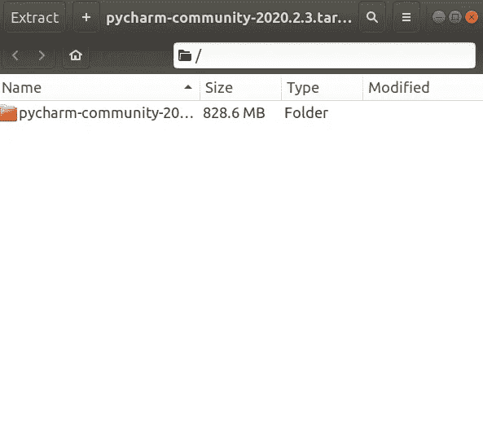
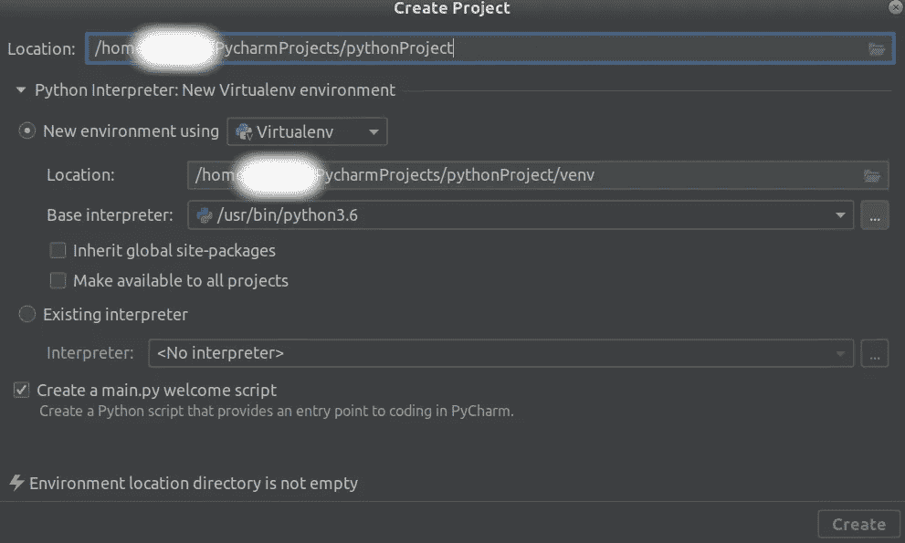
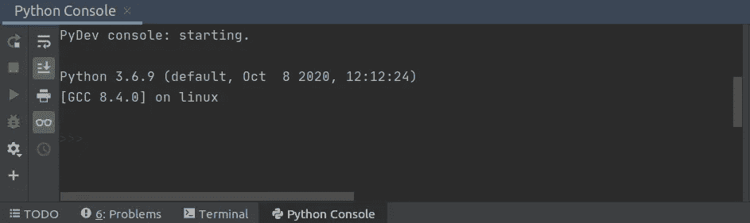
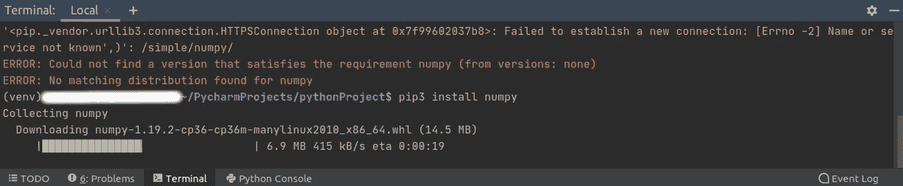
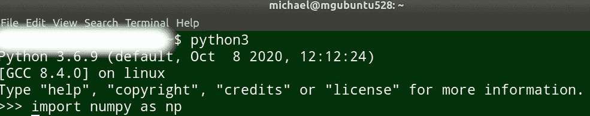
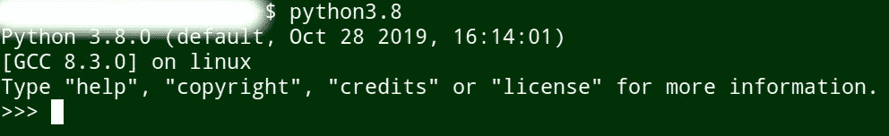
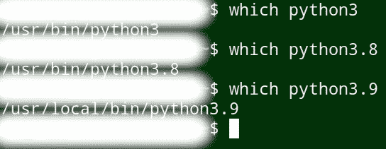
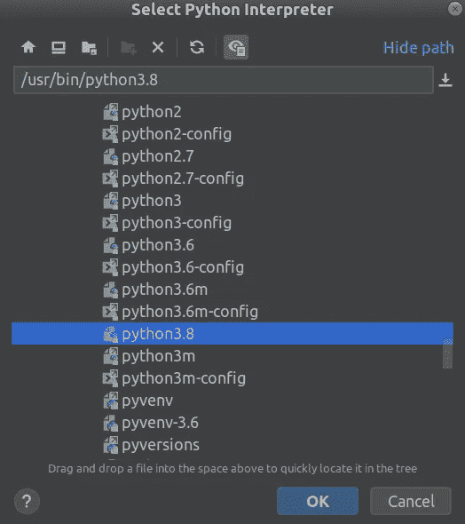
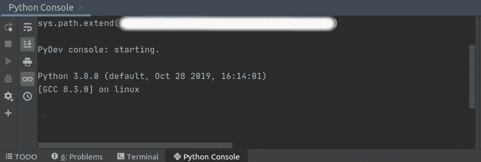

# PyCharm:在 Ubuntu 中管理多个 Python 版本

> 原文：<https://towardsdatascience.com/pycharm-managing-multiple-python-versions-in-ubuntu-11224789845e?source=collection_archive---------22----------------------->

## 使用 PyCharm 运行不同的 Python 版本


来源:来自 [Pixabay](https://pixabay.com/photos/gears-cogs-machine-machinery-1236578/) 的 [MustangJoe](https://pixabay.com/users/mustangjoe-2162920/) 的照片

运行 Python 项目时的一个潜在问题是版本冲突。例如，您可能安装了 Python 3.6 作为 Python 的系统级版本，但是需要构建一个需要 Python 3.8 的特定程序。

然而，将 Python 3.8 安装为系统范围的版本会有使您的 Python 3.6 代码与新版本不兼容的风险。

在这种情况下，需要使用**虚拟环境**，即一个独立的环境，它运行一个不同于系统范围内运行的 Python 版本。

PyCharm 作为多个 Python 版本的 IDE(集成开发环境)非常有效。使用 Ubuntu 18.04，让我们看看如何通过 PyCharm 在虚拟环境中设置 Python 3.8。

# 安装 PyCharm

从 [JetBrains](https://www.jetbrains.com/pycharm/download/#section=linux) 网站上，你会看到 PyCharm(在撰写本文时)既提供了付费的**专业版**py charm，也提供了名为**社区**的免费开源版。

通过单击下载，该文件将被下载为 tar.gz 文件。在撰写本文时，文件名是 pycharm-community-2020.2.3。

然后，可以将这个 tar.gz 文件解压缩到您选择的文件夹中:



资料来源:Ubuntu 18.04

如另一个[教程](https://medium.com/@singh.shreya8/how-to-install-pycharm-in-ubuntu-16-04-ubuntu-14-04-ubuntu-18-04-linux-easiest-way-5ae19d052693)中所述，导航到 **bin** 文件夹并打开一个终端。PyCharm 可以通过以下方式安装:

```
sh pycharm.sh
```

然后会打开一个相关的窗口，在这里可以定制 PyCharm 的默认设置。

# 在 PyCharm 中创建项目

如前所述，Python 3.6 是本例中 Python 的默认版本。在 PyCharm IDE 中，一旦选择了**创建项目**，将显示以下内容:



来源:PyCharm IDE

为了简单起见，这个项目被称为 *pythonProject* ，但是您可以为这个项目指定任何名称。从上面可以看出，python3.6 被选为基础解释器。在这种情况下，Python 3.6 和 Python 2.7 是系统上安装的仅有的两个版本。



来源:PyCharm IDE

一旦 Python 控制台启动，我们可以看到 Python 3.6.9 被加载。

也就是说，由于我们在自己的独立环境中使用这个版本的 Python，请注意相关的库必须单独安装到这个环境中。

例如，尝试运行 numpy 库第一次失败，因此需要在 PyCharm 项目中手动安装它，如下所示。



来源:PyCharm IDE

然而，当在标准的 Linux 终端(使用系统范围的版本)中运行时，库运行起来没有问题。



来源:PyCharm IDE

# 配置新的 Python 版本

如前所述，在许多情况下，用户需要使用不同于默认系统范围版本的 Python 版本。

对于这个例子，让我们假设我们希望安装 **Python 3.8.0** 。

正如来自[的 Serhat Teker](https://tech.serhatteker.com/post/2019-12/how-to-install-python38-on-ubuntu/) 的这个教程中所描述的，这个 Python 版本可以如下下载:

```
ssudo wget https://www.python.org/ftp/python/3.8.0/Python-3.8.0.tgz
```

然后，tar 文件可以按如下方式解压缩:

```
sudo tar xzf Python-3.8.0.tgz
```

在这种情况下，我们不希望 Python 3.8 成为默认版本。假设系统上的许多其他 Python 代码以不同的版本命名(在这种情况下是 Python 3.6.9 ),那么直接升级 Python 可能会导致严重的依赖性问题，并导致库被弃用。

因此，必须使用 *sudo make altinstall* 而不是标准的*sudo make install*——后者将覆盖默认的 Python 版本。在这方面，必须导航到新下载的 Python 文件夹，配置并启用优化，然后使用 altinstall。

```
cd Python-3.8.0
sudo ./configure --enable-optimizations
sudo make altinstall
```

在终端中检查 Python 版本时，您会注意到 Python 3.6.9 的默认版本保持不变:


来源:Ubuntu 终端

但是，Python 3.8 也可以作为一个单独的版本来调用:



来源:Ubuntu 终端

我们可以通过终端中的 *which* 命令找到每个 Python 版本的安装位置:



来源:Ubuntu 终端

相应地，可以通过 PyCharm 设置新目录，基本解释器现在设置为 Python 3.8，如下所示:



来源:PyCharm IDE

相应地，当打开新项目的 Python 控制台时，我们可以看到 Python 3.8.0 现在已经加载。



来源:PyCharm IDE

如上例所示，需要为此环境单独安装库，并且需要配置依赖关系。

然而，PyCharm 符合我们试图实现的目标——在虚拟环境中安装一个单独的 Python 版本，而不影响系统范围的版本。

# 结论

在本例中，您看到了:

*   如何在 Ubuntu 中安装多个版本的 Python
*   创建不干扰系统范围 Python 版本的虚拟环境
*   配置 PyCharm IDE 以使用不同的 Python 版本

在这方面，PyCharm 为使用不同的 Python 版本提供了一个非常有用的平台。安装的虚拟环境在技术上独立于 PyCharm 本身，可以简单地在终端上运行。然而，我们不能否认 PyCharm 确实使这个过程更加直观。

非常感谢您的阅读！非常感谢任何问题或反馈。你可以在[michael-grogan.com](https://www.michael-grogan.com/)找到更多我的数据科学内容。

*免责声明:本文是在“原样”的基础上编写的，没有担保。它只是为了教育目的而写的，不应该被解释为任何形式的专业建议。我们不保证上述代码的执行适合您自己的系统，使用风险由您自行承担。*