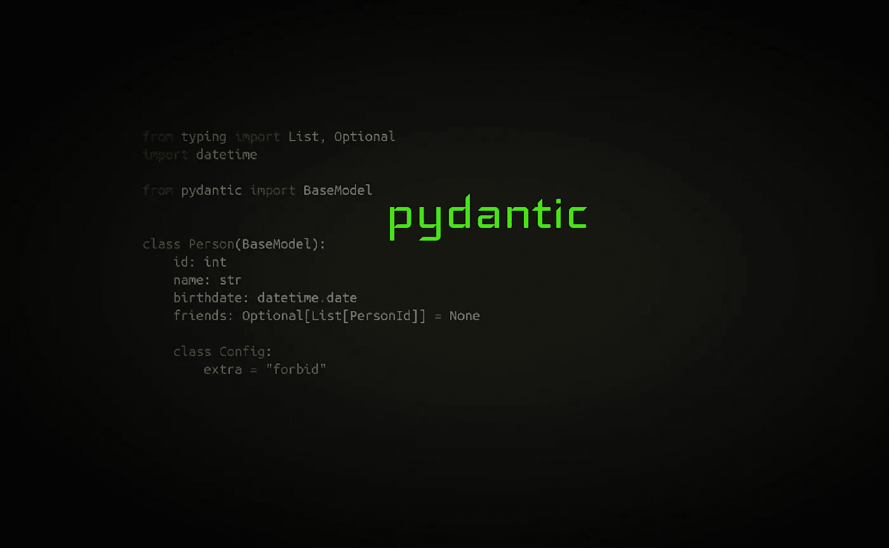

# pydantic

> 原文：<https://towardsdatascience.com/pydantic-688e897cfd3a?source=collection_archive---------5----------------------->

## 如果你篡改数据，你必须知道这个库



作者图片

拥有复杂的嵌套数据结构很难。在 Python 中存储这种数据的传统方法是嵌套字典。虽然 [Python 字典很神奇](https://www.youtube.com/watch?v=npw4s1QTmPg)，但通常会出现两个问题:(1)作为开发人员，我如何知道传递的字典中应该有哪种数据;( 2)我如何防止输入错误？

如果您使用类，您的编辑器或 mypy 可以防止属性名中的拼写错误。对于字典，任何有效的字符串都可以是一个键。

解决这两个问题的方法是使用一个库: [**pydantic**](https://pypi.org/project/pydantic/) 。它是一个验证和解析库，将数据映射到 Python 类。

# 先决条件

安装 pydantic via

```
pip install pydantic
```

对于本文，我假设您的数据是`[people.json](https://gist.github.com/MartinThoma/517d20998501afc4fff72be032782d41)`中的一个人的网络。他们有一个 ID，一个名字，一个由他们的 ID 给出的朋友列表，一个生日，以及他们银行账户上的金额。

我们想通过这个例子来计算每个人比他们的中位朋友多拥有多少财富。

我们想要解决的问题是:

*   **丑陋无**:把`None`作为朋友的值是相当丑陋的。在某些情况下，`None`不同于空列表。在这种情况下，我们就假设它的意思是一样的。用其他东西替换缺失数据被称为[插补](https://en.wikipedia.org/wiki/Imputation_(statistics))，有几种技术。
*   **丑 Any** :类型注释有`Dict[str, Any]`，因为它被认为太复杂甚至不可能知道代表一个人的字典也能映射哪些值。
*   **难看的索引**:只是语法，但是`["id"]`比`.id`长 50%。这就是[帮](https://pypi.org/project/bunch/) / [蒙克](https://pypi.org/project/munch/)存在的原因。
*   **错别字**:如果你在字典的任何一个字符串索引中出现了错别字，没有静态代码分析工具可以帮你检测出来。没有自动完成将正常工作。
*   **后期错误**:好的软件将职责模块化。一个模块负责业务逻辑，一个模块负责输入/输出。当我写“模块”时，我指的是一个代码单元——它可以是一个 Python 模块、一个类、一个函数、一个方法。简单地用一个函数来处理这些不同类型的复杂性是不好的。获得正确的业务逻辑本质上不同于确保您的输入/输出看起来像预期的那样。一个是关于定义和验证适当的接口，另一个是关于理解领域。
*   **文档**:新开发人员必须定期阅读更大应用程序的代码。通常，没有时间让对应用程序了如指掌的人详细解释每一个部分。大多数时候，甚至没有一个人什么都知道——即使项目是由一个开发人员完成的。我总是忘记部分代码。因此记录是至关重要的。在 Python 中，记录预期的参数类型及其返回值至关重要。有`Dict[str, Any]`总比没有好，但比`Person`差得多。

# 创建一个 pydantic 模型

我们为一个人的 ID 创建了一个新的类型，仅仅是因为 PersonId 比 T2 更有意义。然后我们子类化`[pydantic.BaseModel](https://pydantic-docs.helpmanual.io/usage/models/#basic-model-usage)`

# 将其用于输入解析

接下来，我们使用`[parse_file_as](https://pydantic-docs.helpmanual.io/usage/models/#parsing-data-into-a-specified-type)`来读取 JSON 文件:

请注意， [datetime](https://pydantic-docs.helpmanual.io/usage/types/#datetime-types) 和 Decimal 是自动解析的——您仍然应该经常查看它是如何完成的。尽早进行数据验证是有好处的，这样错误也会在已知的地方尽早发生。这意味着 pydantic 轻推你到一个好的设计。我喜欢它😍

# 约束类型

[约束类型](https://pydantic-docs.helpmanual.io/usage/types/#constrained-types)是某个取值范围内的整数/浮点数或与正则表达式匹配的字符串😃

# 缺少数据:使用默认值

如果您的 JSON 可能缺少一些您想要的属性，那么您需要使用默认值。典型的默认值是`None`，这意味着您需要将类型更改为`Optional[what it was before]`。这通常很难看，因为您需要在代码的后面检查`None`。

特别是对于列表，您可能要考虑使用空列表。你这样做:

对于不可变的数据类型，比如字符串、整数、浮点数、元组，可以简单地赋值。对于可变列表，您需要使用带有`default_factory`的 Field，每次都会生成一个新列表。[如果你还不知道的话，学习一下为什么可变缺省是邪恶的](https://docs.python-guide.org/writing/gotchas/#mutable-default-arguments)。

# 附加数据:忽略、允许或禁止

有时在开发时不可能知道 JSON 对象具有哪些属性。尽管如此，你还是需要把它们传来传去。这是非常不幸的，应该受到挑战，但这是可能发生的。

Pydantic 称那些**为临时演员**。如果忽略它们，读取的 pydantic 模型将不会知道它们。**被忽略的额外参数被丢弃**。允许他们意味着接受这个不幸的设计是必要的。**允许的额外内容将是解析对象**的一部分。最后，**禁止**额外参数意味着如果出现额外参数，将抛出`pydantic.ValidationError` **异常**。

这是通过向 pydantic 模型添加一个名为`Config`的子类来配置的:

# 重命名属性

名字很重要。[可读性计数](https://www.python.org/dev/peps/pep-0020/)。在 Python 中，变量应该遵循一个`snake_case`命名方案，而在 JavaScript 中，变量应该遵循一个`camelCase`命名方案。为了实现这两个目标，pydantic 提供了`[allow_population_by_field_name](https://pydantic-docs.helpmanual.io/usage/model_config/)`作为配置参数。

# 验证器

有时候，简单的类型是不够的。你想检查更复杂的东西。

文件已经给出了一个很好的例子:

你可以检查几乎任何东西，只要你只需要类本身。请不要对数据库运行查询来进行一致性检查；例如，如果您希望用户名是唯一的或类似的。尽管您可能会运行此操作，但通过创建“数据容器”来触发数据库查询将是意想不到的。

在我们的例子中，我们可能想要阻止人们成为自己的朋友:

除了抛出异常，我们还可以简单地修复它:

# 使用 Pydantic 进行基于属性的测试


在 [Unsplash](https://unsplash.com?utm_source=medium&utm_medium=referral) 上[科学高清](https://unsplash.com/@scienceinhd?utm_source=medium&utm_medium=referral)摄影

基于属性的测试自动生成被测函数的输入，并确保满足某个属性。在最简单的情况下，这个属性是测试中的函数不会崩溃。如果你想了解更多关于这种类型的测试，请阅读我的关于基于属性的测试和假设的文章。

顺便说一下，这个测试实际上指出了一个潜在的问题:

```
Falsifying example: test_two_people(
    person_a=Person(id=0, name='', bank_account=Decimal('NaN'), birthdate=datetime.date(2000, 1, 1), friends=[]),
    person_b=Person(id=0, name='', bank_account=Decimal('NaN'), birthdate=datetime.date(2000, 1, 1), friends=[]),
)
```

# 更整洁的东西

Pydantic 非常棒:

*   您可以从它的模型中生成一个模式( [source](https://pydantic-docs.helpmanual.io/usage/schema/) )，
*   mypy 插件提供了更好的类型检查
*   对字典的序列化可以用`.dict()`方法完成，对 JSON 字符串的序列化可以用`.json()`方法完成。

# 操作安全


照片由[本工程图](https://unsplash.com/@thisisengineering?utm_source=medium&utm_medium=referral)在 [Unsplash](https://unsplash.com?utm_source=medium&utm_medium=referral) 上拍摄

我通常担心的一部分是普遍支持。以下是 pydantic 拥有健康社区的一些指标:

*   ✔️ [GitHub](https://github.com/samuelcolvin/pydantic) : 4.5k 星，404 叉，172 贡献者
*   ✔️用法: [FastAPI](https://fastapi.tiangolo.com/#example-upgrade) 使用它。微软的 Onefuzz 使用它。 [AWS Lambda Powertools](https://github.com/awslabs/aws-lambda-powertools-python) 也是如此。许多机器学习项目
*   ✘ [PyPI 项目](https://pypi.org/project/pydantic/):很遗憾，这个只有一个维护者。如果有两个，我会更喜欢一点。只是为了防止有人丢失密码。
*   ✔️Self-decided 项目状态:维护者认为 pydantic 可以投入生产/稳定。

# 摘要

pydantic 是一个非常棒的数据解析和验证库。它可以很好地支持你在 Python 中获得更好的[类型注释。用它！](https://medium.com/analytics-vidhya/type-annotations-in-python-3-8-3b401384403d)