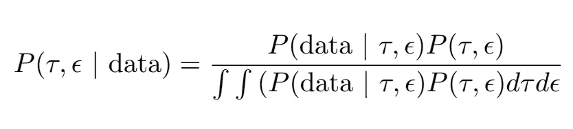
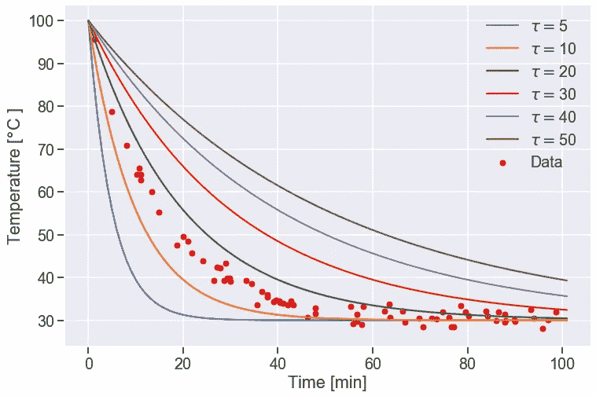
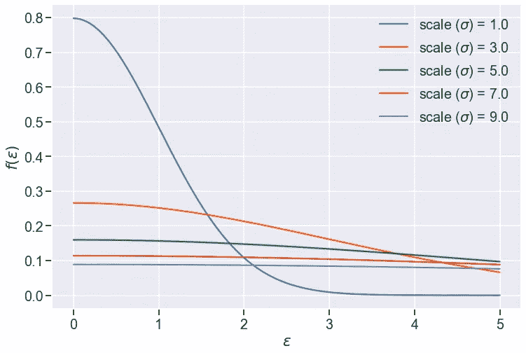
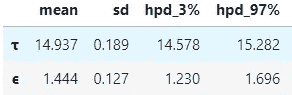
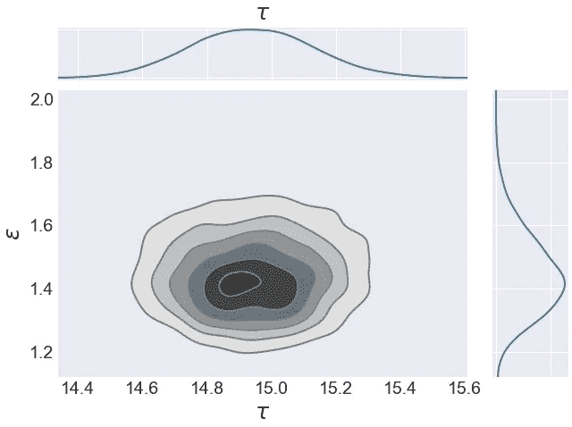
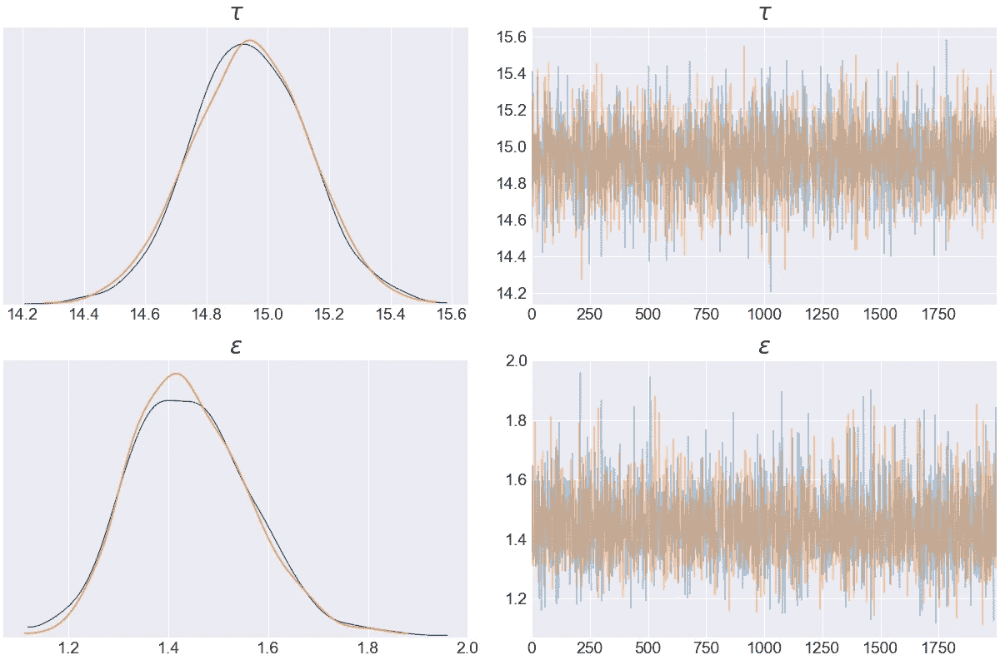
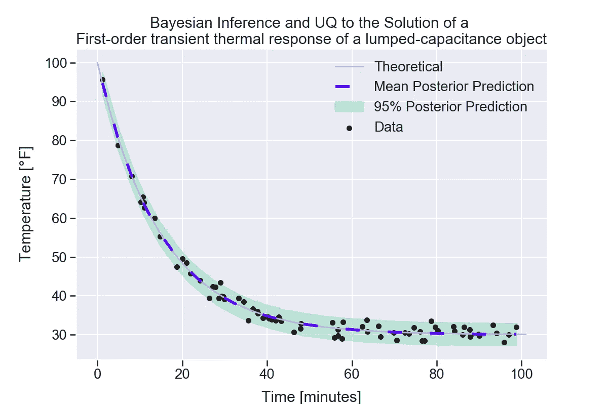
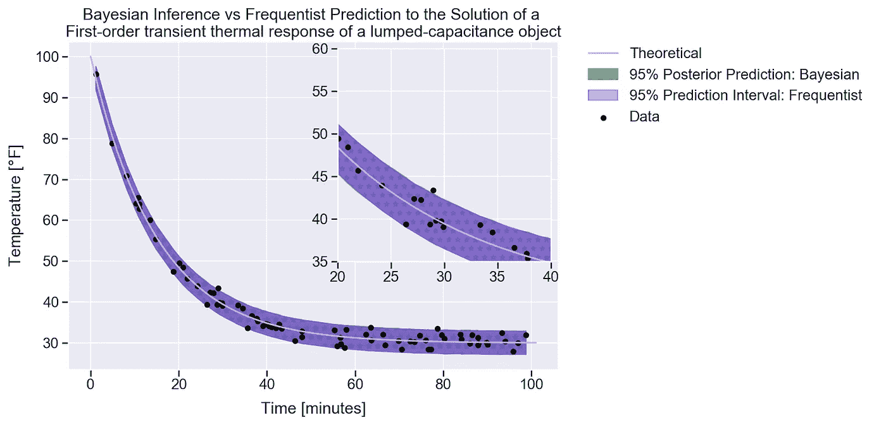

# 非线性模型参数不确定性量化的 PyMC3 和贝叶斯推理(二)

> 原文：<https://towardsdatascience.com/pymc3-and-bayesian-inference-for-parameter-uncertainty-quantification-towards-non-linear-models-a03c3303e6fa?source=collection_archive---------19----------------------->

## 参数和模型不确定性量化


导航的不确定性(作者图片)

在本系列的第 2 部分中，我们将深入 PyMC3，并学习如何将其应用于非线性模型的不确定性量化(UQ)。为了验证，我们还将看到贝叶斯方法如何与 UQ 参数的频率主义方法进行比较。我假设你已经为你的模型优化了参数。我将使用的模型来自本系列的第 1 部分。

我们将在本系列中使用的库如下:

将要使用的库

对于那些从第 1 部分跳到这里的人，或者那些需要重温第 1 部分的人，非线性模型是集总电容对象(多么拗口)的一阶瞬态热响应的解决方案。


集总电容物体一阶瞬态热响应的解

Python 中的函数

我们假设 T_0 = 100C，T_env = 30C。我们试图估计冷却参数τ和模型的不确定性。这个问题的日常例子是冷却保温良好的热饮！


热饮…也许我们把它放在一个非常好的保温瓶里(图片由作者提供)

## PyMC3 下的贝叶斯推理

为了开始对模型参数的 UQ 进行贝叶斯推断，我们首先使用 PyMC3 创建一个模型，这里我在第 1 行将其称为“model_g”。

引用 Therese Donovan 和 Ruth M. Micket 的话[1]，

> “如果不使用先验分布，就无法进行贝叶斯分析”。



贝叶斯框架。p 代表概率。

这里我们的先验是 P(τ，ϵ)，我们将把这个先验分解成两个先验，每个参数一个。而我们对τ的分布知之甚少或没有多少先验知识。然而，我们可以提供一个弱信息先验[2]。通过简单地画出τ的不同值，我们可以看出τ一定是有界的。我们将假设τ为均匀分布，下界为 0，上界为 100。我们可以看到，这很容易涵盖这个问题的可能值，然后一些。从第 1 部分中，我们发现τ的最佳参数是 14.93，从图中可以看出这是有意义的。



调查 tau 的前科

我们需要的下一个先验是误差的标准差，ϵ.我们知道这个参数不能小于 0，因为标准差总是大于或等于 0。半正态分布似乎适合于ϵ.的先验分布我们再次通过选择标度值为 5 的半正态分布来选择弱信息先验。我使用ϵ而不是第一部分中使用的σ，以避免与也用于衡量半正态分布的σ术语混淆



调查ϵ的前科

将所有内容结合在一起，第 5 行描述了预测温度“T_pred”来自使用我们的非线性牛顿冷却函数的平均值(μ)的正态分布。这个模型是我们的可能性，代表 p(数据| τ，ϵ)。我们还让 PyMC3 知道我们模型的标准偏差是ϵ.的先验分布最后，我们传递的最后一个参数是观察到的“实验”温度数据。

使用第 8 行，我们让 PyMC3 通过抽取 2000 个后验样本，使用 NUTS 采样来完成繁重的工作。我非常非常推荐去看看 Richard 的 McElreath 关于采样算法的[网页](https://elevanth.org/blog/2017/11/28/build-a-better-markov-chain/)。我们通常无法显式求解上述贝叶斯框架方程中的分子，因此我们必须使用采样算法来帮助我们探索它。

一旦执行了采样，我们就可以检索摘要

```
az.summary(trace_g)
```



跟踪摘要

在第 1 部分中，我们发现τ_opt = 14.93，σ的估计值=1.42。查看上表，我们的采样方法的平均值也提供了非常相似的结果，这是有道理的。我们之前做的优化也允许我们检查我们的贝叶斯推理。



我们参数的联合图

```
joint_plt = az.plot_joint(data_spp, var_names=['τ', 'ϵ'], kind='kde', fill_last=False);
```

使用上面的代码，我们可以通过对后验概率 P(τ，ϵ |数据)进行抽样来生成一个联合图。

我们还可以获得一个跟踪图，以验证我们的采样没有停滞，并且我们的采样充分探索了参数空间。我们想要像“毛毛虫”一样的痕迹。

```
trace_fig = az.plot_trace(trace_g,
 var_names=[ 'τ', 'ϵ'],
 figsize=(12, 8));
```



追踪图

我们还可以通过使用以下方法获得参数的最高后验密度(HPD ),这里我们选择 99%。

```
posterior_params = pm.plot_posterior(data_spp,
                                     point_estimate='mean',
                                     credible_interval=0.99,
                                     textsize=20,
                                     round_to=4);
```


如果没有噪声，我们的平均值将完全等于“未知”参数。由于存在噪声，就像真实数据一样，我们的参数值存在不确定性，我们需要量化其中的不确定性。

从第 1 部分可以看出，实际值τ=15，σ=1.5。不仅平均后验概率接近这些值，而且 HPD 很容易包含真实值，这正是我们想要的。

贝叶斯推理的好处之一是，除了计算参数的平均值，我们还可以得到参数的分布，如上所示。我们的非线性模型的 UQ 就像从我们的分布中取样一样简单，这是在上面的 sample_posterior.py 中完成的，为了清楚起见，下面使用方法

```
pm.sample_posterior_predictive()
```

计算模型中的不确定性，不仅从参数中，而且从数据中，是通过从我们的后验样本完成的。使用 NumPy 中的百分位数方法，从我们的后验预测中生成分位数是非常容易的。

将所有这些放在一起，让我们不仅绘制平均后验反应，而且绘制 95%后验预测。



参数和模型 UQ 的贝叶斯推断

## 频繁主义方法

如果我们想验证我们的贝叶斯推断，我们还应该将我们的结果与频率主义方法进行比较。由于模型是非线性的，这将需要更多的手工计算，但是对于我们将要使用的库来说，这应该不会太难。

首先，我们需要为模型“grad_newton_values”构建一个灵敏度矩阵。由于模型中只有 1 个参数，这个矩阵只是一个列向量。我们将使用自动签名库来自动区分关于τ的模型。

模型误差δk 可以从我们的灵敏度阵列中计算出来。利用δk、t-逆数值(1.99)和我们对第 1 部分中σ的估计(1.42)，我们可以计算参数τ [3]的置信区间。

我们发现，在 95%的置信区间下，τ在 14.571 和 15.292 之间。非常接近贝叶斯方法！

接下来，我们想比较贝叶斯和频率主义方法之间的 UQ 传播在我们的模型。这包括模型参数和数据的不确定性。下面我为我们的非线性模型生成了置信区间和预测区间。

我用星形影线绘制了 95%的贝叶斯后验预测，用纯紫色绘制了 95%的频率预测区间。这两种方法几乎完全重叠，因为在紫色阴影区域下面可以看到星形影线。我们看到在边界上，最小的绿色。看起来我们的贝叶斯方法和频率主义方法是一致的。

根据这些预测，我们可以提供作为时间函数的饮料温度的不确定性。例如，在 25 分钟时，如果我们多次运行该实验，我们预计大多数热饮的温度在 40℃到 45℃之间，有 95%的把握。



两种方法的预测区间几乎相同

## 结论

我们对参数的估计以及模型本身进行了 UQ。我们已经发现 PyMC3 库对于处理非线性模型是多么强大，以及它与 Python 的集成是多么好。贝叶斯方法为我们如何开发和设计模型提供了极大的自由度。如果需要，我们可以将我们的可能性或温度模型从正态分布改为另一个参数模型。PyMC3 的过程不会有太大变化。

**参考文献**

[1] T. Donovan 和 R. M. Mickey，*贝叶斯统计初学者:循序渐进的方法*。牛津大学出版社。

[2] O. Martin，*用 Python 进行贝叶斯分析:使用 PyMC3 和 ArviZ 进行统计建模和概率编程介绍，第 2 版*。帕克特出版有限公司，2018 年。

[3] R. C. Smith，*不确定性量化:理论、实施和应用*。暹罗，2013 年。