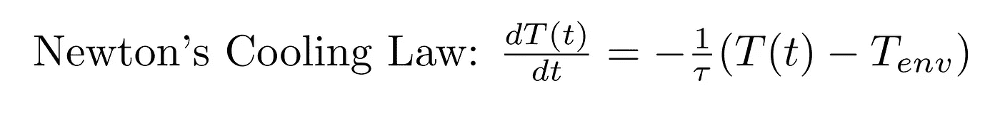
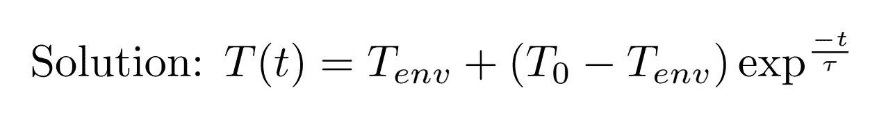
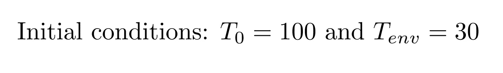
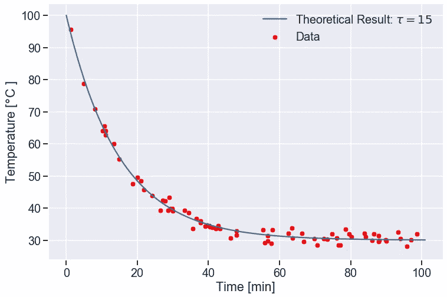
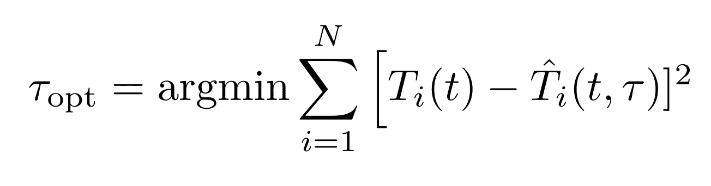
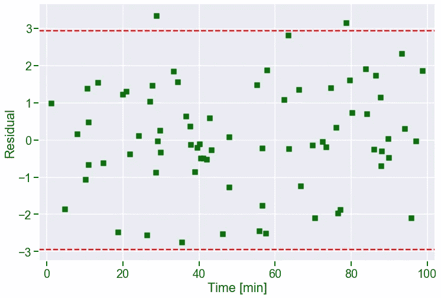

# 非线性模型的 PyMC3 和贝叶斯推理:第一部分

> 原文：<https://towardsdatascience.com/pymc3-and-bayesian-inference-for-parameter-uncertainty-quantification-towards-non-linear-models-d1d50250f16a?source=collection_archive---------24----------------------->

## 参数和模型不确定性量化


不确定的世界(作者图片)

像 Stan 这样的概率编程语言已经为科学家和工程师提供了进入贝叶斯统计世界的便利手段。作为一个熟悉 Python 编程的人，我一直在努力寻找完美的贝叶斯库来补充 Python 美妙而简洁的语法。

学习新材料和新图书馆的最大挑战之一是找到足够的资源和例子。我找不到一篇关于使用 Python 和贝叶斯推理对非线性模型进行参数和模型不确定性量化(UQ)的文章。因此，我希望这篇文章能帮助其他人将这些方法应用到他们自己的研究或工作中。

这将是一篇由两部分组成的文章，目的是让更多的读者能够阅读它，同时也让浏览和阅读文章变得更加容易。

第 1 部分将快速讨论贝叶斯推理的两个公共库:PyStan 和 PyMC3。我们还将建立一个非线性函数用于贝叶斯推理。这将包括通过 SciPy 库进行参数优化。我们将使用最佳参数作为我们贝叶斯推理的起点，并检查我们的贝叶斯方法。如果你已经熟悉了参数优化，可以直接跳到[第 2 部分](https://medium.com/p/a03c3303e6fa/edit)中的 PyMC3 部分。

第 2 部分是我们开始使用 PyMC3 并深入研究语法和结果的地方。为了验证，我们还将看到贝叶斯方法如何与频率主义方法进行参数不确定性量化的比较。

我不打算对 Baye 定理和整个贝叶斯框架进行过多的推测，有大量关于 Medium 的文章可以满足您的好奇心。本文的主要成果是让读者了解如何利用 PyMC3 来量化线性模型(尤其是非线性模型)中使用的参数和模型的不确定性。Jupyter 笔记本可以在[这里](https://github.com/adamcwatts/Statistic_and_Data_Science_Examples/blob/master/PyMC3/Newton_Bayesian.ipynb)找到。

## PyStan

Stan 以 PyStan 的形式提供给 Python，但是语法相当令人不快。让我们看一个在 PyStan 中创建模型的例子，这个模型被分配给一个 string 类型的变量。然后这个模型会在 PyStan 的帮助下编译成 C++。

上面是一个简单的二次模型示例，它有两个参数，α和β，响应为 y。当开始使用更复杂的模型时，该模型非常冗长，很难调试。肯定有更 Pythonic 化的东西…

# ***PyMC3***

我相信 PyMC3 对于刚进入 Python 概率编程领域的人来说是一个完美的库。PyMC3 使用原生 Python 语法，使得调试更容易，也更直观。让我们深入一个例子，看看这个库的威力。

我们将使用的库

在这个例子中，我将使用一个简单的非线性方程的日常例子，希望这些概念更容易理解和记忆。

让我们从利用牛顿冷却定律来冷却一个热物体开始。我们假设物体中不存在热梯度(集总电容)。


让我们假设热物体是一种饮料(图片由作者提供)



对于那些对常微分方程(ODE)生疏的人来说，不用担心。解决方法如下。



T(t)表示在给定时间 t 饮料的温度。τ是我们感兴趣的参数，它决定了这个问题的冷却速率。T_env 是我们的环境温度，T_0 是 t=0 时饮料的温度。我们假设 T_env 不随时间变化。

在 Python 中:

让我们也假设我们提前知道，*先验*，环境温度是 30 摄氏度，物体开始于 100 摄氏度。最后，我们假设未知参数τ=15。



我们将首先绘制出热饮冷却的理论解，如蓝色实线所示。这里我们可以对方程和参数有一个直观的认识。

我们还将生成一些带有人工噪声的数据来模拟现实生活中的数据，这里显示为红色散射点。我们将假设数据是 [IID](https://en.wikipedia.org/wiki/Independent_and_identically_distributed_random_variables) 。饮料温度的响应是高斯型的，即 T(t)~ N(μ，σ)。平均值μ将遵循上面的解。我们将很快解决从数据本身不知道τ的问题。响应中的标准偏差为σ=1.5。这就是我们如何产生假噪声的，我们也能够从数据中估计出来。



根据这些模拟数据，我们想要估计冷却参数τ，并估计其值的不确定性。理想情况下，我们的估计参数和不确定性将封装真实值。同样，我们也希望模型标准误差中的不确定性包含σ。

为了阐明术语“封装”的含义，假设我们估计一个参数γ= 100 ^ 10。我们希望真实参数在 90–110 的范围内，与 100±10 相同。

## 优化:估计τ

在估算τ的不确定性之前，我们必须首先优化最符合数据的τ值。用更专业的术语来说，我们希望找到τ，使得残差平方和最小。



n 是数据点的数量

其中括号左侧的函数是我们的数据，括号右侧的函数是我们的 ODE 的解。

我们发现τ_opt = 14.93，非常接近τ=15 的真实参数的估计值。回到我们最初的问题，记住响应，饮料的温度，是高斯的，即 T(t)~ N(μ，σ)。我们终于有了τ的估计，我们可以检验正态性。

请记住，如果我们的响应来自高斯分布，那么我们的残差(数据减去预测)也必须是高斯分布。

```
residuals = T_data -  newton_cooling(tau_opt, T_0, T_env, time_data)
```

想一想，线性变换，或者更基本的，Z 值的变化。

残差，o =数据和我们的模型之间的差异，看起来很大，平均值大约为 0。它们看起来是随机的，同质的，大部分数据在两条红色虚线之间。

让我们看看我们是如何估算σ的

```
sigma_error_square = (1/(len(time_data)-1))*ss_min
sigma_error = np.sqrt(sigma_error_square)
print(sigma_error)
```

我们发现σ的估计值是 1.42，非常接近 1.5



剩余剧情。两条红色虚线代表 0 1.96*σ或 95%的数据。

## 不确定性量化

如果你还和我在一起，太好了！现在我们已经有了τ和σ的估计值，我们终于可以开始研究贝叶斯统计和 PyMC3 了。点击查看该系列[的第二部分。](https://medium.com/@aldburg/pymc3-and-bayesian-inference-for-parameter-uncertainty-quantification-towards-non-linear-models-a03c3303e6fa)