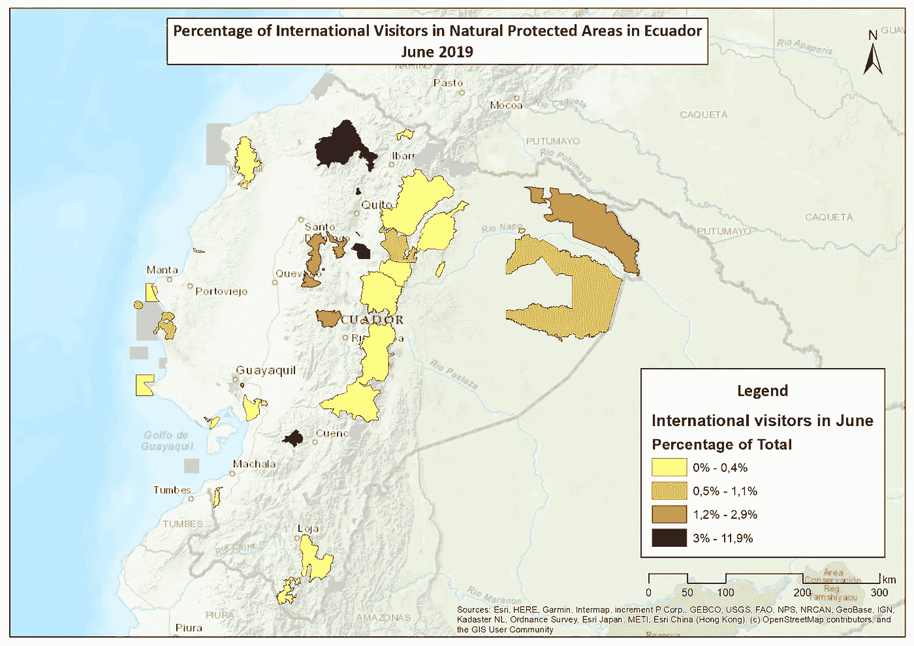
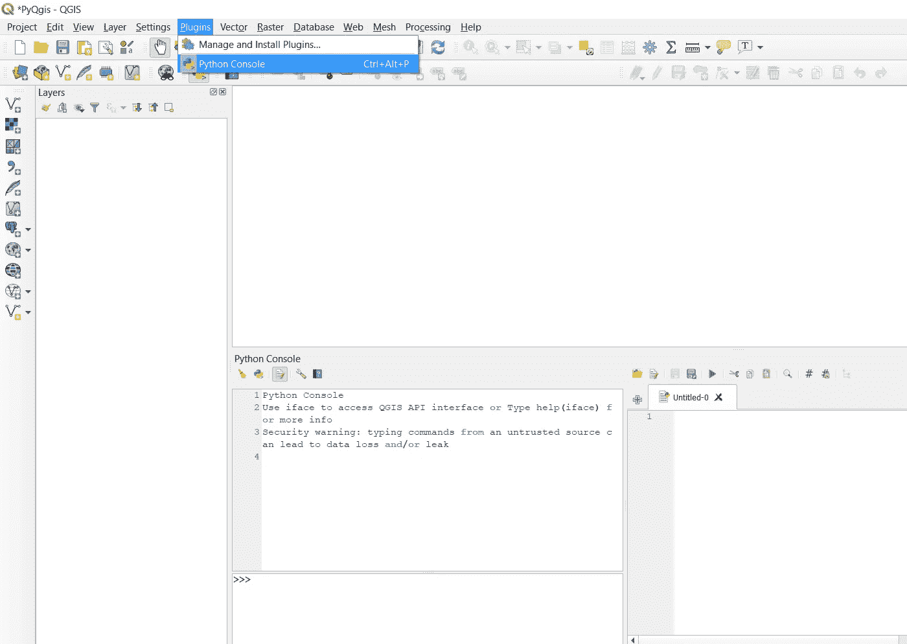
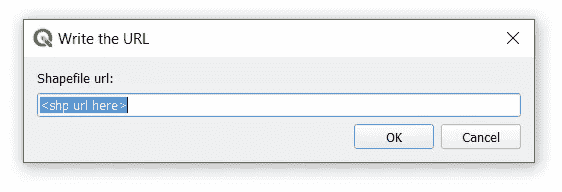
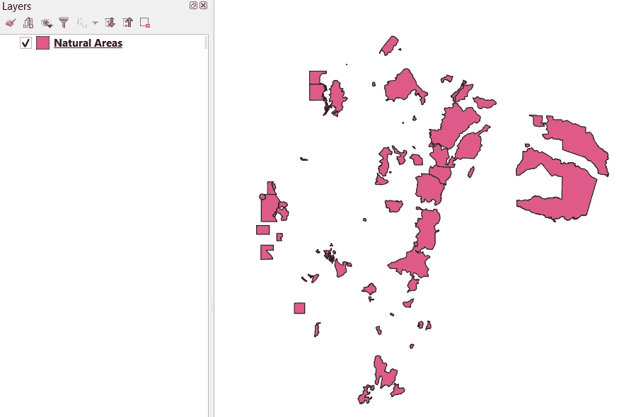
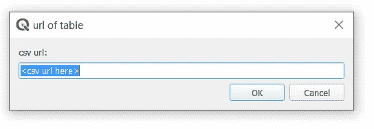
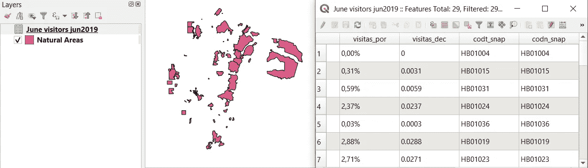
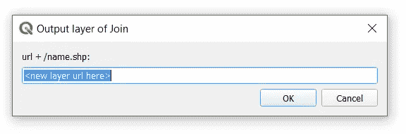
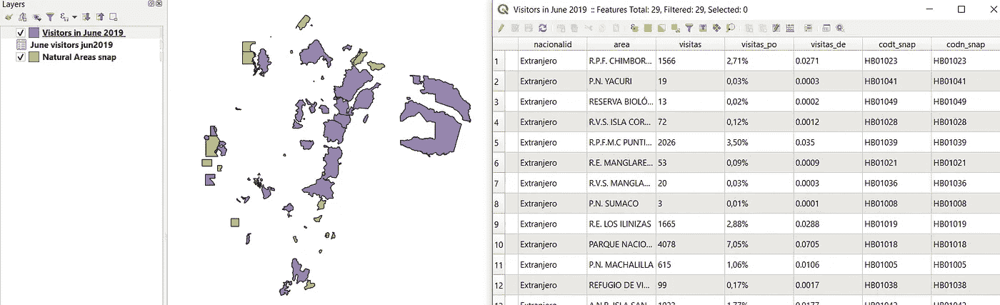

# PyQGIS 连接表-厄瓜多尔自然保护区的国际游客

> 原文：<https://towardsdatascience.com/pyqgis-join-table-international-visitors-in-natural-protected-areas-in-ecuador-7deb7ed8d868?source=collection_archive---------41----------------------->

## 如何在 PyQGIS 3.10 中使用连接表创建 choropleth 地图

PyQGIS 为管理 GIS 过程中的自动化提供了一个很好的解决方案。厄瓜多尔国家保护区系统(SNAP)以电子表格形式获取国际游客的[信息，但不一定是地图。因此，如果需要地图，可以使用一个 python/PyQGIS 脚本来创建地图，该脚本可以输出适当的图层，包括受保护区域的游客数量。此处](http://areasprotegidas.ambiente.gob.ec/reporte-de-visitas#)可在厄瓜多[环境信息地理门户下载快照图层。](http://ide.ambiente.gob.ec/mapainteractivo/)

在这篇文章/教程中，我将向你展示如何在 Qgis 3.10 中将**连接表**自动化为 Shapefile。这个脚本最好的一点是，它通过 **QInputDialog()** 与用户(在本例中是您)进行交互，因此您必须使用的输入只是您的数据的 URL。

所以，我们来看看这个剧本的产物。如上所述，该脚本生成了一个*新图层*，其中包含添加到 ***自然保护区*** 的 shapefile 中的 ***游客数量*** 的附加信息。如果你不熟悉*加入*，看看这里的。



图片由作者提供，choropleth 地图包含国际游客数量的相关信息

首先，您必须在 Qgis 中打开 python 控制台并打开编辑器。



图片由作者提供，Python 控制台，编辑器窗口“无标题-0”位于右侧

我们的第一个任务是打开 shapefile，并在 Qgis 中打开表。在本教程中，您唯一需要做的就是复制和编辑数据的 URL。我的例子的 URL 如下:***C:\ Desktop \ Pyqgis \ data \ natural _ areas . shp***

首先，将下面的代码复制并粘贴到 python 编辑器中，然后运行。然后，您将看到一个新的对话窗口打开。

```
#Dialog 
qid1 = QInputDialog()
title = ‘Write the URL’
label = ‘Shapefile url: ‘
mode = QLineEdit.Normal
default = ‘<shp url here>’
snapUrl, ok = QInputDialog.getText(qid1, title, label,mode, default)#Adding Layer 
snap_layer = iface.addVectorLayer(snapUrl,’Natural Areas’,’ogr’)
```



图片作者，输入框添加您的 shapefile 的 URL

然后，您将看到 shapefile 如何像图层一样添加到内容列表中。添加 shapefile 时，您只需注意正确书写您计算机的 URL，包括扩展名 **shp** 。
( *例如\…\…\areas.shp* )



作者的图片，屏幕上的 shapefile。

如您所见，您正在与 python 控制台进行交互。基本上就是在问你开什么，你在回复一个网址。下一步是执行相同的过程，但是包括显示的表格，在本例中是 ***。csv*** ，要与***Natural areas . shp .***进行连接记住，要正确处理连接表，两边需要有相似的属性。在这种情况下，shapefile 和表都有一个包含自然区域代码的列。
按照下面的代码打开表格。

```
#Dialog CSV june
qid2 = QInputDialog()
title = ‘url of table’
label = ‘csv url: ‘
mode = QLineEdit.Normal
default = ‘<csv url here>’
juncsvUrl, ok = QInputDialog.getText(qid2, title, label,mode, default)#Adding csv juneurljun = r’file:\\’+juncsvUrl+’?delimiter={}’.format(“,”)
juncsv = QgsVectorLayer(urljun, “June 2019”, “delimitedtext”)
iface.addVectorLayer(juncsvUrl, “June visitors”, “ogr”)
```



图片作者，输入收件箱添加您的 CSV 表的网址

然后，您将看到该表被添加到屏幕上。



图片由作者提供，屏幕上的 CSV 表。

目前，我们已经获得了*连接表*所需的数据。现在我们运行下面的代码来处理连接。你会看到一个新的消息框打开，要求一个网址，你必须写下你要保存新层的文件夹的网址。不要忘记包括扩展名。例如:①..\…\join.shp )。

> 如果你用的是自己的数据。请注意，在行**字段**中必须包含 shapefile 的列名，在**字段 2** 中必须包含 CSV 表的列名。

```
#Dialog JOIN 
qid4 = QInputDialog()
title = ‘Output layer of Join’
label = ‘url + \name.shp: ‘
mode = QLineEdit.Normal
default = ‘<new layer url here>’
out, ok = QInputDialog.getText(qid4, title, label,mode, default)#Join Table June
processing.run(“native:joinattributestable”, \
{‘INPUT’:snapUrl,\
‘FIELD’:’csnap’,\
‘INPUT_2’:juncsvUrl,\
‘FIELD_2’:’codt_snap’,\
‘FIELDS_TO_COPY’:[],\
‘METHOD’:1,\
‘DISCARD_NONMATCHING’:True,\
‘PREFIX’:’’,\
‘OUTPUT’: out,})jun_visitors = iface.addVectorLayer(out,’Visitors in June 2019',’ogr’)
```



作者的图像，新图层 URL 的消息框。

最后，您会看到新层被添加。包含访问者数量的那个。



图像由作者创建，屏幕上的新图层包含表中的数据。

这是您应该知道的关于将表连接到 shapefiles 的全部内容。您可以轻松地重写代码，并使其与您自己的数据一起工作。本教程是我关于 PyQGIS 的一个简短课程的一部分。如果您对更大的项目有任何疑问，请访问我的[个人资料](https://www.linkedin.com/in/bryanrvallejo/)。