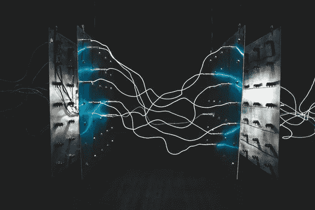
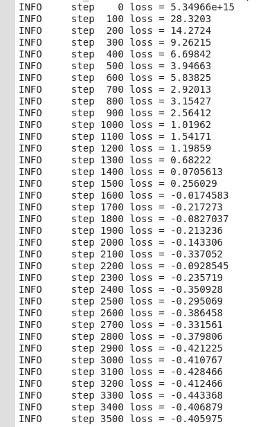
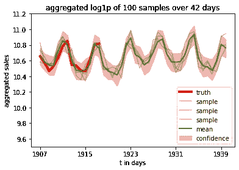

# Pyro 自上而下预测|应用案例

> 原文：<https://towardsdatascience.com/pyro-top-down-forecasting-application-case-4781eb2c8485?source=collection_archive---------48----------------------->

## *将一段时间内的点连接起来，满怀信心地进行预测(-区间)。*



***跨越时间的连接点—*** *照片由伊斯雷尔·帕拉西奥在 Unsplash 上拍摄*

你有没有想过如何解释时间序列预测中的不确定性？你有没有想过应该有一种方法从以前看到的数据中生成数据点，并对确定性做出判断？我知道我有。
如果你想建立捕捉概率并保持信心的模型，我们建议使用概率编程框架，如 [Pyro](https://pyro.ai/) 。
在之前的一篇[文章](http://laplaceml.com/ngboost-incremental-forecasting/)中，我们研究了 NGBoosting，并将其应用于 Kaggle 上的 M5 预测挑战。简单回顾一下——M5 预测挑战要求我们预测沃尔玛商品的销售将如何发展。它提供了来自不同州的不同商店的不同类别的商品的大约 4-5 年的数据，并要求我们预测我们没有信息的 28 天。作为对挑战和数据集的概述，我们仍然推荐这款[令人惊叹的笔记本](https://www.kaggle.com/headsortails/back-to-predict-the-future-interactive-m5-eda)。上次我们总结说，我们用 Pyro 得到了更好的结果，这里是一个简单的演示我们是如何做到这一点的。

随着时间的推移，有不同的方法来建模和预测数据。有*自顶向下模型*、*状态空间模型*和*层次模型*——仅举几个例子。在这篇文章中，我们看到了如何通过一个非常粗糙和基本的自顶向下的模型进行预测。我们充分利用了 Pyro 中现有的**预测器**对象。我们只是告诉模型如何做出明智的预测。之后，我们将所有数据转储到其中。就是这样——很简单！没有花哨的先验，没有花哨的潜在分布假设，只有数据和概率框架。我们还需要做一些假设，我们会带你经历这些。

```
Sidenote: One more elegant way to do forecasting is with hierarchical models. These models allow accounting for different distributions over different categories in your data. You can assign individual priors and make use of information that you have about your model. The elegance of such an approach will be covered in another post.
```

最后，我们将所有的时间序列信息转储到模型中，这是一段时间内的*销售*，同时将销售作为独立的随机事件保存。我们不用别的。
Pyro 编程框架，特别是 [ForecastingModel](http://docs.pyro.ai/en/stable/contrib.forecast.html) ，是我们模型的引擎，我们还需要一个驱动程序。
推动我们的模型朝着正确方向发展的因素是:

```
prediction = regressor + trend + seasonal + motion + bias
```

这一行简单的代码结合了我们随时间采样的 Pyro 对象。现在，让我们看看所有这些部分的含义:

# 构建模型

实际模型零件由**回归器**捕获。这一部分寻找合适的模型权重，并将它们与直接来自数据输入的特征进行比较。每个权重都位于经典的高斯曲线上。这意味着我们从以零为中心、标准差为 1 (μ=0，σ =1)的正态分布中采样。

```
weight = pyro.sample("weight", dist.Normal(0, 1).expand(
        [feature.size(-1)]).to_event(1))
 regressor = (weight * feature).sum(-1)
```

第二个参数是**趋势**。我们参考我们的概率窥镜，然后决定它应该来自对数正态分布，例如 l∞LN，μ=-2，σ =1。一个关键的因素是我们考虑了我们提供给模型的时间特征。

```
trend_coef = pyro.sample("trend", dist.LogNormal(-2, 1))
trend = trend_coef * time
```

现在没有**季**的趋势是什么？潮流来来去去，但季节是我们可以依靠的。我们知道基础数据描述了一段时间内的购买情况。我们认为销售额的变化是通过一周中的某一天来捕捉的。因此我们说

```
with pyro.plate("day_of_week", 7, dim=-1):
    seasonal = pyro.sample("seasonal", dist.Normal(0, 5))
seasonal = periodic_repeat(seasonal, duration, dim=-1)
```

这里我们使用了另一个简洁的烟火物体:[盘子](http://docs.pyro.ai/en/0.3.0-release/_modules/pyro/primitives.html#plate)。这种结构用于模拟随机事件的独立性。这意味着我们正在观察一个实例的发生。这个观察来自我们数据的每个时间步。彻底的解释可以在[烟火 SVI 教程](https://pyro.ai/examples/svi_part_ii.html)中找到。出于简单的目的，我们将其分解，并说我们认为数据在七天的窗口内上升和下降。我们将其转化为独立采样的事件。最后但并非最不重要的是，不仅仅有一个七天的间隔，但是我们*在我们所有给定的时间输入 aka 上周期性地重复*这个。我们的持续时间是时间张量的大小。

最后，每一个专业的 ML 模型都需要一些可训练的参数，以说明有时事情并不像你期望的那样好——我们称之为**偏差**。我们决定我们的偏差(b)来自一个正态分布，这样 b∞N 其中μ=0 和σ =10 或 loc=0 和 scale=10，如果你想谈论 Pyro。

```
bias = pyro.sample("bias", dist.Normal(0, 10))
```

在我们继续之前，让我们看看参数的分布。


*图 1——根据颜色绘制的所有采样参数的密度图。y 轴被截断，趋势对数正态分布的最大值为> 2.5。*

你，细心的读者，可能会在这一点上得出结论。你有你需要的一切，我们同意。我们现在所拥有的足以给我们一个估计，并对未来几天做出预测。不过我们可以做得更好。到目前为止，我们预测的是一个非常僵硬的表达。模型被告知要符合输入，但我们不允许留有余地。为了便于讨论，让我们假设加州的所有人都决定在周四下午而不是周六去购物；或者危机发生，每个人都去为世界末日做准备。我们的模型可能已经正确预测了所有以前的星期六，但是那个星期四真的把它打乱了。为了解决这个问题，我们引入了一个叫做重新参数化的东西。有关该主题的详细概述，请参见[2]。
为了使它更加健壮，我们通过另一个重新参数化来进行重新参数化——我们这样做的原因在这里[解释](http://pyro.ai/examples/forecasting_i.html)。
将所有东西打包在一起，我们得到一个漂移，它定义了我们模型的**运动**。这就翻译成了烟火:

```
drift_stability = pyro.sample("drift_stability", dist.Uniform(1, 2))
drift_scale = pyro.sample("drift_scale", dist.LogNormal(-17, 5))
with self.time_plate:
   with poutine.reparam(config={"drift": LocScaleReparam()}):
      with poutine.reparam(config={"drift": SymmetricStableReparam()}):
         drift = pyro.sample("drift", dist.Stable(drift_stability, 0, drift_scale))
motion = drift.cumsum(dim=-1)
```

现在我们有了模型运行所需的一切。

# 你的工作模型

对于实际的模型拟合部分，我们使用 Pyro 的随机变量推理机或 SVI。这个算法允许我们在合理的时间内有效地计算后验分布。在我们的例子中，这样做是为了最大化证据下限或 [ELBO](https://pyro.ai/examples/svi_part_iii.html) 。考虑 ELBO 的一个简单方法是观察两个不同的分布，一个当前分布和一个先前分布。如果分布相差很大，我们会得到一个低的 ELBO 值。另一方面，如果我已经拟合了一个好的分布，我的下一个可能也一样好，与已经观察到的一个很好地对齐，并且我得到一个高的 ELBO 值。有些人甚至会说两种分布的*差异被最小化*。要详细阅读它，我们可以参考 SVI 的原始论文(见[【3】](http://jmlr.org/papers/v14/hoffman13a.html))。现在让我们假设这是可行的，因为聪明的研究人员已经充分实现了它。

```
We will go into the interplay of Stochastic Variational Inference and ELBO (or minimizing KL) in another article.
```

现在，我们已经建立了一个工作模型，选择了我们的算法来计算我们的后验分布，我们必须设置超参数，加载数据并开始训练。对于数据处理，我们广泛关注 github 上的 [M5 初学者工具包实现，这是 Pyro PPL 团队慷慨提供的。这是一种简单的方法，可以对销售数据等进行汇总。请自行实现。这是了解张量的可靠方法。对于我们的初学者模型，我们只关心一段时间内的销售数据。
我们现在设置参数并实例化预测器，如下所示:](https://github.com/pyro-ppl/Pyro-M5-Starter-Kit)

```
forecaster_opt = {
    "learning_rate": 0.1,
    "learning_rate_decay": 0.1,
    "clip_norm": 10,
    "num_steps": 3501,
    "log_every": 100,
}
forecaster = Forecaster(TopDownModel(), data, covariates[:-28], **forecaster_opt)
samples = forecaster(data, covariates, num_samples=1000).exp().squeeze(-1).cpu()
pred = samples.mean(0)
```

在上面的代码中，我们安装了预测器，它使用了一个 [DCTAdam](http://docs.pyro.ai/en/stable/optimization.html#pyro.optim.optim.DCTAdam) 优化器。我们提供了培训的协变量，并保留了 28 天，我们在下面的行中将其用于实际预测。实际的预测是样本的平均值，但是我们不要在这里妄下结论。当我们运行上述代码并正确实现我们的模型时，我们应该得到以下输出—实际训练:



*预测者训练过程用指定的模型结束了 3501 步的所有训练数据。随着时间的推移，损耗被最小化。*

我们看到我们的损失减少了。这很好，它告诉我们，随着时间的推移，我们预测的计算分布会变得更好。这里的损失是相对于数据和部分预测者文档的负 ELBO 的商(见[【4】](http://docs.pyro.ai/en/stable/contrib.forecast.html))。

# 真正不确定的事情——自信和一切

我们现在在记忆中保存了一个最终模型。我们可以用它来计算损失，用它来对抗新数据，戳戳它，看看它会产生什么。
例如，我们可以对一段时间内的销售额进行采样，如下图所示:



*图 2 —真实数据和随时间推移从拟合模型中采样的数据。红线表示最近可用(真实)的 14 天，而模型的抽样预测为浅绿色。报告的预测值是所有样本的平均值(绿线)。我们可以预测所需的 28 天。每个时间步长 10%-90%的置信区间用红色阴影显示。请参考下面的代码。*

为了计算各个步骤的置信度，我们要求我们的模型有 100 个样本，并计算这些样本的分位数(0.1 和 0.9)。这就是你在图 2 中看到的红色区域。既然这个模型由你支配，如果你想使它更精确，你可以要求更多的样品。为了更好地拟合模型，图中的销售额是累计的记录值。要获得更真实范围内的值，请使用 numpy 的 exp 转换这些值。

# 总结

我们已经展示了如何构建 Pyro 模型并使用预测器实现。您可以使用您所知道的关于问题的事实来设置模型参数并找到合适的分布。Pyro 附带了很多功能。其中之一是 SVI，一种计算后验概率的算法，这使得模型训练首先成为可能。在我们拟合我们的模型后，我们可以从中取样，预测数据点并计算我们预测的置信区间。总而言之，概率编程和 Pyro 之类的框架提供了一个强大的工具集，在处理不确定性和对现实世界数据建模时可以使用。

# 完整的型号代码

```
class TopDownModel(ForecastingModel):
  """
  Top-Down Hierarchical Forecasting Model
  """
  def model(self, zero_data, covariates):
    # check univariate data
    assert zero_data.size(-1) == 1 
    duration = zero_data.size(-2) time, feature = covariates[..., 0], covariates[..., 1:] bias = pyro.sample("bias", dist.Normal(0, 10))
    trend_coef = pyro.sample("trend", dist.LogNormal(-2, 1))
    trend = trend_coef * time weight = pyro.sample("weight", dist.Normal(0, 1).expand(
        [feature.size(-1)]).to_event(1))
    regressor = (weight * feature).sum(-1) # weekly seasonality as independent events
    with pyro.plate("day_of_week", 7, dim=-1):
      seasonal = pyro.sample("seasonal", dist.Normal(0, 5))
    seasonal = periodic_repeat(seasonal, duration, dim=-1) drift_stability = pyro.sample("drift_stability", dist.Uniform(1, 2))
    drift_scale = pyro.sample("drift_scale", dist.LogNormal(-17, 5)) # introduce drift
    with self.time_plate:
          # We combine two different reparameterizers: the inner SymmetricStableReparam
          # is needed for the Stable site, and the outer LocScaleReparam improves inference.
          with poutine.reparam(config={"drift": LocScaleReparam()}):
              with poutine.reparam(config={"drift": SymmetricStableReparam()}):
                  drift = pyro.sample("drift",
                                      dist.Stable(drift_stability, 0, drift_scale))
    motion = drift.cumsum(dim=-1) # predict
    prediction = regressor + trend + seasonal + motion + bias
    # Pyro Forecast is multivariate - univariate timeseries is needed
    prediction = prediction.unsqueeze(-1) # heavy tail nose to account for outliers
    stability = pyro.sample("noise_stability", dist.Uniform(1, 2).expand([1]).to_event(1))
    skew = pyro.sample("noise_skew", dist.Uniform(-1, 1).expand([1]).to_event(1))
    scale = pyro.sample("noise_scale", dist.LogNormal(-5, 5).expand([1]).to_event(1))
    noise_dist = dist.Stable(stability, skew, scale)
    with poutine.reparam(config={"residual": StableReparam()}):
      self.predict(noise_dist, prediction)
```

# 抽样和绘制置信区间

```
# sample from the fitted model to forecast data
samples = forecaster(data[T0:T1], covariates[T0:T2], num_samples=100)
samples.clamp_(min=0)p10, p50, p90 = quantile(samples[:, :], (0.1, 0.5, 0.9)).squeeze(-1)fig, ax = plt.subplots()ax.set_title("aggregated (log1p) sales over 42 days")
ax.plot(data[T1:T2].squeeze(-1).cpu().numpy(), "r-",lw=4, label="truth")
ax.fill_between(np.arange(0, (T2-T1)), p10.cpu().numpy(), p90.cpu().numpy(), alpha=0.3, color="red", label="confidence")
ax.plot(samples.squeeze(-1).T.cpu().numpy()[:, 10:13], color="green", alpha=0.35, label="sample")
ax.plot(np.mean(samples.squeeze(-1).T.cpu().numpy()[:, :], axis=1),color="green", lw=2, alpha=0.75, label="mean")
ax.set_xlabel("t in days")
ax.set_ylabel("aggregated sales")
labels = np.arange(len(covariates)-42, len(covariates), step=8)
ax.set_xticklabels(labels)
plt.ylim((9.5, 11.2))
plt.legend(loc='lower right')
plt.show()
```

## 承认

非常感谢 Pyro 文档和开发团队。GitHub 上关于主题和实现的全面写作确实使 Pyro 用户能够立即投入使用。我们的模型是不同模型的混合实验，我们测试了哪些部分可以很好地协同工作。

# 参考

1.  Pyro 文档—预测教程 [I](http://pyro.ai/examples/forecasting_i.html) 、 [II](https://pyro.ai/examples/forecasting_ii.html) 和 [III](http://pyro.ai/examples/forecasting_iii.html)
2.  米（meter 的缩写））戈里诺瓦，d .摩尔，m .霍夫曼。概率程序的自动重新参数化。2019 发表于 [ArXiv](https://arxiv.org/pdf/1906.03028.pdf)
3.  米（meter 的缩写））霍夫曼等人在*随机变分推理。* 2013 年。在 [JMLR](http://jmlr.org/papers/v14/hoffman13a.html)
4.  优步技术公司。2018.烟火预报员见[文件](http://docs.pyro.ai/en/stable/contrib.forecast.html)