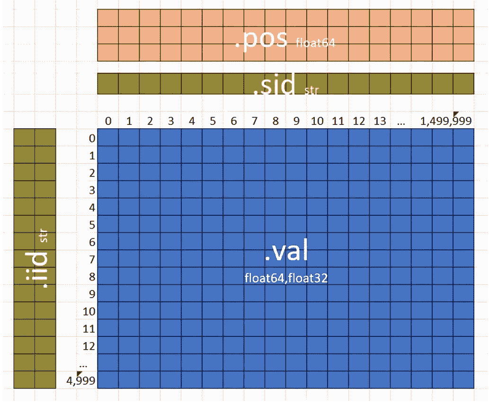
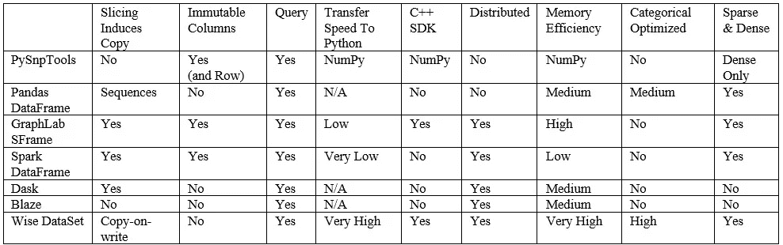

# PySnpTools

> 原文：<https://towardsdatascience.com/pysnptools-9038f994fdd7?source=collection_archive---------56----------------------->

## 在 Python 中读取和操作基因组数据


[国立癌症研究所](https://unsplash.com/@nci?utm_source=medium&utm_medium=referral)在 [Unsplash](https://unsplash.com?utm_source=medium&utm_medium=referral) 拍摄的照片

PySnpTools 是一个 Python 库，用于读取和操作 Python 中的基因组数据。它允许用户有效地选择和重新排序个体(行)和 SNP 位置(列)。然后，它只读取选定的数据。PySnpTools 最初是为了支持[快速 LMM](https://fastlmm.github.io/)——一种全基因组关联研究(GWAS)工具——而开发的，现在支持大内存和集群规模的工作。

> **2022 年 3 月 22 日更新**:更新示例以匹配[本笔记本](https://nbviewer.org/github/fastlmm/PySnpTools/blob/master/doc/ipynb/paper.ipynb)。

# 介绍

当我们开发快速 LMM 包(1；2;3;4;5;6)，我们厌倦了重新编写代码来支持越来越多的文件格式(*例如*，PLINK 的 Bed，Dat，Pheno 等。) (7;8).此外，我们注意到自己重复地进行类似的操作，例如，

*   读取 SNP 子集(列)的数据，
*   对我们的表型数据中的个体(行)进行重新排序，以匹配它们在 SNP 数据中的顺序，以及
*   填补缺失数据和规范化数据。

受 NumPy 和 Pandas 的启发，我们创建了 PySnpTools，这是一个开源库，使这些操作变得简单。

我们在西雅图的 PyData 2015 大会上展示了 PySnpTools 的第一个公开版本。

> 在会议上，Travis oli phant(NumPy 的主要创建者)推荐了 PySnpTools 读取和操作基因组数据的方法(9)。

会议结束后不久，希拉里·菲纽肯(麻省理工学院和哈佛大学布罗德研究所菲纽肯实验室的负责人)写信给我们:

> “我一直喜欢 PySnpTools，并向其他使用 Python (10)的统计遗传学家推荐它！”

自会议以来，随着 FaST-LMM 发展到支持多达 100 万个样本的数据集(6)，我们扩展了 PySnpTools 以简化:

*   大于内存的数据集
*   在多个处理器或任何集群上运行循环，以及
*   在本地或从/向任何远程存储器读写文件。

最近，我们已经使用多线程来加快读床速度，并增加了对 BGEN 格式的支持。

本文讲述了如何安装 PySnpTools，并描述了 PySnpTools 关注的基因组数据。然后给出了核心用法的例子。最后，它列出了 PySnpTools 的其他特性，并提供了与其他数据集方法的简要比较。

# 安装 PySnpTools

要使用 PySnpTools:

`pip install pysnptools`

你可以在[https://github.com/fastlmm/PySnpTools](https://github.com/fastlmm/PySnpTools)找到 Jupyter 笔记本、完整的 API 文档和示例以及源代码。

# 基因组数据

我们感兴趣的基因组数据通常由 500，000 到 150 万列组成——每个 SNP 或变体一列(这是已知人类不同的基因组位置)。数据包括每个人的一行。一千到一百万行是典型的。初始数据中的值可能是 0、1、2 或缺失(代表在一个基因组位置为一个个体测量的次要等位基因的数量)。标准化后，值是 64 位或 32 位浮点数，缺少的值用 NaN(“非数字”)表示。

图 1 显示了 PySnpTools 对基因组数据的内存表示。被称为`iid`的两个字符串标识每个个体。一个名为`**sid**`的字符串识别每个 SNP。一种叫做`**val**`的浮动，告诉一个 SNP 个体的等位基因数。最后，名为`**pos**`的三重浮点表示每个 SNP 的位置(染色体数目、遗传距离和碱基对位置)。对于`**val**`中的一个给定位置，PySnpTools 可以轻松找到对应的`**iid**`、`**sid**`、`**pos.**` 而且，对于任何感兴趣的`**iids**` 或`**sids**` ，PySnpTools 都可以轻松高效地在`**val**`中找到对应的位置。



图一。PySnpTools 的基因组数据的内存表示

对于表型和协变量数据(*例如*，年龄、性别、身高、体重、疾病的存在)，PySnpTools 使用相同的表示法。对于这样的数据，`**sid**` 给出特征的名称(*如*，“高度”)，而`**pos**`被忽略。`**val**` 数组作为浮点数，也可以通过 0.0 和 1.0 表示二进制数据。我们通过 hot-one 编码处理分类数据。

# 读取基因组文件:一个例子

PySnpTools 将从文件中读取基因组数据的 Python 对象称为 SnpReader。下面是如何为流行的 Bed 文件格式创建 SnpReader:我们告诉它要读取什么文件以及如何读取。(这个 SnpReader 还没有从它的文件中读取任何内容。)

*输入:*

```
*# Download BED files and return local file name*
**from** **pysnptools.util** **import** example_file
all_bed_file = example_file("doc/ipynb/all.*",endswith="*.bed"**from pysnptools.snpreader import Bed** snpreader = Bed(all_bed_file, count_A1=True)
print(snpreader)
```

*输出:*

```
Bed("[...]/all.bed",count_A1=True)
```

我们可以向 SNP 阅读器询问个体的数量和 SNP 的数量。我们也可以，例如，要求它为第一个体的`**iid**` 。我们可以另外向它索要最后一个 SNP 的`**sid**` 。(Bed SnpReader 只读取回答这些问题所需的小文件。)

*输入:*

```
print(snpreader.iid_count,snpreader.sid_count)
print(snpreader.iid[0])
print(snpreader.sid[-1])
```

*输出:*

```
500 5000
['cid0P0' 'cid0P0']
snp124_m0_.23m1_.08
```

接下来，我们可以将所有基因组数据读入内存，创建一个新的 SnpReader，称为 SnpData。因为 SnpData 是 SnpReader，我们可以再次询问个体和 SNP 的数量。

*输入:*

```
snpdata = snpreader.read()
print(snpdata)
print(snpdata.iid_count, snpdata.sid_count)
```

*输出:*

```
SnpData(Bed('all.bed',count_A1=True))
500 5000
```

SnpData 是一个 SnpReader，它包含一个其他 SNP reader 没有的额外的`**val**` 属性。`**val**` 属性是基因组数据的(内存中)NumPy 数组。

例如，我们可以显示前 7 个个体和前 7 个 SNPs 的基因组数据。我们还可以找到所有基因组数据的平均值。

*输入:*

```
**import** **numpy** **as** **np** print(snpdata.val[:7,:7])
print(np.mean(snpdata.val))
```

*输出:*

```
[[0\. 0\. 1\. 2\. 0\. 1\. 2.]
 [0\. 0\. 1\. 1\. 0\. 0\. 2.]
 [0\. 0\. 1\. 2\. 1\. 0\. 0.]
 [0\. 0\. 0\. 2\. 0\. 0\. 0.]
 [0\. 0\. 0\. 0\. 0\. 0\. 2.]
 [0\. 0\. 1\. 0\. 0\. 0\. 2.]
 [0\. 0\. 2\. 1\. 0\. 1\. 2.]]
0.521412
```

或者，我们可以在一行中做所有的事情。

*输入:*

```
print(np.mean(Bed(all_bed_file,count_A1=**True**).read().val))
```

*输出:*

```
0.521412
```

# SnpData

SnpData，特殊的内存 SnpReader，由任何 SnpReader 的`**read()**` 方法创建。我们还可以从头开始创建 SnpData。

这里我们为三个个体和两个 SNP 创建`**snpdata1**` 。我们用 NaN 标记一个缺失值，然后求平均值(忽略缺失值)。

*输入:*

```
**from pysnptools.snpreader import SnpData**
snpdata1 = SnpData(iid=[['f1','c1'],['f1','c2'],
                       ['f2','c1']],
                   sid=['snp1','snp2'],
                   val=[[0,1],[2,.5],[.5,np.nan]])
print(np.nanmean(snpdata1.val))
```

*输出:*

```
0.8
```

# 在读取前选择并重新排序数据

*假设我们只关心前 7 个个体和前 7 个 SNP 的基因组数据。PySnpTools 使从磁盘中读取所需的数据变得很容易。我们在 read 方法之前使用类似 NumPy 的索引。*

**输入:**

```
*snpreader = Bed(all_bed_file,count_A1=**True**)
snpdata77 = snpreader[:7,:7].read()
print(snpdata77.val)*
```

**输出:**

```
*[[0\. 0\. 1\. 2\. 0\. 1\. 2.]
 [0\. 0\. 1\. 1\. 0\. 0\. 2.]
 [0\. 0\. 1\. 2\. 1\. 0\. 0.]
 [0\. 0\. 0\. 2\. 0\. 0\. 0.]
 [0\. 0\. 0\. 0\. 0\. 0\. 2.]
 [0\. 0\. 1\. 0\. 0\. 0\. 2.]
 [0\. 0\. 2\. 1\. 0\. 1\. 2.]]*
```

*支持所有类似 NumPy 的花哨索引:切片、布尔、整数列表、负整数(11)。此外，PySnpTools 允许同时对行和列进行有趣的索引。*

*将索引附加到任何 SnpReader，创建一个新的 SnpReader。这里有一个极端的例子。它说，“创造一个阅读器*

*   *来自 bed 格式的文件“all.bed”*
*   *个体以相反的顺序并且对于每第二个 SNP*
*   *对于前 5 个这样的个体和前 5 个这样的 SNP*
*   *对于第一个和最后一个个体以及第一个、第二个和第五个 SNP，*
*   *然后读。"*

*和以前一样，只从磁盘中读取最终所需的数据。*

**输入:**

```
*print(Bed(all_bed_file,count_A1=**True**)[::-1,::2][:5,:5]
       [[0,-1],[True,True,False,False,True]]
       .read().val)*
```

**输出:**

```
*[[0\. 0\. 1.]
 [0\. 1\. 1.]]*
```

# ***通过单个(行)和 SNP(列)标识符进行索引***

*我们已经看到了如何使用基于位置的索引来操作 SnpReaders。如果我们转而希望通过`**iid**` (个体的标识符)或`**sid**`**(SNPs 的标识符)来操纵 SnpReaders 呢？这是一个更像熊猫的场景。在这种情况下，我们可以使用`**iid_to_index()**` 或`**sid_to_index()**` 的方法。***

***这个例子显示了如何读取三个感兴趣的 SNP，每个 SNP 由`**sid**`而不是位置识别。***

****输入:****

```
***desired_sid_list = ['snp1750_m0_.02m1_.04',
              'snp0_m0_.37m1_.24','snp122_m0_.26m1_.34']
snpreader = Bed(all_bed_file,count_A1=**True**)
desired_snpreader = \
    snpreader[:,snpreader.sid_to_index(desired_sid_list)]
print(desired_snpreader.iid_count,
      desired_snpreader.sid_count)***
```

****输出:****

```
***500 3***
```

# ***读者和伪读者***

***PySnpTools 包括这些常见文件格式的 SNP reader:Bed、Pheno、Dat、Ped、Dense。它还定义了这些新的二进制格式:SnpNpz、SnpHdf5 和 SnpMemMap。最后一点很有趣，因为它使用 NumPy 的内存映射数组来提供对大于内存容量的数据的内存访问。PySnpTools 还定义了一种称为 DistributedBed 的格式，这种格式提供了对密集存储在几十个(或几百或几千个)Bed 文件中的数据的随机访问。***

***此外，PySnpTools 还包括 SnpGen，可以称之为“伪阅读器”。对于任何使用 SnpGen 的程序来说，它看起来像一个文件阅读器，但它不是从磁盘读取数据，而是动态生成随机的基因组数据。基于用户提供的种子的这一代是确定性的。***

***除了阅读 SNPS，PySnpTools 还包括大量内核数据的读者和伪读者。(核数据表示个体之间成对的相似性。)***

***如果 PySnpTools 不支持感兴趣的数据格式，您有两种选择。如果您的数据相对较小，您可以使用其他 Python 工具读取它，然后创建内存中的 SnpData(或 SnpMemMap)对象。如果需要更高的性能，可以为该格式编写一个新的 SnpReader 模块。在这两种情况下，为 SnpReader 编写的任何程序都将自动使用新的数据格式。***

# ***超越阅读***

***最近，当我们努力将快速 LMM 扩展到 100 万个样本时，我们向 PySnpTools 添加了更多功能。PySnpTools 现在包括以下工具:***

*   ***标准化 SNP 数据和内核，***
*   ***交叉(和排序)来自任何数量 SnpReaders 的个体(在一行中)，***
*   ***有效地处理大整数范围，***
*   ***编写循环，以便它们可以在多个处理器或任何集群(由一个模块定义)上运行，以及***
*   ***向任何本地或任何分布式文件系统(由模块定义)读写文件。***

# ***与其他数据集格式相比***

***在 PyData 2015 上，Joshua Bloom 比较了用于数据科学的数据集工具(12)。表 1 用 PySnpTools 更新了他的表。基本上，与 [xarray](http://xarray.pydata.org/) 非常相似，PySnpTools 用不可变的索引行和列标识符来修饰 2d NumPy 数组。这给了我们方便和高效率，但比其他方法更特殊的目的。PySnpTools 还延迟了所有的复制(和读取)，直到`**read()**` 方法被显式调用，这给了我们效率和可预测性。***

******

***表 1。Bloom 的数据科学数据集，加上 PySnpTools***

# ***摘要***

***PySnpTools 是一个 Python 库，用于读取和操作基因组数据。受 NumPy 和 Pandas 的启发，PySnpTools 可以被认为是一种向基因组数据添加熊猫式索引的方法。要安装 PySnpTools:***

***`pip install pysnptools`***

***你可以在[https://github.com/fastlmm/PySnpTools](https://github.com/fastlmm/PySnpTools)找到 Jupyter 笔记本、完整的 API 文档和示例以及源代码。***

## ***感谢***

***感谢 FaST-LMM 团队中的每个人，他们的使用和反馈为 PySnpTools 的设计提供了信息。特别感谢 Christoph Lippert，他编写了我们最初的 BED reader，以及 David Heckerman，他鼓励了 PySnpTools 的开发。***

## ***参考***

***1.*用于全基因组关联研究的快速线性混合模型。***【Lippert，c .】*等*** 2011，《自然方法》，8 833–835 页。***

***2.*对扩展的威康信托数据进行详尽的上位 SNP 关联分析。* **Lippert，c .等人** 2013 年，科学报告 3，1099。***

***3.*基于核的遗传变异集关联测试的能力和计算效率更高。* **李柏特，C，*等*** 2014，生物信息学 30，22。***

***4.*对全基因组关联研究线性混合模型的进一步改进。* **Widmer，c .，*等*** 2015，科学报告，4 6874。***

***5.*遗传力估计的线性混合模型。* **赫克曼，D. *等人*。** 2016 年美国国家科学院院刊 113 期(27)。***

***6.用于全基因组关联研究的 Ludicrous Speed 线性混合模型。 **卡迪，C. &海克尔马，D.** 2019，bioRxiv 154682。***

***7.珀塞尔，s .普林克。【http://zzz.bwh.harvard.edu/plink/.在线】***

***8. *PLINK:全基因组关联和基于人群的工具集。* **Purcell，S. *等*** 2007，美国人类遗传学杂志，81。***

***9.奥列芬特，t。2015.***

***10.个人通信。2015.***

***11.分度**。** *NumPy 用户指南。*【在线】[https://docs . scipy . org/doc/numpy/reference/arrays . indexing . html](https://docs.scipy.org/doc/numpy/reference/arrays.indexing.html.)***

***12.机器学习的系统观点。 **布鲁姆，J.** 西雅图:s.n .，2015。PyData。***