# PySpark 和 SparkSQL 基础知识

> 原文：<https://towardsdatascience.com/pyspark-and-sparksql-basics-6cb4bf967e53?source=collection_archive---------0----------------------->

## 使用 PySpark 实施大数据

## 如何用 Python 编程实现 Spark


[**【来源】**](https://pixabay.com/illustrations/analytics-information-innovation-3088958/)

Python 通过 Spark Python API 揭示了 Spark 编程模型来处理结构化数据，该 API 被称为 [**PySpark**](https://spark.apache.org/docs/0.9.1/api/pyspark/index.html) 。

这篇文章的目的是演示如何用 PySpark 运行 Spark 并执行常见的函数。

Python 编程语言需要安装 IDE。使用 Python 和 Anaconda 的最简单的方法，因为它安装了足够的 IDE 和重要的包。

# 1.下载 Anaconda 并安装 PySpark

借助这个 [**链接**](https://www.anaconda.com/distribution/) ，可以下载 Anaconda。下载合适的 Anaconda 版本后，点击它继续安装程序，安装程序在 [**Anaconda 文档**](https://docs.anaconda.com/anaconda/install/) 中有详细说明。

安装完成后，将会打开 Anaconda Navigator 主页。要使用 Python，只需点击“笔记本”模块的“启动”按钮。

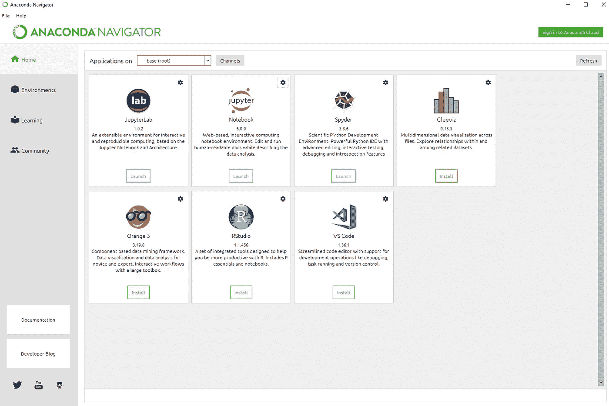

Anaconda Navigator 主页(图片由作者提供)

为了能够通过 Anaconda 使用 Spark，应该遵循下面的包安装步骤。

> Anaconda 提示终端
> 
> 康达安装 pyspark
> 
> 康达安装 [pyarrow](https://pypi.org/project/pyarrow/)

PySpark 和 PyArrow 包安装完成后，只需关闭终端，返回 Jupyter Notebook，在代码顶部导入所需的包。

```
import pandas as pd
from pyspark.sql import SparkSession
from pyspark.context import SparkContext
from pyspark.sql.functions 
import *from pyspark.sql.types 
import *from datetime import date, timedelta, datetime
import time
```

# 2.正在初始化 SparkSession

首先，需要初始化一个 Spark 会话。在 SparkSession 的帮助下，可以创建 DataFrame 并将其注册为表。而且执行 SQL 表，可以缓存表，可以读取 parquet/JSON/CSV/Avro 数据格式的文件。

```
sc = SparkSession.builder.appName("PysparkExample")\    
.config ("spark.sql.shuffle.partitions", "50")\    .config("spark.driver.maxResultSize","5g")\    
.config ("spark.sql.execution.arrow.enabled", "true")\    .getOrCreate()
```

关于 SparkSession 各个参数的详细解释，敬请访问[py spark . SQL . spark session](https://spark.apache.org/docs/2.1.0/api/python/pyspark.sql.html?highlight=sparksession#pyspark.sql.SparkSession)。

# 3.创建数据框

数据帧可以被接受为标题列的分布式列表集合，类似于关系数据库中的表。在本文中，我们将在 PySpark API 上使用 DataFrame 操作来处理数据集。

你可以从[这个链接](https://www.kaggle.com/cmenca/new-york-times-hardcover-fiction-best-sellers)下载 Kaggle 数据集。

**3.1*。来自星火数据来源***

可以通过读取文本、CSV、JSON 和拼花文件格式来创建数据帧。在我们的例子中，我们将使用一个. json 格式的文件。您还可以通过使用如下所示的相关读取函数来查找和读取文本、CSV 和拼花文件格式。

```
**#Creates a spark data frame called as raw_data.****#JSON**
dataframe = sc.read.json('dataset/nyt2.json')**#TXT FILES#** 
dataframe_txt = sc.read.text('text_data.txt')**#CSV FILES#** 
dataframe_csv = sc.read.csv('csv_data.csv')**#PARQUET FILES#** 
dataframe_parquet = sc.read.load('parquet_data.parquet')
```

# 4.重复值

使用 dropDuplicates()函数可以消除表中的重复值。

```
dataframe = sc.read.json('dataset/nyt2.json') 
dataframe.show(10)
```

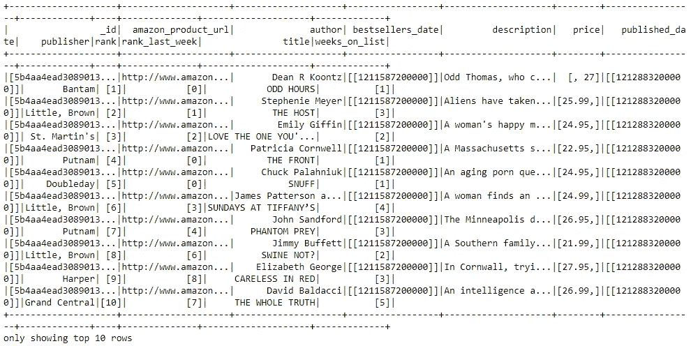

(图片由作者提供)

在应用 dropDuplicates()函数之后，我们可以观察到重复项被从数据集中删除了。

```
dataframe_dropdup = dataframe.dropDuplicates() dataframe_dropdup.show(10)
```

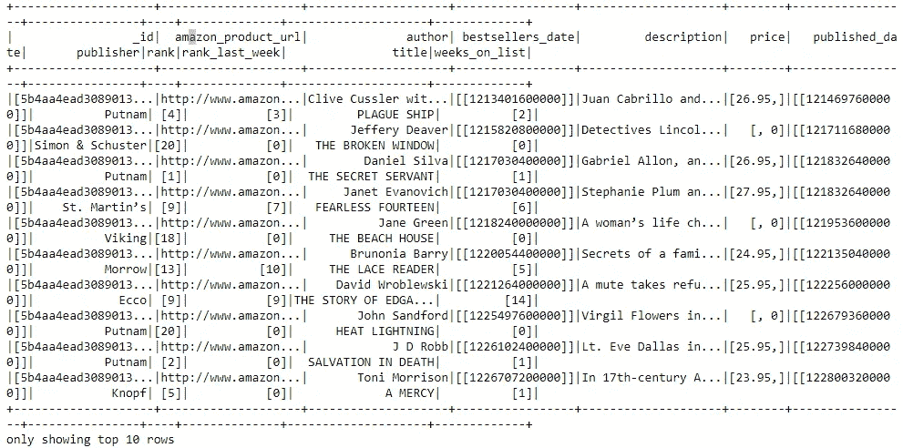

(图片由作者提供)

# 5.问题

查询操作可以用于各种目的，例如用 *"select"* 子集化列，用 *"when"* 添加条件，用 *"like "过滤列内容。*下面举例说明一些最常用的操作。有关查询操作的完整列表，请参见 [**Apache Spark 文档**](https://spark.apache.org/docs/2.1.0/api/python/pyspark.sql.html) 。

**5.1*。【选择】操作***

可以通过属性(“作者”)或索引(dataframe['author'])来获取列。

```
**#Show all entries in title column**
dataframe.select("author").show(10)**#Show all entries in title, author, rank, price columns**
dataframe.select("author", "title", "rank", "price").show(10)
```

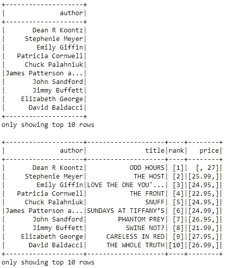

第一个结果表只显示“作者”选择，第二个结果表显示多列(作者的图像)

***5.2。【当】操作***

在第一个示例中，选择了“title”列，并添加了一个带有“when”条件的条件。

```
**# Show title and assign 0 or 1 depending on title**dataframe.select("title",when(dataframe.title != 'ODD HOURS', 
1).otherwise(0)).show(10)
```

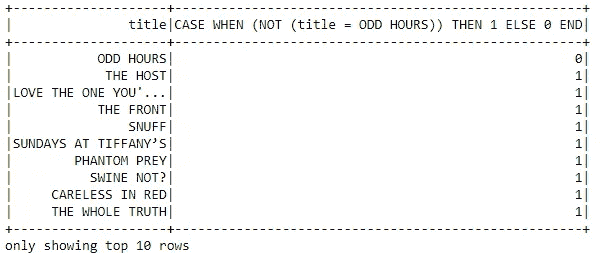

显示 10 行指定条件(图片由作者提供)

在第二个示例中，应用了“isin”操作，而不是“when ”,后者也可用于为行定义一些条件。

```
**# Show rows with specified authors if in the given options**dataframe [dataframe.author.isin("John Sandford", 
"Emily Giffin")].show(5)
```

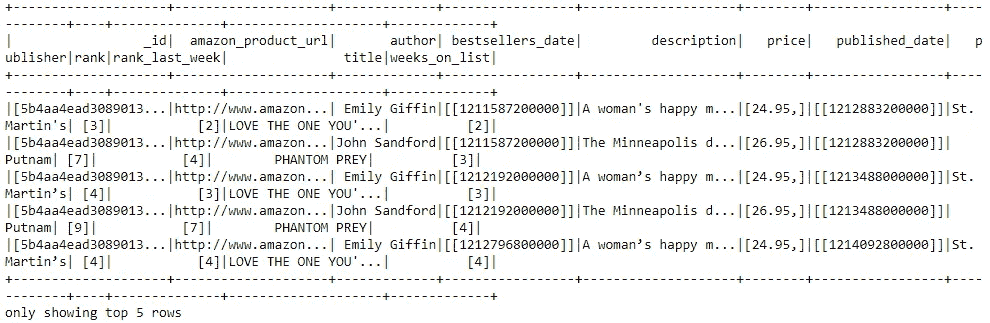

结果集显示 5 行指定的条件(图片由作者提供)

**5.3*。【喜欢】操作***

在“Like”函数的括号中,%字符用于过滤掉所有包含“the”单词的标题。如果我们正在寻找的条件是完全匹配的，那么不应该使用%字符。

```
**# Show author and title is TRUE if title has " THE " word in titles**dataframe.select("author", "title",
dataframe.title.like("% THE %")).show(15)
```


包含“THE”单词的标题的结果集。(图片由作者提供)

**5.4*。***

从单词/内容的开头开始扫描，并在括号中指定标准。并行地，EndsWith 从末尾开始处理单词/内容。这两个函数都区分大小写。

```
dataframe.select("author", "title", dataframe.title.startswith("THE")).show(5)dataframe.select("author", "title", dataframe.title.endswith("NT")).show(5)
```

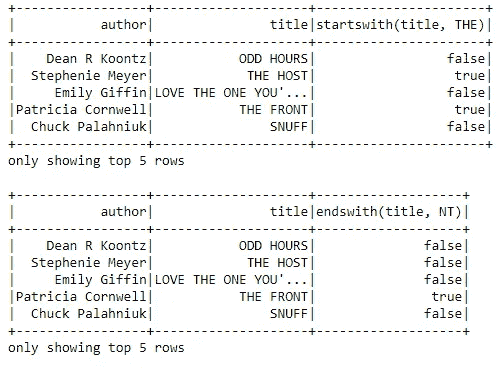

结果集有 5 行 startsWith 和 endsWith 操作。(图片由作者提供)

***5.5。【子串】操作***

Substring 函数提取指定索引之间的文本。在以下示例中，从索引号(1，3)、(3，6)和(1，6)中提取文本。

```
dataframe.select(dataframe.author.substr(1, 3).alias("title")).show(5)dataframe.select(dataframe.author.substr(3, 6).alias("title")).show(5)dataframe.select(dataframe.author.substr(1, 6).alias("title")).show(5)
```

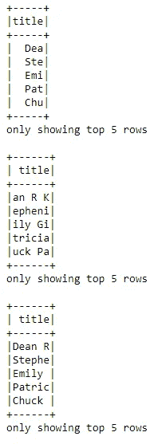

分别显示子字符串(1，3)、(3，6)、(1，6)的结果。(图片由作者提供)

# 6.添加、更新和删除列

DataFrame API 中也提供了数据操作函数。下面，您可以找到添加/更新/删除列操作的示例。

***6.1。添加*列**

```
**# Lit() is required while we are creating columns with exact values.**dataframe = dataframe.withColumn('new_column', 
F.lit('This is a new column'))display(dataframe)
```

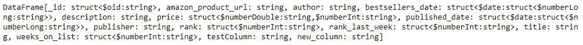

新列被添加到数据集的末尾(图片由作者提供)

**6.2*。更新列***

对于 DataFrame API 的更新操作，withColumnRenamed()函数使用两个参数。

```
**# Update column 'amazon_product_url' with 'URL'**dataframe = dataframe.withColumnRenamed('amazon_product_url', 'URL')dataframe.show(5)
```

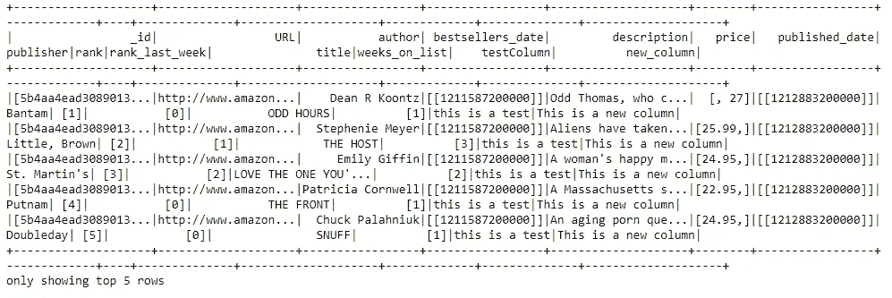

“Amazon_Product_URL”列名更新为“URL”(图片由作者提供)

**6.3*。移除列***

可以通过两种方式删除列:在 drop()函数中添加列名列表，或者通过在 drop 函数中指向来指定列。两个示例如下所示。

```
dataframe_remove = dataframe.drop("publisher", "published_date").show(5)dataframe_remove2 = dataframe \ .drop(dataframe.publisher).drop(dataframe.published_date).show(5)
```

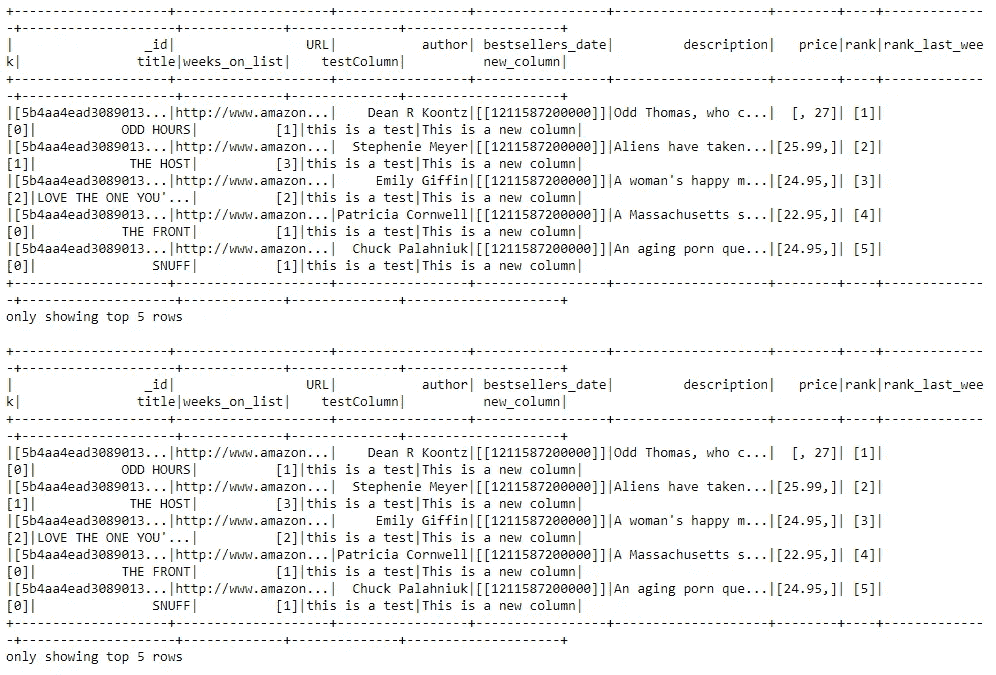

“publisher”和“published_date”列以两种不同的方法删除。(图片由作者提供)

# 7.检查数据

存在几种类型的函数来检查数据。下面，你可以找到一些常用的。要深入了解，请访问 [**Apache Spark 文档**](https://spark.apache.org/docs/2.1.0/api/python/pyspark.sql.html#pyspark.sql.DataFrame) 。

```
**# Returns dataframe column names and data types**
dataframe.dtypes**# Displays the content of dataframe**
dataframe.show()**# Return first n rows**
dataframe.head()**# Returns first row**
dataframe.first()**# Return first n rows**
dataframe.take(5)**# Computes summary statistics**
dataframe.describe().show()**# Returns columns of dataframe**
dataframe.columns**# Counts the number of rows in dataframe**
dataframe.count()**# Counts the number of distinct rows in dataframe**
dataframe.distinct().count()**# Prints plans including physical and logical**
dataframe.explain(4)
```

# 8.“分组”操作

通过在函数中添加列名，使用 GroupBy()函数应用分组过程。

```
**# Group by author, count the books of the authors in the groups**dataframe.groupBy("author").count().show(10)
```

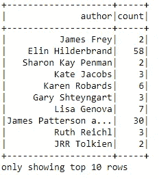

作者按出版的书籍数量分组(图片由作者提供)

# 9.“过滤”操作

通过使用 filter()函数并在其中添加一个条件参数来应用过滤。该函数区分大小写。

```
**# Filtering entries of title
# Only keeps records having value 'THE HOST'**dataframe.filter(dataframe["title"] == 'THE HOST').show(5)
```

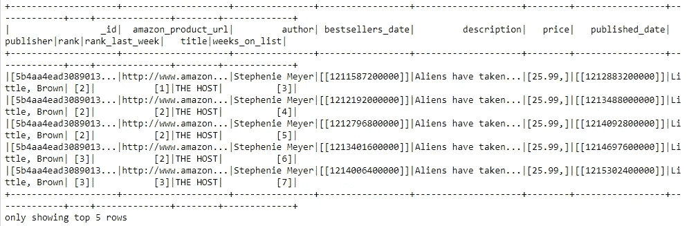

标题列被过滤，内容只有“主机”并显示 5 个结果。(图片由作者提供)

# 10.缺少和替换值

对于每个数据集，在数据预处理阶段总是需要替换现有值、删除不必要的列和填充缺失值。[**py spark . SQL . dataframenafunction**](http://pyspark.sql.DataFrameNaFunction)库帮助我们在这方面操作数据。下面补充一些例子。

```
**# Replacing null values**
dataframe.na.fill()
dataFrame.fillna()
dataFrameNaFunctions.fill()**# Returning new dataframe restricting rows with null** valuesdataframe.na.drop()
dataFrame.dropna()
dataFrameNaFunctions.drop()**# Return new dataframe replacing one value with another**
dataframe.na.replace(5, 15)
dataFrame.replace()
dataFrameNaFunctions.replace()
```

# 11.分配

可以增加或减少 RDD 中现有的分区级别。增加可以通过使用 *repartition(self，numPartitions)* 函数来实现，该函数会产生一个获得更多分区数量的新 RDD。减少可以用 *coalesce(self，numPartitions，shuffle=False)* 函数处理，该函数产生一个新的 RDD，其分区数量减少到指定的数量。更多信息请访问**[**Apache Spark docs**](https://spark.apache.org/docs/1.1.1/api/python/pyspark.rdd.RDD-class.html)。**

```
**# Dataframe with 10 partitions**
dataframe.repartition(10).rdd.getNumPartitions()**# Dataframe with 1 partition**
dataframe.coalesce(1).rdd.getNumPartitions()
```

# **12.以编程方式运行 SQL 查询**

**还可以通过在 SparkSession 上启用“sql”操作来使用原始 SQL 查询，从而以编程方式运行 SQL 查询，并将结果集作为 DataFrame 结构返回。更多详细信息，敬请访问[**Apache Spark docs**](https://spark.apache.org/docs/2.2.0/sql-programming-guide.html)。**

```
**# Registering a table**
dataframe.registerTempTable("df")sc.sql("select * from df").show(3)sc.sql("select \               
CASE WHEN description LIKE '%love%' THEN 'Love_Theme' \               WHEN description LIKE '%hate%' THEN 'Hate_Theme' \               WHEN description LIKE '%happy%' THEN 'Happiness_Theme' \               WHEN description LIKE '%anger%' THEN 'Anger_Theme' \               WHEN description LIKE '%horror%' THEN 'Horror_Theme' \               WHEN description LIKE '%death%' THEN 'Criminal_Theme' \               WHEN description LIKE '%detective%' THEN 'Mystery_Theme' \               ELSE 'Other_Themes' \               END Themes \       
from df").groupBy('Themes').count().show()
```

# **13.输出**

****13.1*。数据结构*****

**DataFrame API 使用 RDD 作为基础，它将 SQL 查询转换为低级 RDD 函数。通过使用。rdd 操作，一个数据帧可以转换成 RDD。也可以将 Spark Dataframe 转换成一串 RDD 和熊猫格式。**

```
**# Converting dataframe into an RDD**
rdd_convert = dataframe.rdd**# Converting dataframe into a RDD of string** dataframe.toJSON().first()**# Obtaining contents of df as Pandas** 
dataFramedataframe.toPandas()
```

**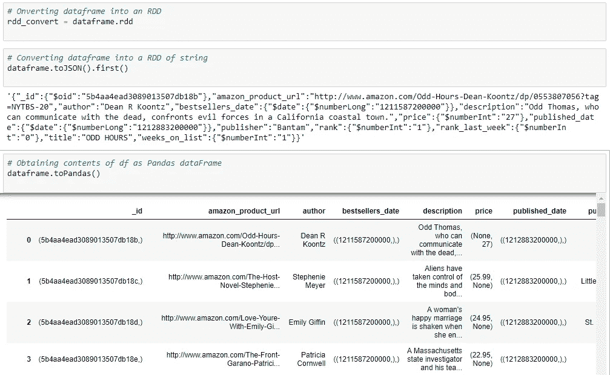**

**不同数据结构的结果(图片由作者提供)**

****13.2*。写&保存到*文件****

**作为数据帧加载到我们代码中的任何数据源类型都可以很容易地转换并保存为其他类型，包括。parquet 和. json .更多保存、加载、写函数细节请访问[**Apache Spark doc**](https://spark.apache.org/docs/latest/sql-data-sources-load-save-functions.html)。**

```
**# Write & Save File in .parquet format**
dataframe.select("author", "title", "rank", "description") \
.write \
.save("Rankings_Descriptions.parquet")
```

**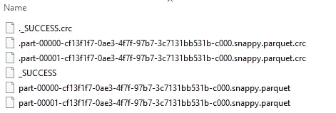**

**拼花文件是在。写吧。save()函数被处理。(图片由作者提供)**

```
**# Write & Save File in .json format**
dataframe.select("author", "title") \
.write \
.save("Authors_Titles.json",format="json")
```

**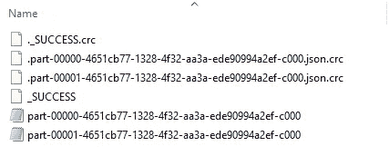**

**JSON 文件是在。写吧。save()函数被处理。(图片由作者提供)**

****13.3*。停止火花会话*****

**可以通过运行 *stop()* 功能来停止 Spark 会话，如下所示。**

```
**# End Spark Session**
sc.stop()
```

**代码和 Jupyter 笔记本都在我的 [**GitHub 上。**](https://github.com/pinarersoy/PySpark_SparkSQL_MLib)**

**非常感谢您的提问和评论！**

****参考文献:****

1.  **[http://spark.apache.org/docs/latest/](http://spark.apache.org/docs/latest/)**
2.  **[https://docs.anaconda.com/anaconda/](https://docs.anaconda.com/anaconda/)**