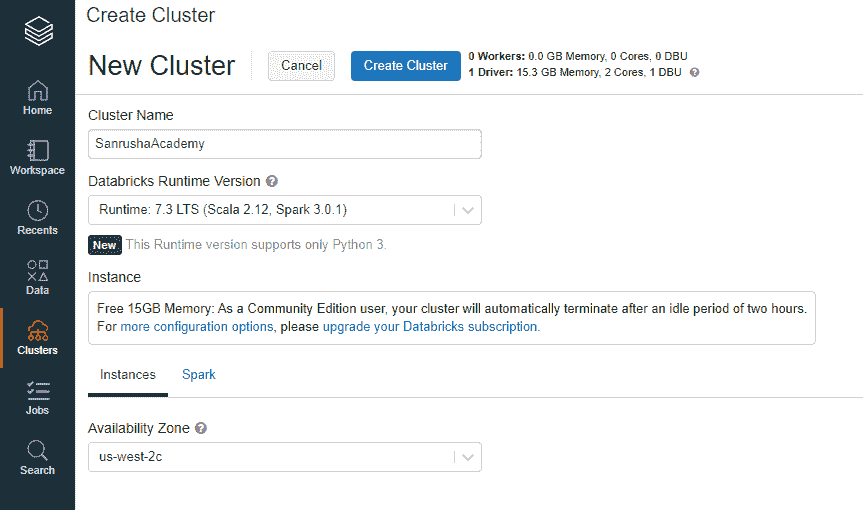
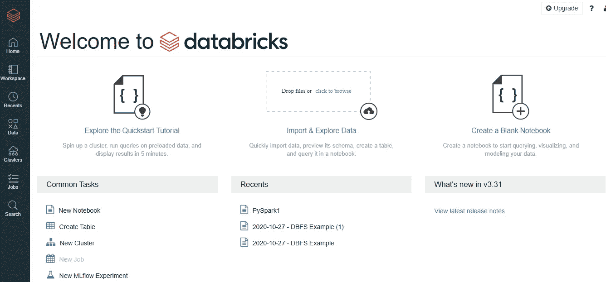
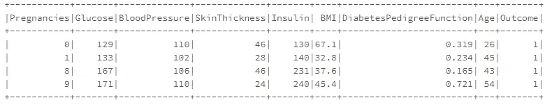

# PySpark

> 原文：<https://towardsdatascience.com/pyspark-f037256c5e3?source=collection_archive---------13----------------------->

## Python、SQL、Spark 和分布式计算的结合使大数据上的机器学习成为可能


[本·韦伯](https://unsplash.com/@benearlweber?utm_source=medium&utm_medium=referral)在 [Unsplash](https://unsplash.com?utm_source=medium&utm_medium=referral) 上拍照

Shilpa 对她的第一份工作非常满意，她是一家很有前途的初创公司的数据科学家。她喜欢 SciKit-Learn 图书馆，尤其是熊猫。使用熊猫数据框架进行数据探索很有趣。一个初露头角的数据科学家无法企及类似 SQL 的接口和快速的内存数据处理。

随着创业之旅的成熟，数据量也在增加，it 开始追求用更大的数据库和更强的处理能力来增强他们的 IT 系统。Shilpa 还通过会话池和多线程在她基于 Python 的 ML 程序中增加了并行性，然而，这还远远不够。很快，IT 部门意识到他们无法继续增加更多的磁盘空间和内存，并决定采用分布式计算(也称为大数据)。

希尔帕现在该怎么办？他们是如何让熊猫用分布式计算工作的？

这个故事你看着眼熟吗？

这就是我在本文中要带你经历的:Python 在大数据中的困境。答案是 **PySpark** 。

PySpark 是什么？

我可以有把握地假设，您一定听说过 Apache Hadoop:一种用于在计算机集群上分布式处理大型数据集的开源软件。Apache Hadoop 只能以批处理模式处理数据集，缺乏实时流处理。为了填补这个空白，Apache 推出了 Spark *(实际上 Spark 是由 UC Berkley amplab 开发的)*:一个快如闪电的内存实时处理框架。Apache Spark 是用 Scala 编程语言编写的。为了用 Spark 支持 Python，Apache Spark 社区发布了 **PySpark** 。

PySpark 被数据科学和机器学习专业人士广泛使用。看了 PySpark 提供的功能，我并不惊讶它已经被网飞、沃尔玛、Trivago、赛诺菲、Runtastic 等组织使用。

下图显示了 Pyspark 的特性。


作者图片

在本文中，我将带您一步一步地在集群计算机上使用 PySpark。

## 环境准备

要真正实践 PySpark，您需要访问一组计算机。我建议通过下面的链接创建一个免费的计算机集群环境。

 [## 数据块-登录

### 编辑描述

community.cloud.databricks.com](https://community.cloud.databricks.com/) 

注册并确认电子邮件后，将显示“欢迎使用 databricks”页面。单击常见任务列表中的新建集群。


作者图片

1.  在创建集群屏幕中输入详细信息。对于运行时版本，确保 Scala 版本高于 2.5，Python 版本为 3 及以上。



作者图片

2.单击创建集群。群集开始运行需要几分钟时间。


作者图片

3.单击集群名称可查看配置和其他详细信息。现在，不要对它做任何更改。


作者图片

恭喜你！！您的计算机集群已准备就绪。是时候将数据上传到您的分布式计算环境中了。

## 数据源

我将从下面的链接使用皮马-印第安人-糖尿病数据库。

[](https://www.kaggle.com/uciml/pima-indians-diabetes-database) [## 皮马印第安人糖尿病数据库

### 基于诊断方法预测糖尿病的发病

www.kaggle.com](https://www.kaggle.com/uciml/pima-indians-diabetes-database) 

*数据集包含几个医学预测变量(自变量)和一个目标变量(因变量)，***。独立变量包括患者的怀孕次数、身体质量指数、胰岛素水平、年龄等。**

*它有一个 diabetes.csv 文件。将其放在您的本地文件夹中，然后上传到 databrics 文件系统(DBFS)。下面是将文件上传到 DBFS 的导航。*

1.  *点击左侧菜单中的数据选项*
2.  *点击添加数据按钮*

**

*作者图片*

*3.在创建新表格屏幕中，单击浏览。*

**

*作者图片*

*4.它将指向本地磁盘上的目录路径。选择您从上面提到的 Prima-Indian-diabetes 链接下载的 diabetes.csv 文件。*

**

*作者图片*

*5.点击 DBFS。它将显示上传到 databrics 文件系统的文件(diabetes.csv)。*

**

*作者图片*

*恭喜你！！您已成功将文件上传至 databrics 文件系统。现在，您可以通过 pyspark 将它保存在集群中的不同节点上。*

## *笔记本*

*Datbricks 提供了一个编写 pyspark 代码的在线笔记本。点击新笔记本打开它。*

**

*作者图片*

## *数据帧*

*到目前为止，文件只在 DBFS。现在真正的行动开始了。在本文的这一部分，我将带您浏览 Pyspark 数据框架。*

*当我们说 dataframe 时，很明显会想到熊猫。Pandas 和 Pyspark dataframe 之间的主要区别在于 Pandas 将完整的数据放在运行它的一台计算机的内存中，Pyspark dataframe 与集群中的多台计算机一起工作(分布式计算),并将数据处理分配给这些计算机的内存。Pyspark 最大的增值是在多台计算机上并行处理一个巨大的数据集。*

*这是主要原因，Pyspark 在处理分布在不同计算机上的大型数据集时表现良好，Pandas 在处理可以存储在单台计算机上的数据集时表现良好。*

*但这并不是 Pandas 和 Pyspark 数据框之间的唯一区别。在 Pandas 和 Pyspark 之间，相同的操作在执行方式上有一些不那么细微的差异。*

*下表显示了其中的一些差异*

*既然熊猫和 Pyspark 的比较已经不在我们的讨论范围内，让我们来研究 Pyspark 数据框架。*

*以下代码行将根据 DBFS 的 CSV 数据创建一个 Pyspark 数据框，并显示前几条记录。注意如何*

**

*pyspark 数据帧上 show 命令的结果*

*像 Pandas 一样，很多操作都可以在 Pyspark 数据帧上执行。下面是一些例子。*

***printSchema:** 显示数据帧的结构，即列和数据类型，以及是否接受空值。*

**

*Pyspark 数据帧上 printSchema 命令的结果*

***列:**显示**列名称。***

```
*df.columns*
```

**

*pyspark 数据帧上 columns 命令的结果*

***计数**:显示行数。*

```
*df.count()*
```

*产量:768*

***len( < dataframe >)。<列> ):** 显示数据帧中的列数。*

```
*len(df.columns)*
```

*产出:9*

***<数据帧>。描述(<列名>)。show():** 描述提到的列。*

*以下代码描述了葡萄糖柱。*

*输出:显示葡萄糖值的统计值，如计数、平均值、标准差(stddev)、最小值(min)和最大值(max)。*

**

*pyspark 描述命令的结果*

***选择:**显示从数据框中选择的列。*

*以下代码将仅从数据框中选择葡萄糖和胰岛素值。*

**

*pyspark 数据帧上 select 命令的结果*

***like:** 它的作用类似于 SQL 中的 like 过滤器。“%”可以用作通配符来筛选结果。但是，与基于 like condition 中提到的条件过滤结果的 SQL 不同，这里显示的是完整的结果，表明它是否满足 like 条件。*

*下面的代码将显示数据帧中的怀孕和葡萄糖值，并指示单个行是否包含从 33 开始的身体质量指数值。*

**注意:通常，like 条件用于分类变量。然而，我使用的数据源没有任何分类变量，因此使用了这个例子。**

**

*数据帧上相似条件的结果*

***过滤:**根据上述条件过滤数据。*

*以下代码过滤血压大于 100 的数据帧。*

**

*pyspark 数据帧上过滤器命令的结果*

*该筛选器可用于添加多个带有 and (&)或(|)条件的条件。*

*下面的代码片段过滤血压和胰岛素值大于 100 的数据帧。*

**

*pyspark 数据帧上过滤器命令的结果*

***orderBy:** 对输出进行排序。*

*以下代码过滤血压和胰岛素值大于 100 的数据帧，并基于葡萄糖值输出。*

**

*pyspark 数据帧上过滤器命令的结果*

***Pyspark SQL***

*Hive 和 Spark SQL 可以用来查询 Hadoop 和 Spark 集群中存储的结构化数据。大多数情况下，Spark SQL 至少比 Hive 快 10 倍。当 Spark SQL 在另一个编程接口中运行时，它将输出作为数据帧返回。*

*在本文的这一部分，我将带您了解 pySpark 内置的 SQL 函数 pyspark.sql.function，它适用于 dataframe。*

*以下是一些主要功能:*

***when and other**:评估特定列的值，并将值更改为更有意义的值。*

*下面的代码显示了如何评估血压水平并将其分类为高、低和正常。*

**

*当和否则命令时 pyspak 的结果*

***聚合函数:**聚合函数，如平均值(avg)、最大值(max)、最小值(min)、总计(sum)、计数。*

*以下代码将显示糖尿病和非糖尿病患者的最大和最小葡萄糖值和计数。*

**

*pyspark SQL 聚合函数的结果*

*参考 [pySpark SQL page](https://spark.apache.org/docs/latest/api/python/pyspark.sql.html) 获得内置函数的完整列表。*

## *以编程方式运行 SQL 查询*

*如果你像我一样有数据库经验并喜欢 SQL 查询，你会喜欢 PySpark 的这个特性。*

*如果我告诉你，你可以在 pySpark 中直接运行任何 SQL 查询，结果将以 dataframe 的形式出现，那会怎么样？*

*这是一个两步走的过程。*

1.  *使用数据帧中的完整数据创建临时或全局视图。*
2.  *在使用 Oracle、MySQL 等关系数据库时，可以像使用数据库视图一样在该视图上运行 SQL 查询。*

**

*pyspark SQL 程序的结果*

*好吧，我同意这太简单了。让我们用聚合函数和 group by、order by 编写一个 SQL。*

*下面的 SQL 将打印糖尿病数据库中每个年龄组的平均血糖和血压。结果将按平均血压排序。它将显示 5 条记录。*

**

*pyspark SQL 编程的结果*

*createOrReplaceTempiew 将创建一个临时视图，只要会话处于活动状态，该视图就会显示值。要创建跨会话的视图(类似于数据库实体化视图)，请使用 createGlobalTempView。*

*在 pySpark 中，通过 SQL 编程可以做很多事情。在[Spark 文档](https://spark.apache.org/docs/2.2.0/sql-programming-guide.html)中获取可能性列表。*

## *用户定义的函数(UDF)*

*上一节中的 SQL 包含预定义的 SQL 函数，如 format_number、avg。在实际项目中，数据科学家经常会遇到这样的情况，他们想要实现一些没有内置函数的东西。那是他们使用 UDF 的时候。*

*下面是一个 Python 函数的片段，它根据一个人的身体质量指数来指示这个人是体重不足、超重、正常体重还是肥胖。*

*为了在 Spark SQL 中使用这个 Python 函数，将其注册为 UDF。*

*现在，UDF BMIInd 可以在 Spark SQL 中使用，如下所示。*

**

*用 UDF 输出触发 SQL*

## *pySpak ML*

*除非我们触及 Spark 的机器学习库 MLlib，否则这篇文章是不完整的。*

*下面是来自 [Spark 网页](https://spark.apache.org/docs/latest/ml-guide.html)*

> **MLlib 是 Spark 的机器学习(ML)库。它的目标是让实用的机器学习变得可扩展和简单。在高层次上，它提供了一些工具，例如:**
> 
> **ML 算法:分类、回归、聚类、协同过滤等常用学习算法**
> 
> **特征化:特征提取、变换、降维、选择**
> 
> **管道:用于构建、评估和调整 ML 管道的工具**
> 
> **持久性:保存和加载算法、模型和管道**
> 
> **实用程序:线性代数、统计学、数据处理等。**

*我们将对糖尿病数据使用 Spark MLlib 来创建一个预测模型，该模型可以根据患者的身体质量指数、年龄、血糖水平和血压来预测他/她是否是糖尿病患者。*

1.  *Vectorassembler:第一步是使用 pyspark.ml.feature 中的 VectorAssemble 方法将所有特征组合成一个向量*
2.  *然后将数据分成训练和测试数据集。*

**

*训练和测试中特征组合和数据分割的结果*

*3.为此，我将使用集成方法梯度引导分类器。*

**

*梯度增强分类器结果*

*不错，梯度推进分类器返回 75%的准确性。*

*浏览[Spark ml lib](https://spark.apache.org/docs/latest/ml-guide.html)页面，获取 Spark 提供的机器学习模型列表。*

## *结论*

*这是一篇大文章。我认为 pySpark 值得拥有这个，因为它是分布式计算上数据科学和机器学习可用的最强大的工具。我和我的学生已经成功地使用了本文档中解释的每一个特性和命令，它们对我们来说工作得很好。但是，如果您遇到任何问题，请让我知道。*

*我期待你的反馈。*

***参考:***

*[https://www . udemy . com/course/Apache-spark-for-data-engineers/？referral code = ca 92888 da 98 AEA 3315 AC](https://www.udemy.com/course/apache-spark-for-data-engineers/?referralCode=CA92888DA98AEA3315AC)*