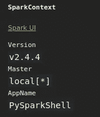
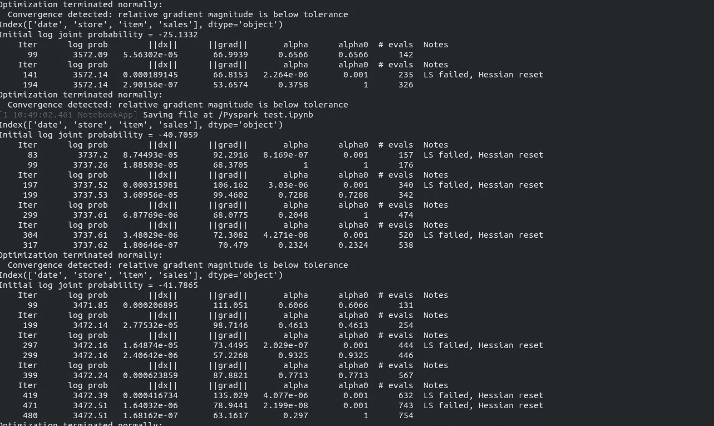
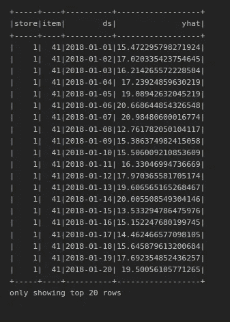

# Pyspark —用熊猫 UDF 和 fb-prophet 进行预报

> 原文：<https://towardsdatascience.com/pyspark-forecasting-with-pandas-udf-and-fb-prophet-e9d70f86d802?source=collection_archive---------8----------------------->

## 预测几个时间序列一次与先知和熊猫 UDF 没有循环。


[https://upload . wikimedia . org/Wikipedia/commons/f/F3/Apache _ Spark _ logo . SVG](https://upload.wikimedia.org/wikipedia/commons/f/f3/Apache_Spark_logo.svg)

在开始任何与熊猫-udf 相关的工作之前，**的先决条件**是

*   火花≥ 2.4
*   pyarrow ≤ 0.14.1(高于此版本有一些问题)

然后我们需要为 pyarrow 设置一个环境变量为 1。(参见进口代码)

```
sudo pip3 install pyarrow=0.14.1
```

然后，我们可以继续库导入。

```
from pyspark.sql import SparkSession
from pyspark.sql.types import *
from pyspark.sql.functions import pandas_udf, PandasUDFType, sum, max, col, concat, lit
import sys
import os
# setup to work around with pandas udf
# see answers here [https://stackoverflow.com/questions/58458415/pandas-scalar-udf-failing-illegalargumentexception](https://stackoverflow.com/questions/58458415/pandas-scalar-udf-failing-illegalargumentexception)
os.environ["ARROW_PRE_0_15_IPC_FORMAT"] = "1"from fbprophet import Prophet
import pandas as pd
import numpy as np
```

如果一切顺利，我们可以通过“sc”调用 spark 上下文，并看到:



现在我们可以谈论有趣的部分，预测！

在本教程中，我们将使用 pyspark 的新功能:pandas-udf，就像以前的 pyspark UDF 一样。pandas-udf 是一个用户自定义函数，目标是**在 spark 数据帧**上应用我们最喜欢的库**，如 numpy、pandas、sklearn 等，而不改变语法**和**返回 spark 数据帧**。

特别是，我们将探索熊猫 UDF 的 **GROUPED_MAP 属性**，这些属性允许我们将 **scikit-learn、statsmodels 和更多**应用于我们的 Spark 数据帧。我们将使用熊猫 UDF 对我们数据集中的每个商品|商店应用脸书人工智能的流行 Prophet 分段回归，没有任何循环，也没有任何结果的串联，因为 Prophet 不会同时处理多个时间序列。

Pandas_udf 可以作为装饰器传递给基本函数，该装饰器用两个参数包装整个函数:预期的输出模式和 **GROUPED_MAP** 属性。

```
# define an output schema
schema = StructType([
        StructField("store", StringType(), True),
        StructField("item", StringType(), True),
        StructField("ds", DateType(), True),
        StructField("yhat", DoubleType(), True)
    ])
```

定义了装饰器之后，剩下的就非常简单和直观了；我们定义我们的函数来调整和预测我们的数据，就像我们对单个序列所做的那样。

我的功能非常简单，我接受 Spark 数据帧作为输入，该数据帧是训练集和测试集(目标初始化为 null)连接的结果，是我对任何项目的销售历史(格式是 Spark 数据帧)。该函数将被应用，就好像只有一个产品-商店对，并且作为一个熊猫数据帧，所以没有语法变化，所以我们定义训练和预测日期，并根据算法要求的约定重命名日期和销售列，然后我调用我的函数创建一个国家事件数据帧(格式:熊猫数据帧)。然后，我传递算法中的所有内容，进行预测，并附上我的预测数据帧，该数据帧仅包含与我的初始测试集相关的日期和预测，以便检索产品和商店 id。整个函数被包装在 pandas-udf 和..就是这样！

*   名词（noun 的缩写）《预言家日报》上的假日只是笔记本上的一个“硬编码”假日熊猫数据框架。

我们可以训练我们的模型。

如果一切顺利，控制台应该记录每个用一些指标训练的时间序列。



然后，对每个序列进行预测，我们把它们放在一个单一的火花数据框架中，没有串联。



魔法起作用了！我们在一瞬间预测了大约 50 个时间序列，没有复杂，没有 for 循环，也没有检索结果。

# 最后

在这个简短的教程中，我们将看到如何使用 pandas udf 训练几个模型，以分布式方式一次预测几个时间序列。与允许我们跳过循环和连接部分的事实相比，pandas UDF 的主要优势是我们通过分布式框架获得的计算时间，每个时间序列都是在不同工作者的不同分区上形成的，整体在最后收集，这是与循环相比的真正优势，循环需要一些时间来运行数百万个包含实际数据的元素。

笔记本在我的 Github 这里有:[https://github.com/AlexWarembourg/Medium](https://github.com/AlexWarembourg/Medium)数据在 Kaggle 上有(链接在笔记本和主物的评论下。 ***感谢！***