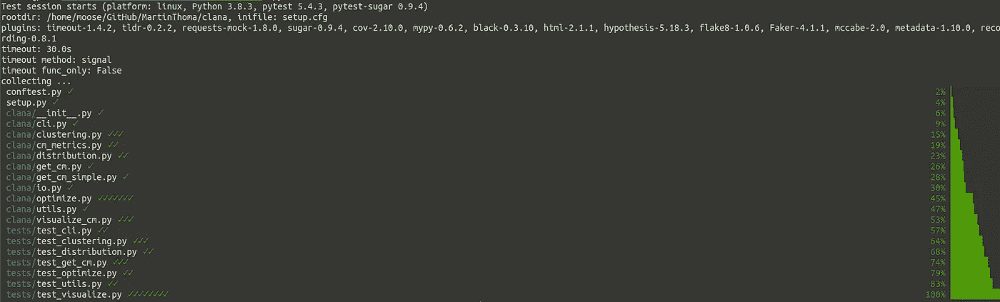
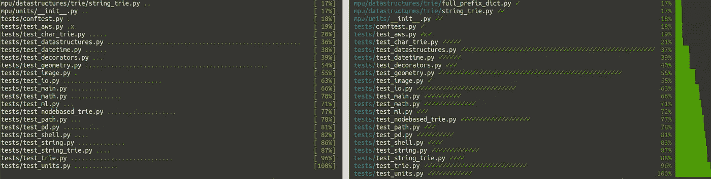
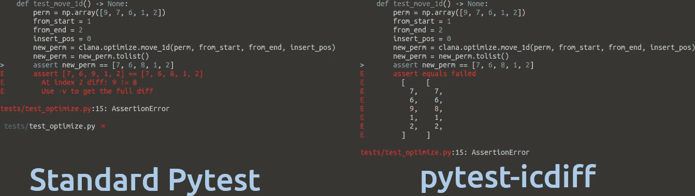
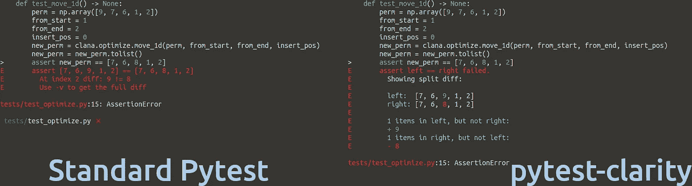
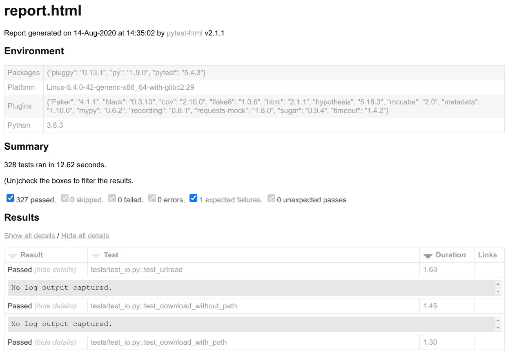
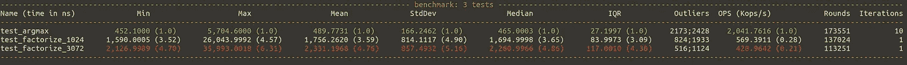

# 爱上❤️的 Pytest 插件

> 原文：<https://towardsdatascience.com/pytest-plugins-to-love-%EF%B8%8F-9c71635fbe22?source=collection_archive---------6----------------------->

## 我的前 5 名和 700+插件中的 50 名，以获得更好的输出和更快的执行速度



插件可以修改和扩展 pylint 的很多方面，包括输出是如何完成的。这个用 pytest-sugar 运行 pytest 的截图是由 Martin Thoma 拍摄的。

Pytest 是可扩展的，有很多插件。你不需要使用它们中的任何一个，但你可能会发现一些非常有用。我喜欢这一点，因为你有一个简单的时间[开始单元测试](https://medium.com/swlh/unit-testing-in-python-basics-21a9a57418a0)，当你更有经验的时候，仍然会发现令人惊奇的东西🤩

在这篇文章中，我将向你展示我使用的插件的例子和我在写这篇文章时发现的插件。你可能想先介绍单元测试的基础知识，或者刷新测试细节，比如 fixtures。

# 如何添加插件？

本文介绍的所有插件都可以通过`pip`安装。他们中的大多数已经开始活动了。例如，当您通过

```
pip install pytest-sugar
```

你只要执行`pytest`插件就会自动工作。其他的需要更直接的使用。例如，安装完`pytest-timeout`后，您需要指定想要使用的超时参数:

```
pytest --timeout=1
```

别担心，我稍后会解释这两个插件🙂

# 存在多少 Pytest 插件？

在 pypi.org 上搜索 trove 分类器`Framework :: Pytest`，我找到了 668 个包。一个惊人的 1053 个包的名字中有“pytest”。461 包都有，名字和 trove 分类器。

为了这篇文章，我查阅了 700 多个 pytest 插件。我跳过了那些认为自己处于计划阶段、前 alpha 阶段或 alpha 阶段的插件。我也跳过了在自述文件中看到`TODO`的包，或者在 GitHub 上少于 10 颗星的包。

我发现的包使 pytest 闪耀✨，提高速度🏎，是专门针对特定的包，或者只是在他们的行为独特的❄️

最后但同样重要的是，有些插件我不确定它们是不是很棒，或者是不是个坏主意。让我们直接跳进去自己看一看吧！

> **旁注**:可能你还记得我的[错别字蹲坑的旁注](/static-code-analysis-for-python-bdce10b8d287#9026)？在写这篇文章的时候，我在 PyPI 上发现了一个可以修复的问题，希望可以提高社区的安全性🎉

# 闪亮的那些


照片由[杰瑞米·托马斯](https://unsplash.com/@jeremythomasphoto?utm_source=medium&utm_medium=referral)在 [Unsplash](https://unsplash.com?utm_source=medium&utm_medium=referral) 上拍摄

pytest 的默认输出已经很好了，但是一些插件让它变得很神奇。`[pytest-sugar](https://github.com/Teemu/pytest-sugar)`是那些 plugins❤中的一个



Pytest sugar 将圆点变为对勾，百分比变为条形。图片由马丁·托马斯提供。

如果这些圆点或勾号对你来说太体面了，试试`[pytest-emoji](https://pypi.org/project/pytest-emoji/)`和`[pytest-emoji-out](https://pypi.org/project/pytest-emoji-output/)`😃

汇总输出现在看起来不错，但是期望值和实际值之间的差异还可以改进。`[pytest-icdiff](https://pypi.org/project/pytest-icdiff/)`是我在研究这篇文章时发现的一个插件——它是🥰❤的一见钟情



图片作者:马丁·托马斯

非常相似的是`[pytest-clarity](https://pypi.org/project/pytest-clarity/)`——注意，pytest-clarity 仅在您执行`pytest -vv`时激活:



马丁·托马斯截图

一旦您对终端输出感到满意，您可能会考虑在浏览器中获取报告。一旦你不得不看很多东西，想要滚动和搜索，这可能会有所帮助。那么`[pytest-html](https://pypi.org/project/pytest-html/)`就是你的朋友。它会生成这样的报告:



马丁·托马斯截图

既然我们对输出结果感到满意，我们想让它快如闪电！

# 我们需要速度！


照片由[丘特尔斯纳普](https://unsplash.com/@chuttersnap?utm_source=medium&utm_medium=referral)在 [Unsplash](https://unsplash.com?utm_source=medium&utm_medium=referral) 上拍摄

插件可以加快速度。例如，您可以使用`[pytest-instafail](https://pypi.org/project/pytest-instafail/)`让 pytest 立即失败，而不是执行所有剩余的测试。对于那些可能需要很长时间甚至在出错时导致无限循环的测试，我使用`[pytest-timeout](https://pypi.org/project/pytest-timeout/)` ❤.当您应用[突变测试](https://medium.com/analytics-vidhya/unit-testing-in-python-mutation-testing-7a70143180d8)时，这尤其有用。

我们也想通过使用`[pytest-xdist](https://pypi.org/project/pytest-xdist/)`来正确使用我们的机器。安装它，执行`pytest -n auto`，你的测试就可以并行运行了！`[pytest-parallel](https://pypi.org/project/pytest-parallel/)`或许也值得一试。

最极端的加速是不执行你不需要的东西。`[pytest-picked](https://github.com/anapaulagomes/pytest-picked)`执行与未分级文件相关的测试，这些文件可能远少于您的完整测试套件。

换个方向，我们想确保算法有一些速度行为。通过`[pytest-benchmark](https://pypi.org/project/pytest-benchmark/)`，我们可以使用`benchmark` fixture 来注释我们想要进行基准测试的测试部分:

```
def test_argmax(benchmark):
    assert benchmark(mpu.math.argmax, [1, 2, 3]) == 2
```

运行`pytest`也会给出这个输出，在这里你可以看到我已经添加了基准的三个函数。其中两个测试一个因式分解函数。因式分解 3072 比因式分解 1024 花费的时间更长，这并不奇怪，但是数字增长的速度之快总是让我吃惊。3 个例子的 argmax 非常快，但是因式分解需要更多的计算:



最小、平均和最大执行时间，以及标准偏差和四分位数范围，让您对执行时间分布有所了解。图片作者:马丁·托马斯

# 独一无二的


照片由 [Darius Cotoi](https://unsplash.com/@dariuscotoi?utm_source=medium&utm_medium=referral) 在 [Unsplash](https://unsplash.com?utm_source=medium&utm_medium=referral) 上拍摄

有些插件是独特的，不适合任何其他类别:

*   `[pytest-cov](https://pypi.org/project/pytest-cov)`:获取测试覆盖报告😍❤:我喜欢两个都生成，一个 HTML 报告和一个到终端的输出。在某些情况下，XML 报告也很有帮助。
*   `[pytest-socket](https://pypi.org/project/pytest-socket/)`:确保不要查询任何非本地的东西。非常好的❤
*   `[pytest-randomly](https://github.com/pytest-dev/pytest-randomly)`和`[pytest-rng](https://pypi.org/project/pytest-rng/)`:如果你使用`random.random`，那么结果取决于随机种子。这个插件改变种子。
*   `[pytest-random-order](https://pypi.org/project/pytest-random-order/)`:以随机的顺序执行测试，以确保您看到测试何时以不同的状态离开系统。
*   `[pytest-lazy-fixtures](https://pypi.org/project/pytest-lazy-fixture/)`:使用`@pytest.mark.parametrize`中的夹具。
*   `[pytest-freezegun](https://pypi.org/project/pytest-freezegun/)`:冻结时间！这也是我在[我的补丁文章](https://levelup.gitconnected.com/unit-testing-in-python-mocking-patching-and-dependency-injection-301280db2fed)中提到过的。
*   `[pytest-leaks](https://pypi.org/project/pytest-leaks/)`:发现资源泄露。这需要一个调试版的 Python！
*   `[pytest-flake8](https://github.com/tholo/pytest-flake8)`:通过 pytest 运行 flake8。我这样做了很长时间，但是当我了解到如何更有效地使用持续集成管道时，我就停止了。还是可以直接执行 flake8。
*   `[pytest-mypy](https://pypi.org/project/pytest-mypy/)`和`pytest-mccabe`:与 flake8 相同。对了，[类型标注很牛逼](https://medium.com/analytics-vidhya/type-annotations-in-python-3-8-3b401384403d)！我喜欢在 CI 管道的 linter 步骤中使用那些静态代码分析工具。
*   `[pytest-deadfixtures](https://pypi.org/project/pytest-deadfixtures/)`:指出哪些灯具没有被使用或复制。

# 17 个专用插件—如果您需要，您会知道的

下面的插件只有在你使用为其编写的应用程序时才会引起你的兴趣。他们通常提供固定装置/模型。

*   `[pytest-cookie](https://pypi.org/project/pytest-cookies/)`:支持 [cookiecutter](https://github.com/cookiecutter/cookiecutter) 模板的测试。
*   `[pytest-plt](https://pypi.org/project/pytest-plt/)`和`[pytest-mpl](https://pypi.org/project/pytest-mpl/)`:为 matplotlib 提供夹具。
*   `[pytest-responses](https://pypi.org/project/pytest-responses/)`:为`[requests](https://requests.readthedocs.io/en/master/)`提供夹具。
*   `[pytest-asyncio](https://pypi.org/project/pytest-asyncio/)`:在开发异步函数时使用它。
*   `[pytest-qt](https://pypi.org/project/pytest-qt/)`:通过 Qt / PySide / PySide2 进行 GUI 开发。

## Web 开发

*   `[pytest-djangoapp](https://pypi.org/project/pytest-djangoapp/)` / `[pytest-djangoqueries](https://pypi.org/project/pytest-django-queries/)`:为 Django 应用程序开发人员提供工具，以方便测试创作，包括设置覆盖、模板标签测试和用户创建。
*   `[pytest-flask](https://pypi.org/project/pytest-flask/)`和`[pytest-flask-sqlalchemy](https://pypi.org/project/pytest-flask-sqlalchemy/)`:为使用 Flask-SQLAlchemy 在事务中运行测试提供 fixtures。
*   `[pytest-seleniumbase](https://pypi.org/project/pytest-seleniumbase/)` / `[pytest-sbase](https://pypi.org/project/pytest-sbase/)` / `[pytest-selenium](https://pypi.org/project/pytest-selenium/)`

## AWS 的模拟和固定装置

*   `[moto](https://pypi.org/project/moto/)`:boto 3 的模拟——AWS 的东西。我不太喜欢这个，但是当你想测试使用 S3 的代码时，它肯定是你能做的最好的了。
*   `[pytest-aws](https://pypi.org/project/pytest-aws/)`:测试 AWS 资源配置
*   `[pytest-localstack](https://pypi.org/project/pytest-localstack/)`:通过 Localstack Docker 容器创建 AWS 集成测试

# 我不确定的插件


布鲁斯·马尔斯在 [Unsplash](https://unsplash.com?utm_source=medium&utm_medium=referral) 上拍摄的照片

当我第一次读到以下插件时，它们听起来很酷，但由于各种原因，我不确定它们是否真的是个好主意:

*   `[pytest-check](https://github.com/okken/pytest-check)`:允许每次测试多次失败。起初，我喜欢这个想法。然后我意识到这可能会导致更糟糕的测试，因为测试开始做很多事情。另一方面，您可能想要测试一次“工作流”——所以不是单元测试，而是集成测试或者甚至是端到端测试。但是你也需要中间结果。
*   `[pytest-docker-tools](https://pypi.org/project/pytest_docker_tools/)`和`[pytest-docker-compose](https://github.com/pytest-docker-compose/pytest-docker-compose)`:我只是构建 Docker 映像并执行其中的内容。
*   `[pytest-mock](https://pypi.org/project/pytest-mock/)`:提供了一个 mocker fixture，它是模拟包提供的补丁 API 的一个瘦包装器。它通过使 mock 成为一个固定设备来减少样板代码。
*   `[pytest-spec](https://pypi.org/project/pytest-spec/)`、`[pytest-pspec](https://pypi.org/project/pytest-pspec/)`和`[pytest-testdox](https://pypi.org/project/pytest-testdox/)`修改 pytest 输出。它们显示了测试的内容。测试应该以这样一种方式编写，即它们代表软件规范——所以测试是针对规范的一部分。
*   它应该通过 VCR.py 记录网络交互，但我没有让它工作。
*   `[pytest-dependency](https://github.com/RKrahl/pytest-dependency)`允许您指定哪些测试需要成功，其他人才能成功。单元测试应该是独立的，依赖的代码应该被嘲笑…也许吧。我对此没有把握。

# TL；速度三角形定位法(dead reckoning)

`pytest`是用 Python 运行测试的首选工具。虽然它有合理的默认值，但它广泛的插件系统允许你定制它，使它变得更好。

我喜欢`[pytest-sugar](https://github.com/Teemu/pytest-sugar)`和`[pytest-icdiff](https://pypi.org/project/pytest-icdiff/)`，因为它们使 pytest 的输出更容易阅读。`[pytest-cov](https://pypi.org/project/pytest-cov/)`生成线覆盖和分支覆盖，因此是发现需要更好测试的点的有价值的工具。下一步是运行测试。你真的不想不小心撞到生产环境。这就是`[pytest-socket](https://pypi.org/project/pytest-socket/)`发挥作用的地方。它只是屏蔽一切并向你报告。另一类问题是长期运行的测试，这些测试可能会陷入无限循环。`pytest-timeout`在指定的时间后终止那些测试。

其他插件那么多；许多人为特定的包添加了固定装置，这些包通常很难测试。您现在应该对 pytest 插件增加的许多可能性有了很好的了解——使用它们吧！

# 下一步是什么？

在这个系列中，我们已经有了:

*   第 1 部分:[Python 中单元测试的基础知识](https://medium.com/swlh/unit-testing-in-python-basics-21a9a57418a0)
*   第 2 部分:[补丁、模拟和依赖注入](https://levelup.gitconnected.com/unit-testing-in-python-mocking-patching-and-dependency-injection-301280db2fed)
*   第 3 部分:[如何用数据库、模板和受保护的页面测试 Flask 应用程序](https://medium.com/analytics-vidhya/how-to-test-flask-applications-aef12ae5181c)
*   第 4 部分: [tox 和 nox](https://medium.com/python-in-plain-english/unit-testing-in-python-tox-and-nox-833e4bbce729)
*   第 5 部分:[结构化单元测试](https://medium.com/python-in-plain-english/unit-testing-in-python-structure-57acd51da923)
*   第 6 部分:[CI-管道](https://levelup.gitconnected.com/ci-pipelines-for-python-projects-9ac2830d2e38)
*   第 7 部分:[基于属性的测试](https://levelup.gitconnected.com/unit-testing-in-python-property-based-testing-892a741fc119)
*   第 8 部分:[突变检测](https://medium.com/analytics-vidhya/unit-testing-in-python-mutation-testing-7a70143180d8)
*   第 9 部分:[静态代码分析](/static-code-analysis-for-python-bdce10b8d287) — Linters、类型检查和代码复杂性
*   第 10 部分: [Pytest 插件到爱](/pytest-plugins-to-love-️-9c71635fbe22)

如果您对使用 Python 测试的其他主题感兴趣，请告诉我。