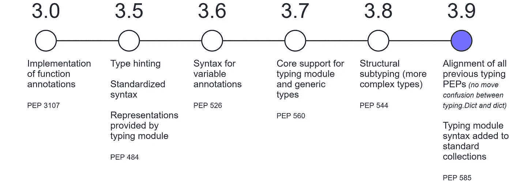

# Python 3.9

> 原文：<https://towardsdatascience.com/python-3-9-9c2ce1332eb4?source=collection_archive---------3----------------------->

## 有什么新的，下一步是什么？


由[法比奥·卢卡斯](https://unsplash.com/@fabiolucas_foto?utm_source=medium&utm_medium=referral)在 [Unsplash](https://unsplash.com?utm_source=medium&utm_medium=referral) 上拍摄的照片

**Python 3.9 的完整版本发布了！**

很明显，这个版本标志着 Python 进化旧路线的一个转折点，走上了一条新的道路。我们将涵盖:

```
**> Python's New Path**
  - Parser change
  - Development cycles**> New Features**
  - Type Hinting
  - String Methods
  - Dictionary Unions
```

让我们探索这些新特性，了解 Python 的发展方向。

# Python 的新路径

这次更新中有两个重要的变化，我们看不到任何直接的影响——但我们将开始注意到 Python 作为一种语言的略微不同的演变。

简而言之，这归结为:

*   Python 的解析器限制
*   更小但更频繁的发布

## LL(1)和 PEG

大约 30 年前，[吉多·范·罗苏姆](https://medium.com/u/1ecea0006127?source=post_page-----9c2ce1332eb4--------------------------------)写了 pgen。为 Python 编写的第一批代码之一——它至今仍被用作 Python 的解析器[1]。

Pgen 使用基于 LL(1)的语法的变体。这意味着我们的解析器从上到下、从左到右地读取代码，只对一个标记进行前瞻。

这实质上意味着 Python 开发受到了限制，因为:

*   一个标记的前瞻限制了语法规则的表达能力。
*   Python 已经包含了非 LL(1)语法，这意味着当前的解析器使用了大量的变通方法，使过程过于复杂。
*   即使有这些变通办法，也只能做到这一点。规则可以变通，但不能破坏。
*   对于 LL(1)，特定的左递归语法会导致解析树中的无限循环，从而导致堆栈溢出——正如这里的[吉多·范·罗苏姆](https://medium.com/u/1ecea0006127?source=post_page-----9c2ce1332eb4--------------------------------)T12 所解释的。

基于 LL(1)的解析器的这些属性限制了 Python 中的能力。

Python 3.9 已经突破了这些限制，这要感谢一个闪亮的新 **PEG** 解析器，在 [PEP 617](https://www.python.org/dev/peps/pep-0617/) 中有概述。

立刻，我们不会注意到这一点。在 Python 3.10 之前，不会利用新的解析器进行任何更改。但在那之后，这种语言将被从它的枷锁中释放出来。

## 开发周期


Python 发布时间表，它将从 18 个月的发布时间表切换到 12 个月。

在 3.9 之前，Python 的发布时间表是 18 个月。现在，我们看到了向 12 个月发布时间表的转变。

我们现在每年都会看到新版本的 Python，而不是一年半一次。这意味着:

*   就新特性而言，发行版更小。
*   变化更为渐进，但通过更快地发布新功能和修复程序来获益。
*   更加一致的发布日历。我们现在知道新的 Python 将在每年十月到来！

因此，本质上，我们在这里看到的是在 12 个月的周期内专注于较小的增量变化，而不是每 18 个月的较大变化。与此同时，发展速度预计将保持不变。

# 新功能

除了这些幕后的变化，我们还可以看到一些新的 Python 特性！

## 类型提示

早在 2008 年，Python 3 引入了函数注释——类型提示的前身。它不是特别健壮，但它是一个开始。



Python 中类型提示的当前状态是随着时间的推移，对注释和类型的许多添加和修改的累积结果。

随后，随着时间的推移，更多的功能被添加进来。但是现在，3.9 将所有这些不同的特性和一个整洁的新语法结合在一起，产生了 Python 类型提示的最新发展。

我们可以很容易地指定变量的预期数据类型。如果我们写了一些没有意义的东西(比如我们把一个字符串传递给一个整数)，那么我们的编辑器会标记这个问题。

不会出现任何错误(不幸的是)，但是在处理复杂的代码库时，它非常有用。让我们来看看新的语法。

在 Python 中，用`+`将两个字符串加在一起绝对有效。因此，在这个`add_int`函数接收两个字符串的情况下，不会出现错误。


无类型提示(左)，Python 3.9 **带**类型提示(右)。

有了新的类型提示功能，我们只需在函数定义中将`: int`添加到我们的参数中，我们的编辑器就会立即注意到这个错误。


指定预期的输入和输出数据类型。

我们也可以使用`-> type`语法来确定函数输出的值的类型。


我们可以将不同的类型结合起来创建更复杂的注释。

我们也不局限于简单的预定义类型！

## 字符串方法

也许不像其他变化那样华丽，但我看到它被大量使用。我们有两种新方法来删除字符串前缀和后缀:

```
"foo bar".remove**prefix**("fo")
```

`**[Out]**: 'o bar'`

```
"foo bar".remove**suffix**("ar")
```

`**[Out]**: 'foo b'`

## 字典联盟

我们现在有两个新的操作符来执行字典联合。

第一个是合并操作符`|`:

```
a = {1: **'a'**, 2: **'b'**, 3: **'c'**}
b = {4: **'d'**, 5: **'e'**}c = **a | b**
print(c)
```

`[Out]: {1: 'a', 2: 'b', 3: 'c', 4: 'd', 5: 'e'}`

以及**更新**操作符，执行合并**就地**:

```
a = {1: 'a', 2: 'b', 3: 'c'}
b = {4: 'd', 5: 'e'}**a |= b**
print(a)
```

`[Out]: {1: 'a', 2: 'b', 3: 'c', 4: 'd', 5: 'e'}`

# 有很多值得期待的

作为一门语言，Python 的未来有很多值得期待的地方。看到这种语言如何随着新的发布时间表和解析器而发展将是非常有趣的。

点击这里获取下载链接！

如果您有任何问题或建议，请在 [Twitter](https://twitter.com/jamescalam) 或在下面的评论中告诉我。如果你想知道更多类似的内容，我也会在 YouTube 上发布。

感谢阅读！

# 资源

[1]吉多·范·罗苏姆， [PEG 解析器](https://medium.com/@gvanrossum_83706/peg-parsers-7ed72462f97c) (2019)。

如果你对 Python 感兴趣——你可能会喜欢我的使用 Docker 将 Python APIs 部署到 Google Cloud 的指南:

[](/deploy-apis-with-python-and-docker-4ec5e7986224) [## 用 Python 和 Docker 部署 API

### 使用 Flask、Docker 和 Google Cloud 部署 API 的权威指南

towardsdatascience.com](/deploy-apis-with-python-and-docker-4ec5e7986224) 

**所有图片均由作者制作，除非另有说明。*