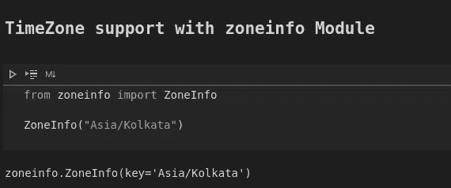

# Python 3.9 —最新更新的实际操作

> 原文：<https://towardsdatascience.com/python-3-9-hands-on-with-the-latest-updates-8137e2246119?source=collection_archive---------22----------------------->

## 比较 Python 3.9 和 Python 3.8 新推出的功能


**Python 3 . 9 . 0——Python 的最新稳定版本发布了！**

在过去的一年里，来自世界各地的开源爱好者一直致力于开发新的、增强的和不推荐的特性。尽管测试版已经推出很长时间了，Python 3.9.0 的正式发布是在 2020 年 10 月 5 日**。**

官方文档包含了最新特性和变更日志的所有细节。通过这篇文章，我将带你了解一些很酷的特性，它们可能会在我们的日常编程任务中派上用场。

## 我们将了解以下内容:

*   **类型提示泛型和灵活函数以及变量注释**
*   **字典中的联合运算符**
*   `**zoneinfo**` **—访问和计算时区**
*   **去除前缀和后缀的字符串方法**
*   **其他发布亮点**

要跟随我或尝试新特性，您应该安装 Python 3.9。我使用了一个名为 [pyenv](https://github.com/pyenv/pyenv) 的环境管理器(或者，您可以使用 conda)来安装最新版本和我的当前版本。您也可以使用[官方 docker 图像](https://hub.docker.com/_/python/)来运行它。

# 灵活的函数和变量注释

自 python 3.0 以来，函数注释就已经存在，它使我们能够向 python 函数添加元数据。那么，Python 3.9 有什么新特性？

Python 3.9 增加了 [**PEP 593**](https://www.python.org/dev/peps/pep-0593) ，引入了一种机制来扩展**[**PEP 484**](https://www.python.org/dev/peps/pep-0484)的类型注释，为注释提供了标准的语义，并建议将注释用于类型提示。**

**现在，除了类型提示之外，还有许多其他的注释用例，因此 PEP 593 引入了`typing.Annotated`，它允许我们向元数据添加更多的细节。**

**让我们通过一个 Python 3.8 和 3.9 的例子来更好地理解这一点。**

****Python 3.8****

```
def currency_exchange(eur: "euros", rate: "exchange rate") -> "euro to USD": """Converting Euros to USD using the exchange rate""" return eur * rate
```

**这是一个简单的函数，使用汇率将欧元转换成美元。我们使用注释作为用户的文档。**

****Python 3.9****

```
from typing import Annotateddef currency_exchange(eur: Annotated[float, "euros"], rate: Annotated[float, "exchange rate"]) -> Annotated[float, "euro to dollars"]: """Converting Euros to Dollars using the exchange rate""" return eur * rate
```

**这里，我们使用新引入的`Annotated`,它至少有两个参数。第一个参数(示例中的`float`)建立了类型提示，其余的参数是函数的任意元数据。**

**用户/开发者也可以使用`__annotations__`属性来检查这些注释:**

****

**我们也可以使用`get_type_hint()`功能检查类型:**

****

## **标准集合中的类型提示泛型**

**像`int`、`str`或`bool`这样的基本数据类型很容易注释。早期的静态类型是在现有 Python 运行时之上逐步构建的，并受其约束。由于泛型，这导致了类型模块中重复的集合层次结构，即我们既有`typing.List`又有内置列表。**

****

**对于泛型，我们有参数化的问题，因为它们的存储结构是一个容器。由于这些原因，我们不能直接使用`list(float)`或`list[float]`作为类型提示，而是需要类型模块来实现。**

**在 **Python 3.9** 中，不再需要这种重复的层次结构。我们可以直接注释它们:**

```
scores: list(float)
```

****

# **合并和更新词典**

**Python 3.9 最酷、最有用的特性之一是添加到内置`dict`类中的 merge(|)和 update(|=)操作符。**

**现有的(3.8)合并两个字典的方法有许多缺点:**

****Python 3.8****

*   **Dict 拆包看起来很丑，不容易被发现。**

```
python = {2000: "2.0.1", 2008: "2.6.9", 2010: "2.7.18"}
python3 = {2008: "3.0.1", 2009: "3.1.5", 2016: "3.6.12", 2020: "3.9.0"}##merging two dictionaries
{**python, **python3}
```

****

*   **另一种方法是 dict.update，它就地修改原始字典:**

****

****Python 3.9****

**[**PEP 584**](https://www.python.org/dev/peps/pep-0584) 为字典引入了两个新的操作符:**

*   ****(|) union —** 合并两个字典。它保留了原始词典。**
*   ****(|=)更新—** 这是用于字典的就地合并。**

```
python = {2000: "2.0.1", 2008: "2.6.9", 2010: "2.7.18"}python3 = {2008: "3.0.1", 2009: "3.1.5", 2016: "3.6.12", 2020: "3.9.0"}##merging two dictionaries
python | python3
```

****

**保留下来的原始格言:**

****

```
python |= python3
python
```

****

**更新操作符合并字典并更新操作符左边的字典，同时**保留两个字典中重叠键的最后值**。**

# **使用时区 ZoneInfo**

**日期和时间在大多数应用程序中扮演着重要的角色。Python 通过标准库中的`datetime`模块提供了全面的支持，但在将时区集成到这些时间戳方面一直存在差距。**

**到目前为止，我们已经有了像 dateutil 这样的第三方库来实现这样的时区特定规则，但是现在 Python 3.9 让 Paul Ganssle 加入核心团队来添加一个新的`**zoneinfo**`模块，该模块提供了整个互联网数字地址分配机构(IANA)时区数据库以供访问和使用。**

****Python 3.8****

**到目前为止，我们一直使用`tzinfo`参数访问时区感知时间戳，如下所示:**

```
from datetime import datetime, timezonedatetime.now(tz=timezone.utc)
```

****

****Python 3.9****

**但是随着 zoneinfo 的加入，我们现在可以访问 [IANA 时区数据库](https://www.iana.org/time-zones)。**

```
from zoneinfo import ZoneInfoZoneInfo("Asia/Kolkata")
```

****

**我们可以根据时区进行一系列操作，相互转换变得非常容易:**

```
from datetime import datetime
from zoneinfo import ZoneInfopost_date = datetime(2020, 10, 10, 18, 10, tzinfo=ZoneInfo("America/Vancouver"))post_date.astimezone(ZoneInfo("Asia/Kolkata"))
```

****

# ****去除前缀和后缀的字符串方法****

**[**PEP 616**](https://www.python.org/dev/peps/pep-0616) 引入了从字符串中去除前缀和后缀的新方法。新方法包括:**

*   ****removeprefix()****
*   ****removesuffix()****

**围绕`lstrip()`和`rstrip()`方法，所有主要论坛(如 StackOverflow)都有许多重复出现的问题。**

****Python 3.8****

**我们已经使用 strip()方法从字符串的两端剥离了字符，如下所示:**

```
"Python 3.9 is out".strip(" Python")
```

****

**这已经删除了出现在字符串末尾的子字符串。如果你仔细看，这已经删除了“python”中的单个字符，即“，“p”，“y”，“t”，“h”，“o”和“n”。**

****Python 3.9****

**为了去掉字符串的前缀，我们现在有了`removeprefix()`**

```
"Python 3.9 is out".removeprefix("Python ")
```

****

**您也可以使用`removesuffix()`方法通过许多其他排列和组合来检验这一点。**

# **其他发布亮点**

**除此之外，还引入了许多其他功能。以下是 PEP IDs 列表:**

*   **[**PEP 617**](https://www.python.org/dev/peps/pep-0617) **，CPython 现在使用了一个基于 PEG 的新解析器——**Python 现在有了一个新的解析器，与旧的 LL(1)解析器并列。您可以使用以下命令选择使用任何解析器来运行您的程序:**

```
python -X oldparser script_name.py
```

**根据 Guido(Python 的创造者)的研究，PEG 解析器更加健壮和强大。PEG 解析器的目标是产生与旧的 LL(1)解析器相同的**抽象语法树(AST)** 。**

*   ****多阶段初始化**现在可以在多个 python 模块中使用(`[audioop](https://docs.python.org/3/library/audioop.html#module-audioop)`、`_bz2`、`_codecs`、`_contextvars`、`_crypt`、`_functools`、`_json`、`_locale`、`[math](https://docs.python.org/3/library/math.html#module-math)`、`[operator](https://docs.python.org/3/library/operator.html#module-operator)`、`[resource](https://docs.python.org/3/library/resource.html#module-resource)`、`[time](https://docs.python.org/3/library/time.html#module-time)`、`_weakref`)**

**下面是一个使用数学库计算两个以上数字的 GCD/LCM 的示例:**

****

*   **CPython 现在采用新的年度发布周期——他们将与他们的发布更加一致，并将在每年 10 月推出新版本。**
*   **[**PEP 614**](https://www.python.org/dev/peps/pep-0614) ，放宽了对装饰者的语法限制——一种更灵活的语法现在可供从事 PyQT 等 GUI 框架工作的人使用。这免除了由点号组成的装饰者的限制。更多详情可以在这里阅读[。](https://www.python.org/dev/peps/pep-0614/)**

**要了解更多关于这些特性的细节，请阅读官方文档。**

# **结论**

**3.9.0 标志着 Python 开发之旅和社区的一个重要里程碑。正如我们所说的，新的增强功能正在增加，3.10 也将有一些有前途的特性。现在，您应该尝试一下 **Python 3.9 中引入的这些即将被广泛使用的特性。****

**尝试使用 Python 3.9 运行您现有的程序，看看升级对您来说是否会很麻烦。**

**你应该尝试的另一件事是新的解析器，它声称是有前途的，但是我们只有在几个用例的大量测试之后才能弄清楚。**

# **[数据科学与 Harshit](https://www.youtube.com/c/DataSciencewithHarshit?sub_confirmation=1)**

**通过这个渠道，我计划推出几个覆盖整个数据科学领域的[系列](/hitchhikers-guide-to-learning-data-science-2cc3d963b1a2?source=---------8------------------)。以下是你应该订阅[频道](https://www.youtube.com/channel/UCH-xwLTKQaABNs2QmGxK2bQ)的原因:**

*   **这些系列将涵盖每个主题和子主题的所有必需/要求的高质量教程，如 [Python 数据科学基础](/python-fundamentals-for-data-science-6c7f9901e1c8?source=---------5------------------)。**
*   **解释了为什么我们在 ML 和深度学习中这样做的数学和推导。**
*   **[与谷歌、微软、亚马逊等公司的数据科学家和工程师以及大数据驱动型公司的首席执行官的播客](https://www.youtube.com/watch?v=a2pkZCleJwM&t=2s)。**
*   **[项目和说明](/building-covid-19-analysis-dashboard-using-python-and-voila-ee091f65dcbb?source=---------2------------------)实施到目前为止所学的主题。了解新的认证、训练营以及破解这些认证的资源，例如 Google 举办的 [**TensorFlow 开发者证书考试。**](https://youtu.be/yapSsspJzAw)**

**请随时在 Twitter 或 LinkedIn(T21)上与我联系。**