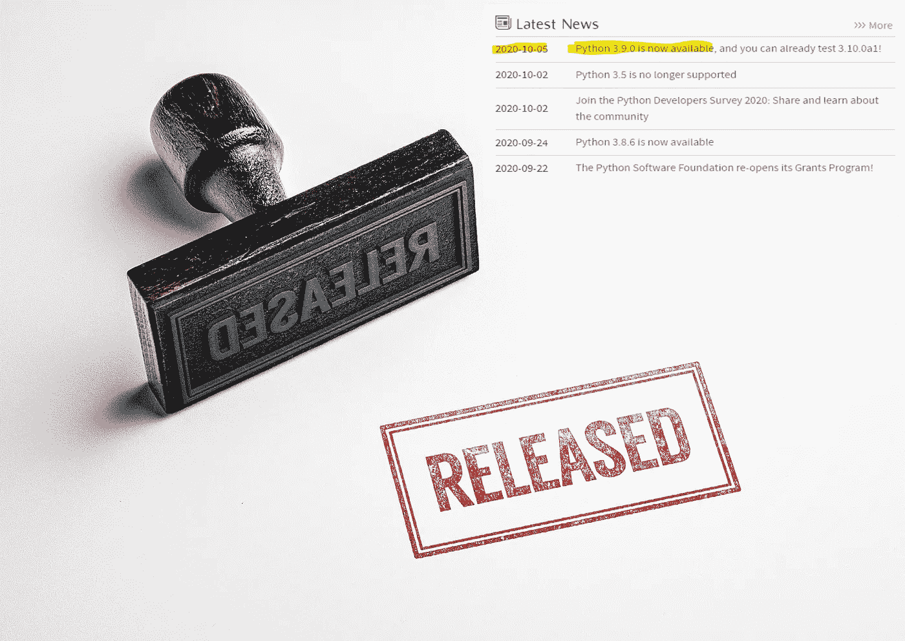

# Python 3.9 可用！您必须使用这些强大的功能…

> 原文：<https://towardsdatascience.com/python-3-9-is-available-and-you-must-use-these-great-features-316387e1d3e5?source=collection_archive---------12----------------------->

## 2020 年 10 月 5 日，Python 发布了 3.9 版本。在本帖中，我们回顾了几个惊人的特性，并指出了相关的来源，以供进一步阅读。


快门架

# **简介**

10 月 5 日周一，Python 发布了新的稳定版本，3.9.0rc2，如果你对 Python 的源码页面感兴趣，可以点击这个链接获得:[***whats new/3.9***](https://docs.python.org/3.9/whatsnew/3.9.html)。在本帖中，我们回顾了该版本的亮点、新特性、新模块、优化，并提供了一些源代码，以便在您自己的环境中进行尝试。此外，我们还参考了一些额外的阅读和实现资料。



Python 网站-主页。

所以，让我们开始吧...

# **新功能**

1.  合并两本**字典**。

```
a = {‘first’: 1, 'second’: 2, 'python’: 3}
b = {’first’: 'third’, 'forth’: 'python3.9’}
a | b
{’second’: 2, 'python’: 3, ’first’:’third’,  'forth’: 'python3.9’}
b | a
{’first’: 1,’second’: 2, 'python’: 3, 'forth’:’python3.9’ }
```

更多字典操作，请访问[python.org/dev/peps/pep-0584/](https://www.python.org/dev/peps/pep-0584/)

2.**新增模块:**不需要第三方库更新时区:模块`zoneinfo`已经添加到标准库中。它支持`IANA`时区数据库，如下所示:

```
from datatime import datetime
#from pytz import timezone <<<<<<<<<< #No need it!!!
from zoneinfo import ZoneInfocurrent_t=datetime.now()
current_t_paris= datetime.now()print(current_t.astimezone(ZonInfo('Europe/Paris')))----------
2020-10-06 05:04:01.932145+06:00
```

3.不需要从**输入*导入列表。******列表*** 是可订阅的。

```
#from typing import List <<<<<<<<<< #No need it!!!
thelist: list[int] = [2,4,6,8]
print(thelist)
thelist: '2468'
print(thelist)------------[2,4,6,8]
2468
```

4.一行仅删除**前缀/后缀**。

```
professors = ['Prof. A', 'Prof. B', 'Prof. C']
names_only=[]
for professor in professors:
    names_only.append(professor.removeprefix('Prof. ')
print(names_only)-------------['A', 'B', 'C']
```

欲了解更多前缀和后缀操作，请访问:

[](https://www.python.org/dev/peps/pep-0616/) [## PEP 616 -删除前缀和后缀的字符串方法

### 这是一个向 Python 的各种字符串的 API 添加两个新方法 removeprefix()和 removesuffix()的提议…

www.python.org](https://www.python.org/dev/peps/pep-0616/) 

> 更多功能我在 Malik 的帖子上推荐:[https://towardsdatascience . com/10-awesome-python-3-9-features-b 8 c 27 f 5 EBA 5c](/10-awesome-python-3-9-features-b8c27f5eba5c)

# **一个多处理改进和一个新的解析器**

Python 3.9 为 CPython 带来了一个新的基于 PEG 的解析器，作为以前基于 LL 的解析器的替代( *LL(1)* )，多处理改进，从 C 扩展类型的方法快速访问模块状态，以及许多其他解释器改进。PEG 解析器比 LL(1)解析器更强大，并且不需要特殊的修改。PEG 解析器在 Python 3.9 中实现。0.通常，PEG 解析器产生**抽象语法树(AST)** 作为旧的 LL(1)解析器。更多详情请访问 [PEP 617](https://www.python.org/dev/peps/pep-0617/) 。总的来说，PEG 解析器稍微快一点，但是它也使用稍微多一点的内存。实际上，在使用这个新的解析器时，人们不会注意到性能有任何变化。

# 更多详细信息，请继续阅读/观看

1.  我强烈推荐 YouTube 上 Pretty Printed 的一个很棒的视频，其中他演示了一些新功能(1-4):

2.如果你想发现所有新版本的特性，你肯定会在 Python 网站上找到它们:[python.org/3.9/whatsnew](https://docs.python.org/3.9/whatsnew/3.9.html)

# 该不该升级到 Python 3.9？

如果你想尝试任何伟大的新功能，那么你需要使用 Python 3.9。因此，您可以升级，然后回到当前的 Python 版本。你必须记住，如果你在 Python 3.8 中运行代码没有任何问题，那么你在 Python 3.9 中运行同样的代码时可能会遇到一些问题。此外，新的 PEG 解析器自然没有像旧的解析器那样经过广泛的测试，只有时间才能告诉我们真相。和往常一样，如果你对这个版本不确定，并且想要相当保守，你可以等待第一个维护版本: **Python 3.9.1。**

# 摘要

这个 Python 3.9.0 似乎有非常酷的特性。尽管如此，这不是一个革命性的版本，但它可能会带来更好的用户体验。这个版本对于 Python 社区来说是一个伟大的里程碑。希望几年后，Python 3.9 会像现在的 Python 3.6 一样普及，因为观察 Python 如何发展新的特性和解析器总是很好的。

# 关于作者

Barak 获得了以色列理工学院的航空工程学士学位(2016 年)、硕士学位(2018 年)以及经济和管理学士学位(2016 年，成绩优异)。他曾在高通工作(2019-2020)，在那里他主要研究机器学习和信号处理算法。巴拉克目前正在海法大学攻读博士学位。他的研究兴趣包括传感器融合、导航、深度学习和估计理论。

[www.barakor.com](http://www.barakor.com)

 [## 巴拉克或-以色列海法大学| LinkedIn

### 在全球最大的职业社区 LinkedIn 上查看 Barak Or 的个人资料。巴拉克有 2 份工作列在他们的…

www.linkedin.com](https://www.linkedin.com/in/barakor/) 

# 参考

[1] Python 网站:[https://docs.python.org/3.9/whatsnew/3.9.html](https://docs.python.org/3.9/whatsnew/3.9.html)

[2]Python 3.9 的 10 个牛逼特性，[中帖。](/10-awesome-python-3-9-features-b8c27f5eba5c)法尔哈德·马利克

[3] Python 3.9。[中等职位](/python-3-9-9c2ce1332eb4)，詹姆斯·布里格斯

[4] Python 3.9:很酷的新特性供你尝试。 [RealPython](https://realpython.com/python39-new-features/) 。盖尔·阿恩·赫杰尔

[5]Python 3.9 中的一些新特性。YouTube [蛮印](https://www.youtube.com/channel/UC-QDfvrRIDB6F0bIO4I4HkQ)。