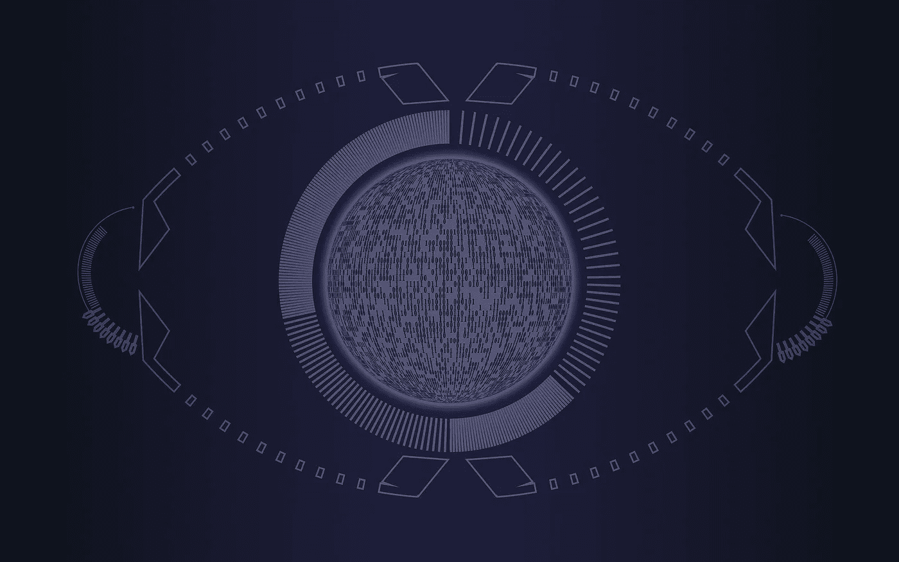
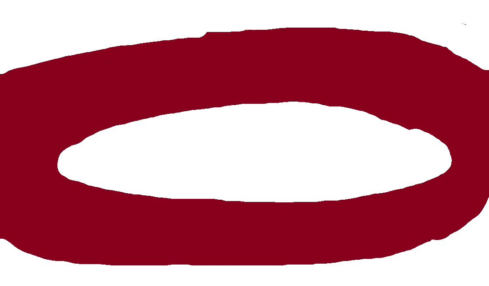

# Python 和计算机视觉

> 原文：<https://towardsdatascience.com/python-and-computer-vision-d0b4a1b49676?source=collection_archive---------60----------------------->

## 或者如何在你朋友的视频上画傻乎乎的脸

来源:[数字摄影师](https://pixabay.com/users/thedigitalartist-202249/)，通过[图片](https://pixabay.com/illustrations/technology-eye-4024486/) (CC0)

在这篇文章中，我打算温和地向您介绍计算机视觉中的一些概念。不需要以前在该领域的知识，但你至少应该有 python 和机器学习的基本概念。

那我们怎么做？我们将拍摄某人面部的视频，将其分成帧，检测面部的面部标志(鼻子、嘴……)，并在检测到的标志上绘制一些东西。听起来很简单，对吧？好吧，让我们开始吧。

首先，我要感谢 Adrian Rosebrock 和[他令人惊叹的网站](https://www.pyimagesearch.com)，如果你想了解更多关于计算机视觉的知识，我强烈推荐你浏览这个网站。

此外，本文假设您已经完成了`dlib`的安装。如果没有，不要担心，详情可以在这里找到[。虽然 Adrian 在 Ubuntu 和 MAC OS*上都这么做了，但我是在我的 windows10 机器上做的，步骤如下:*](https://www.pyimagesearch.com/2017/03/27/how-to-install-dlib/)

根据经验，如果这个包在 conda 仓库中，用 conda 安装它，而不是用 pip，否则就用 pip。截至 2020 年 3 月 30 日，康达提供以下所有套餐。

*   如果你没有安装 anaconda，安装它。
*   创建一个新的康达虚拟环境。在里面安装 jupyter 笔记本
*   安装`boost`、`py-boost`和`cmake`。如果你已经在 Windows 系统上，不用担心`X11`。确保在 v-env 中安装了所有的包。
*   安装`numpy`、`scipy`和`scikit-image`。还要安装`imutils`，Adrian 开发的包。
*   最后，安装`dlib`

上面提到的所有软件包都可以用 conda 安装，但是要用`pip`安装`opencv-python`

您可能仍然需要安装这些先前包所具有的一些其他依赖项。如果错误信息提示你有一些缺失的包，安装它。你还需要下载面部检测器`shape_predictor_68_face_landmarks.dat`，你可以从[这篇文章](https://www.pyimagesearch.com/2017/04/03/facial-landmarks-dlib-opencv-python/)下载，或者从[这里](https://github.com/davisking/dlib-models/blob/master/shape_predictor_68_face_landmarks.dat.bz2)克隆并提取它。

因为我更喜欢用笔记本的方式做事情，所以我编辑了 Adrian 在这篇文章中开发的代码。代码如下:

如果你把代码放在笔记本里运行，你就做对了。如果没有，请留下你的评论，我会尽力帮助你。第二步是运行下面的代码，该代码部分来自 Adrian 的帖子，它将向您显示一张脸上的面部标志。为此，如果您需要视频，只需用 windows 摄像头录制一小段即可。

在第 1–4 行，我们加载预测器和面部检测器，第 5–8 行，我们加载视频，在每帧的循环中，我们检测面部标志点，并在帧中绘制成圆圈。如果你想停止录像，就按“q”。

所以我们已经准备好了本文的第一部分，检测人脸。现在，我们应该能够检测面部的一部分，这非常简单，因为你看到的 68 个红点是有序的，很清楚哪些属于你面部的每个部分，所以你只需要定义一个字典，我们稍后将使用它来访问这些点。

下一步是画一些你想放在鼻子、嘴巴等上面的东西。我建议你使用 windows 10 中的 paint3D，因为我们将需要绘图有一个透明的背景。如果你知道用 python 和(可能)opencv 制作透明背景的方法，请告诉我，因为我花了太多时间来实现这个。

因此，打开 paint3D，选择“画布”并打开“透明背景”。现在画一些你想放在你的一个面部标志上的东西，例如嘴:

现在剩下的就是定义一些函数来为我们完成任务。第一个是一个简单的函数，从一个点的数组(或列表)中返回边界框角的坐标(稍微大一点)。

然后，我们要定义一个函数，从一张图片和四个点，计算变换，把原始图像投影到那个地方。你可以在这里找到更多信息[。注意我们在这里使用的主要函数是如何来自 opencv 包的。我强烈推荐你阅读](https://medium.com/acmvit/how-to-project-an-image-in-perspective-view-of-a-background-image-opencv-python-d101bdf966bc)[软件包文档](https://opencv-python-tutroals.readthedocs.io/en/latest/py_tutorials/py_tutorials.html)，因为那里有很多东西要学。

我们需要的最后一个函数是一个拍摄两张图片并将其中一张叠加在另一张上面的函数。

这个最后的函数将两个图像对齐，一个在另一个的上面，但是因为我们要投影小的一个，它将被放置在我们想要的任何地方。

所以结合这三个函数，我们要在第一个循环中改变一点，结果会像我保证的那样愚蠢。