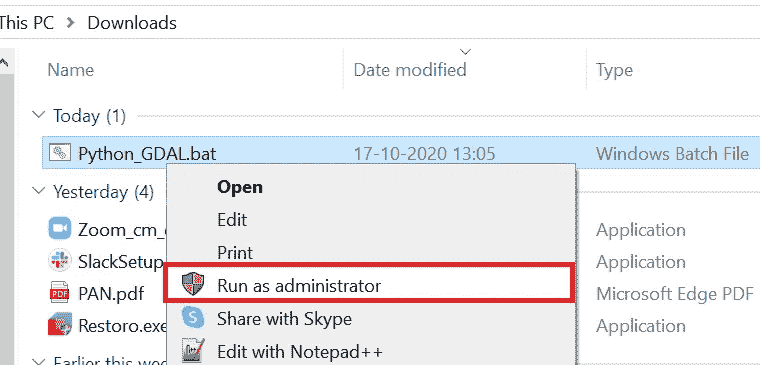
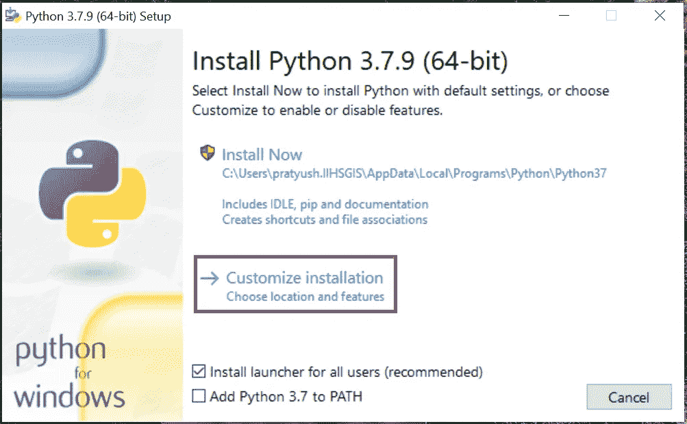
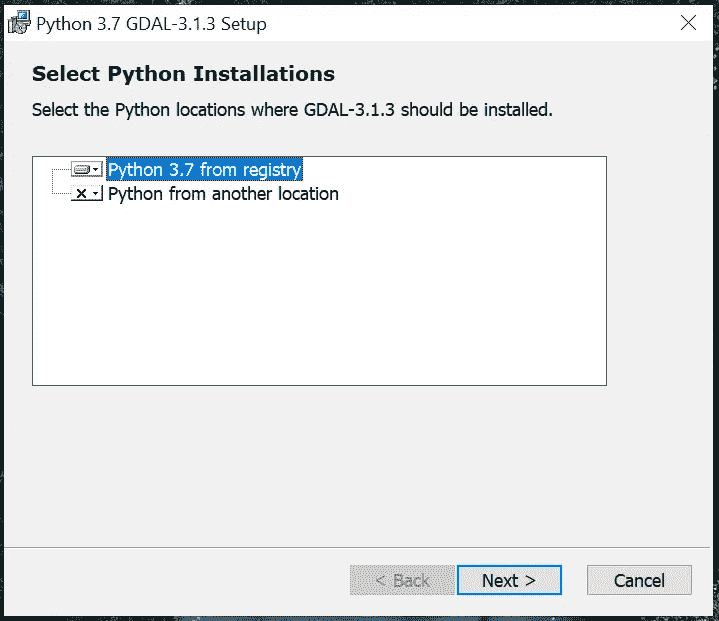

# 面向 Windows 10 的 Python 和 GDAL 自动安装

> 原文：<https://towardsdatascience.com/python-and-gdal-installation-automated-for-windows-10-f22686595447?source=collection_archive---------18----------------------->

照片由[像素](https://www.pexels.com/photo/astronomy-atmosphere-earth-exploration-220201/?utm_content=attributionCopyText&utm_medium=referral&utm_source=pexels)的[皮克斯拜](https://www.pexels.com/@pixabay?utm_content=attributionCopyText&utm_medium=referral&utm_source=pexels)拍摄

你是地理空间处理 Python 的初学者吗？你觉得安装过程有点麻烦吗？那你来对地方了！对于该领域的专家来说，如果你正在使用 Windows 10，我希望这将为你节省一些手动工作。

好吧！我们开始吧！

去[这个 GitHub repo](https://github.com/PratyushTripathy/python_gdal_automated_windows) 下载 Python_GDAL_(32/64)。bat 文件，请确保将其保存为批处理文件(*。蝙蝠)。

右键点击下载的文件，选择**“以管理员身份运行”**。

以管理员权限运行下载的文件。

该脚本将下载安装文件，并运行他们一个接一个，确保您连接到互联网。如果您的连接速度太慢或者下载服务器出现故障，脚本将会终止。在这种情况下，您可以简单地重新运行它。

文件下载完成后，Python 安装窗口会自动弹出，然后您必须选择**“定制安装”**，如下图所示。

选择自定义安装

按照说明继续安装，直到到达**高级选项**窗口。减少安装路径，如下所示。这是一个**强制**步骤，也是你在整个过程中唯一需要注意的事情。

缩短目录

单击安装按钮，等待安装完成。安装成功后会弹出 GDAL 安装窗口，不要做任何更改，一直点击下一步完成安装。当询问时，选择典型的安装。

最后，将开始安装 Python 的 GDAL 模块，保留所有默认设置，为所有用户安装，并检查安装是否针对正确的 Python 实例，如下图所示。

从注册表中选择 Python 3.7

如果这是系统上的第一次 Python 3.7 安装，并且没有冲突安装，那么这个过程将会很顺利。

完成后，安装程序将在 30 秒内自动关闭。从开始菜单打开命令提示符，键入 ***python37*** 启动 python，或者在开始菜单中搜索 Python 3.7 IDLE 并打开。在控制台中输入 ***import gdal*** *，理想情况下，它不应该在屏幕上打印任何东西。*

如果它抛出错误，尝试从开始菜单或控制面板中的**添加或删除程序**选项卸载 Python 和 GDAL，并使用(*)重试安装。bat 档。如果你面临任何其他问题，请随意回复这篇文章。这个 [YouTube 视频](https://www.youtube.com/watch?v=kVoWcBRPVKI)和[这个视频](https://www.youtube.com/watch?v=1G2tkMaoS8Q)也演示了安装过程。

## 调试步骤(2021 年 4 月 14 日更新):

我们所有的计算机都是独一无二的，每一台都安装了不同的软件和反恶意软件防御程序。有时，这些甚至会使正常的流程变得繁琐。以下是到目前为止人们向我报告的错误列表(以及解决方案)。如果您的错误没有列在这里，不要担心。给我写信，评论这篇文章或 YouTube 视频，或者在 GitHub 上提出问题，我会在这里列出你的错误和解决方案。

> *1。ModuleNotFoundError:没有名为' _ gdal '【T19]的模块。当路径未被添加到系统变量中时，可能会出现此错误。* [见此处*解*](https://github.com/PratyushTripathy/python_gdal_automated_windows/tree/main/debugger) *的步骤。*

这个帖子到此为止。如果您想开始学习地理空间任务的机器学习方法，如 Landsat 多光谱分类，您可能会发现以下帖子很有用。

1.[神经网络用于卫星数据分类使用 Python 中的 tensor flow](/neural-network-for-satellite-data-classification-using-tensorflow-in-python-a13bcf38f3e1)
2。[CNN 在中分辨率卫星数据上同样闪亮吗？](/is-cnn-equally-shiny-on-mid-resolution-satellite-data-9e24e68f0c08)

永远开心连接你— [Twitter](https://twitter.com/i_pratyusht) ， [LinkedIn](https://www.linkedin.com/in/pratyush-tripathy-b28a47146/) 。

分享开放知识！