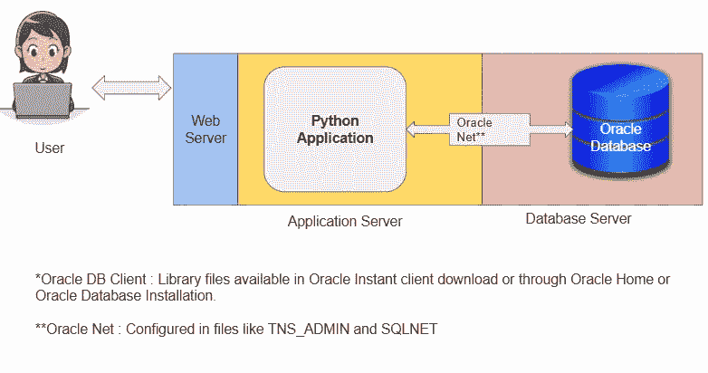
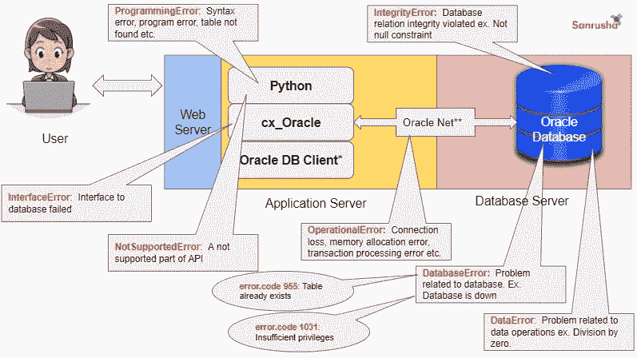
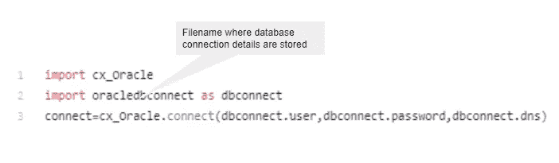

# Python 和 Oracle 数据库

> 原文：<https://towardsdatascience.com/python-and-oracle-database-c7b5d4d7fa4c?source=collection_archive---------10----------------------->

## 任何数据科学家都不能忽视这种组合

布鲁斯·马斯在 [Unsplash](https://unsplash.com?utm_source=medium&utm_medium=referral) 上的照片

在学习数据科学的同时，大部分时间我们使用的是 Excel，CSV 格式的开源数据。然而，现实世界的数据科学项目涉及从数据库中访问数据。如果需要存储和访问数据，就需要数据库。现代数据库的两种主要类型是关系数据库(RDBMS)和非关系数据库(也称为 NoSQL 数据库)。

RDBMS 数据库可以很好地处理存储在行和列中的数据。一致性和速度是 RDBMS 数据库的最大优势。

在本文中，我将带您了解最常用的 RDBMS 数据库——Oracle 数据库，并解释如何在 Oracle 数据库上使用 Python 应用程序的神圣组合。

## 连接策略

作者图片

数据库连接是应用程序和 oracle 数据库机之间的物理通信路径。一旦应用程序建立了数据库连接，该会话将从用户通过数据库验证开始一直持续到用户断开或退出数据库应用程序。

> Python 有一个用于连接 Oracle 数据库的内置库 cx_Oracle。

我最喜欢 cx_Oracle 的一个特性是它为诊断任何与连接或数据访问相关的问题提供了透明性。下图显示了应用程序和数据库连接和操作的不同阶段的不同错误代码。

作者图片

下面的代码片段显示了如何使用 cx_Oracle 库连接 Oracle 数据库。用您的数据库详细信息替换下面代码中的 userid、密码、主机、端口和服务名。

除了直接在 python 程序中输入数据库登录详细信息，它还可以存储在 python 文件中，并可以像下面这样导入到程序中。

这里，oracbledbconnect 是存储数据库连接详细信息的文件的名称。

作者图片

## 连接池

在 python 应用程序和 Oracle 数据库之间设计一个合理的连接策略至关重要。在数据密集型应用程序中，单个独立连接可能不够，它可能需要一个连接池。

> 连接池是到 Oracle 数据库的连接的缓存。

在运行时，应用程序从池中请求一个连接。如果池包含可以满足请求的连接，那么它将连接返回给应用程序。应用程序使用连接在数据库上执行工作，然后将连接返回到池。然后，释放的连接可用于下一个连接请求。

下面的代码片段显示了如何创建连接池。

这段代码将在开始时创建五个连接会话，并将连接会话增加到 15 个。

## Python 和 SQL

SQL 是基础，任何从事数据相关专业的人都必须掌握。

使用 cx_Oracle 在 Oracle 数据库上运行 SQL 一点也不困难。只需在连接对象上打开一个光标，执行 SQL，然后关闭连接。

下面的代码片段显示了如何连接到数据库，从一个表中选择所有记录，然后打印表中第一行第三列的记录。

## Python 和 PLSQL

PLSQL 是 SQL 的过程扩展。可以在一个 PLSQL 程序中一起编写多个 SQL 语句，而不是编写如上所示的单个 SQL 语句，并且可以通过数据库连接游标中的 callfunc 方法在 Python 应用程序中调用该程序，如以下代码片段所示。

## 大型物体

数据以行和列的形式存储在 Oracle 数据库中。如果有些数据不能用行列格式表示，例如。文档、图像、视频，它不能直接存储在 Oracle 数据库中。

大型文档、图像等数据。在 Oracle 数据库中被称为大型对象。Cx_Oracle 有 CLOB、BLOB 之类的方法来处理大型对象。

下面的代码片段显示了如何在 Oracle 数据库表字段中存储图像。

## 系统综合

数据科学和机器学习包括从不同的来源获取数据。公共数据、网络废弃、来自服务提供商的文件等。使用 cx_Oracle 和 sqlalchemy 库，可以在 Oracle 数据库表中使用不同种类的数据。

下面的代码片段显示了如何将特定目录中所有文件的数据消耗到 oracle 数据库表中。

## 结论:

几乎每个大型企业都使用 Oracle、MySQL、IBM DB2 等关系数据库来存储业务关键数据。虽然 SQL 是处理大多数关系数据库的有效机制，并且 SQL 的声明式设计使其易于学习和使用，但在开发多样化的应用程序时，它的能力是有限的。这就是 Python 和 SQL 的结合大放异彩之处。作为一门数据科学，你不能忽视使用 Oracle 数据库学习 Python 的重要性。

**参考**

 [## Python+ SQL + Oracle:集成 Python、SQL 和 Oracle

### 我是桑鲁沙的桑杰！我们是领先的信息技术教育提供商:数据集成和…

www.sanrushaacademy.com](https://www.sanrushaacademy.com/p/pythonsqloracle)