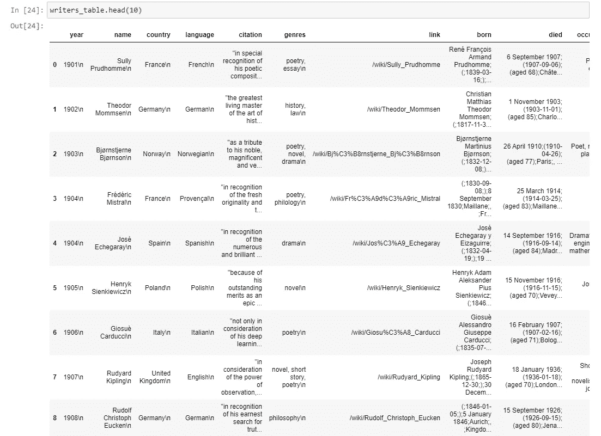

# Python 与世界文学:使用 BeautifulSoup 的初级网络抓取

> 原文：<https://towardsdatascience.com/python-and-world-literature-elementary-web-scraping-with-beautifulsoup-a43daaf46ab?source=collection_archive---------53----------------------->

## 数据科学提示

## 数据挖掘课程 101


在 [Unsplash](https://unsplash.com?utm_source=medium&utm_medium=referral) 上由 [Daiga Ellaby](https://unsplash.com/@daiga_ellaby?utm_source=medium&utm_medium=referral) 拍摄的照片

每一位新的数据科学家都希望创建壮观的可视化效果，构建渐进的预测模型，从数据中获得惊人的洞察力。好吧，这些东西很吸引人，也很漂亮。但有时人们会在每次分析过程开始时忘记很多“脏”工作。而且这还不是数据清理阶段。

在你开始处理数据之前，你需要…数据！

是的，认为数据分析从数据集清理开始是一个常见的错误，因为它指的是您已经拥有数据的事实。有人可能会相信你总是会神奇地从空气中获得数据。但是数据搜集、收集、挖掘和收集是你需要不断提高的技能。您必须能够处理不同的源代码、格式，有时甚至是语言，而这个事实假设您有足够的技能。基本技能之一是网络抓取——从网站和网络应用程序中加载数据。

当然，蜘蛛和爬虫的创作有很多技巧和方法。今天我想从最原始但非常有效的工具开始— [BeautifulSoap parser](https://www.crummy.com/software/BeautifulSoup/bs4/doc/#) 。这是一个非常强大的 HTML 解析器，结合适当的请求逻辑，可以自动完成数据收集过程。所以，不再多言——让我们开始编码吧。

## 准备会话

我将重复文章的第一个想法:使用您需要的数据…数据！所以，我们需要加载一些内容。我想创建自己的数据集用于进一步分析，它是献给诺贝尔奖的。起点是获奖者的名单，我选择了文学类别来工作。我想保持简单，所以我将使用[适当的维基百科页面](https://en.wikipedia.org/wiki/List_of_Nobel_laureates_in_Literature)。是的，它并不完美，但仍然是一个很好的起点，因为它有很多交叉链接，我将使用这些链接来获得额外的信息。

但是首先我们应该为请求准备引擎。我创建了一个简单的会话(因为我想保持与同一台主机的稳定连接)和一个简单的适配器(用于超时或网络切换的情况)。

您可以在[请求库页面](https://requests.readthedocs.io/en/master/user/advanced/)上了解其他设置。这很简单，让我们继续。

## 获取内容

这里仍然没有什么有趣的东西:只需加载页面并创建适当的`BeautifulSoup parser`:

现在我们为下一步做准备，这包括一些探索。

## 找到信息

这听起来可能很奇怪，但是在我们强制脚本自动搜索信息之前，我们应该手动找到它。而且不，这和文章的目的并不矛盾！我们必须研究数据，探索其内部结构，并将这些知识应用于 scrapper 的创建。换句话说，我们应该为 scrapper 找到一些定向器来解析想要的 HTML-tag。我们可以在页面上看到一个包含数据的大表，但是我们需要挖掘 HTML 代码来查看该表的实际位置。我们不能引用位置，因为更多的表可能会被插入到所需的表之前。出于同样的原因，我们不能从本章开始就查阅行数。但是我们可能依赖于章节名称和不同的标签属性。因此，让我们“找到”带有“桂冠诗人”姓名和`id`属性的标签，并在它下面找到所需的表。每个 BeautifulSoup 标签都可以使用`find_all()`方法来遍历其内容(所有内部标签):

这就是了。根据我们知道的标准维基页面结构，它是标题的子标签。幸运的是，每个被解析的标签都有一个指向`parent`标签的指针:

```
tag = laureates_tag.parent
```

我们使用该信息来查找所需的表。每个 BeautifulSoup 标签不仅有`parent`指针，还有`next_sibling`和`previous_sibling`指针。所以，我们可以走遍“邻居”标签。正如我们在页面代码中看到的，我们的表格就在 found 标题下面。

```
while tag.name != ‘table’:
    tag = tag.next_sibling
tag.name # <table>
```

我们准备好解析了！

## 解析数据

这是棘手的部分。我们看到，该表有许多行，有些行的所有单元格都已填充，但有些行有常见的字符串“*Not award”*。但这还不是最困难的部分:有些年份有两位获奖者。但是我们配备了一些美丽的乐器:

*   访问内部标签:`tag.internal_tag`；
*   检查标签是否有属性:`tag.has_attr(‘attr’)`；
*   访问属性:`tag[‘attr’]`；
*   从标签中获取文本:`tag.text`；

还有很多其他的，你可以在文档中找到[。](https://www.crummy.com/software/BeautifulSoup/bs4/doc/#)

主要思想是遍历每一行，用`<tr>`标记表示，并获取所有单元格，用`<td>`标记表示。由于表可能非常大，我们可能不想一次复制和遍历它的所有行。不过，BeautifulSoup 为我们提供了所选标签的所有内部标签的`tag.children`访问器生成器:

你可以在我的 GitHub 上的完整代码[中查看解析函数本身。其实是纯解析逻辑，应该包括一些异常情况。所以，经过一些尝试，我们收集了数据。但对我们来说还不够！](https://github.com/Midvel/medium_jupyter_notes/blob/master/bs_scrapping/bs-scrapping.ipynb)

## 附加数据

除了我们需要的数据，我们还取消了每个作者个人页面的链接。我们将使用这些信息来构建刮板的下一部分。实际上，这是爬行器的最基本层次，因为我们将重用废弃的链接到新页面。

我们有很多行，当然，我们不会检查每一行的每一页。因此，我们将依赖于这样的假设，即每个作者的页面都有传记元素。该元素是我们的目标，因为它包含大量附加数据:

再来一个循环，再来一个解析函数:数据集就准备好了！



然而，这只是长期数据分析过程的第一步。数据是原始的，需要大量清理。但是，这是一个非常不同的故事。

一如既往(老读者已经知道了，新读者——你的乐趣)，这里是我的 GitHub 工作示例的链接。

[](https://github.com/Midvel/medium_jupyter_notes/blob/master/bs_scrapping/bs-scrapping.ipynb) [## 中级/中等 _jupyter_notes

### permalink dissolve GitHub 是超过 5000 万开发人员的家园，他们一起工作来托管和审查代码，管理…

github.com](https://github.com/Midvel/medium_jupyter_notes/blob/master/bs_scrapping/bs-scrapping.ipynb) 

此外，由于下一个合乎逻辑的步骤是数据清理，请确保您没有错过我关于丢失数据处理的文章:

[](/7-idioms-to-acquire-missing-values-every-data-scientist-should-know-2edf4224360c) [## 每个数据科学家都应该知道的获取缺失值的 7 个习惯用法

### 你应该把命令自动化

towardsdatascience.com](/7-idioms-to-acquire-missing-values-every-data-scientist-should-know-2edf4224360c) [](/handle-missing-data-with-r-10-daily-used-idioms-13d849d01690) [## 用 R: 10 日常习惯用法处理缺失数据

### 你应该把命令自动化

towardsdatascience.com](/handle-missing-data-with-r-10-daily-used-idioms-13d849d01690)