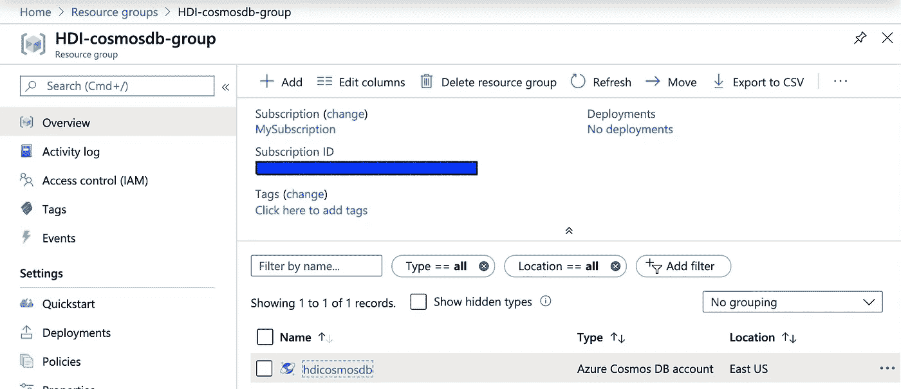
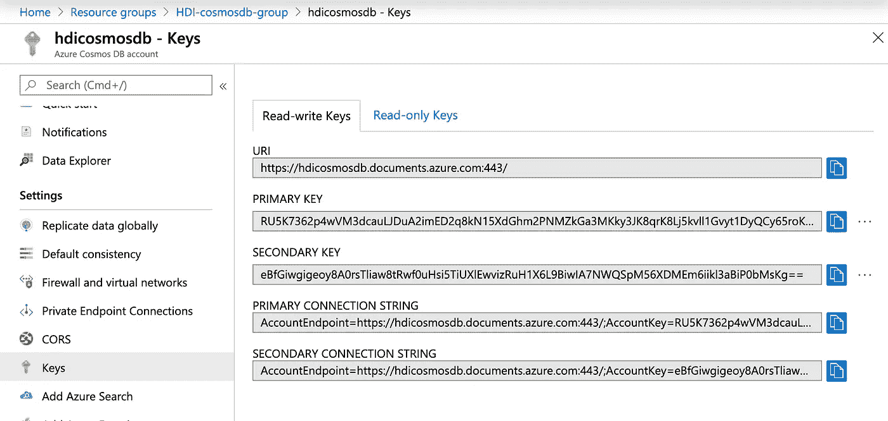
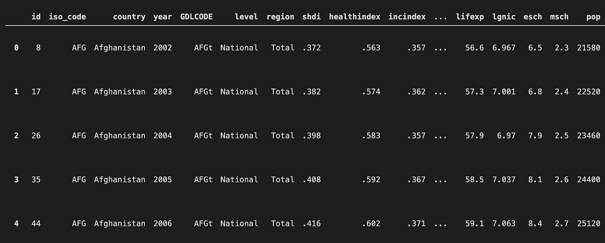

# Python + Azure Cosmos DB

> 原文：<https://towardsdatascience.com/python-azure-cosmos-db-f212c9a8a0e6?source=collection_archive---------6----------------------->

## 创建数据集和容器。查询数据。用 Python 探索 Cosmos DB。

额外收获:Azure CLI 命令。


布兰登·肖在 [Unsplash](https://unsplash.com/s/photos/galaxy?utm_source=unsplash&utm_medium=referral&utm_content=creditCopyText) 上的照片

# Azure Cosmos DB 是什么？

Azure Cosmos DB 是一个[全球分布式、多模型的数据库服务](https://docs.microsoft.com/en-us/azure/cosmos-db/introduction)，具有弹性可伸缩性和极快的速度。事实上，它是全球分布的，这意味着它是数据需要靠近用户的应用程序的优秀解决方案，并且能够针对峰值使用快速扩展。它被作为 web、移动、游戏和 IOT 应用程序的解决方案进行营销，这些应用程序具有海量输入数据和全球实时即时查询的需求。作为一个例子，它是光晕 5 的[社交游戏的数据库！](https://azure.microsoft.com/en-us/blog/how-halo-5-guardians-implemented-social-gameplay-using-azure-documentdb/)

# 本文的目标

在本文中，我们将创建一个 Azure Cosmos DB 帐户，并使用 [Azure Cosmos Python SDK](https://pypi.org/project/azure-cosmos/) 创建一个数据库，创建一个容器，用数据填充容器，并使用 SQL API 查询容器。我们将使用的数据来自[联合国人类发展指数——国家以下一级指数](https://globaldatalab.org/shdi/download_files/),因此人类发展指数的前缀是资源。

[**查看本文的 Github repo**](https://github.com/rchardptrsn/Cosmos-DB-and-Python)，您可以使用 Jupyter 笔记本查看可执行的 python 脚本。

# 创建一个 Azure Cosmos DB 帐户

使用 Azure 时，将资源放在一个资源组中总是一个好主意。最简单的方法是从 [Azure CLI 或云 shell:](https://docs.microsoft.com/en-us/cli/azure/group?view=azure-cli-latest#az-group-create)

首先，使用以下命令登录 Azure CLI:

```
az login
```

接下来，使用[**az Group create**](https://docs.microsoft.com/en-us/cli/azure/group?view=azure-cli-latest)命令创建一个名为 *HDI-cosmosdb-group* 的资源组。

```
az group create --location eastus \
                --name HDI-cosmosdb-group \
                --subscription MySubscription
```

用 [**az cosmosdb create**](https://docs.microsoft.com/en-us/cli/azure/cosmosdb?view=azure-cli-latest#az-cosmosdb-create) 命令创建一个名为 *hdicosmosdb(必须全小写)*的 Cosmos DB。这大约需要 10 分钟才能完成。

```
az cosmosdb create --name hdicosmosdb \
                   --resource-group HDI-cosmosdb-group \
                   --locations regionName=eastus \
                   --subscription MySubscription
```

完成后，您将在新创建的资源组中看到一个 Cosmos DB 资源。



现在已经创建了 Cosmos DB 帐户，我们需要 URI 端点和主键来与我们的帐户进行交互。你可以找到你的 URI 和访问密钥，方法是进入你的 Cosmos DB 账户，在左边向下滚动找到设置>>密钥。将 URI 和主键复制到安全文件中。



自该屏幕截图以来，新密钥已重新生成。

# 设置 Python 环境

将我们需要的两个包安装到您的 python 环境中。

```
pip install azure-cosmos
pip install pandas
```

# 导入包并初始化 Cosmos 客户机

现在，从 azure-cosmos-python github 示例和微软官方文档[中获取技巧，我们将开始使用 python 与我们的 Cosmos DB 进行交互。我们将从导入必要的包和创建 Cosmos 客户机开始。通过用我们的 URI 端点和访问密钥初始化 Cosmos 客户端，我们将能够使用 azure-cosmos API 与我们的 Cosmos DB 帐户进行交互。](https://docs.microsoft.com/en-us/azure/cosmos-db/create-sql-api-python)

# 创建数据库

使用初始化为我们的帐户的客户机，创建一个 Cosmos DB 数据库。这个数据库将存放容器，容器存放物品。项目是组成数据库的单个文档或记录/行。

# 创建一个容器

容器，也称为集合，存放构成数据库记录的项目(文档)。分区键路径('/country ')是容器的一个属性，Cosmos DB 将使用它在后台对数据集进行分组和分区。[这篇 C#Corner](https://www.c-sharpcorner.com/article/partitioning-in-cosmos-db/) 文章很好地解释了如何使用分区键按“部门”对记录进行分组在我们的数据集中，列“country”将用于对分区中的记录进行分组，分区由记录的“country”值定义。

# 下载并准备要上传的数据

现在，下载人类发展指数——使用熊猫的地方指数。Azure Cosmos DB 需要一列来标识每个记录/行的唯一 id。我们将基于熊猫数据帧的索引创建一个列“id”。此外，由于每一行在 Cosmos DB 中都以 json 文档的形式结束，我们需要将“id”列转换为 string 类型。

# 将数据上传到宇宙数据库

这里，我们将迭代熊猫数据帧的行，并为每一行创建一个字典。该字典已经为 json 提取进行了良好的格式化，这是通过 ***json.dumps()完成的。*** 当 for 循环执行时，每一行都被写入 Cosmos DB。对于一个 45，000 条记录的数据集，这大约需要 15 分钟。

# 查询宇宙数据库

既然我们的数据集已经植入了数据，让我们运行一个测试查询。

我们想要查询阿富汗国家的所有国家级数据。

我们所有的努力都得到了回报。 ***。head()*** 方法显示数据已经成功返回，并且在一个 pandas DataFrame 中。



让我们用三个主要指数——健康、收入和教育指数——的折线图来庆祝一下。


感谢你远道而来！Azure Cosmos DB 非常容易设置，它面向 json 的记录对于 python 和 pandas 来说轻而易举。