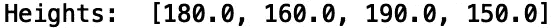
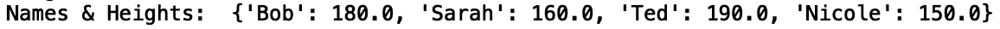
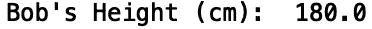
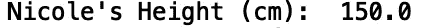
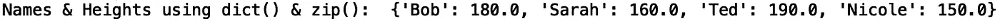
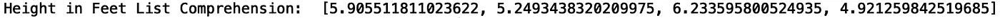
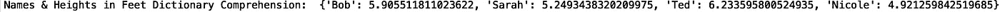
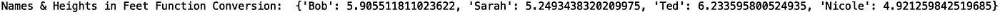

# 初学者的 Python 基础

> 原文：<https://towardsdatascience.com/python-basics-for-beginners-5fac8dd4fe43?source=collection_archive---------37----------------------->

## Python 简介


由[像素](https://www.pexels.com/photo/smartphone-surrounded-with-paper-pen-and-cup-of-americano-6372/)上的 [Kaboompics](https://www.pexels.com/@kaboompics) 拍摄的照片

Python 是一种高级解释编程语言，用于各种任务，如数据分析、机器学习和 web 开发。在这篇文章中，我们将介绍 python 中的一些基本概念。具体来说，我们将讨论如何定义列表和字典，迭代列表和字典，以及定义函数。

我们开始吧！

python 列表是一种重要的 python 数据结构。python 列表只是对象的集合。对象可以是字符串、整数、浮点数等..一个例子是姓名列表。为了在 python 中定义名称列表，我们执行以下操作:

```
names = ['Bob', 'Sarah', 'Ted', 'Nicole']
print("Names: ", names)
```


名称列表包含字符串对象。我们还可以定义一个浮动对象列表，比如每个人的身高(厘米):

```
heights = [180.0, 160.0, 190.0, 150.0]
print("Heights: ", heights)
```



现在假设我们需要一种方法来将名字映射到以厘米为单位的高度值。例如，假设 Bob 的身高是 180 cm，有没有一种方法可以可靠地得到他的身高。我们可以使用字典来实现这一点。为了构建这个字典，我们做了以下工作:

```
names_height = {'Bob':180.0, 'Sarah':160.0, 'Ted':190.0, 'Nicole':150.0}
print("Names & Heights: ", names_height)
```



现在，我们可以通过以下方式获得 Bob 的身高:

```
print("Bob's Height (cm): ", names_height['Bob'])
```



如果我们想要妮可的身高:

```
print("Nicole's Height (cm): ", names_height['Nicole'])
```



我们还可以使用“zip()”和“dict()”方法构建相同的字典:

```
names_height_2 = dict(zip(names, heights))
print("Names & Heights using dict() & zip(): ", names_height_2)
```



现在假设我们想将高度列表中的高度转换为英尺。为了把厘米换算成英尺，我们除以 30.48。我们可以在 for 循环中这样做:

```
heights_feet = [] #initialize empty list
for height in heights:
    heights_feet.append(height/30.48)
print("Height in Feet: ", heights_feet)
```


我们也可以使用叫做列表理解的东西来完成同样的任务:

```
heights_feet_2 = [height/30.48 for height in heights]
print("Height in feet list comprehension: ", heights_feet_2)
```



类似地，字典理解可以用于构造具有以英尺为单位的姓名和高度的字典:

```
names_height_feet = {name:height/30.48 for name, height in names_height.items()}
print("Names & Heights in Feet Dictionary Comprehension: ", names_height_feet)
```



最后，我们可以定义一个函数，它获取一个包含姓名/身高(cm)对的字典，并打印一个包含姓名/身高(ft)对的新字典:

```
def convert_to_feet(height_cm_dict):
   height_feet_dict = {}
   for key, value in height_cm_dict.items():
       height_feet_dict[key] = value/30.48
   print("Names & Heights in Feet Function Conversion: ", height_feet_dict)
```

让我们用包含厘米高度的字典调用我们的函数:

```
convert_to_feet(names_height)
```



我就讲到这里，但是您可以自己随意摆弄代码。

## 结论

总之，在这篇文章中，我们讨论了如何在 python 中定义列表和字典。我们讨论了如何使用“dict()”和“zip()”方法从列表中构造字典。我们还展示了如何使用 for 循环、列表的列表理解和字典的字典理解来迭代这些对象。最后，我们展示了如何定义一个函数，将字典中的厘米高度值转换为英尺，并将新值存储在一个单独的字典中。这篇文章的代码可以在 [GitHub](https://github.com/spierre91/medium_code/blob/master/basic_python/python_basics_beginners.py) 上找到。我希望你觉得这篇文章有用/有趣。感谢您的阅读！