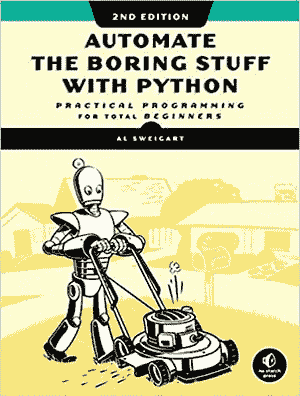

# 2021 年必读的 Python 书籍

> 原文：<https://towardsdatascience.com/python-books-you-must-read-in-2020-a0fc33798bb?source=collection_archive---------2----------------------->

## 看看吧，你为什么要读它们？

照片由来自[佩克斯](https://www.pexels.com/photo/python-book-1181671/?utm_content=attributionCopyText&utm_medium=referral&utm_source=pexels)的[克里斯蒂娜·莫里洛](https://www.pexels.com/@divinetechygirl?utm_content=attributionCopyText&utm_medium=referral&utm_source=pexels)拍摄

> Python 是程序员需要多大自由的一个实验。太多的自由，没人能读懂别人的代码；太少，表现力受到威胁。
> 
> 吉多·范·罗苏姆

[**Python**](https://www.python.org/) 是 [**顶级编程语言**](/top-programming-languages-for-ai-engineers-in-2020-33a9f16a80b0?source=---------27------------------) 之一，适用于多种多样的任务和领域。Python 的用户友好性、高级特性、对简单性的强调和增强的代码可读性使它成为全世界许多开发人员的首选。如果这还不能让你接受 Python，我相信超过 25.5 万个第三方包的详尽的生态系统会让你接受。

**类似这些**的特性让 Python 的需求无处不在，无论是应用开发、 [**数据科学、**](/best-data-science-tools-for-data-scientists-75be64144a88?source=---------24------------------) **、** [**人工智能**](https://blog.digitalogy.co/best-examples-of-artificial-intelligence-in-everyday-life/) 还是其他任何行业。这篇文章背后的目标是收集一些最好的 Python 书籍，帮助您获得关于这种令人惊叹的编程语言的知识和信心。

> 根据 Stackoverflow 的说法，python 是最受欢迎的语言，这意味着大多数开发人员都使用 Python。

 [## 2020 年大一新生热门 Python 面试问答

### 这里列出了大一新生最常被问到的 python 面试问题和答案，涵盖了核心…

blog.digitalogy.co](https://blog.digitalogy.co/python-interview-questions-and-answers-for-freshers/) 

# Python 书籍

书籍很可能是几乎任何主题的顶级信息来源之一，在这一部分，我们收集了十多本顶级书籍来帮助你熟悉和**获得一些关于 Python 的实用知识。这些书中有些涵盖了**关于编程语言**的全面知识，而有些则在**方面非常优秀，给你实际操作的体验**。**

不管你以前有没有 Python 或任何编程语言的经验，我们相信你会从这些书中为你的下一个项目找到一些非常有用的技巧。

 [## 给 Python 开发者的 10 个很酷的 Python 项目想法

### 您可以使用 Python 构建的有趣想法和项目列表

towardsdatascience.com](/10-cool-python-project-ideas-for-python-developers-7953047e203) 

***免责声明:*** *那些附属链接仅供参考。*

# 1. **Python 速成班**

**作者:**埃里克·马特斯

**出版社** —无淀粉出版社

**难度等级:**初学者

**在这里获得两本书**——[亚马逊](https://www.amazon.com/Python-Crash-Course-Hands-Project-Based/dp/1593276036)、[亚马逊](https://www.amazon.in/Python-Crash-Course-Eric-Matthes/dp/1593279280)

《Python 速成教程》一书的封面

顾名思义，作者写这本书是为了给几乎没有编程经验的读者提供一个快速速成班。作者已经把所有的介绍性概念**做得对初学者来说像 ABC 一样简单**，这样他们就可以开始在有趣的项目中运用他们的知识。这本书的介绍性质也使它成为学者的合适选择。

这本**分为两部分的书**在第一部分涵盖了**编程介绍**，而在第二部分，它采用了**项目驱动的方法**，鼓励读者完成任意或所有三个编程项目。这些项目包括编码一个 2D 游戏，创建一个数据可视化程序，以及最后一个用于笔记的在线学习日志。

# 2.**学习 Python**

**作者:**马克·卢茨

**出版商** —奥莱利传媒

**难度等级:**初学者

**在这里获取图书**——[亚马逊](https://www.amazon.com/Learning-Python-5th-Mark-Lutz/dp/1449355730/ref=as_li_ss_tl?keywords=learning+python&qid=1583256550&sr=8-1&linkCode=sl1&tag=daolf0f-20&linkId=29201fa045a2b84f298263ffd0b1128e&language=en_US)

《学习 Python》一书的封面

> 在 Python 的思维方式中，显式比隐式好，简单比复杂好。
> ――马克·卢茨

**学习 Python** 涵盖了编程语言的所有基础知识，旨在为寻求 Python**深度介绍**的初学者提供一站式解决方案。与上一本书一样，本书也是由两部分组成的，作者**马克·卢茨**试图在这一部分用 Python 创建一个坚实的基础，而另一部分则更多地关注于**真实的例子**和更好的**实际编程暴露的情况**。

本书最新版本涵盖了 [**Python v3.3**](https://www.python.org/downloads/release/python-330/) 及其所有最新改进连同 [**老版本 v2.7**](https://www.python.org/download/releases/2.7/) **。顺便说一句，如果你对编程一窍不通，给这本书补充一些介绍性的参考资料是个好主意。**

 [## 2020 年你必须使用的最好的 Python IDEs 和代码编辑器

### 具有显著特性的顶级 Python IDEs 和代码编辑器

towardsdatascience.com](/best-python-ides-and-code-editors-you-must-use-in-2020-2303a53db24) 

# 3.Python 技巧:令人敬畏的 Python 特性自助餐

**作者:**丹·巴德

出版人 —丹·巴德(dbader.org)

**难度等级:**初学者

**在这里获取图书**——[亚马逊](https://www.amazon.com/Python-Tricks-Buffet-Awesome-Features-ebook/dp/B0785Q7GSY/ref=as_li_ss_tl?keywords=python+tricks&qid=1583257348&sr=8-1&linkCode=sl1&tag=daolf-20&linkId=0c9de4230b75e954a3dd799506b5cdad&language=en_US)

《Python 技巧:令人敬畏的 Python 特性自助餐》一书的封面

> "应该有一种——最好只有一种——显而易见的方法来做这件事。"丹·巴德

顾名思义，Python Tricks 汇集了一系列方便的**特性、技巧和诀窍**，让你高效地使用 Python。

**用作者的话来说——**“一开始是一个有趣的 twitter 实验，后来变成了一系列值得注意和有用的技巧，并附有一个清晰的代码示例，帮助数百名 Python 开发人员理解了 Python 各个方面背后的思想。”

这本书涵盖了 Python 中各种主题的大量技巧，并且以一种解释清楚的风格呈现，但是要充分利用这本书，您仍然需要有很强的 Python 基础。

# 4.艰难地学习 Python

**作者:**泽德·肖

**出版商** —艾迪生-卫斯理

**难度等级:**初学者

**在这里获取图书**——[亚马逊](https://www.amazon.com/Learn-Python-Hard-Way-Introduction/dp/0134692888/ref=as_li_ss_tl?crid=1W6JUVLJ8UJTJ&keywords=learn+python+the+hard+way&qid=1583324926&sprefix=learn+python+the+,aps,239&sr=8-1&linkCode=sl1&tag=daolf-20&linkId=ed22a463300ec2adaac072b7272626f4&language=en_US)

《艰难地学习 Python》一书的封面

> "慢慢来，不要伤到你的大脑。"

如果你被标题中的**吓倒了，不要害怕。那只是作者使用说明的方式，让你彻底的通读章节，练习你所学的东西。**

****把标题放在一边**，作者已经完成了一项惊人的工作，以一种更加初学者友好的速度**呈现 Python 的基本概念，为你准备复杂的主题。这本书还包括大量的教学视频和练习来增强你的 Python 知识。如果你想知道，是的，这本书已经更新了一个新版本，支持 [**Python 3** 。](https://www.python.org/download/releases/3.0/)****

# **5.用 Python 自动化枯燥的东西**

****作者:**阿尔·斯威加特**

****出版社** —无淀粉出版社**

****难度等级:**初学者**

****在这里获取图书**——[亚马逊](https://www.amazon.com/Automate-Boring-Stuff-Python-2nd/dp/1593279922/ref=as_li_ss_tl?keywords=automate+boring+stuff+python&qid=1583257047&sr=8-1&linkCode=sl1&tag=daolf-20&linkId=3a3efa25c5d18038592a705d91d0b9ea&language=en_US)**

****

**“用 Python 自动化枯燥的东西”这本书的封面**

****据作者-****

> **不要把时间花在一只训练有素的猴子能做的工作上。即使你从来没有写过一行代码，你也可以让你的电脑做一些繁重的工作。了解如何用 Python 自动化枯燥的东西。**

**标题说明了一切。时不时地，你一定会遇到一个无聊或重复的任务，让你说“不要再这样了。”本书想要消除的正是这些时刻。作者在本书中介绍了编程语言的必要**基础知识，以帮助您创建一些漂亮的 Python 片段，这些片段可以在几秒钟内而不是几小时内自动完成一项简单但枯燥的任务。****

**虽然这本书对于那些想快速解决无聊任务的人来说是个奇迹，但没有编程背景，它并没有全面涵盖 Python 的每个方面。对于创建**方便的一次性代码**来说已经足够了，但是对于一个完整的介绍来说还不够。**

# **6.**用于数据分析的 Python****

****作者:**韦斯·麦金尼**

****出版商** —奥赖利**

****难度等级:**中级**

****在这里获取图书**——[亚马逊](https://www.amazon.in/dp/1491957662?tag=hackr0df-21)**

****

**《用于数据分析的 Python》一书的封面**

**Python 可以用于各种任务，其中之一就是数据分析。如果你经常发现自己忙于**分析和操作结构化数据**或者只是热衷于了解 Python 对于数据分析任务的效率，你可能会发现这本书很有用。**

**作者以一种非常全面的方式解释了处理数据的基本原理，同时也触及了科学计算的话题**。Python for Data Analysis 还涵盖了一些最流行的用于数据分析的库，比如[**【NumPy】**](https://numpy.org/)**[**熊猫**](https://pandas.pydata.org/)**[**matplotlib**](https://matplotlib.org/)**[**IPython**](https://ipython.org/)**和** [**SciPy**](https://www.scipy.org/)**********

> ****“无为而为；不费力地工作。把小的看成大的，把少的看成多的。在困难还容易的时候去面对它；通过一系列小行动完成大任务。——老子”
> ——韦斯·麦金尼****

**** [## 10 家使用 Python 的世界级公司

### Python 正被 IT 界的一些巨头积极使用

towardsdatascience.com](/10-world-class-companies-using-python-26cde24919a8) 

# 7.**Python 机器学习简介**

**作者:**安德里亚斯·穆勒和萨拉·圭多

**出版商** —奥赖利

**难度等级:**中级

**在这里获取图书**——[亚马逊](https://www.amazon.in/dp/1449369413?tag=hackr0df-21)

《用 Python 进行机器学习入门》一书的封面

机器学习的发展速度令人着迷。为了能够充分利用这项技术，Python 是胶合语言的首选。针对有志于寻找现实世界机器学习问题[解决方案](https://blog.digitalogy.co/best-and-free-online-machine-learning-courses/)的机器学习专业人士，这本书不需要任何机器学习经验。

这本书没有深入算法和模型背后的数学，而是采取了一种更温和的方法，解释了背景和它们的重要性。尽管它确实需要一些使用 Python 实现书中所涉及的大量算法和模型的知识，如**[**scikit-learn**](https://scikit-learn.org/)**、NumPy 和 matplotlib。****

# **8. **Python 数据科学手册****

**作者:杰克·范德普拉斯**

****出版商** —奥莱利传媒**

****难度等级:**中级**

****在这里获取图书**——[亚马逊](https://www.amazon.com/Python-Data-Science-Handbook-Essential/dp/1491912057/ref=sr_1_10?keywords=fluent+python&qid=1575011237&sr=8-10)**

****Git Hub—**[https://github.com/jakevdp/PythonDataScienceHandbook](https://github.com/jakevdp/PythonDataScienceHandbook)**

****

**《Python 数据科学手册》的封面**

**最近，数据科学越来越成为各个领域的必备技能，因为它提供的好处是无价的。本手册的作者更加强调将数据科学作为一种技能来学习，而不是一个新的知识领域，因为它可以证明在将技能应用于手头的问题时是有利的。**

**本书的内容已经被组织成由 Python 提供的**五个不同的库，用于广泛覆盖，即 **IPython、NumPy、Pandas、Matplotlib、Scikit-Learn** 。该手册确实需要对 Python 有一定程度的精通，才能按照作者的意图阅读，并且不适合初学者。****

# **9. **Head First Python:一个对大脑友好的指南****

****作者:**保罗·巴里**

****出版商** —奥莱利传媒**

****难度等级:**中级**

****在这里获取图书**——[亚马逊](https://www.amazon.com/Head-First-Python-Brain-Friendly-Guide/dp/1491919531/ref=as_li_ss_tl?keywords=head+first+python&qid=1583256982&sr=8-1&linkCode=sl1&tag=daolf-20&linkId=57c2a2bdf52d3e077f98f710ad9532bf&language=en_US)**

****

**“Head First Python:对大脑友好的指南”一书的封面**

> **“代码读的比写的多。这个"
> ――保罗·巴里**

**虽然这本书没有详细介绍编程语言及其整体，但它仍然设法以一种更实用和有趣的方式教你 Python。这本书与众不同的是作者用来与读者建立联系的**有趣和随意的风格**，更重要的是**滑稽地使用图片** **来保持学习过程的直观性。****

**对于那些刚刚开始学习 Python 或任何其他编程语言的人来说，你可能很难理解所涉及的主题。如果你知道编程的基本知识，那就来吧。**

# **10.流畅的 Python**

****作者:**拉马尔霍**

****出版商** —奥莱利传媒**

****难度等级:**专家**

****在这里获取图书**——[亚马逊](https://www.amazon.com/Fluent-Python-Concise-Effective-Programming/dp/1491946008/ref=as_li_ss_tl?keywords=fluent+python&qid=1583256926&sr=8-1&linkCode=sl1&tag=daolf-20&linkId=23ded57a39e0dfc2f56cc608291ada12&language=en_US)**

****

**《流畅的 Python》这本书的封面**

**当有效使用时，Python 可以是一种非常**通用和强大的编程语言**，这一动机是《流利的 Python》这本书的唯一驱动因素。很明显，学习 Python 和熟练掌握 Python 是两码事。大多数开发人员通常会用 Python 实现他们想要的东西，但这是以牺牲其全部潜力为代价的。**

**作者强调了一些很少使用的特性和技术，以使充分利用 Python 成为可能。如果你最近开始学习 Python，这本书可能不适合你，因为你可能会觉得很难理解。**

# **11.有效的 Python**

****作者:**布雷特·斯拉特金**

****出版商** —艾迪生-卫斯理**

****难度等级:**专家**

****在此获取图书**——[亚马逊](https://www.amazon.com/Effective-Python-Specific-Software-Development/dp/0134853989/ref=as_li_ss_tl?keywords=effective+python&qid=1583257231&sr=8-1&linkCode=sl1&tag=daolf-20&linkId=377613aad2ada0e254cb781aa0c4a0c5&language=en_US)**

****

**《有效的 Python》一书的封面**

**Python 是一种编程语言，它高度强调创建**清晰且可读性极强的代码**，但仍有一些情况下无法实现这一点。这就是《有效的 Python》这本书的由来。作者涵盖了一些常见错误，并提供了**宝贵的见解和实践**如何首先避免它们，以**编写更干净、可重用和更有效的 Python 代码**。如果你一直在努力寻找优化代码的方法，这本书可能是适合你的。**

# **12.Python 食谱**

**作者:大卫·比兹利&布莱恩·k·琼斯**

****出版商** —奥赖利媒体**

****难度等级:**专家**

****在这里获取图书**——[亚马逊](https://www.amazon.com/Python-Cookbook-Third-David-Beazley/dp/1449340377/ref=as_li_ss_tl?keywords=python+cookbook&qid=1583256834&sr=8-1&linkCode=sl1&tag=daolf-20&linkId=2f7b313663a4ff3ce71f9ef3e414aa65&language=en_US)**

****

**“Python 烹饪书”的封面**

**Python 有一个 [**优秀的社区**](https://www.python.org/community/) ，这本书从社区面临的许多独特挑战中获取灵感，这些挑战被称为 Python 食谱中的食谱。食谱附有**相关的例子和详细的背景研究**来自一些最有见地的社区成员。**

**为了让这一点非常清楚，作者将这本书的目标读者定为有经验的 Python 开发人员，他们希望加强对 Python 中各种现代技术的理解。建议初学者在开始阅读 Python 指南之前，先阅读一些关于 Python 入门部分的内容。****** 

# **更多的 Python 书籍可以阅读—**

*   **Python 袖珍参考**
*   **Python 机器学习**
*   **使用 Python 进行深度学习**
*   **Python 编程:计算机科学导论**
*   **用 Python 进行自然语言处理**
*   **一言以蔽之，Python**
*   **思考 Python:如何像计算机科学家一样思考**
*   **Django 初学者:用 Python 和 Django 构建网站**

# **结论**

**Python 是一种优雅而强大的编程语言，如果使用得当，它可以创造奇迹。这篇文章中涉及的书籍应该为您提供足够的知识，让您开始使用 Python，并提供一些额外的技巧和诀窍，以编写清晰、优化且运行良好的代码。总结一下，如果你热衷于从头开始学习 Python 或者只是想温习一下，我们强烈推荐你阅读这些书籍。**

> *****注:*** *为了消除各种各样的问题，我想提醒你一个事实，这篇文章仅代表我想分享的个人观点，你有权不同意它。***

# **更多有趣的阅读—**

**我希望这篇文章对你有用！以下是一些有趣的读物，希望你也喜欢**

** [## 面向所有人的顶级谷歌人工智能工具

### 使用谷歌人工智能中心将想法变为现实

towardsdatascience.com](/top-google-ai-tools-for-everyone-60346ab7e08)  [## 2020 年必读的机器学习书籍

### 看看吧，你为什么要读它们？

towardsdatascience.com](/machine-learning-books-you-must-read-in-2020-d6e0620b34d7)  [## 2020 年必读的数据科学书籍

### 看看吧，你为什么要读它们？

towardsdatascience.com](/data-science-books-you-must-read-in-2020-1f30daace1cb)  [## 面向数据科学的顶级 Python 库

### 面向数据科学的流行 Python 库概述

towardsdatascience.com](/top-python-libraries-for-data-science-c226dc74999b)  [## 用于自然语言处理的 Python 库

### 用于自然语言处理的流行 python 库概述

towardsdatascience.com](/python-libraries-for-natural-language-processing-be0e5a35dd64) 

> ***关于作者***
> 
> ***克莱尔 D*** *。在*[***Digitalogy***](https://www.digitalogy.co/)***—****是一个内容制作者和营销人员，这是一个技术采购和定制匹配市场，根据全球各地的特定需求，将人们与预先筛选的&顶尖开发人员和设计师联系起来。在*[***Linkedin***](https://www.linkedin.com/company/digitalogy)*，*[***Twitter***](https://twitter.com/DigitalogyCorp)*，*[***insta gram***](https://www.instagram.com/digitalogycorp)**。****