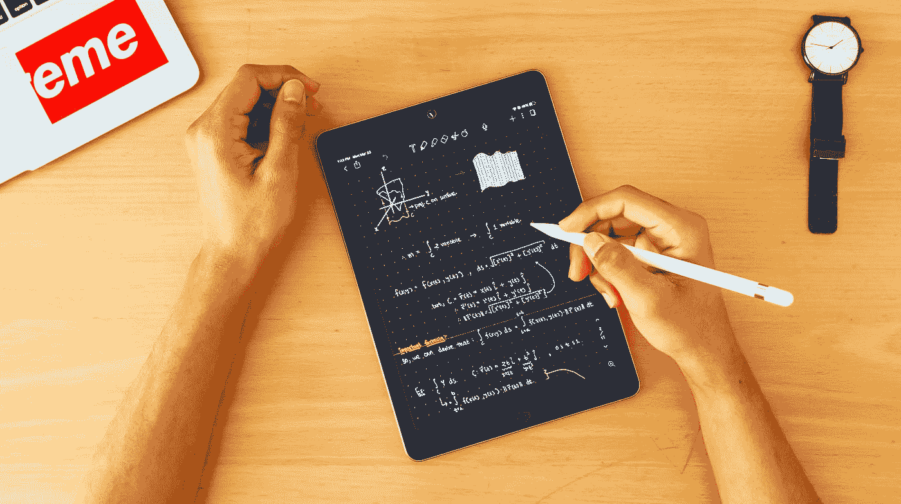

# Python 从头编码:没有任何机器学习库的矩阵乘法！

> 原文：<https://towardsdatascience.com/python-coding-from-scratch-matrix-multiplication-without-any-machine-learning-libraries-463624fe8726?source=collection_archive---------15----------------------->

## 从零开始了解如何在没有任何机器学习库的情况下实现矩阵乘法！

照片由 [Unsplash](https://unsplash.com?utm_source=medium&utm_medium=referral) 上的 [Dhru J](https://unsplash.com/@dhruj?utm_source=medium&utm_medium=referral) 拍摄

你曾经想象过在没有任何复杂的令人敬畏的机器学习库的情况下处理机器学习问题吗？

由于这些模块，我们可以在眨眼之间完成某些操作。

为了真正欣赏这些模块的美丽和优雅，让我们在没有任何机器学习库或模块的情况下从头开始编写矩阵乘法代码。虽然这不是一个极其复杂的任务，但这将帮助我们更好地学习核心概念，也理解 NumPy 的意义，它可以在短短几行代码中完成相同的任务。

所以，事不宜迟，让我们动手开始编码吧！

我解决这个问题的方法是从用户那里获取所有的输入。这些是第一和第二矩阵的行数和列数。同样，根据每个矩阵的行数和列数，我们将相应地分别填充备选位置。

在做任何矩阵乘法之前，第一步是检查两个矩阵之间的运算是否实际可行。这可以通过检查第一矩阵的列是否匹配第二矩阵的行的形状来完成。这可以表述为:

## →矩阵 1 中的列数=矩阵 2 中的行数

使用这个策略，我们可以制定我们的第一个代码块。这可以如下图所示完成—

好吧，这部分很简单。我们制定了一个计划，只在需要的时候执行矩阵运算。现在，让我们看看如何相应地接收相应行和列的输入。

在继续之前，让我们明确一个我们试图解决的问题。下图代表了我们需要解决的问题。我采用了更简单的 3*3 和 3*3 矩阵组合，但我保证这种方法将适用于匹配第一个矩阵的列和第二个矩阵的行的任何复杂问题。

作者截图

下图显示了相应的行数和列数。

既然我们已经制定了我们的问题陈述，让我们从用户那里获取想要的输入，并开始着手解决这个问题。这可以通过下面的代码块来完成:

在这里，我展示了如何遍历行和列来输入第一个矩阵的值。同样，您也可以对第二个矩阵重复这些步骤。完成此步骤后，您的输出应该如下所示:

好了，现在我们已经成功地获取了所有需要的输入。是时候遍历这些值并开始计算它们了。为了阐明矩阵乘法的工作原理，我们将行和它们各自的列相乘。

矩阵的第一个值必须如下:

**(1 * 1)+(2 * 4)+(3 * 7)=(1)+(8)+(21)= 30**

这可以使用以下代码来完成:

这段代码相应地计算结果，我们得到的最终输出如下:

下图显示了已完成的相同计算。

作者截图

好极了。我们现在已经完成了矩阵的工作。然而，我很好奇这将如何在 numpy 上工作。让我们看一看👀

## 使用 Numpy:

在仅使用 python 成功地格式化了矩阵乘法的工作之后，我们现在可以看看使用 numpy 模块的类似公式是什么样子的。这可以通过以下方式完成:

Welp！看起来这就是我们要做的一切。

来自[剪贴画](http://clipart-library.com/clipart/1215127.htm)的 Gif

这几乎没有任何工作，我坐在这里用 Python 编码。嗯！至少我们学到了一些新东西，现在可以欣赏我们使用的机器学习库有多棒了。

照片由[安托万·道特里](https://unsplash.com/@antoine1003?utm_source=medium&utm_medium=referral)在 [Unsplash](https://unsplash.com?utm_source=medium&utm_medium=referral) 上拍摄

# 结论:

我们发现，如果不使用现有的令人惊叹的机器学习库，即使是像矩阵乘法这样简单的任务，也需要花费更长的时间来执行，否则只需几行代码就可以完成。

然而，尽管如此，理解核心基础知识和理解这些操作是如何执行的仍然很重要，我们在本文中正是这样做的。在本文中，我们研究了如何在不使用任何库的情况下编写矩阵乘法代码。

如果你想让我做更多这样的“没有机器学习库的 Python 编码”那么请随意提出你希望我在接下来的文章中尝试的更多想法。

你可以通过下面的链接查看我最近的文章:

 [## 10+牛逼 Python 编辑器的简明指南，以及如何选择最适合你的编辑器…

### 帮助您在各种 python 开发环境中进行选择的简明指南

towardsdatascience.com](/a-concise-guide-of-10-awesome-python-editors-and-how-to-choose-which-editor-suits-you-the-best-465c9b232afd)  [## 5 个常见的 Python 错误以及如何避免它们！

### 从初学者到专家，每个人在 python 和机器学习中都容易出现这些错误。

towardsdatascience.com](/5-common-python-errors-and-how-to-avoid-them-63d9afc1a58f) 

请随意查看下面的文章系列，这些文章将从头开始涵盖对机器学习的全部掌握。该系列将持续更新，该系列将从头开始涵盖与 python 进行机器学习相关的每个主题和算法。

 [## 开始使用 Python 掌握机器学习的旅程

### 了解精通机器学习的基本要求

towardsdatascience.com](/starting-your-journey-to-master-machine-learning-with-python-d0bd47ebada9)  [## 机器学习所需的 Python 基础知识及其库模块

### 学习 python 数据结构的基础知识，对机器所需的每个库有直观的理解…

towardsdatascience.com](/basics-of-python-and-its-library-modules-required-for-machine-learning-51c9d26026b8) 

谢谢大家看完这篇文章，祝大家有美好的一天！