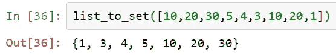
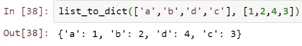
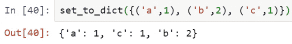

# Python 数据结构转换(列表、集合和字典)

> 原文：<https://towardsdatascience.com/python-data-structures-conversions-ec9d56649e3b?source=collection_archive---------41----------------------->

## 不使用内置 Python 命令的 Python 数据结构(列表、集合和字典)及其转换指南


马库斯·斯皮斯克在 [Unsplash](https://unsplash.com?utm_source=medium&utm_medium=referral) 上的照片

在 Python 中，主要有两种数据类型，主要是**原子**和**集合。原子数据类型是不可分的，它只代表一个数据值。一些例子是整数( **int** )、浮点( **float** )和布尔( **bool** )。**集合**数据类型则是多个数据值的集合，由字符串( **str** )、列表( **list** )、元组( **tuple** )、集合( **set** )和字典( **dict** )组成。本文将重点介绍**列表**、**集合**和**字典**，以及在没有任何内置 python 命令的情况下在它们之间进行转换的方法。**

# 目录

Python list 是一种数据类型，用于通常相关的集合项，它们可以保存任何数据类型(即 string、int、bool)的*数据对象，如下所示。它们通常用方括号表示(例如 **[ ]** )*

```
a_list = [1, 'two', 3.0, '4']
```

一些常见有用的列表命令如下。注意，Python 中的索引从 0 开始，而不是像 r 这样的其他编程语言中的 1。

```
# define empty list
a_list = []# append new item into list at the end of the list
a_list.append(new_item)
# append new item into list at a specific index
a_list.insert(index, new_item)# remove an item from the list based on index
a_list.pop(0)
# remove an item from the list based on item value
a_list.remove('two')# sort the items in ascending order, note that the data types must be similar
a_list.sort()
# reverse the order of the items
a_list.reverse()
```

# 一组

集合是一种数据类型，用于表示*唯一的、无序的*项的集合。它们通常被捕获在一个花括号中(即 **{ }** )。由于集合是唯一且无序的，所以在 Python 中我们无法基于索引或项目分配来访问单个项目。一些常用设置命令如下:

```
# define an empty set
a_set = set()
# define a set
a_set = {'one', 2}# adding item to a set
a_set.add('c')# removing an item from a set, raise keyError if item does not exist
a_set.remove('one')
# removing an item from a set, no keyError if item does not exist
a_set.discard('one')
# remove the first item from a set and return it
a_set.pop()
# remove all items from a set
a_set.clear()
```

# 词典

字典是一种映射数据类型，它将一个键与一个值相关联，这在某种程度上解释了什么是字典(即查找一个单词，它会提供一个含义)。每个数据项表示为 *key : value。*注意，键值必须是不可变的类型，这意味着它们应该是不变的，而数据值可以是任何数据类型。一些常见的有用的字典命令如下:

```
# define an empty dictionary
a_dict = {}# define a dictionary
a_dict = {"one":1, "two":2}# adding new items to the dictionary
a_dict[new_key] = new_value# removing items from the dictionary
del a_dict[a_key]# display the keys in the dictionary
a_dict.keys()
# display the values in the dictionary
a_dict.values()
# display the items in the dictionary
a_dict.items()
```

# 要设置转换的列表

我们可以很容易地使用`set[a_list]`将一个列表转换成一个集合。然而，我个人认为了解数据结构如何工作的最好方法是尝试从头开始创建它们。下面的函数将首先定义一个空集，然后使用`for`循环遍历给定列表中的每个值，将它添加到一个集合中。请记住，集合是唯一的数据结构，即使在给定的列表中有重复的值，它也不会被添加到集合中。

```
def list_to_set(int_list):
    my_set = set()
    for each in int_list:
        my_set.add(each)

    return my_set
```



按作者分类的图像 list _ to _ set 函数的 Python 输出

# 列表到词典的转换

请记住，字典是一个键-值对，这就是为什么如果我们要从头开始创建字典，我们将需要两个单独的列表，一个用于键，另一个用于值。该函数将首先创建一个空字典，然后使用带有`range`选项的`for`循环，它将遍历两个列表中的每个元素，并将其标记为键值对。请记住，这两个列表中的顺序很重要，因为我们要根据位置索引将一个键标记为值列表中的一个值。此外，两个列表的长度必须相似。

```
def list_to_dict(key_list, value_list):
    my_dict = {}
    for i in range (0, len(key_list)):
        my_dict[key_list[i]] = value_list[i]

    return my_dict
```



作者图片 list _ to _ dict 函数的 Python 输出

# 设置为字典转换

对于这一部分，我们将引入一种新的数据类型，称为**元组**，这在前面没有介绍过。元组是括号中的多个数据项(即 **( )** ),元组集只是多个唯一元组的集合。具有两个项目的元组的例子是 **(1，2)** ，而元组集合可以是 **{(1，2)，(1，3)}** 。对于两个数据项的元组，这似乎表明我们可以从元组集构建一个字典。

像往常一样，我们首先定义一个空字典。然后，我们将使用一个`for`循环来遍历每个元组。由于每个元组中有两个数据项，第一个值将是我们的字典键，而第二个值将是我们的 it 值。

```
def set_to_dict(tuple_set):
    my_dict = {}
    for each in tuple_set:
        my_dict[each[0]] = each[1]

    return my_dict
```



作者图片 set _ to _ dict 函数的 Python 输出

# 摘要

在本文中，我们介绍了 Python 中三种最常见的集合数据类型(即列表、集合、字典)以及一些常见的有用的 Python 命令。然后详细讨论了数据转换，从头开始在它们之间转换，而不使用内置的 Python 命令。我希望这篇文章能给 Python 爱好者一个熟悉 Python 数据结构的开端，并决定哪种数据结构最适合不同的问题/业务需求，干杯！

[](https://www.buymeacoffee.com/tankahwang)