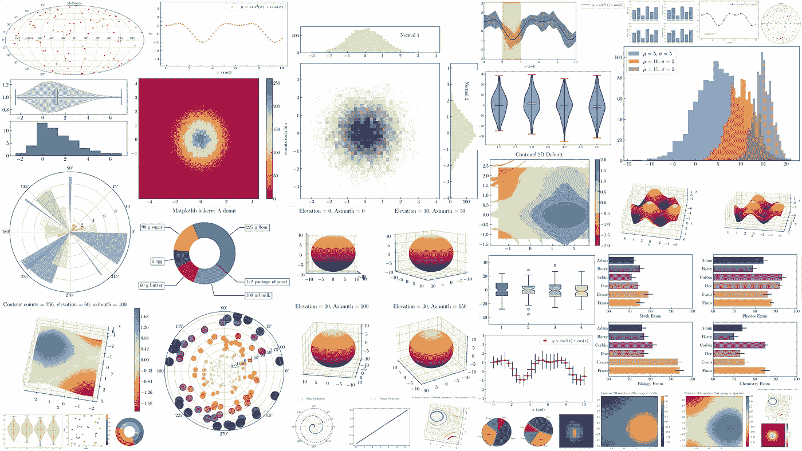
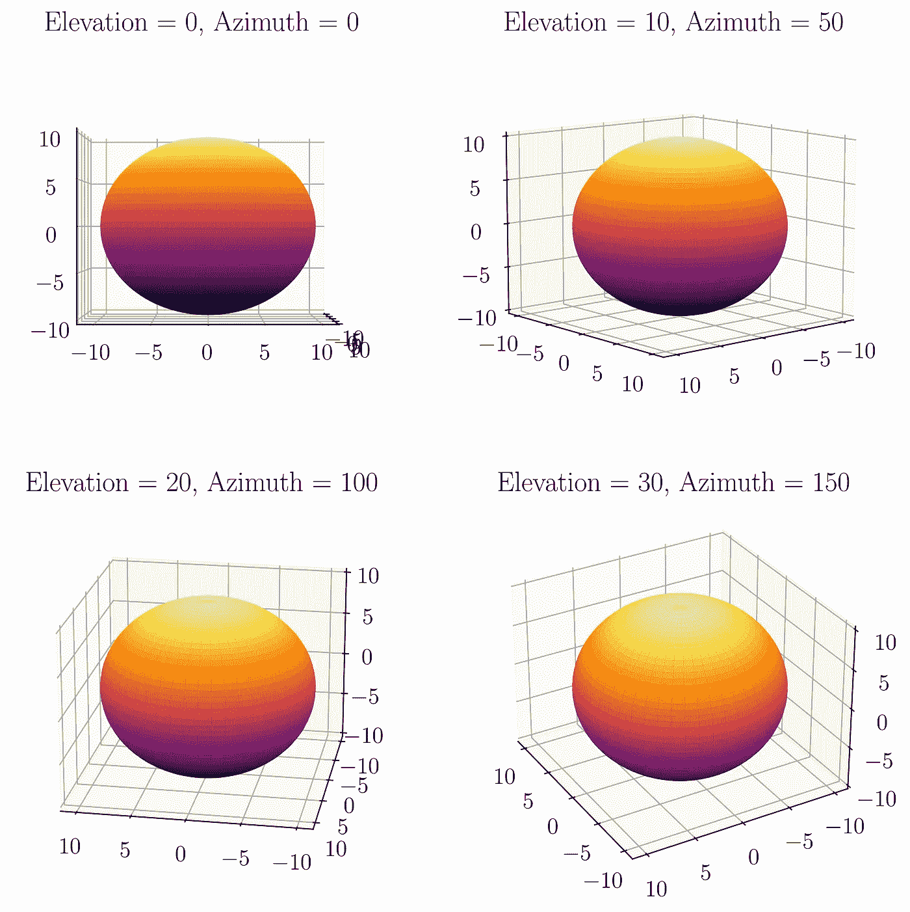

# 使用 Matplotlib 实现 Python 数据可视化—第 2 部分

> 原文：<https://towardsdatascience.com/python-data-visualization-with-matplotlib-part-2-66f1307d42fb?source=collection_archive---------4----------------------->



## [实践教程](https://towardsdatascience.com/tagged/hands-on-tutorials)，Matplotlib 简介

## 完成了从基础到高级的 Python 绘图的 Matplotlib 教程，包含 100 多个示例

T 他的故事是使用 Matplotlib 的 [Python 数据可视化的下一部分——第 1 部分](/visualizations-with-matplotlib-part-1-c9651008b6b8?source=your_stories_page-------------------------------------)。在第 1 部分中，我们学习了如何生成和定制散点图、折线图、直方图和条形图。本故事将继续研究使用 Matplotlib 进行 Python 绘图，包括生成和定制箱线图、小提琴图、饼图、极坐标图、地理投影、3D 图和等高线图。

和第 1 部分一样，我告诉您我已经在 Matplotlib 中定制了默认参数。这是我的绘图风格

```
import numpy as np
import matplotlib.pyplot as pltplt.rcParams['text.usetex'] = True
plt.rcParams['font.size'] = 15
plt.rcParams['font.family'] = "serif"tdir = 'in'
major = 5.0
minor = 3.0
plt.rcParams['xtick.direction'] = tdir
plt.rcParams['ytick.direction'] = tdirplt.rcParams['xtick.major.size'] = major
plt.rcParams['xtick.minor.size'] = minor
plt.rcParams['ytick.major.size'] = major
plt.rcParams['ytick.minor.size'] = minor
```

我使用乳胶字体作为我的默认衬线系列字体。如果您在激活 LaTeX 字体时遇到错误，您需要阅读[这个故事](/5-powerful-tricks-to-visualize-your-data-with-matplotlib-16bc33747e05)以找到解决方案。我还定制了 xtick 和 ytick 设置，将刻度方向从“向外”改为“向内”,并调整刻度的大小。可以看[这个故事](/matplotlib-styles-for-scientific-plotting-d023f74515b4)了解一下。我们开始吧。

## 01.箱形图

你知道盒子情节吗？维基百科将箱线图定义为一种通过四分位数图形化描述数字数据组的方法。它用于描述性统计。您可以在图 1 中看到一个箱形图的例子。


图一。方框图元素(图片由作者/ Rizky MN 提供)。

一般来说，箱线图代表一个分布图。它由一个盒子、胡须和离群值构成。在图 1 中，没有异常值。在 box 元素中，您可以显示分布的中值或平均值。我们可以在图 1 中看到中间值。该框受 Q1(第一个四分位数)和 Q3(第三个四分位数)值的限制。Q1 和 Q3 的差值称为四分位数(IQR)。默认情况下，触须显示分布的边界、最小值和最大值。


图二。方框图元素(图片由作者/ Rizky MN 提供)。

在图 2 中，您可以看到有一个异常值。箱线图如何检测异常值？当其值小于 Q1-1.5 倍 IQR 或大于 Q3+1.5 倍 IQR 时，在箱线图中检测到异常值。

在用 Matplotlib 创建一个方框图之前，我将使用下面的代码生成模拟数据

```
N = 50
np.random.seed(100)
box1 = np.random.randn(N) * 2 + 1
```

要以方框图的形式显示变量 box1，可以使用以下代码

```
plt.figure()
plt.boxplot(box1)
```

当您运行上面的代码时，您可以在图 3 中看到结果


图 3。Matplotlib 中的默认盒图(图片由作者/ Rizky MN 提供)。

## 水平箱形图

如果您想要水平更改盒状图的方向，您需要在 plt.boxplot()代码中应用以下参数。

```
vert = False
```

您可以在图 4 中看到水平方框图的结果。


图 4。Matplotlib 中的水平方框图(图片由作者/ Rizky MN 提供)。

在下一个例子中，我将通过改变种子数量来创建一个带有异常值的分布，如下面的代码所示

```
N = 50
np.random.seed(140)
box1 = np.random.randn(N) * 2 + 1plt.boxplot(box1, vert=False)
```

如果您运行上面的代码，您将得到一个方框图，如图 5 所示。


图 5。箱形图中的异常值(图片由作者/ Rizky MN 提供)。

我将向您展示 Matplotlib 如何通过计算 Q1 值(1.5 倍 IQR，Q3+1.5 倍 IQR)来检测异常值，并使用此代码对分布进行排序

```
q1 = np.quantile(box1, .25)
q3 = np.quantile(box1, .75)
iqr = q3-q1
lower_boundary = q1 - 1.5 * iqr
upper_boundary = q3 + 1.5 * iqr
sort = np.sort(box1)
```

为了可视化我需要的值，我运行下面的代码

如果您运行上面的代码，它会显示一个图，如图 6 所示。


图 6。箱线图中异常值的解释(图片由作者/ Rizky MN 提供)。

在图 6 中，你可以看到我用红点生成的随机数。下限(Q1-1.5 x IQR)等于-3.69，分布的最小值是-2.41。因此，图 6 中的左晶须极限处于最小值-2.41。上限(Q3 + 1.5 x IQR)为 5.98，因此值为 7.0 的数据被定义为异常值。右须限制将在 5.47 中结束，在上限之前的最大值上。要将图例放在图的外部，您需要阅读[这个故事](/5-powerful-tricks-to-visualize-your-data-with-matplotlib-16bc33747e05)。

在下一个例子中，我将展示四个分布的平均值。我需要使用下面的代码为四个发行版创建模拟数据

```
np.random.seed(1214)
data = [np.random.normal(0, std, 100) for std in range(10, 14)]
```

## 展示意味着价值

可变数据将生成 mu 为 0 的四个正态分布，每个分布具有不同的 sigma 值(10、11、12 和 13)。要在箱线图中显示平均值，您需要使用以下代码

```
plt.boxplot(data, showmeans=True)
```

如果您运行上面的代码，它将生成一个方框图，如图 7 所示。绿色三角形代表每个箱线图的平均值。


图 7。Matplotlib 中的自定义方框图(图片由作者/ Rizky MN 提供)。

您还可以使用以下代码在水平方框图中显示它

```
plt.boxplot(data, showmeans=True, vert = False)
```

上面的代码将生成一个图形，如图 8 所示。


图 7。在水平方框图中显示平均值(图片由作者/ Rizky MN 提供)。

您可以通过添加此参数来更改平均值的符号

```
meanline=True
```

或者使用此参数隐藏方框形状

```
showbox=False
```

图 8 显示了方框图中的一些定制。


图 8。在 Matplotlib 中自定义方框图(图片由作者/ Rizky MN 提供)。

你想改变盒子的颜色吗？你可以用这些设置来做。首先，您需要激活补丁艺术家，如下面的代码所示

```
patch_artist=True
```

然后，准备您的颜色，并使用此代码将其应用到方框图中

```
colors = ['royalblue', 'lightblue', 'lightgreen', 'pink']
for patch, color in zip(box['boxes'], colors):
    patch.set_facecolor(color)
```

这是完整的代码

```
np.random.seed(123)
all_data = [np.random.normal(0, std, 100) for std in range(10, 14)]box = plt.boxplot(all_data, notch=False, patch_artist=True)colors = ['royalblue', 'lightblue', 'lightgreen', 'pink']
for patch, color in zip(box['boxes'], colors):
    patch.set_facecolor(color)plt.ylim(-50, 50)
```

上面的代码将生成一个图形，如图 9 所示。


图 9。在 Matplotlib 中自定义方框图颜色(图片由作者/ Rizky MN 提供)。

## 激活槽口

您可以使用此参数在箱形图中显示凹口，如图 10 所示

```
notch=True
```


图 10。在 Matplotlib 中嵌入凹口(图片由作者/ Rizky MN 提供)。

您可以用这段代码重现图 10

```
np.random.seed(123)
all_data = [np.random.normal(0, std, 100) for std in range(10, 14)]box = plt.boxplot(all_data, notch=True, patch_artist=True)colors = ['royalblue', 'lightblue', 'lightgreen', 'pink']
for patch, color in zip(box['boxes'], colors):
    patch.set_facecolor(color)plt.ylim(-50, 50)
```


## 02.小提琴情节

Violin 图与 box 图非常相似，但没有定义异常值。分布中的所有数据都显示在一个内核函数中。为了创建一个小提琴情节，我使用了以下代码

```
N = 50
np.random.seed(140)
viol = np.random.randn(N) * 2 + 1plt.figure()
plt.violinplot(viol)
```

该代码将向您展示一个小提琴图，如图 11 所示。


图 11。Matplotlib 中的默认小提琴情节(图片由作者/ Rizky MN 提供)。

要水平显示它，您可以在方框图中使用相同的参数

```
vert=False
```

默认情况下，violin 图不显示中值和平均值。如果你想展示它，你需要插入这些参数

```
showmeans=True, showmedians=True
```

如果我结合上面的参数并运行它，我将看到如图 12 所示的 violin 图。


图 12。Matplotlib 中带有中值和平均值的小提琴图(图片由作者/ Rizky MN 提供)。

在图 12 中，我认为你不能区分哪里是中间值，哪里是平均值，因为它们有相似的颜色。要更改 violin 绘图中每个元素的颜色，如条形的颜色、中值、平均值、最小值和最大值，您需要将盒绘图代码定义为一个变量，如以下代码所示

```
violin_parts = plt.violinplot(data, showmedians=True, 
                              showmeans=True)
```

我生成四种不同的正态分布，定义为 ***数据*** 变量。

要更改中值、平均值、条形图、最小值和最大值的颜色，可以使用以下代码

```
vmedian = violin_parts['cmedians']
vmedian.set_edgecolor('r')vmean = violin_parts['cmeans']
vmean.set_edgecolor('k')vbars = violin_parts['cbars']
vbars.set_edgecolor('k')vmax = violin_parts['cmaxes']
vmax.set_edgecolor('darkorange')vmin = violin_parts['cmins']
vmin.set_edgecolor('darkorange')
```

定制的小提琴图如图 13 所示。


图 13。Matplotlib 中定制的小提琴剧情(图片由作者提供)。

下面是生成图 13 的完整代码。

```
np.random.seed(1214)
data = [np.random.normal(0, std, 100) for std in range(10, 14)]plt.figure(figsize = (10, 6))
violin_parts = plt.violinplot(data, showmedians=True, 
                              showmeans=True)vbars = violin_parts['cbars']
vbars.set_edgecolor('k')vmedian = violin_parts['cmedians']
vmedian.set_edgecolor('r')vmean = violin_parts['cmeans']
vmean.set_edgecolor('k')vmax = violin_parts['cmaxes']
vmax.set_edgecolor('darkorange')vmin = violin_parts['cmins']
vmin.set_edgecolor('darkorange')
```

要改变身体(轮廓)的颜色，你需要使用这个代码

```
for vp in violin_parts['bodies']:
    vp.set_facecolor('orange')
    vp.set_edgecolor('k')
    vp.set_linewidth(3)
```

上面的代码将把主体颜色改为橙色，黑色作为边缘颜色，并将线条宽度调整为 3，如图 14 所示。


图 14。在 Matplotlib 中自定义小提琴情节的主体颜色(图片由作者/ Rizky MN 提供)。

在图 14 中，我只显示了每个分布的中值。您可以用下面的代码重现图 14

```
np.random.seed(1214)
data = [np.random.normal(0, std, 100) for std in range(10, 14)]plt.figure(figsize = (10, 6))
violin_parts = plt.violinplot(data, widths=0.9, showmedians=True)for vp in violin_parts['bodies']:
    vp.set_facecolor('orange')
    vp.set_edgecolor('k')
    vp.set_linewidth(3)
```

我创建了一个完全定制的小提琴图，如图 15 所示。


图 15。在 Matplotlib 中自定义小提琴剧情(图片由作者/ Rizky MN 提供)。

您可以使用这段代码生成图 15

```
np.random.seed(1214)
data = [np.random.normal(0, std, 100) for std in range(10, 14)]# Create violin plot objects:
plt.figure(figsize=(10, 6))
violin_parts=plt.violinplot(data, showmedians=True, showmeans=True)# Make the violin body blue with a red border:
for vp in violin_parts['bodies']:
    vp.set_facecolor('royalblue')
    vp.set_edgecolor('k')
    vp.set_linewidth(2)
    vp.set_alpha(.8)colors = ['k', 'red', 'red', 'w', 'k']
part = ['cbars','cmins','cmaxes','cmeans','cmedians']for i in range(len(part)):
    vp = violin_parts[part[i]]
    vp.set_edgecolor(colors[i])
    vp.set_linewidth(2)
```


## 03.圆形分格统计图表

在生成饼图之前，我使用这段代码创建了一些动物的数量数据

```
labels = 'Frogs', 'Hogs', 'Dogs', 'Logs'
numbers = [15, 30, 45, 10]
```

要在饼图中可视化它，您可以使用以下代码

```
plt.pie(numbers)
```

上面的代码将生成一个饼状图，如图 16 所示。


图 16。Matplotlib 中的默认饼图(图片由作者/ Rizky MN 提供)。

图 16 显示了一个简单的饼图。您可以使用此参数为每个动物数据指定标签

```
labels = labels
```

如果你想显示每种动物的数量，你需要插入这个参数

```
autopct='%1.1f%%'
```

您可以在图 17 中看到添加标签和数字后的饼图结果。


图 17。在 Matplotlib 中自定义饼图(图片由作者/ Rizky MN 提供)。

下面是创建图 17 的完整代码。

```
labels = 'Frogs', 'Hogs', 'Dogs', 'Logs'
sizes = [15, 30, 45, 10]plt.figure()plt.pie(sizes, labels = labels, autopct='%1.1f%%')
```

您可以使用此参数更改饼图的起始角度

```
startangle=90
```

默认起始角度为 0，应用于第一个数据(青蛙)。我在两个不同的角度自定义了起始角度，如图 18 所示。


图 18。在 Matplotlib 中自定义饼图的起始角度(图片由作者/ Rizky MN 提供)。

下面是生成图 18 的代码

```
labels = 'Frogs', 'Hogs', 'Dogs', 'Logs'
sizes = [15, 30, 45, 10]
explode1 = (0, 0.1, 0, 0)
explode2 = (0, 0, 0.1, 0)plt.figure(figsize=(10, 10))
plt.subplot(121)
plt.pie(sizes, labels=labels, autopct='%1.1f%%', startangle=90)
plt.title('Startangle = 90$^\circ$')plt.subplot(122)
plt.pie(sizes, labels=labels, autopct='%1.1f%%', startangle=180)
plt.title('Startangle = 180$^\circ$')
```

您还可以为特定的饼图留出空白，如图 19 所示。


图 19。在 Matplotlib 中自定义饼图分解(图片由作者/ Rizky MN 提供)。

您可以使用下面的代码重现图 19

```
labels = 'Frogs', 'Hogs', 'Dogs', 'Logs'
sizes = [15, 30, 45, 10]
explode1 = (0, 0.1, 0, 0)
explode2 = (0, 0, 0.1, 0)plt.figure(figsize=(10, 10))plt.subplot(121)
plt.pie(sizes, explode=explode1, labels=labels, 
        autopct='%1.1f%%', startangle=90)plt.subplot(122)
plt.pie(sizes, explode=explode2, labels=labels, 
        autopct='%1.1f%%', startangle=180)
```

您可以通过调整变量 explode 中的值来更改边距。

## 在饼图中应用不同的样式

是否希望以不同的样式在饼图中显示数据？Yups，你可以看到图 20。


图 20。在饼图 Matplotlib 中应用不同的样式。

与之前的饼图不同的是，我将标签放在了图例中。要做到这一点，你需要使用这个论点

```
textprops={'color':"w"}
```

这个代码

```
plt.legend(labels, bbox_to_anchor = (1., .95),  title="Labels Name")
```

您可以使用下面的代码重现图 20

```
labels = 'Frogs', 'Hogs', 'Dogs', 'Logs'
sizes = [15, 30, 45, 10]
explode = (0, 0.05, 0, 0)plt.figure(figsize=(7, 7))plt.pie(sizes, autopct='%1.1f%%', textprops={'color':"w"}, 
        explode = explode, startangle = 90)
```

## 饼图中的阴影

您可以使用此参数在饼图中添加阴影

```
shadow=True
```

结果如图 21 所示。


图 21。在 Matplotlib 中的饼图中添加阴影(图片由作者/ Rizky MN 提供)。

我想我知道你在想什么:d .影子很丑吧？为此我尝试过很多替代方案；他们在这里

a.如果您正在使用 Jupyter，您可以通过右键单击图形来手动保存您的饼图。然后，点击 Save Image As，如图 22 所示。


图 22。在 Jupyter 中手动保存图像(图片由作者/ Rizky MN 提供)。

保存的图像如图 23 所示。


图 23。Jupyter 和 Matplotlib 中的备选保存图像(图片由作者/ Rizky MN 提供)。

b.另一种方法是添加白色笔画作为前景。要应用它，您需要使用以下代码从 Matplotlib 导入 path_effects

```
import matplotlib.patheffects as path_effects
```

然后，定义饼图的变量名，如下面的代码所示

```
patches, texts, autotexts = plt.pie(sizes, autopct='%1.1f%%', 
                                    textprops={'color':"w"}, 
                                    explode = explode, 
                                    startangle = 90, shadow=True)
```

接下来，用下面的代码定制 path_effects

```
for patch in patches:
    patch.set_path_effects([path_effects.Stroke(linewidth=2.5, 
                                                foreground = 'w')])
```

这是完整的代码

如果您运行上面的代码，它将创建一个饼图，如图 24 所示。


图 24。在饼图 Matplotlib 中添加前景笔划(图片由作者/ Rizky MN 提供)。

它并不完美，但我认为它比没有添加笔画更漂亮。您还可以将第一个和第二个选项结合起来，得到如图 25 所示的饼图。


图 25。自定义饼图 Matplotlib 中的阴影。

## 圆环图

从 Matplotlib 中的饼图特性，您可以创建一个圆环图，如图 26 所示。


图 26。Matplotlib 中的简单圆环图(图片由作者/ Rizky MN 提供)。

下面是生成图 26 数据的代码。

```
size = 0.3
vals = np.array([[60.], [37.], [29.]])cmap = plt.get_cmap("tab20c")
outer_colors = cmap(np.arange(3)*4)
inner_colors = cmap(np.array([1, 2, 5, 6, 9, 10]))
```

圆环图与饼图相似，但没有中心的完整半径。在图 26 中，我设置半径等于 0.3。下面是生成图 26 的代码。

```
plt.figure(figsize=(10,10))plt.pie(vals.sum(axis=1), radius=1, colors=outer_colors,
       wedgeprops=dict(width=size, edgecolor='w'))
```

我还创建了两个不同的半径大小，如图 27 所示。


图 27。圆环图 Matplotlib 中两种不同的半径大小(图片由作者/ Rizky MN 提供)。

您可以用下面的代码重现图 27。

```
vals = np.array([[60.], [37.], [29.]])plt.figure(figsize=(10,10))plt.subplot(121)
plt.pie(vals.sum(axis=1), radius=1, colors=outer_colors,
       wedgeprops=dict(width=.3, edgecolor='w'))
plt.title('Size = 0.3')plt.subplot(122)
plt.pie(vals.sum(axis=1), radius=1, colors=outer_colors,
       wedgeprops=dict(width=.5, edgecolor='w'))
plt.title('Size = 0.5')
```

您还可以创建一个双圆环图，如图 28 所示。


图 28。Matplotlib 中的双圆环图(图片由作者/ Rizky MN 提供)。

下面是生成图 28 的代码。

```
plt.figure(figsize=(10, 10))size = 0.3
vals = np.array([[60., 32.], [37., 40.], [29., 10.]])cmap = plt.get_cmap("tab20c")
outer_colors = cmap(np.arange(3)*4)
inner_colors = cmap(np.array([1, 2, 5, 6, 9, 10]))plt.pie(vals.sum(axis=1), radius=1, colors=outer_colors,
       wedgeprops=dict(width=size, edgecolor='w'))plt.pie(vals.flatten(), radius=1-size, colors=inner_colors,
       wedgeprops=dict(width=size, edgecolor='w'))
```

如果你阅读 Matplotlib 站点中的甜甜圈图文档，你会遇到一个漂亮的甜甜圈图，如图 29 所示。


图 29。Matplotlib 中一个漂亮的圆环图(图片由作者/ Rizky MN 提供)。

您可以使用这段代码创建图 29。


## 04.极区图

在平面投影中，您将有一个 x 轴和 y 轴。在极轴投影中，你需要用半径和角度的形式来定义它，如图 30 所示。


图 30。极射投影和平面投影的比较(图片由作者/ Rizky MN 提供)。

在极轴投影中，半径轴以圆半径的大小显示，角度以每个 0 度圆的角度为起点进行投影。要生成极轴投影，需要将投影类型定义为极轴，如以下参数所示。

```
projection='polar'
```

下面是生成图 30 的完整代码。

```
r = np.linspace(0, 2, 100)
theta = 2 * np.pi * rfig = plt.figure(figsize=(13, 4))ax1 = plt.subplot(121, projection='polar')
ax1.scatter(theta, r, label = 'Polar Projection', s = 10)
ax1.legend(bbox_to_anchor = (.85, 1.35))ax2 = plt.subplot(122)
ax2.scatter(theta, r, label = 'Planar Projection', s = 10)
ax2.legend(bbox_to_anchor = (0.85, 1.35))
ax2.set_xlabel('R')
ax2.set_ylabel(r'$\theta$')
```

您还可以在极轴投影中以绘图线样式显示您的数据，如图 31 所示。


图 31。在极投影中创建一条绘图线(图片由作者/ Rizky MN 提供)。

您可以用这段代码重现图 31

接下来是在极坐标投影中创建一个条形图，如图 32 所示。


图 32。极坐标投影中的条形图(图片由作者/ Rizky MN 提供)。

当你看到图 32 时，也许你正在记起 Matplotlib :D 的徽标。为了创建图 32，你需要使用以下代码生成数据

```
np.random.seed(10130)N = 20
theta = np.linspace(0.0, 2 * np.pi, N, endpoint=False)
radii = 10 * np.random.rand(N)
width = np.random.rand(N) * .8 - .1
colors = plt.cm.Spectral(radii / 10)
```

要将其可视化，您可以使用以下代码

```
plt.figure(figsize=(7, 7))ax = plt.subplot(111, projection='polar')
ax.bar(theta, radii, width=width, bottom=0.0, 
       color=colors, alpha=0.5)
```

如果您对使用极坐标条形图生成 Matplotlib 徽标感兴趣，可以阅读此文档。

[](https://matplotlib.org/3.1.0/gallery/misc/logos2.html) [## Matplotlib 徽标- Matplotlib 3.1.0 文档

### 编辑描述

matplotlib.org](https://matplotlib.org/3.1.0/gallery/misc/logos2.html) 

## 05.地理投影

要可视化您的地理数据，您可以使用 Matplotlib 提供的地理投影。有四种类型的投影:Aitoff、Hammer、Mollweide 和 Lambert 投影。为了理解它，我将使用这段代码创建一个模拟数据

```
N = 100np.random.seed(157)
long = np.random.random(N) * 360 - 180
lat = np.random.random(N) * 180 - 90
```

要在 Aitoff 投影中将其可视化，可以使用以下代码

```
plt.figure(figsize=(12, 7))
plt.subplot(111, projection="aitoff")
plt.scatter(long, lat, marker = '*', color = 'red', s = 40)
plt.title("Aitoff")
plt.grid(True)
```

代码将向您显示一个图形，如图 33 所示。


图 33。Matplotlib 中的 Aitoff 投影(图片由作者/ Rizky MN 提供)。

在艾托夫投影中，您需要确保您的数据以度为单位。

接下来是锤子投影。您可以使用此代码在 Hammer 投影中显示您的数据

```
plt.figure(figsize=(12, 7))
plt.subplot(111, projection="hammer")
plt.scatter(long, lat, marker = '*', color = 'red', s = 40)
plt.title("Hammer")
plt.grid(True)
```

锤子投影中显示的经度和纬度变量的单位是度。上面的代码将生成一个图形，如图 34 所示。


图 34。Matplotlib 中的锤子投影(图片由作者/ Rizky MN 提供)。

我不确定艾托夫投影和锤子投影有什么区别。如果你需要一些解释，你可以阅读这些链接。

[](https://en.wikipedia.org/wiki/Aitoff_projection) [## 艾托夫投影

### Aitoff 投影是由 David A. Aitoff 于 1889 年提出的一种改进的方位地图投影。基于…

en.wikipedia.org](https://en.wikipedia.org/wiki/Aitoff_projection) [](https://en.wikipedia.org/wiki/Hammer_projection) [## 锤子投影

### 哈默投影是恩斯特·哈默在 1892 年描述的一种等面积地图投影。使用相同的 2:1 椭圆…

en.wikipedia.org](https://en.wikipedia.org/wiki/Hammer_projection) 

在 Mollweide 投影中，数据单位需要转换为弧度。下面是生成弧度数据的代码。

```
N = 100np.random.seed(157)
long = np.random.random(N) * 2 * np.pi  - np.pi
lat = np.random.random(N) * np.pi - (np.pi / 2)
```

要在 Mollweide 投影中将其可视化，可以使用以下代码

```
plt.figure(figsize=(12, 7))
plt.subplot(111, projection="mollweide")
plt.scatter(long, lat, marker = '*', color = 'red', s = 40)
plt.title("Mollweide")
plt.grid(True)
```

如果您运行上面的代码，它将创建一个图形，如图 35 所示。


图 35。Matplotlib 中的 Mollweide 投影(图片由作者/ Rizky MN 提供)。

最后一个投影是 Lambert 投影，如图 36 所示。


图 36。Matplotlib 中的 Lambert 投影(图片由作者/ Rizky MN 提供)。

数据的单位是弧度。您可以使用这段代码重现图 36。

```
N = 100np.random.seed(157)
long = np.random.random(N) * 2 * np.pi  - np.pi
lat = np.random.random(N) * np.pi - (np.pi / 2)plt.figure(figsize=(12, 12))
plt.subplot(111, projection="lambert")
plt.scatter(long, lat, marker = '*', color = 'red', s = 40)
plt.title("Lambert")
plt.grid(True)
```


## 06.三维绘图

要创建 3d 绘图，需要将投影类型定义为 3D，如以下参数所示

```
projection = '3d'
```

3D 投影将给出如图 37 所示的结果。


图 37。Matplotlib 中的 3D 投影(图片由作者/ Rizky MN 提供)。

我用这段代码生成模拟数据。

```
N = 250np.random.seed(124)
x = 15 * np.random.random(N)
y = np.sin(x) + 0.25 * np.random.random(N)
z = np.cos(x) + 0.25 * np.random.random(N)
```

要可视化 3D 散点图中的数据，可以使用以下代码。

```
plt.figure(figsize=(9, 6))
ax = plt.axes(projection = '3d')
ax.scatter3D(x, y, z, color = 'r')ax.set_xlabel('x', fontsize = 20, labelpad = 20)
ax.set_ylabel('y', fontsize = 20, labelpad = 20)
ax.set_zlabel('z', fontsize = 20, labelpad = 20)
```

代码将生成一个 3d 绘图，如图 38 所示。


图 38。Matplotlib 中的 3D 散点图(图片由作者/ Rizky MN 提供)。

据我所知，在最新的 Matplotlib 版本中，每个轴的纵横比总是相同的。要更改它，您可以使用以下代码

```
ax.set_box_aspect((2., 1.5, 1.2))
```

我将 x 轴、y 轴和 z 轴的纵横比更改为 2:1.5:1.2。应用上面的代码后，您将有一个图，如图 39 所示。


图 39。在 Matplotlib 中自定义 3D 散点图的特征。

## 三维绘图线

您可以创建一个 3D 绘图线，如图 40 所示。


图 40。Matplotlib 中的 3D 绘图线(图片由作者/ Rizky MN 提供)。

您可以用这段代码重现图 40。

```
N = 100np.random.seed(124)
xline = np.linspace(0, 15, N)
yline = np.sin(xline) 
zline = np.cos(xline)fig = plt.figure(figsize=(9, 6))
ax = plt.axes(projection = '3d')
ax.plot3D(xline, yline, zline)ax.set_xlabel('x')
ax.set_ylabel('y')
ax.set_zlabel('z')ax.set_box_aspect((2, 1.5, 1.2))
```

你可以用这个代码改变视角

```
ax.view_init(10, 180)
```

view_init 中的第一个参数是仰角，第二个参数是方位角。您可以看到不同角度的不同表示，如图 41 所示。


图 41。在 3D 绘图中自定义视角(图片由作者/ Rizky MN 提供)。

## 三角形 3D 表面

要在 Matplotlib 中生成一个三角形的 3D 曲面，可以使用下面的代码。

```
ax.plot_trisurf()
```

我用这段代码生成了要在三角形 3D 表面中可视化的数据

```
N = 2000np.random.seed(124)
r = 2 * np.pi * np.random.random(N)
theta = 20 * np.pi * np.random.random(N)xdata = np.ravel(r * np.sin(theta))
ydata = np.ravel(r * np.cos(theta))
zdata = np.sin(xdata) + np.cos(ydata)
```

您可以从上面图 42 中的数据看到三角形 3D 表面图。


图 42。Matplotlib 中的三角形 3D 表面绘图(图片由作者/ Rizky MN 提供)。

您可以用这段代码重现图 42

## 3D 等高线图

Matplotlib 提供 3D 等高线图。您可以使用以下代码创建它

```
ax.contour3D()
```

我使用下面的代码生成模拟数据

```
N = 100
np.random.seed(3124)
x = np.linspace(-2, 2, N) + np.random.random(N)
y = np.linspace(-2, 2, N) + np.random.random(N)X, Y = np.meshgrid(x, y)
Z = np.sin(X) + np.cos(Y)
```

为了形象化它，我运行以下代码

```
fig = plt.figure(figsize=(9, 6))ax = plt.axes(projection = '3d')
ax.contour3D(X, Y, Z, cmap = 'Spectral')
```

定制之后，我的 3D 轮廓图如图 43 所示。


图 43。Matplotlib 中的默认 3D 等高线图(图片由作者/ Rizky MN 提供)。

您可以使用这段代码重现图 43

默认情况下，Matplotlib 在 7 个计数的等高线中生成 3D 等高线图。您可以通过在 ax.contour3D()的第四个参数中写下您想要的计数来更改它，如下面的代码所示

```
ax.contour3D(X, Y, Z, 256, cmap = 'Spectral')
```

您可以在图 44 中看到不同的 3D 等高线图。


图 44。在 Matplotlib 中自定义 3D 等高线图(图片由作者/ Rizky MN 提供)。

下面是生成图 44 的完整代码。

要显示颜色条，您可以使用以下代码

```
plt.colorbar()
```

需要的参数是您的 3D 等高线图。所以，如果你把你的图定义成一个变量，那是最好的。在我的代码中，它被定义为变量 p。

您可以使用前面图中应用的相同代码来改变视角，如图 45 所示。


图 45。在 Matplotlib 中使用颜色条自定义 3D 等高线图(图片由作者/ Rizky MN 提供)。

## 3D 等高线 Matplotlib 中的错误

我觉得 Matplotlib 3D contour 有 bug，如图 46 所示。


图 46。3D contour Matplotlib 中的一个 bug(图片作者/ Rizky MN)。

要创建图 46，您需要在前面的代码(创建图 45 的代码)中更改仰角和方位角的值。你明白我说的虫子是什么意思吗？如果你仔细分析图 46，你会得到一个奇怪的特征。您可以在图 47 中看到它。


图 47。3D contour Matplotlib 中的一个 bug(图片作者/ Rizky MN)。

蓝线覆盖的区域位置不对。我们看不到它，因为它被放在后面。我不确定是不是 bug，但是我觉得需要 Matplotlib 来修复。

为了更详细地理解它，我在 Matplotlib 中引入了两种不同的轮廓表示，ax.contour()和 ax.contourf()，如图 48 所示。


图 48。Matplotlib 中 3D 等高线图的两种不同表示法(图片由作者/ Rizky MN 提供)。

contourf 在 ax.contourf 中的意思是填充轮廓。因此，您可以在图 48 中看到 ax.contour()和 ax . contour()之间的区别。ax.contour 具有与 ax.contour3D()相似的默认轮廓计数，即 7 个计数。但是，ax.contourf()有不同的计数，它是 8。您可以用这段代码重现图 48

```
N = 100
np.random.seed(3124)
x = np.linspace(-2, 2, N) + np.random.random(N)
y = np.linspace(-2, 2, N) + np.random.random(N)X, Y = np.meshgrid(x, y)
Z = np.sin(X) + np.cos(Y)plt.figure(figsize=(14, 6))ax1 = plt.subplot(121, projection = '3d')
ax1.contour(X, Y, Z, cmap = 'Spectral')
ax1.set_xlabel('x')
ax1.set_ylabel('y')
ax1.set_zlabel('z')ax1.set_box_aspect((3, 3, 1))
ax1.view_init(10, 100)
ax1.set_title('Contour Default, elevation = 10, azimuth = 100')ax2 = plt.subplot(122, projection = '3d')
ax2.contourf(X, Y, Z, cmap = 'Spectral')
ax2.set_xlabel('x')
ax2.set_ylabel('y')
ax2.set_zlabel('z')ax2.set_box_aspect((3, 3, 1))
ax2.view_init(10, 100)
ax2.set_title('Contourf Default, elevation = 10, azimuth = 100')
```

您可以在图 48 的右图中仔细观察(contourf 图)。我在 3D 轮廓中提到的错误没有被检测到。您可以在图 49 中看到更多细节。


图 49。ax.contur()和 ax.contourf()在检测 Matplotlib 的 bug 方面的比较(图片由作者/ Rizky MN 提供)。

您可以看到，如果 ax.contour()会给出相同的错误，但对于 ax . contour()则不会。所以，如果你想在 3D 投影中可视化等高线图，我推荐你使用 ax.contourf()。

## 线框绘图

您可以使用以下代码在 Matplotlib 中生成一个线框绘图

```
ax.plot_wireframe()
```

下面是生成在线框图中可视化的模拟数据的代码

```
N = 100
np.random.seed(3124)
x = np.linspace(-2, 2, N) + np.random.random(N)
y = np.linspace(-2, 2, N) + np.random.random(N)X, Y = np.meshgrid(x, y)
Z = np.sin(X) + np.cos(Y)
```

默认的线框图表如图 50 所示。


图 50。Matplotlib 中的默认线框绘图(图片由作者/ Rizky MN 提供)。

您可以用下面的代码重现图 50

```
N = 100
np.random.seed(3124)
x = np.linspace(-2, 2, N) + np.random.random(N)
y = np.linspace(-2, 2, N) + np.random.random(N)X, Y = np.meshgrid(x, y)
Z = np.sin(X) + np.cos(Y)fig = plt.figure(figsize=(10, 10))ax = plt.axes(projection = '3d')
ax.plot_wireframe(X, Y, Z, color = 'k', alpha = .2)
```

定制的线框图表如图 51 所示。


图 51。Matplotlib 中的自定义线框绘图(图片由作者/ Rizky MN 提供)。

我将线框层数改为 5，将仰角设为 60 度，方位角设为 100 度。您可以使用这段代码生成图 51。

```
N = 100
np.random.seed(3124)
x = np.linspace(-2, 2, N) + np.random.random(N)
y = np.linspace(-2, 2, N) + np.random.random(N)X, Y = np.meshgrid(x, y)
Z = np.sin(X) + np.cos(Y)fig = plt.figure(figsize=(9, 6))ax = plt.axes(projection = '3d')# 3d contour plot
ax.plot_wireframe(X, Y, Z, 5, color = 'k', alpha = .2)
ax.set_xlabel('x')
ax.set_ylabel('y')
ax.set_zlabel('z')ax.set_box_aspect((2, 2, 1))
ax.view_init(60, 100)ax.set_title('Wireframe counts = 5, elevation = 60, azimuth = 100')
```

如果您想检查我们是否在 ax.contour()和 ax.contour3D()中遇到类似的错误，您可以将仰角更改为 10 度，将方位角更改为 100 度，如图 52 所示。


图 52。Matplotlib 中的自定义线框绘图(图片由作者/ Rizky MN 提供)。

我们没有遇到线框图中的错误。

## 3D 表面图

您可以使用此代码在 Matplotlib 中生成 3D 曲面图。

```
ax.plot_surface()
```

定制的 3D 表面图如图 53 所示。


图 53。Matplotlib 中的自定义 3D 表面图(图片由作者/ Rizky MN 提供)。

您可以用这段代码重现图 53

```
N = 100
np.random.seed(3124)
x = np.linspace(-2, 2, N) + np.random.random(N)
y = np.linspace(-2, 2, N) + np.random.random(N)X, Y = np.meshgrid(x, y)
Z = np.sin(X) + np.cos(Y)fig = plt.figure(figsize=(8, 8))ax = plt.axes(projection = '3d')# 3d contour plot
ax.plot_surface(X, Y, Z, )
ax.set_xlabel('x')
ax.set_ylabel('y')
ax.set_zlabel('z')ax.set_box_aspect((2, 2, 1))
ax.view_init(10, 100)ax.set_title('Plot surface Default, elevation = 10, azimuth = 100')
```

您可以使用此参数设置 cstride 和 rstride 的值

```
rstride = 1, cstride = 1
```

您可以在图 54 中看到默认 cstride 和 rstride 值与自定义值之间的差异。


图 54。Matplotlib 中的自定义 3D 表面图(图片由作者/ Rizky MN 提供)。

要生成图 54，您可以使用以下代码

你不会遇到你在等高线图中遇到的 bug，如图 55 所示。


图 55。在 Matplotlib 中检查 3D 表面图中的 bug(图片由作者/ Rizky MN 提供)。

## 在 Matplotlib 中创建球

您可以在 Matplotlib 中创建一个球，如图 56 所示。


图 56。在 Matplotlib 中创建球(图片由作者/ Rizky MN 提供)。

您可以用下面的代码创建图 56

```
u = np.linspace(0, 2 * np.pi, 100)
v = np.linspace(0, np.pi, 100)
x = 10 * np.outer(np.cos(u), np.sin(v))
y = 10 * np.outer(np.sin(u), np.sin(v))
z = 10 * np.outer(np.ones(np.size(u)), np.cos(v))plt.figure(figsize=(10, 10))
ax = plt.subplot(projection = '3d')
ax.plot_surface(x, y, z, cmap = 'inferno')
```

您可以为它定制视角，如图 57 所示。



图 57。在 Matplotlib 中自定义球(图片作者/ Rizky MN)。

您可以使用这段代码重现图 57


## 07.2D 等高线图

我要展示的最后一种绘图类型是 2D 等高线图。您可以使用此代码生成 2D 等高线图

```
plt.contour()
```

虽然名称是 2D 等高线图，但它显示的是 3D 数据。我使用这段代码创建模拟数据

```
N = 100
np.random.seed(100)x = np.linspace(-2, 2, N) + np.random.random(N)
y = np.linspace(-2, 2, N) + np.random.random(N)X, Y = np.meshgrid(x, y)
Z = np.sin(X) + np.cos(Y)
```

我将模拟数据呈现在等高线图中，如图 58 所示。


图 58。Matplotlib 中的默认 2D 等高线图(图片由作者/ Rizky MN 提供)。

您可以用下面的代码重现图 58

```
N = 100
np.random.seed(100)x = np.linspace(-2, 2, N) + np.random.random(N)
y = np.linspace(-2, 2, N) + np.random.random(N)X, Y = np.meshgrid(x, y)
Z = np.sin(X) + np.cos(Y)plt.figure(figsize=(7, 5))
plt.contour(X, Y, Z)
plt.title('Contour 2D Default', pad = 10)
```

我生成了两个定制的等高线图，如图 59 所示。


图 59。Matplotlib 中的两个自定义 2D 等高线图(图片由作者/ Rizky MN 提供)。

要创建图 59，您可以使用以下代码

```
N = 100
np.random.seed(100)x = np.linspace(-2, 2, N) + np.random.random(N)
y = np.linspace(-2, 2, N) + np.random.random(N)X, Y = np.meshgrid(x, y)
Z = np.sin(X) + np.cos(Y)plt.figure(figsize=(15, 5))plt.subplot(121)
plt.contour(X, Y, Z, 256)
plt.title('Contour 2D counts = 256, cmap = viridis', pad = 10)
plt.colorbar()plt.subplot(122)
plt.contour(X, Y, Z, 256, cmap = 'Spectral')
plt.colorbar()
plt.title('Contour 2D counts = 256, cmap = Spectral', pad = 10)
```

同样，你可以生成填充到 2D 投影中的等高线，如图 60 所示。


图 60。Matplotlib 中的默认轮廓图(图片由作者/ Rizky MN 提供)。

您可以用下面的代码生成图 60

```
N = 100
np.random.seed(100)x = np.linspace(-2, 2, N) + np.random.random(N)
y = np.linspace(-2, 2, N) + np.random.random(N)X, Y = np.meshgrid(x, y)
Z = np.sin(X) + np.cos(Y)**3plt.figure(figsize=(7, 5))
plt.contourf(X, Y, Z, cmap = 'Spectral')
plt.colorbar()plt.title('Contourf 2D Default', pad = 10)
```

这里我生成了两个不同的 contourf 图，如图 61 所示。


图 61。Matplotlib 中两个自定义的 confourf 图(图片由作者/ Rizky MN 提供)。

您可以使用这段代码生成图 61

```
N = 100
np.random.seed(100)x = np.linspace(-2, 2, N) + np.random.random(N)
y = np.linspace(-2, 2, N) + np.random.random(N)X, Y = np.meshgrid(x, y)
Z = np.sin(X) + np.cos(Y)**3plt.figure(figsize=(15, 5))plt.subplot(121)
plt.contourf(X, Y, Z, 50, cmap = 'inferno')
plt.colorbar()plt.title('Contourf 2D counts = 50', pad = 10)plt.subplot(122)
plt.contourf(X, Y, Z, 200, cmap = 'inferno')
plt.colorbar()plt.title('Contourf 2D counts = 200', pad = 10)
```


## 结论

在技术时代，数据可视化对于从小数据或大数据中分析数据具有重要意义。我们需要它来全面了解我们的数据。可以与 Matplotlib 一起使用的各种类型的可视化。这只是 python 用 Matplotlib 绘图的一小部分。在这个 Matplotlib 指南系列(第 1 部分和第 2 部分)中，我生成了 101 个图形。如果你读完了所有的部分，你需要花你的 48 分钟:D，我希望这个故事可以帮助你把你的数据可视化成各种各样的情节类型。

## 如果你喜欢这篇文章，这里有一些你可能喜欢的其他文章:

[](/5-powerful-tricks-to-visualize-your-data-with-matplotlib-16bc33747e05) [## 使用 Matplotlib 可视化数据的 5 个强大技巧

### 如何使用 LaTeX 字体，创建缩放效果，发件箱图例，连续错误，以及调整框填充边距

towardsdatascience.com](/5-powerful-tricks-to-visualize-your-data-with-matplotlib-16bc33747e05) [](/matplotlib-styles-for-scientific-plotting-d023f74515b4) [## 用于科学绘图的 Matplotlib 样式

### 为您的科学数据可视化定制 Matplotlib

towardsdatascience.com](/matplotlib-styles-for-scientific-plotting-d023f74515b4) [](/creating-colormaps-in-matplotlib-4d4de78a04b8) [## 在 Matplotlib 中创建色彩映射表

### 从颜色列表中创建和定制自己的色彩映射表的指南

towardsdatascience.com](/creating-colormaps-in-matplotlib-4d4de78a04b8) [](/customizing-multiple-subplots-in-matplotlib-a3e1c2e099bc) [## 在 Matplotlib 中自定义多个子情节

### 使用 subplot、add_subplot 和 GridSpec 在 Matplotlib 中创建复杂 subplot 的指南

towardsdatascience.com](/customizing-multiple-subplots-in-matplotlib-a3e1c2e099bc) [](/introduction-to-big-data-a-simple-code-to-read-1-25-billion-rows-c02f3f166ec9) [## Vaex 大数据简介—读取 12.5 亿行的简单代码

### 用 Python 高效读取和可视化 12.5 亿行星系模拟数据

towardsdatascience.com](/introduction-to-big-data-a-simple-code-to-read-1-25-billion-rows-c02f3f166ec9) 

仅此而已。感谢您阅读这个故事。喜欢就评论分享。我还建议您关注我的帐户，以便在我发布新故事时收到通知。