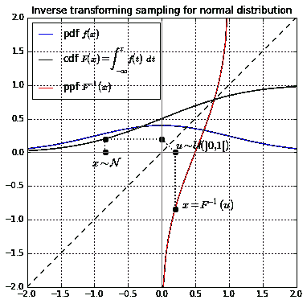
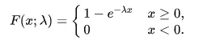
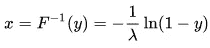
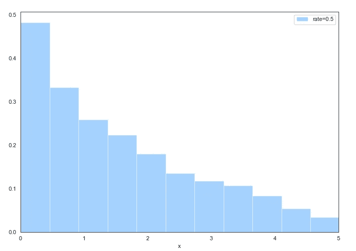

# Python 装饰者与数据科学:随机抽样

> 原文：<https://towardsdatascience.com/python-decorators-with-data-science-random-sampling-177962cae80c?source=collection_archive---------56----------------------->

来源:https://en.wikipedia.org/wiki/Inverse_transform_sampling

## 使用 python decorator 进行随机采样

这篇文章在一起学习一些概念方面更有教育意义。我想知道如何将 python decorators 与特定的数据科学概念结合使用，于是就有了写这篇文章的想法。让我们先看看随机抽样是如何做到的。

# 随意采样

逆变换是从一些众所周知的分布中生成随机样本的方法之一。逆变换取 0 和 1 之间的均匀样本 *u* ，并从分布 P(X)返回最大数 *x* ，使得 X 低于 *x* 的概率小于等于 u

> [概率积分变换](https://en.wikipedia.org/wiki/Probability_integral_transform)陈述了如果 x 是一个[连续随机变量](https://en.wikipedia.org/wiki/Continuous_random_variable)具有[累积分布函数](https://en.wikipedia.org/wiki/Cumulative_distribution_function) Fₓ，那么随机变量 Y=Fₓ(X 在【0，1】上具有[均匀分布](https://en.wikipedia.org/wiki/Uniform_distribution_(continuous))。逆概率积分变换正好与此相反:具体来说，如果 y 在[0，1]上具有均匀分布，并且如果 x 具有累积分布 Fₓ，则随机变量 Fₓ⁻ (Y)具有与 x 相同的分布
> 
> 来源:[https://en.wikipedia.org/wiki/Inverse_transform_sampling](https://en.wikipedia.org/wiki/Inverse_transform_sampling)

维基百科关于[逆变换采样](https://en.wikipedia.org/wiki/Inverse_transform_sampling)的文章对此有更详细的解释。在这篇文章中，我不会深入讨论这个问题，只是使用逆变换来计算一些分布的随机样本。

根据这篇文章，逆变换采样方法的工作原理如下:

1.  从区间[0，1]中的标准均匀分布生成一个随机数 u
2.  求所需 CDF 的倒数，例如 Fₓ⁻ (X)
3.  计算 Fₓ⁻(美国)

现在我将逐一介绍这些步骤，并介绍我们如何使用 python decorators。

## 随机数发生器

Python 随机模块提供了一种生成随机数的好方法。

> 随机. random()
> 
> 返回[0.0，1.0]范围内的下一个随机浮点数。

我们定义一个函数 *random_sample* ，它返回一个给定长度*大小*的随机数列表。那很容易！

## 逆累积分布函数

在这个练习中，让我们以伯努利分布为例。它是一个离散的概率分布，其中随机变量 *x* 以概率 *p* 取值 1，以概率 1 - *p* 取值 0。

当 *x* = 0 时，P(X = X)= 1-*P .*F(*X*)在这种情况下也是 1-*P*。F 的倒数可以理解为，当来自均匀分布的随机样本小于等于 1- *p* 时，则 *x* 为 0。由此我们还可以得出，当随机样本大于 1- *p* 时，则 *x* 为 1。

## 计算逆 CDF

如前所述，如果随机生成的数字小于等于 1- *p* ，则该方法返回 0，否则返回 1。很高兴看到概率为 0.5(甚至概率为 0 或 1)的伯努利样本有一半是 0，另一半是 1。类似地，对于 0.8 的概率，10 个样本中有 8 个是 1。需要注意的是，在不同的机器和不同的运行中，结果可能会有所不同。

## Python 装饰者

我们可以用 *bernoulli_sample 来修饰函数 *random_sample* 。*这将使所有的 random_sample 都来自伯努利分布。让我们看看如何做到这一点。

这样的结局和以前一样。我看到 10 个样本中有 8 个样本的概率为 0.8。同样，需要注意的是，在您的机器上和不同的运行中，结果可能会有所不同。

## 问题

1.  **输入参数**:如果你仔细看 *random_sample* 函数的定义，它已经变了。现在不是以大小作为输入，而是以概率和大小两个输入。
2.  **函数名**:另一个问题是函数名 *random_sample* 暗示了它的随机样本，而不是来自伯努利分布的样本列表。

让我们解决以上两个问题。

## 一般化

kwargs 是 python 中传递关键字参数的一种方式。我将用它来概括实现。此外，我将交换*伯努利*和*随机样本*函数的顺序。所以与其说是*伯努利*装饰 *random_sample* ，不如说是反过来。这将为我们提供描述分布名称的函数名。

以下是我们所做的更改列表:

1.  **装饰者**:现在 *random_sample* 方法是装饰者，装饰任何方法*分配*。
2.  **关键字参数** s:用随机的*样本更新参数字典，*因此任何分配方法都可以通过，而不管它的参数。
3.  **包装**:使用*包装*允许将 docstring 更新为包装的分发函数。help(bernoulli)显示了更具描述性的内容。

> 模块 __main__ 中关于伯努利函数的帮助:
> 
> 伯努利(**kwargs)
> 样本来自给定概率 p 和大小的伯努利分布。
> :param p:事件发生的概率
> :param size:随机样本数
> :return:给定大小的样本列表

# **指数分布**

让我们把我们在伯努利方程中学到的知识应用到指数分布中。指数分布的累积分布函数如下:

资料来源:https://en.wikipedia.org/wiki/Exponential_distribution

指数分布的 CDF 的倒数为:

来源:[https://en.wikipedia.org/wiki/Inverse_transform_sampling](https://en.wikipedia.org/wiki/Inverse_transform_sampling)

上面是使用*random _ sample*decorator 从指数分布中获取样本的代码。下面是获得的样品的直方图。

指数分布:概率分布函数

# 结论

在这篇文章中，我想探索如何将 Python 和数据科学这两个概念结合起来。希望你对如何用 *random_sample* 来装饰逆变换实现可以产生目标分布的样本感兴趣。

在 LinkedIn 上与我联系或在 Medium 上关注我。如果你喜欢这个故事，你可能会喜欢我关于 python decorators 的其他故事:

 [## 装饰模式和 Python 装饰器

### 为什么它们不一样？

medium.com](https://medium.com/better-programming/decorator-pattern-and-python-decorators-b0b573f4c1ce)  [## Python 装饰器:从简单装饰器到嵌套多重

### 如何用多个参数化的 decorators 修改一个函数？

towardsdatascience.com](/python-decorators-from-simple-decorators-to-nesting-multiple-33bbab8c5a45)