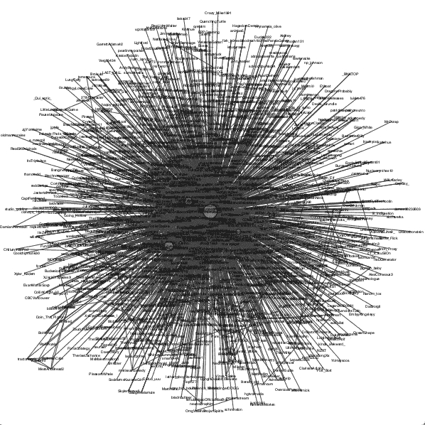

# Python:用图形和机器学习检测 Twitter 机器人

> 原文：<https://towardsdatascience.com/python-detecting-twitter-bots-with-graphs-and-machine-learning-41269205ab07?source=collection_archive---------12----------------------->

## 具有 Graph2Vec、XGBoost 等特性！


艾莉娜·格鲁布尼亚克在 [Unsplash](https://unsplash.com?utm_source=medium&utm_medium=referral) 上的照片

在最近的封锁期间，Twitter 用户活动的[上升](https://www.engadget.com/twitter-q1-2020-112603005.html)，这似乎是一个开始寻找隔离项目以提高我的机器学习能力的好地方。具体来说，随着错误信息和令人困惑的阴谋控制了美国的网民，试图找出识别坏人的新方法似乎越来越成为一项相关的任务。

在这篇文章中，我将借助一些有用的 Python 网络图形和机器学习包，展示如何构建一个模型来预测 Twitter 用户是人类还是机器人，只使用每个用户的最小可行图形表示。

# 概述

> *1。初步研究*
> 
> *2。数据收集*
> 
> *3。数据转换*
> 
> *4。训练分类模型*
> 
> *5。收尾思路/改进空间*

## 技术札记

所有编程、数据收集等。是在一个笔记本上完成的。
使用的库:

```
tweepy
pandas
igraph
networkx
numpy
json
csv
ast
itemgetter (from operator)
re
Graph2Vec (from karateclub)
xgboost
```

最后，四个资源是这项任务的关键，我将在本文后面讨论:

*   印第安纳大学网络科学研究所的 [Bot 资源库](https://botometer.iuni.iu.edu/bot-repository/index.html)，
*   [Jacob Moore 关于识别 Twitter 影响者的教程](/python-identifying-twitter-influencers-through-network-analysis-964c9b293e03)，使用特征向量中心性作为衡量标准，
*   [空手道俱乐部](https://github.com/benedekrozemberczki/karateclub)，NetworkX 的延伸，
*   以及 [XGBoost](https://xgboost.readthedocs.io/en/latest/) 梯度提升库。

让我们开始吧！

# 初步研究

虽然将 bot 检测作为一个目标并不是什么新鲜事，但是如果没有前面提到的重要工作，像这样的项目是不可能完成的，我认为问题空间中有几个主题可以进一步探讨。

首先是规模和缩减。我不会在“业余爱好者”以上的任何级别描述我的数据科学专业知识，因此，处理能力和 Twitter API 访问都是我必须记住的因素。我知道我无法通过更大、更成熟的群体来复制模型的准确性，因此我开始研究的事情之一是，在这些限制下，如何实现分类模型的可伸缩性和准确性。

第二是分类中使用的用户数据类型。我发现了几个模型，它们借鉴了用户档案的各种不同元素，从推文的文本内容到用户名的长度或使用的档案图片。然而，我发现只有少数 [尝试](https://www.aclweb.org/anthology/R19-1065.pdf)基于用户社交网络的图表做同样的事情。碰巧的是，这种基于图表的方法也是我收集每个用户的足够数据用于以后分类的最佳方式，而不会违反 Twitter 的 API 限制。

# 数据收集

首先，当使用 Twitter 时，您需要开发人员 API 访问。如果你还没有，你可以在这里申请，Tweepy(我将在这篇文章中使用的 Twitter API 包装器)的文档中有更多关于认证过程的信息。

完成后，您需要用您的凭证创建一个 API 实例，如下所示。

输入您的凭证

为了训练一个模型，我需要一个 Twitter 用户名和现有标签的数据库，以及一种快速收集每个用户相关数据的方法。

我最终选定的数据库是 IUNI 优秀的[机器人知识库](https://botometer.iuni.iu.edu/bot-repository/index.html)，其中包含数千个 TSV 和 JSON 格式的已标记人类和机器人账户。第二部分有点难。起初，我试图生成每个用户的整个时间表的图形表示，但由于 API 的限制，对于一些更多产的用户来说，这可能需要一天多的时间*。小型图表的最佳格式是 [Jacob Moore 的教程](/python-identifying-twitter-influencers-through-network-analysis-964c9b293e03)，使用特征向量中心性识别 Twitter 影响者。*

我不会重复他的脚本如何工作的完整解释，或者什么是特征中心性，因为这两个东西在他的教程中比我能说的更好，但是从一个高层次的角度来看，他的脚本将一个 Twitter 用户(或者一个关键字，但我最终没有使用该功能)作为输入，并输出一个 CSV，其中包含一个用户边缘列表，该列表根据他们对给定用户在 Twitter 上的交互的“影响”进行加权。它还输出一个 iGraph 对象，我们将把它写入一个 GML 文件，我们将用它作为每个用户的唯一表示。

您将需要他的教程中的 TweetGrabber、RetweetParser 和 TweetGraph 类的功能。下一步是用您的 API 键创建一个 TweetGrabber 实例，并对您选择的 Twitter 用户执行搜索。

创建用户与其网络关系的 GML 文件

上述代码的第 27 行和第 28 行为每个顶点创建了一个“size”属性，该属性保存了其特征中心值，这意味着当我们将创建的 iGraph 对象写入 GML 文件时，正如我们在第 31 行中所做的那样，该文件将包含我们需要的关于用户的所有信息，并且可以丢弃之前创建的 CSV。此外，如果您愿意，您可以取消对第 33–38 行的注释来绘制和查看图形，它可能看起来像这样:



我跟踪的抽动流光的图形输出。

为了构建我将在其上训练分类模型的数据库，我将从 Bot 存储库中收集的每个用户名和标签添加到 pandas 数据帧中，并遍历该数据帧，以每个用户名作为输入运行该脚本。这个过程的这一部分是最耗时的，需要几个小时，但在从框架中删除空的或被删除的帐户后，结果是超过 20，000 个带有“基础事实”标签的用户图表用于分类。下一步:格式化这些数据来训练模型。

# 数据变换

但是首先，简单回顾一下什么是模型(如果你熟悉，你可以跳到‘在过程的这个点……’)。

机器学习模型的目标是查看关于*某物*的一系列信息(特征)，然后使用这些信息尝试并预测关于该物的特定陈述(或标签)。

例如，这可能是一个模型，它获取一个人的日常饮食，并试图预测他们牙齿上的菌斑数量，或者这可能是一个模型，它获取一个人经常购物的商店类型，并试图预测他们的头发颜色。像第一种模型，个人信息与被预测的特征更紧密相关(饮食对牙齿健康的影响可能比购物习惯对头发颜色的影响更大)，通常会更成功。

创建这样一个模型并“教会”它更准确地做出这些预测的方法是，将它暴露给大量的*事物*，这些事物已经有了它们的特征和标签。通过“研究”这些提供的例子，模型理想地“学习”什么特征与一个标签或另一个标签最相关。
例如，如果你的模型正在“研究”的数据库包含一群具有“早餐吃棉花糖”特征的人的信息，而这些人中的大多数碰巧都有较高的牙菌斑量，那么你的模型很可能能够预测，如果一个没有标签的人也在早餐吃棉花糖，他们的牙齿就不会看起来这么热。

为了更好更全面的解释，我推荐[这个视频](https://www.youtube.com/watch?v=VwVg9jCtqaU)。

在这个过程中的这一点上，我们有一个关于 *somethings* (Twitter 用户)的数据库，每个用户都有信息(他们的图表)和一个是/否声明(他们是否是机器人)。然而，这将我们带到下一步，这是创建模型的关键步骤-如何将这些图表转换为输入要素。为模型提供太多不相关的信息会使它花更长的时间从输入中“学习”,或者更糟，使它的预测不太准确。

在不丢失任何重要信息的情况下，在我们的模型中表示每个用户图表的最有效方式是什么？

这就是空手道俱乐部的由来。具体来说， [Graph2Vec](https://karateclub.readthedocs.io/en/latest/modules/root.html#karateclub.graph_embedding.graph2vec.Graph2Vec) ，这是一个完整的图形“嵌入”库，它采用任意大小的图形，比如上图中的图形，并将其嵌入为一个低维向量。关于图形嵌入的更多信息(特别包括 Graph2Vec)，我推荐[这篇文章](/overview-of-deep-learning-on-graph-embeddings-4305c10ad4a4)，以及[这篇白皮书](https://arxiv.org/pdf/1707.05005.pdf)。
长话短说，Graph2Vec 将图形转换成更密集的表示，保留结构和信息等属性，这正是我们想要的输入特征。

为此，我们需要将图形转换成与 Graph2Vec 兼容的格式。对我来说，这个过程是这样的:

创建用户图形的矢量嵌入

最终结果将如下所示:

```
[[-0.04542452  0.228086    0.13908194 -0.05709897  0.05758724  0.4356743
   0.16271514  0.09336048  0.05702725 -0.2599525  -0.44161066  0.34562927
   0.3947958   0.30249864 -0.23051494  0.31273103 -0.26534733 -0.10631609
  -0.44468483 -0.17555945  0.07549448  0.38697574  0.2060106   0.08094891
  -0.30476692  0.08177203  0.35429433  0.2300599  -0.26465878  0.07840226
   0.14166194  0.0674125   0.0869598   0.16948421  0.1830279  -0.17096592
  -0.17521448  0.18930815  0.35843915 -0.19418521  0.10822983 -0.25496888
  -0.1363765  -0.2970226   0.33938506  0.09292185  0.02078495  0.27141875
  -0.43539774  0.23756032 -0.11258412  0.01081391  0.44175783 -0.19365656
  -0.04390689  0.09775431  0.03468767  0.06897729  0.2971188  -0.35383108
   0.2914173   0.45880902  0.22477058  0.12225034]]
```

对人类的眼睛来说并不漂亮，但是结合我们的标签，正是我们创建分类模型所需要的。我对每个被标记的用户重复这个过程，并将结果存储在另一个 pandas 数据帧中，因此现在我有一个大约 20，000 行和 65 列的数据帧，其中 64 列是描述用户图形的向量，第 65 列是用户是机器人还是人类的“基本事实”标签。现在，到了最后一步。

# 训练分类模型

因为我们的目标是分类(预测每个“东西”是否应该被放在两个类别中的一个，在本例中是机器人或人)，所以我选择使用 [XGBoost](https://xgboost.readthedocs.io/en/latest/) 的 XGBClassifier 模型。XGBoost 使用梯度推进来优化回归和分类问题的预测，以我的经验来看，这比其他大多数选项的预测更准确。

从这里开始，有两种不同的选择:

如果您的目标是训练您自己的模型来进行预测和修改，并且您有一个用户图形向量和标签的数据库来完成此任务，则您需要使分类模型适合您的数据库。这是我的过程:

训练你自己的分类模型

如果你的目标只是试图预测你已经绘制和矢量化的单个用户的人性或机器人性，那也没问题。我已经包含了一个 JSON 文件，您可以从我的 GitHub 中加载我的模型，它链接到我的个人资料中。这个过程大概是这样的:

加载我的分类模型

就是这样！您应该会看到您开始使用的帐户的预测标签。

# 关闭思路/改进空间

我的模型有很多可以改进的地方，我希望有一天能再去看看。

首先也是最重要的是准确性。虽然 IUNI 根据他们的 Bot 存储库构建的 [Botometer 分类模型](https://botometer.iuni.iu.edu/#!/)在测试数据集上显示了近 100%的分类准确性，但我的模型显示了 79%的准确性。这是有意义的，因为我使用较少的特征来预测每个用户的标签，但我相信在我的极简方法和 IUNI 的方法之间有一个中间地带，我会有兴趣尝试结合基于图形、基于文本和基于简档的分类方法。

另一个与准确性相关的因素是图表本身的结构。Igraph 能够计算图中每个节点的特征向量中心性，但也包括许多其他基于节点的测量，如接近度、介数或多个测量的优化组合。

最后，有两件事使得测试和改进这个模型的准确性变得困难。首先，由于我对向量嵌入的理解有限，我很难识别哪些特征会导致准确或不准确的标记。第二个问题是，测试数据集的结果对 Twitter 今天的生态系统有多准确。随着机器人被检测到，这个领域也在发展，检测方法也必须发展。为此，我在整个隔离期间从 Twitter 上浏览了一些趋势话题，供用户应用这个模型，但我认为这必须等到以后的帖子。

感谢您的阅读！如果你有任何问题或反馈，请在评论中告诉我。