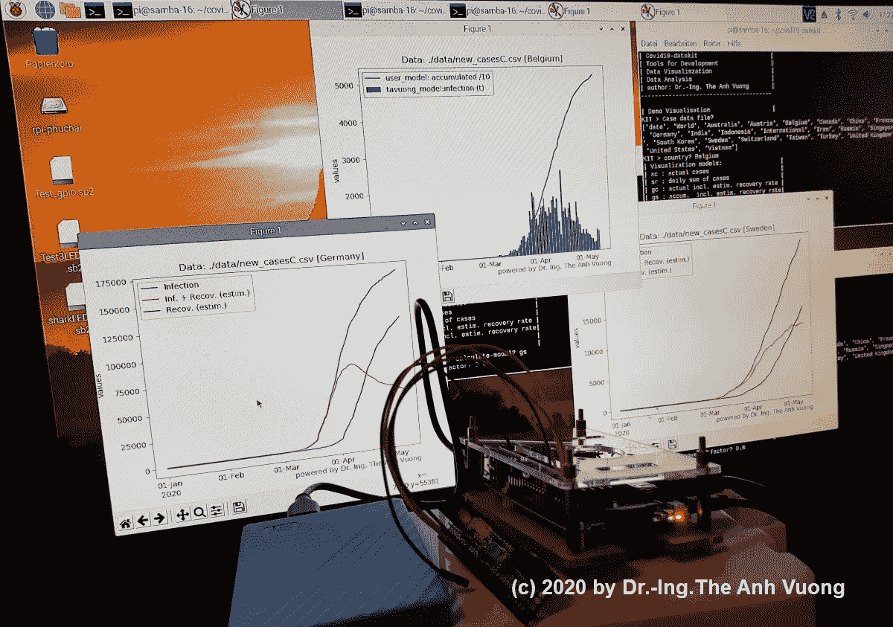
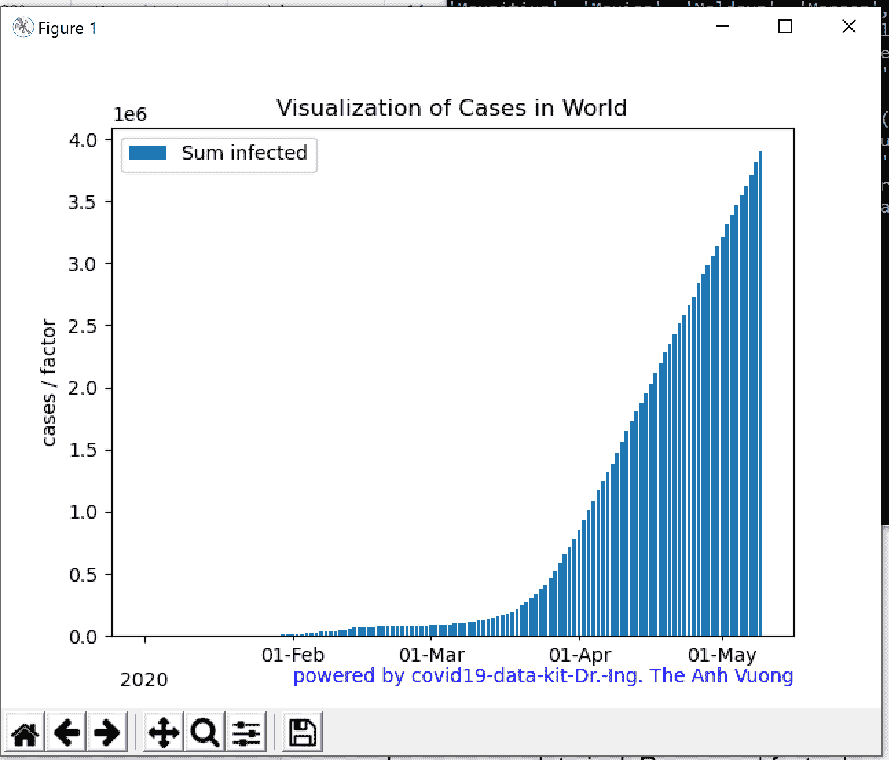
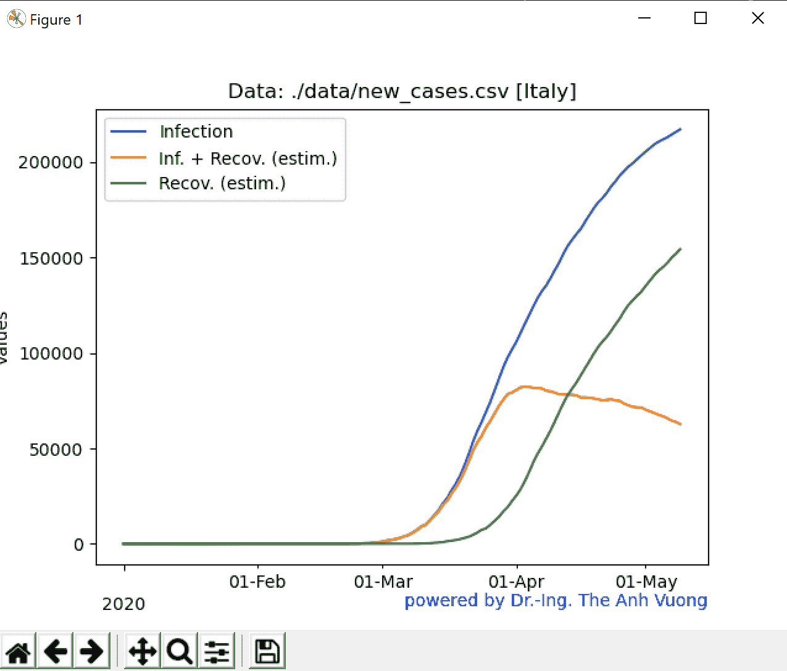
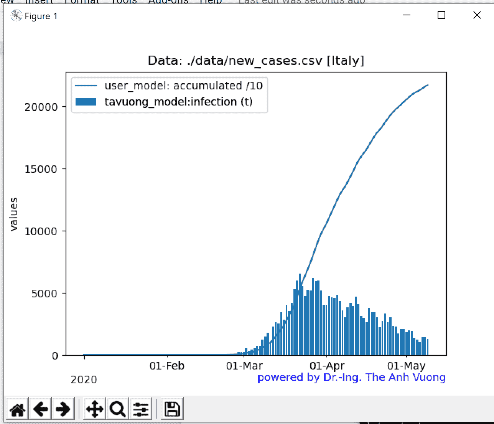

# 用于可视化和建模 covid 19-数据的 Python 开发工具包

> 原文：<https://towardsdatascience.com/python-development-kit-for-visualizing-and-modelling-of-covid19-data-b33e7a13aace?source=collection_archive---------67----------------------->

## 数据可视化—开发套件—覆盆子— Python

## 用您自己的方法创建您的新冠肺炎数据分析

## 介绍

新冠肺炎冠状病毒疫情正在影响 213 个国家，并造成严重破坏。人们因被感染而死亡；世界经济缩减了；失业以每周数百万的速度增长，许多人正在制造混乱，开始反抗。因此，对 Covid19 数据的分析和模拟对于对抗新型冠状病毒病毒是重要的。这不仅对病毒学家、医生很重要，对其他学科的其他专家也很重要，对我们所有人也很重要。

人们可以使用计算软件，如[微软 Excel](https://www.microsoft.com/en-us/microsoft-365/excel) (桌面)、 [LibreOffice](https://www.libreoffice.org/download/download/) (桌面，免费)、[谷歌工作表](https://www.google.com/sheets/about/)(在线)来处理数据，但最好使用编程来进行复杂方法的计算。因此我开发了一个开源包[***TAV uong/covid 19-dataki***t](https://github.com/tavuong/covid19-datakit)，它是 MIT 授权的，用 Python 编写。您可以使用该套件根据套件库中已实现的模型来可视化、分析或模拟数据。您也可以将自己的模型实现到工具包中。

那么就让我们来看看怎么用吧！

# covid 19-数据套件

## 数据下载和处理

Covid19-Datakit 将处理冠状病毒疫情的数据，这些 csv 文件可以从[冠状病毒源数据](https://ourworldindata.org/coronavirus-source-data)、 [openZH/covid_19](https://github.com/openZH/covid_19) 或从互联网下载，例如 [JainXu- list](/a-short-review-of-covid-19-data-sources-ba7f7aa1c342) 。

Covid19-datakit 可以处理具有以下结构和格式的 csv 文件数据:

*   第一名。列是数据-时间，该列中的数据将绘制在 x 轴上。第一列中的日期时间必须采用 yyyy-mm-dd 格式，例如 2020–01–01。
*   2nd- nte 列是时间序列数据，绘制在 y 轴上。

如果您的 csv 文件不符合这些要求，您应该使用计算软件，如 MicroSoft Excel、LibreOffice Calc 或 Google sheet，来更改格式或结构。

## 套件—描述

麻省理工学院许可的开源软件 [tavuong/covid19-datakit](https://github.com/tavuong/covid19-datakit) 包含以下部分:

*   **covid19-datakit.py** 是一个仪表板，有一个用户界面，通过对话框获取数据 csv 文件的位置和模型参数值。它管理工作流程:读取数据，使用模型模块计算数据，并在计算机屏幕上显示结果或将结果打印为图像(png 文件)。仪表盘有一个**“我”模式**，用户可以将仪表盘切换到与自己的车型一起工作。还有内置的命令行，因此您可以编写 shell 脚本来可视化许多功能的数据，例如许多国家的新案例。
*   **默认套件库**是[**TAV uong _ visual . py**](https://github.com/tavuong/covid19-datakit/blob/master/lib/tavuong_visual.py)中的可视化模块，开发模型处理[**TAV uong _ model . py**](https://github.com/tavuong/covid19-datakit/blob/master/lib/tavuong_model.py)中的 covid19- data。您可以使用这些模块来立即可视化您的数据，例如，每日新增病例的总和或根据恢复率估计的每日感染人数的总和(我的开发模型)。
*   **用户库:**是您开发自己的模型和自己的所有者演示文稿的模块。您可以使用[**user _ model . py**](https://github.com/tavuong/covid19-datakit/blob/master/lib/user_model.py)**和[**user _ visual . py**](https://github.com/tavuong/covid19-datakit/blob/master/lib/tavuong_visual.py)中的模板来开发集成在仪表板中的“me-mode”，这样您就可以获得数据和参数，而不必编写新的对话框和管理工作流。测试一下，你会喜欢的。**

## **哪个计算机系统可以使用该工具包？**

**要运行这个工具包，你需要一个 Python 解释器，你可以从 Python.org 下载 Python 用于 [Windows](https://www.python.org/downloads/windows/) 、 [Linux/UNIX](https://www.python.org/downloads/source/) 、 [Mac OS X](https://www.python.org/downloads/mac-osx/) 、[其他](https://www.python.org/download/other/)。该套件由 Windows 10 (PC)、由“Raspbian Buster with desktop and recommended software”([Raspberry Pi](https://www.raspberrypi.org/downloads/raspbian/))和由 Termux(UNIX for[table t](https://play.google.com/store/apps/details?id=com.termux))进行测试**

# **安装**

**在命令提示符(Windows X)或 LX 终端(Raspberry PI)中给出以下命令**

> **$ github 克隆[https://github.com/tavuong/covid19-datakit.git](https://github.com/tavuong/covid19-datakit.git)**
> 
> **$ pip 安装费用**
> 
> **$ pip 安装 Matplotlib**
> 
> **$ cd ~\covid19-datakit\**
> 
> **$ python。\ covid 19-data kit . py[通过 PC]**
> 
> **$ python3。\ covid 19-data kit . py[by Raspberry PI]**

**它将要求:数据 csv 文件的数据读取位置，你想可视化其数据的国家，可视化或模拟的模型和我的模型' gc '或' gs '的恢复率，模拟感染与估计恢复率的情况。**

## **将对话框用于套件的示例**

**对于这个例子，我们在。\ covid 19-数据工具包\数据\**

> **$ CD ~ \ covid 19-数据套件\**
> 
> **$ python。\ covid 19-data kit . py[通过 PC]**
> 
> **试剂盒>病例数据文件？。\data\new_cases.csv
> (请求 csv 文件的位置)**

**csv 文件中的国家列表将被读取并显示:**

> **套件>国家？世界
> (您想要处理的国家数据请求)**

**将显示可视化模式列表:**

> *****ac*** *:实际案例:每日新增案例曲线***
> 
> *****sr*** *:每日病例总数***
> 
> *****gc*** *:实际案例，包括预计回收率:这是模拟***
> 
> *****gs*** *:每日案例总数，包含预计回收率:这是模拟***
> 
> *****我*** *:我的型号:切换到自己的型号***
> 
> *****t2 :*** *测试图***

> **KIT >您的计算模型是什么？sr
> (要求您选择模式)**

**然后它将绘制:**

****

# **命令行**

**命令行刚刚实现。它有以下选项:**

> **$ python。\covid19-datakit.py -h**
> 
> **covid19-datakit
> -i <输入文件> -o <输出文件>
> -c 国家
> -m 模式
> -g 恢复**

## **示例呼叫 gs 模式**

> **$ python。\ covid 19-data kit . py-I。\ data \ new _ cases . CSV-c Italy-o test.png-m GS-g 0.8**

****

# **切换到用户模式:我的模式**

**您可以使用模板模块开发自己的所有者模型，该模型通过仪表板集成为“我”模式(covid19-datakit.py)。**

**通过从仪表板请求(covid19-datakit.py)中选择“我”,套件将调用我模式的可视模块:**

> ****my_collection_1(x，y，y1，y2，namecountry，gesund)。****
> 
> ****名称国家**:国家参数**
> 
> ****gesund** :回收率**
> 
> ****x [ ]** :从 csv 文件输入*时间数据***
> 
> ****y [ ]** :输入，*CSV 文件中所选国家的 covid 数据，范围同 x [ ]***
> 
> ****Y1 [ ]** : *读取生成的缓冲字段，范围与 x [ ]* 相同**
> 
> ****y2 [ ]** : *读取生成的缓冲区，范围与 x [ ]* 相同**

**现在，您已经完成了用于可视化和/或建模的数据**

**根据 my_collection_1(…)中的 y[ ]，您可以通过调用模块来计算另一个 y2 [ ]:**

> ****my_model_1(y2，y，factor，Tau，gesund)****
> 
> **Tau:孵化时间，尚未实现从仪表板读取**
> 
> **因子:R 因子，尚未实现从仪表板读取**
> 
> **gesund:来自控制板请求的回收率**
> 
> **y [ ]:输入 csv 文件中所选国家的 covid 数据**
> 
> **y2 [ ]:输出，与 y [ ]范围相同**

****Me 模式示例****

**要研究 user-visual.py 和 user_model.py 中两个模板模块的代码，先从这个例子开始理解它是如何工作的。**

> **$ python。\ covid 19-data kit . py-I。\ data \ new _ cases . CSV-c Italy-o test.png-m me-g 0.8**

****

# **摘要**

**软件包 covid19-datakit 专注于处理 covid19 数据。它很容易使用对话框或命令行。您可以将自己的模型集成到仪表板中。**

**covid19 数据的可视化和建模一直在不断发展，将来还会更新。如果您已经开发了一个新的有趣的模型-模块或演示-模块，请不要犹豫与我联系进行咨询开发，并可能将您的模块贡献给开源和麻省理工学院许可的项目[***TAV uong/covid 19-data kit***](https://github.com/tavuong/covid19-datakit)over[github](https://github.com/)。**

**玩得开心！**

**鸣谢:简范博士教授**