# Python 环境 101

> 原文：<https://towardsdatascience.com/python-environment-101-1d68bda3094d?source=collection_archive---------0----------------------->

## pyenv 和 pipenv 有何不同，何时应该使用它们


作者图片

```
**Table of Contents**
🐍 [Introduction](#9ea4)
🐍 [TL;DR](#39b6)
🐍 [pyenv](#f3ad)
🐍 [pipenv](#c002)
🐍 [Conclusion](#e4c6)
```

[更新:2021 年 8 月 15 日 pyenv 安装]

# 简介:pyenv vs pipenv vs virtualenv

我当时用的是 Python 3.7.7 + virtualenv，有一天安装了 3.8.2。这给 Jupyter 笔记本带来了麻烦。它不工作，我得到了各种错误信息。

我想我应该整理一下 Python 环境。我需要知道 pyenv、pipenv 和 virtualenv 是做什么的。所以这是我所学到的文章。

[Python 在 2019 年发布了](https://www.python.org/downloads/) 13 个版本，在 2018 年发布了 12 个版本。大多数编程语言都有一些版本管理。

Node 有[nvm](https://github.com/nvm-sh/nvm)Ruby 有 [RVM](https://rvm.io/) 等。 [pyenv](https://github.com/pyenv/pyenv) 是 Python 版本管理。

它安装/卸载不同的 Python 版本，设置全局和本地(目录)Python 版本。

pyenv-virtualenv 是一个 pyenv 插件，用于管理类 UNIX 系统上的 Python 虚拟环境。

依赖项管理是管理项目中所有相关库和包的过程，以确保项目成功运行。

[pipenv](https://github.com/pypa/pipenv) 是 Python 应用的打包工具，管理包依赖关系及其子依赖关系。

`pipenv`通过在开发环境中使用 Pipfile，在生产环境中使用 aPipfile.lock，简化了开发过程。pipenv 还管理虚拟环境。

[virtualenv](https://github.com/pypa/virtualenv) 是一个创建隔离 Python 环境的工具。如果您在 python 3.8 下安装 virtualenv，virtualenv 将默认创建也是 3.8 版本的虚拟环境。

这意味着如果您升级您的系统 python，您的虚拟环境可能会中断。我升级到 Python3.7.7 的时候也遇到过。

您可以在您的 Python 项目中使用 pyenv 和 pipenv，在本文中，您将了解到从它们的安装到使用的所有内容。正如我之前提到的，pyenv 有自己的 virtualenv，pyenv-virtualenv。

当您单独使用 virtualenv 时，它使用系统 Python 版本。virtualenvwrapper 为 virtualenv 提供了一套有用的脚本。

在本文中，我将重点关注 pyenv 和 pipenv，因为当您更新系统 Python 版本时， [virtualenv](https://github.com/pypa/virtualenv) 会出现问题。

> pyenv 是 Python 版本管理+虚拟环境工具，pipenv 是 Python 包管理和虚拟环境工具。

# TL；速度三角形定位法(dead reckoning)

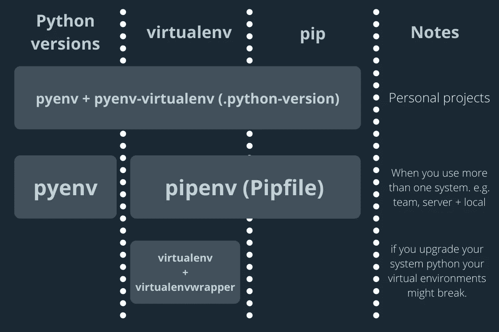

pyenv、pipenv 和 virtualenv 图。作者图片

pipenv 创建独立的 pip 环境，而 pyenv+virtualenv 创建多个项目可以使用的 virtualenv。

# pyenv

如果您正在处理您的个人项目或者使用一个以上的系统，比如团队或服务器和本地，那么您应该使用 pyenv。

## 安装 pyenv

可以将 pyenv 安装到 macOS 和[其他 Linux OS](https://github.com/pyenv/pyenv#installation) 。(如果您有任何安装问题，请参见 [Github pyenv 安装](https://github.com/pyenv/pyenv#installation)页面。)

```
# for macOS
$ brew install pyenv
```

将以下内容添加到 bash_profile/zshrc 将定义环境变量`PYENV_ROOT`。

对于 zsh，在您的终端中运行以下命令。

```
$ echo 'eval "$(pyenv init --path)"' >> ~/.zprofile
```

(这部分可能已经不相关了，我留下来做参考。)

pyenv 的工作原理是在你的路径前面插入一个由[垫片](https://github.com/pyenv/pyenv#understanding-shims)组成的目录。一个 **shim** 是一个小的库，它拦截并改变对另一个库的调用。添加以下内容可以启用填充和自动完成。

```
$ echo -e 'if command -v pyenv 1>/dev/null 2>&1; then\n  eval "$(pyenv init -)"\nfi' >> ~/.zshrc
```

## 安装 python 版本

列出可用的 Python 版本

```
$ pyenv install -l
Available versions:
  2.1.3
  2.2.3
  ...
```

安装新的 Python 版本

```
$ pyenv install 3.7.7
$ pyenv install 3.8.2
```

## 显示系统中的所有 Python 版本

```
$ pyenv versions
3.7.7
3.8.2
```

## 设置全局 Python 版本

```
$ pyenv global 3.7.7
```

## 验证活动 Python 版本

```
$ pyenv version
3.7.7 (set by /Users/shinokada/.pyenv/version)
```


pyenv 快速参考。作者图片

## pyenv 本地

`pyenv local`在目录中创建或修改`.python-verion`。例如，`pyenv local 3.7.7`用`Python 3.7.7.` `pyenv local 3.8.2`创建`.python-verion`并将`.python-verion`修改为`Python 3.8.2`

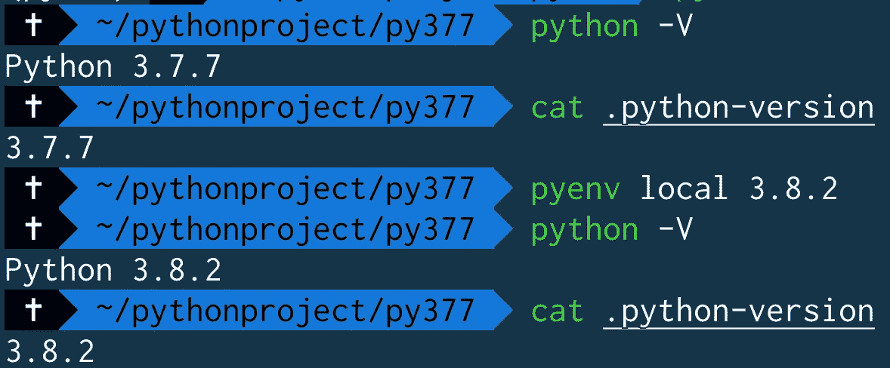

。python 版本文件

# 如何创建虚拟环境

如果您正在处理您的个人项目，并且没有安装 pipenv，我建议您安装 **pyenv-virtualenv** 。

如果您在一个团队中工作，或者使用不止一个系统，我建议您安装 pipenv，我将在下面介绍它。

`pyenv-virtualenv`是一个 pyenv 插件，它提供了在类 UNIX 系统上管理 Python 的 virtualenvs 和 Conda 环境的特性。

下面是如何安装 [pyenv-virtualenv](https://github.com/pyenv/pyenv-virtualenv#installation) 的说明。

```
# For Homebrew users
$ brew install pyenv-virtualenv
```

然后，您需要将以下内容添加到您的。bash_profile 或. zshrc。

```
# pyenv-virtualenv
eval "$(pyenv init -)"
eval "$(pyenv virtualenv-init -)"
```

您可以通过用 virtualenv 目录的名称指定 Python 版本来创建 virtualenv。

```
# Create a virtualenv called py377 using Python 3.7.7
$ pyenv virtualenv 3.7.7 py377
# Create a virtualenv called py382 using Python 3.8.2
$ pyenv virtualenv 3.8.2 py382
# Create a virtualenv called jupy based on the global Python version
$ pyenv virtualenv jupy
```

> 我经常使用这个命令来创建一个 virtualenv。
> $ pyenv virtualenv 3.8.6 py386

## 本地虚拟

一旦创建了不同的 virtualenv，就可以为一个目录设置一个本地 virtual env。这里我用的是 [Oh-My-Zsh 内置命令](/the-ultimate-guide-to-your-terminal-makeover-e11f9b87ac99) `[take](/the-ultimate-guide-to-your-terminal-makeover-e11f9b87ac99)`。

```
$ take py377
# Set a local(direcotry) python environment to 377
$ pyenv local py377
(py377)$ cat .python-version
py377
```

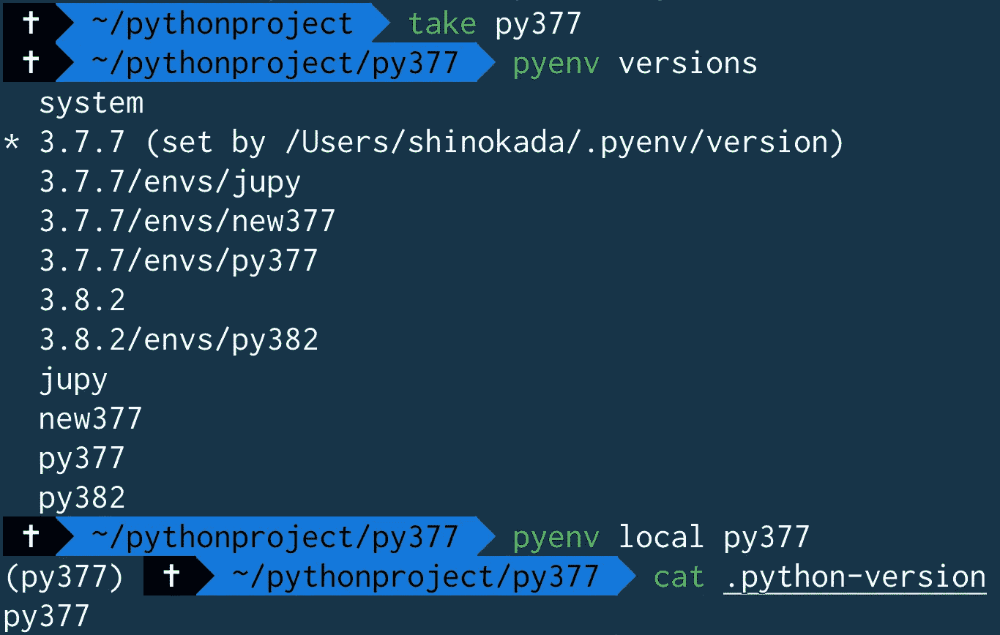

设置本地虚拟环境

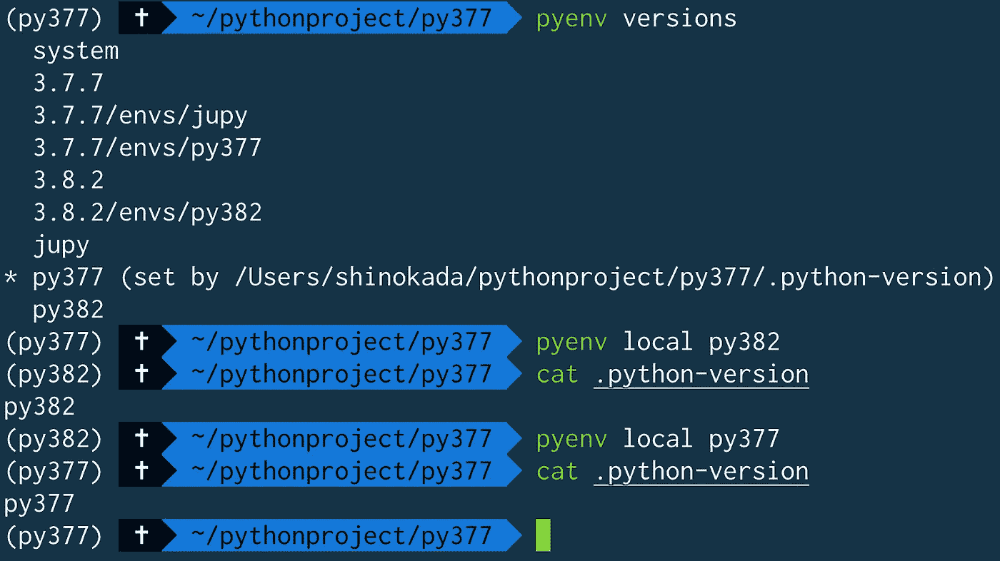

设置本地虚拟环境

## 每个 virtualenv 都有不同的 pip 存储

下图中，我在 virtualenv py377 下升级了 pip。在将本地改为 3.7.7 并检查 pip 列表后，它显示了不同的 python 包。

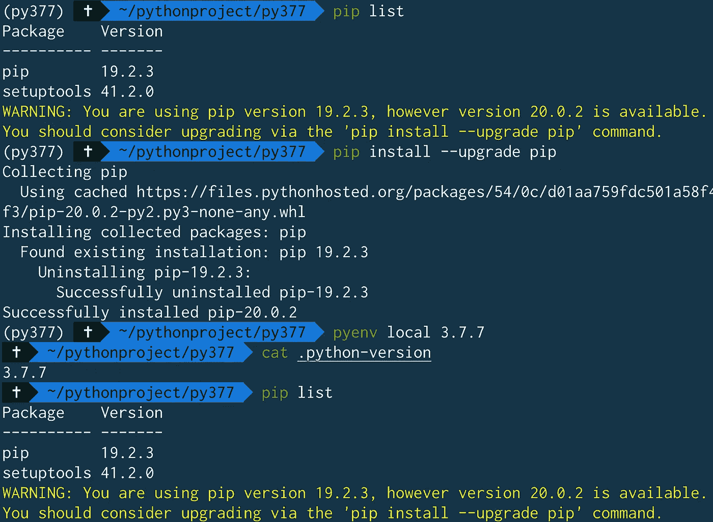

每个 pyenv virtualenv 都有不同的 pip

## 如何删除本地虚拟机:

通过移除`.python-version`你可以移除一个本地虚拟。

```
# remvoing .python-version will set the directory to the global Python version
$ rm .python-version
```

## 删除虚拟设备

```
$ pyenv uninstall my-virtual-env
# or
$ pyenv virtualenv-delete my-virtual-env
```

# pyenv activate 是做什么的？

您可以激活虚拟设备:

```
# Activate py382
$ ~/pythonproject: pyenv activate py382
# cd to py377 which has local virtualenv py377\. 
# Activated version py382 overrides the local
(py382) $ ~/pythonproject:  cd py377
# confirming the local virtualenv is py377
(py382) $ ~/pythonproject/py377:  cat .python-version
py377
# Deactivate py382
(py382) $ ~/pythonproject/py377: pyenv deactivate
# Now the local virtualenv py377 is used
(py377) $ ~/pythonproject/py377:
```

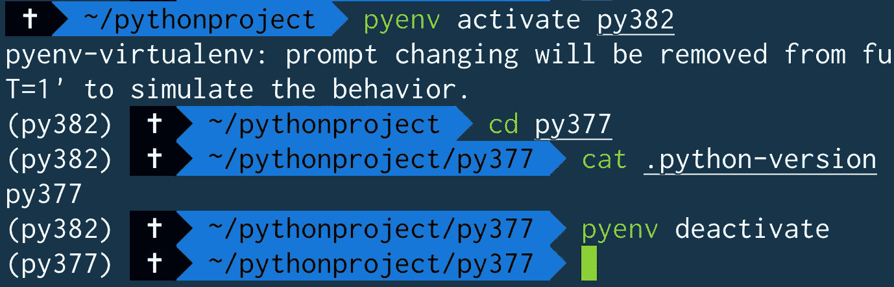

> 当你`activate a virtulaenv`时，virtualenv 会覆盖本地 virtualenv。

# pipenv

如果您的项目依赖于 Python 包版本及其依赖项，那么 pipenv 适合您。

pipenv 创建了一个 Pipfile.lock，您可以在移动到不同的系统时使用它。

Pipfile.lock 包含所有的依赖项及其版本。

当您使用 Pipfile.lock 安装 Python 包时，它将创建与您的原始系统完全相同的环境。

> 当一个 repo 有一个 Pipfile.lock 时，可以用`pipenv install`安装所有的包和依赖项。

让我们用自制软件安装 pipenv。你可以在这里找到其他操作系统[的安装。](https://github.com/pypa/pipenv#installation)

```
# macOS
brew install pipenv
```

使用 Python 3.7 创建新项目:

```
$ pipenv --python 3.7 install
```

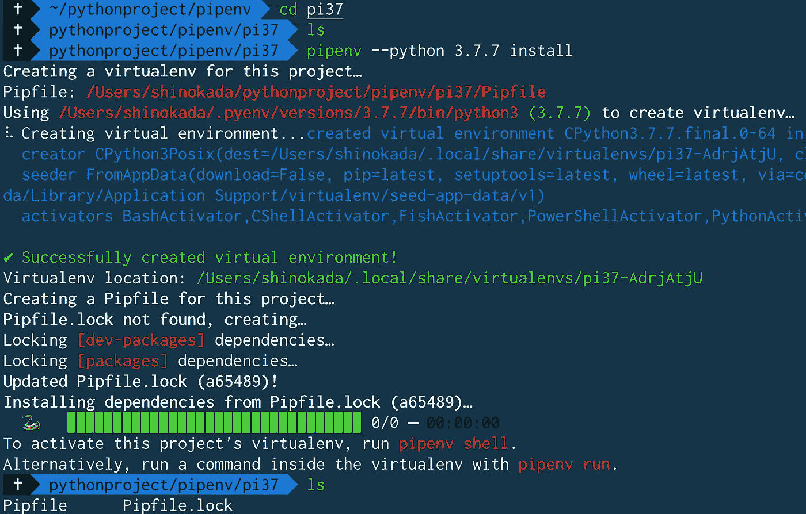

pipenv-python 3 . 7 . 7 安装创建 Pipfile 和 Pipfile.lock

在上图中，我用`pipenv --python 3.7.7`创建了一个新的虚拟人。它显示虚拟位置:

```
Virtualenv location: /Users/shinokada/.local/share/virtualenvs/pi37-AdrjAtjU
```

它创建了 Pipfile 和 Pipfile.lock。pipenv 使用这些 Pipfile 和 Pipfile . lock 来控制 Python 版本和包版本。

pip 文件内容:

```
cat Pipfile
[[source]]
name = "pypi"
url = "https://pypi.org/simple"
verify_ssl = true[dev-packages][packages][requires]
python_version = "3.7"
```

[source]告诉您的包来源。[包裹]是您的包裹信息。[dev-packages]适合您的开发需求。[requires]是所需的 Python 版本。

Pipfile.lock 内容:

```
cat Pipfile.lock
{
    "_meta": {
        "hash": {
            "sha256": "7e7ef69da7248742e869378f84218111f8f0017fddf94d086813baa518a65489"
        },
        "pipfile-spec": 6,
        "requires": {
            "python_version": "3.7"
        },
        "sources": [
            {
                "name": "pypi",
                "url": "https://pypi.org/simple",
                "verify_ssl": true
            }
        ]
    },
    "default": {},
    "develop": {}
}
```

一旦你安装了一个包，你可以在 Pipfile.lock 中的`default`下找到这个包和散列。

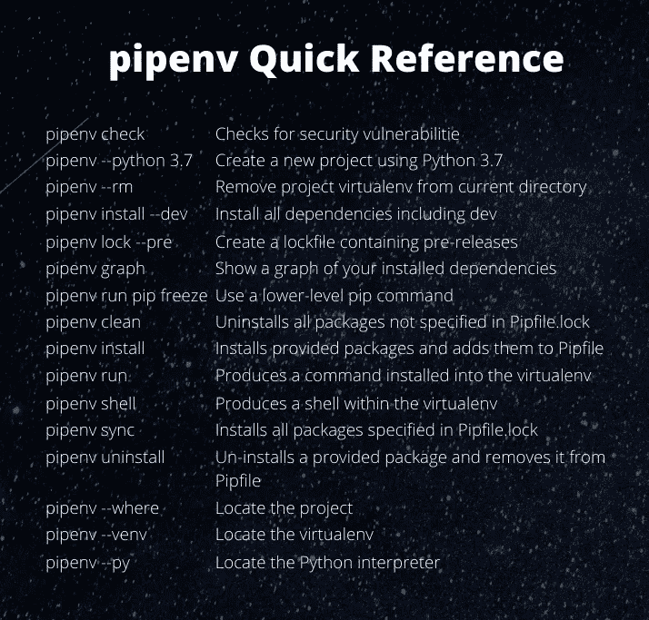

作者快速参考

## pipenv 与 pyenv 一起工作

如果您的系统没有特定的 Python 版本，它会询问您是否要安装 Python 版本。

```
$ pipenv --python 3.6
Warning: Python 3.6 was not found on your system…
Would you like us to install CPython 3.6.10 with pyenv? [Y/n]: Y
Installing CPython 3.6.10 with pyenv (this may take a few minutes)…
⠼ Installing python...
$ ls 
Pipfile
```

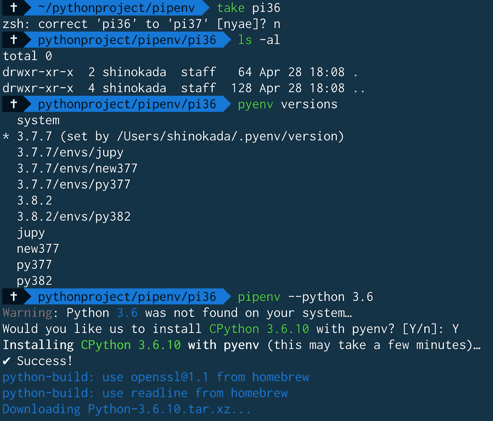

pipenv 与 pyenv 一起工作

这将在目录中创建一个 Pipfile。

```
cat Pipfile
[[source]]
name = "pypi"
url = "https://pypi.org/simple"
verify_ssl = true[dev-packages][packages][requires]
python_version = "3.6"
```

## 安装软件包

我们用`pipenv`代替`pip`来安装包。

```
$ pipenv install numpy
$ cat Pipfile
...
[packages]
numpy = "*"
...
```

这就创建了 Pipfile.lock 并将`numpy ="*"`添加到 Pipfile 中。您可以使用 Pipfile.lock 在不同的系统中创建相同的环境。

安装项目的所有依赖项(包括开发):

```
$ pipenv install --dev
```

创建包含预发行版的锁定文件:

```
$ pipenv lock --pre
```

显示已安装依赖项的图表:

```
$ pipenv graph
numpy==1.18.4
```

检查您安装的依赖项是否存在安全漏洞:

```
$ pipenv check
Checking PEP 508 requirements…
Passed!
Checking installed package safety…
An error occurred:
Your API Key '1ab8d58f-5122e025-83674263-bc1e79e0' is invalid. See [https://goo.gl/O7Y1rS](https://goo.gl/O7Y1rS)
```

它返回一个错误，我希望未来的版本可以修复它。

将本地 setup.py 安装到您的虚拟环境/Pipfile 中:

```
$ pipenv install -e .
```

使用低级 pip 命令:

```
$ pipenv run pip freeze
```

## 管道外壳和出口

您可以通过运行`pipenv shell`激活项目的 virtualenv，通过运行`exit`停用它。

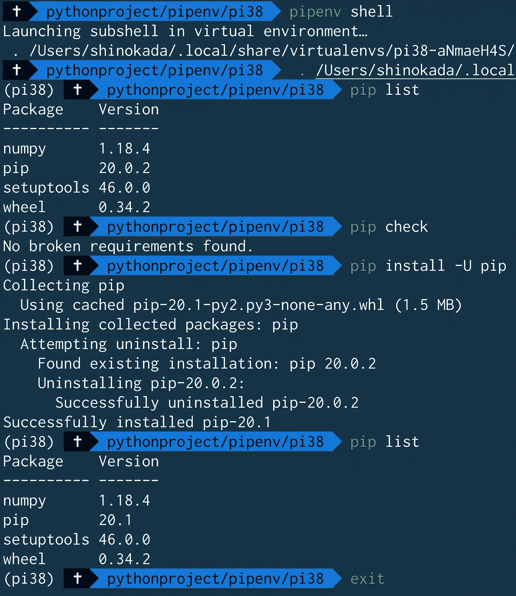

升级软件包的 pipenv shell

如上图所示，可以使用`pipenv shell`并使用`list`和`-U`等 pip 命令来升级包。

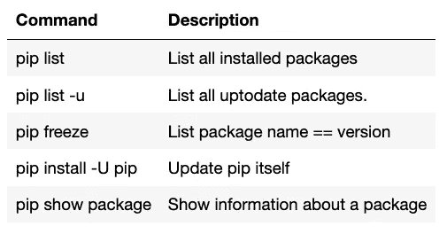

作者的一些 pip 命令

## 拆卸管道虚拟管道

```
$ pipenv --rm
Removing virtualenv (/Users/shinokada/.local/share/virtualenvs/pi37-AdrjAtjU)…
```

所以你所有的 pipenvs 都存储在`~/.local/share/virutlaenvs`目录下。

```
ls ~/.local/share/virtualenvs
pi36-JaecZ40h pi37-AdrjAtjU
```

如果您愿意，可以从该目录中删除 pipenv。

## pipenv 和 pyenv 虚拟冲突

如果你试图在 pyenv 下使用 pipenv，就会发生这种情况。它将显示一个礼貌通知。

```
$ mkdir demo
$ cd demo
# Python version
$ python --version
Python 3.7.7
# create a virtualenv
$ pyenv virtualenv 3.8.2 demo382
Looking in links: /var/folders/17/2xhf1tw15xzd8sz_0hw3gp2h0000gn/T/tmpcn78j8xb
...
# Set the local virtualenv
$ pyenv local demo382
(demo382) $ python --version
Python 3.8.2# Create pipenv 
$ pipenv --python 3.8
Courtesy Notice: Pipenv found itself running within a virtual environment, so it will automatically use that environment, instead of creating its own for any project. You can set PIPENV_IGNORE_VIRTUALENVS=1 to force pipenv to ignore that environment and create its own instead. You can set PIPENV_VERBOSITY=-1 to suppress this warning.
```

## Pipfile.lock

当您准备将其投入生产时，您需要锁定您的环境，以便您可以确保在生产中使用相同的环境。

```
$ pipenv lock
```

这将创建或更新您的`Pipfile.lock`。

一旦您在生产环境中获得了代码和`Pipfile.lock`，您就可以安装所有的包:

```
$ pipenv install --ignore-pipfile
```

这将忽略`Pipfile`进行安装，并使用`Pipfile.lock`安装所有软件包。Pipenv 将创建与您的开发环境完全相同的环境，包括子依赖项。

# 结论

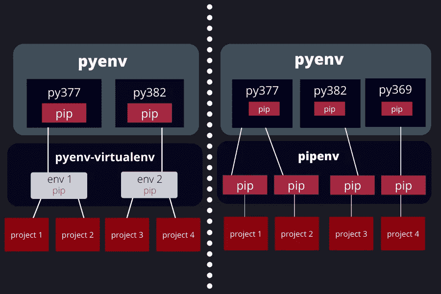

pyenv，pipenv 图。作者图片

上图左侧，pyenv + pyenv-virtualenv 可以容纳不同的项目。

这意味着 pyenv-virtualenv 可以与不同的项目共享包。而在 pyenv+pipenv 上，每个项目都拥有自己的 pip/包，没有共享。

如果你在一个团队中工作，那么你应该一起使用 pyenv+pipenv。

如果您的项目涉及多个系统，比如本地和远程服务器，那么您也应该使用它们。

因此，简而言之，如果您的项目涉及多个系统，您应该使用 pyenv+pipenv。

pyenv 和 pipenv 创建 virtualenvs 的方式不同，但您可以同时使用这两种方式。

还有其他可用的工具，它们有不同的范围和用途，如下图所示。

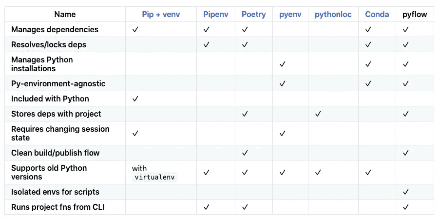

从[https://github.com/David-OConnor/pyflow](https://github.com/David-OConnor/pyflow)

**通过** [**成为**](https://blog.codewithshin.com/membership) **会员，可以完全访问媒体上的每一个故事。**


[请订阅。](https://blog.codewithshin.com/subscribe)

[](/awesome-rust-powered-command-line-utilities-b5359c38692) [## 7 个强大的 Rust 驱动的命令行工具

### 适合每个开发人员的现代 Linux 命令

towardsdatascience.com](/awesome-rust-powered-command-line-utilities-b5359c38692) [](/the-ultimate-guide-to-your-terminal-makeover-e11f9b87ac99) [## 终端改造的终极指南

### 今天你将度过的最好的 11 分钟:程序员的终端提示

towardsdatascience.com](/the-ultimate-guide-to-your-terminal-makeover-e11f9b87ac99) [](/a-step-by-step-guide-to-scheduling-tasks-for-your-data-science-project-d7df4531fc41) [## 为您的数据科学项目安排任务的分步指南

### macOS/Linux 中 cron 和 launchd 的完整指南

towardsdatascience.com](/a-step-by-step-guide-to-scheduling-tasks-for-your-data-science-project-d7df4531fc41) 

# 参考

*   [https://realpython.com/pipenv-guide/](https://realpython.com/pipenv-guide/)