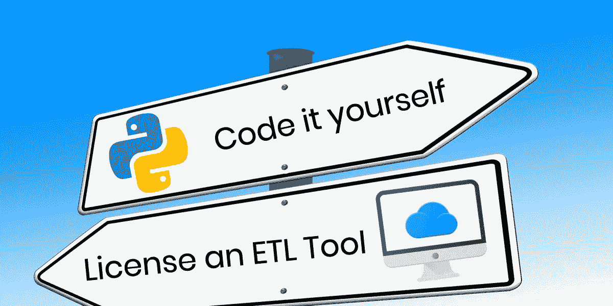

# Python ETL 与 ETL 工具

> 原文：<https://towardsdatascience.com/python-etl-vs-etl-tools-9709171c9e58?source=collection_archive---------8----------------------->

## 你应该自己编码还是授权一个 ETL 工具？

选择你的方向:自己编码你的 ETL 管道或者使用现有的 ETL 工具

如果你正在研究 ETL 解决方案，你将不得不决定是使用现有的 ETL 工具，还是使用其中一个 [Python ETL 库](/python-etl-tools-best-8-options-5ef731e70b49)构建自己的 ETL 工具。在这篇文章中，我们来看看在做决定时需要考虑的一些因素。

ETL(提取转换负载)是为数据仓库创建数据管道的最重要的方面。市场提供了各种现成的 ETL 工具，可以很容易地在数据仓库中实现。然而，最近 Python 也成为创建定制 ETL 管道的一个很好的选择。在本文中，我们将快速比较 Python ETL 和 ETL 工具，以帮助您在项目中选择两者。

# ETL 工具

市场上有许多现成的 ETL 工具可以用来构建容易复杂的数据管道。大多数提供友好的图形用户界面，具有丰富的管道构建功能，支持各种数据库和数据格式，有时甚至包括一些有限的商业智能功能。最棒的是，所有这些都是现成的。

这些工具可以是许可的，也可以是开源的。他们中的大多数都采用订阅模式，从每月几百美元到每月几千美元不等。另一方面，开源工具是免费的，它们也提供了一些许可工具所提供的特性，但是通常需要更多的开发才能达到类似的结果。

市场上一些可用的 ETL 工具如下。

## 信息动力中心

[Informatica](https://www.informatica.com/) 的 ETL 解决方案是目前最常用的数据集成工具，用于连接和检索来自不同数据源的数据。Informatica 在这个行业已经有很长时间了，并且是这个领域的一个成熟的参与者。他们有针对 ETL、数据屏蔽、数据质量、数据复制、数据管理等的数据集成产品。

## 阿洛玛

[Alooma](http://alooma.com/) 是一款授权的 ETL 工具，专注于将数据迁移到云中的数据仓库。Alooma 似乎是许多企业的一个很好的解决方案，它的自动化数据管道以及与 Amazon Redshift、Microsoft Azure 和 Google BigQuery 的简单集成。然而，在 2019 年被谷歌收购后，Alooma 在很大程度上放弃了对非谷歌数据仓库解决方案的支持。这可能会给依赖多个云平台的公司带来问题。

## Xplenty

[Xplenty](https://www.xplenty.com/) 是一个基于云的 ETL 和 ELT(提取、加载、转换)工具。它使用可视化界面来构建数据管道，并连接到 100 多个常见数据源。

## AWS 胶水

[AWS Glue](https://aws.amazon.com/glue/) 是亚马逊基于 AWS 平台的无服务器 ETL 解决方案。如果你已经在 AWS 生态系统中根深蒂固，AWS Glue 可能是一个不错的选择。

# Python ETL

Python 无需介绍。每年 Python 在越来越多的领域变得无处不在，从天体物理学到搜索引擎优化。所以 Python 有 ETL 的解决方案也就不足为奇了。

对于 ETL，Python 提供了一些健壮的开源库。得益于不断增长的 Python 开源社区，这些 ETL 库提供了大量特性来开发健壮的端到端数据管道。

如果您对 Python 了如指掌，您可以创建复杂的 ETL 管道，类似于使用 ETL 工具所能完成的事情。但是要准备好消耗一些开发时间。这些库功能丰富，但不像上面列出的一些 ETL 平台那样现成可用。

一些流行的 python ETL 库有:

*   熊猫
*   路易吉
*   Petl
*   倭黑猩猩
*   气泡

这些库已经在[关于 Python ETL 选项](/python-etl-tools-best-8-options-5ef731e70b49)的其他帖子中进行了比较，所以我们在这里不再重复讨论。相反，我们将关注是使用这些还是使用已建立的 ETL 平台。

# Python ETL 与 ETL 工具

在设计数据仓库策略时，必须仔细选择 ETL 的策略。一旦你选择了一个 ETL 过程，你就被套牢了，因为将它移植到另一个平台需要花费大量的开发时间。对于具有许多模式和复杂体系结构的企业数据仓库来说尤其如此。

因此，让我们比较一下定制 Python ETL 和 ETL 工具的有用性，以帮助做出选择。

# 费用

ETL 工具(尤其是大型企业数据仓库)的许可成本可能很高——但这一费用可能会被您的工程师在其他事情上节省的时间所抵消。较小的公司或创业公司可能不总是能够负担得起 ETL 平台的许可费用。在这种情况下，创建一个定制的 Python ETL 可能是一个不错的选择。但是，同样重要的是，要考虑这样节省的成本是否值得推迟产品上市。初创公司的另一个考虑因素是，像 Avik Cloud 这样定价更灵活的平台可以保持成本与使用成比例——这将使 ETL 需求有限的早期初创公司更加负担得起。

# 数据仓库的规模和复杂性

如果它是一个具有复杂模式的大型数据仓库，从头开始编写一个定制的 Python ETL 过程可能会很有挑战性，尤其是当模式更改更加频繁时。在这种情况下，您应该从各种 ETL 工具中探索适合您的需求和预算的选项。

# 简单和灵活

如果数据仓库很小，您可能不需要企业 ETL 工具的所有特性。编写一个定制的轻量级 Python ETL 过程可能是一个好主意，因为它既简单又能让您更灵活地根据自己的需要进行定制。

# 可量测性

数据库的初始大小可能不大。但是如果您预计在不久的将来会有增长，那么您应该判断您的定制 Python ETL 管道是否也能够随着数据吞吐量的增加而扩展。如果有疑问，您可能希望更仔细地研究一些 ETL 工具，因为它们更容易扩展。

# 用户友好性

正如您可能猜到的那样，要将 Python 用于您的 ETL 过程，需要 Python 方面的专业知识。但是 ETL 工具通常有用户友好的图形用户界面，即使对于非技术人员来说也很容易操作。因此，这是一个根据项目需求做出的选择。

# 增值和支持

ETL 工具，尤其是付费工具，在多种特性和兼容性方面提供了更多的附加值。他们还提供客户支持——这似乎是一个不重要的考虑，直到你需要它。然而，开源工具确实有很好的文档和大量也能提供支持的在线社区。

如果您使用定制的 Python ETL，您将会错过这些东西。将如此多的市场 ETL 工具的特性整合到具有相同健壮性的定制 Python ETL 过程中是一项具有挑战性的工作。

# 令人惊讶的第三个选项:数据虚拟化

另一个越来越受欢迎的选择是完全放弃 ETL，转而支持 [*数据虚拟化*](https://en.wikipedia.org/wiki/Data_virtualization) 。数据虚拟化是一个逻辑数据层，它跨不同的孤岛集成数据。数据虚拟化管理统一数据，并通过集中的安全性和治理将数据交付给用户。

[Denodo](https://www.denodo.com/en/data-virtualization/overview) 提供数据虚拟化作为数据管理/工程选项。

# 结论

谈到 Python ETL 和 ETL 工具，没有明显的赢家，它们都有各自的优点和缺点。最后，这一切都归结为基于我们上面讨论的各种参数做出选择。但是，如果您强烈考虑使用 Python 进行 ETL，至少要看看现有的平台选项。如果你觉得特别大胆，可以考虑深入兔子洞，学习一些关于数据虚拟化的知识。同样，如果您正在考虑将 ETL 工具用于简单的 ETL 用例，那么仔细研究一下 Python 可能是值得的。