# Python 日常

> 原文：<https://towardsdatascience.com/python-everyday-fa8946524532?source=collection_archive---------31----------------------->

## **招数、代码优化、面试问题等**

在 [Unsplash](https://unsplash.com/s/photos/python-programming?utm_source=unsplash&utm_medium=referral&utm_content=creditCopyText) 上由 [Hitesh Choudhary](https://unsplash.com/@hiteshchoudhary?utm_source=unsplash&utm_medium=referral&utm_content=creditCopyText) 拍摄的照片

Python 是初学者觉得非常容易上手的语言之一。它是一种解释的、面向对象的高级编程语言。

在本帖中，我们将讨论面试问题、执行操作的 python 技巧、如何优化代码等等。

*那么，事不宜迟，让我们开始吧*:

## **1)优化和分析:**

我在采访中经常遇到这个问题——如何优化 python 代码。嗯，我通常更喜欢依靠标准的最佳实践尽早构建数据处理管道(我将在本文后面讨论)。然后，开始识别可能以下列形式存在的低效率:

*   一条语句— [timeit](https://colab.research.google.com/github/jakevdp/PythonDataScienceHandbook/blob/master/notebooks/01.07-Timing-and-Profiling.ipynb) (在结尾的多个示例中演示了这一点)
*   代码的某一部分——cProfile

让我们先学习代码剖析。

什么是个人资料？根据 [python 文档](https://docs.python.org/3/library/profile.html):

> *概要文件*是一组统计数据，描述了程序的各个部分执行的频率和时间。

我们将看到如何使用标准库 cProfile 对给定的 python 函数评估概要文件。

让我们以斐波那契数列为例来说明轮廓是怎样的:

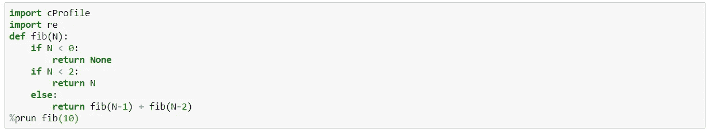

斐波那契数列剖析

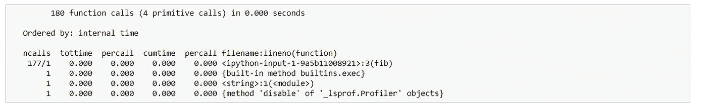

轮廓输出

输出中的第一行告诉我们总共监控了多少个调用，其中有多少是原始的。这表明代码中存在递归(因为 180 个调用中只有 4 个是原语调用)。

[PyCallGraph](https://pycallgraph.readthedocs.io/en/master/examples/basic.html#source-code) 是剖析代码的另一种方式，并且更容易解释，因为输出是 png 图形图像的形式。我们不会在这里讨论太多，因为这超出了这篇文章的范围，更多的可以在这里阅读[。](https://pycallgraph.readthedocs.io/en/master/)

## 2) **用装饰器缓存结果:**

继续上面关于优化的讨论，它需要分析代码的运行时间和内存配置文件。如果代码有较长的运行时间和大量的内存使用，它被称为是昂贵的。

然后对应用程序进行分析，以识别具有优化空间的昂贵代码。提高代码速度的典型方法是缓存罪魁祸首(是的！！！，对我们来说是)。

> 缓存的目的是存储计算量很大的结果。因此，它们只需计算一次，通过称为 Decorators 的包装器进行缓存和检索。

装饰器是一个函数，它的输入和输出也是一个函数。

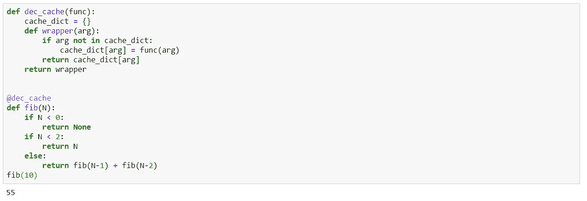

装饰斐波那契示例

## 3) **Join()组合字符串:**

字符串是不可变的。这意味着每当 2 个字符串被连接时；由于不能就地修改，因此会创建一个新的表示。还要注意，字符串连接的时间度量是连接操作次数和字符串平均长度的函数。

使用“Join”连接字符串，因为它比“+”运算符更快

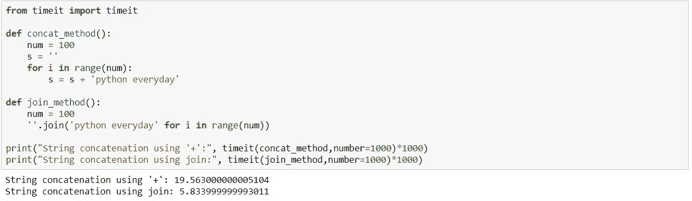

串并置

## 4)计数器

如果您想通过添加公共关键字的值来合并两个字典，则“+”运算符不起作用。

例如，A+B 在下面的代码中抛出错误，但可以使用计数器实现:

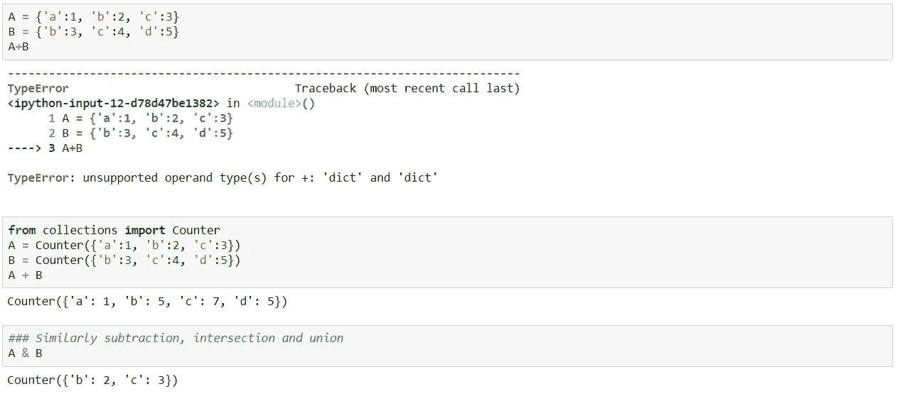

合并两个字典的计数器

同样，我们也可以找到 A 和 B 的交集和并集。

使用“Counter”的另一个非常基本的应用是当我们传递一个字符串作为输入来计算字符串中每个字母的出现次数时，例如“python”:

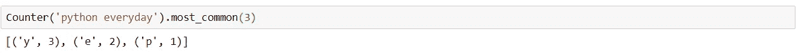

字符串计数

可以使用 OrderedDict 来计算每个字母表在字典中出现的顺序:

有序直接

计数器也可以通过展平来计算字典中每个元素的出现次数:

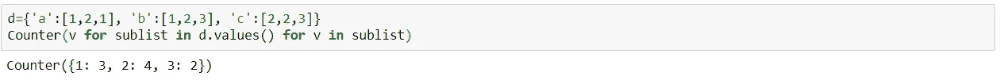

对字典值进行扁平化后的元素进行计数

## 5)变量交换

避免创建临时变量来交换变量。为了通过一个例子来理解它，让我们看看表达式的交换是如何发生的

x，y = y，x

步骤 1:首先计算右边的 y，x，这在内存中创建了一个 2 元素元组。这两个元素是被标识为 y 和 x 的对象，供 Python 内部处理。

步骤 2:在左侧表达式的求值过程中，元组被分配到左侧，并首先被解包到 x 中，然后是 y 中

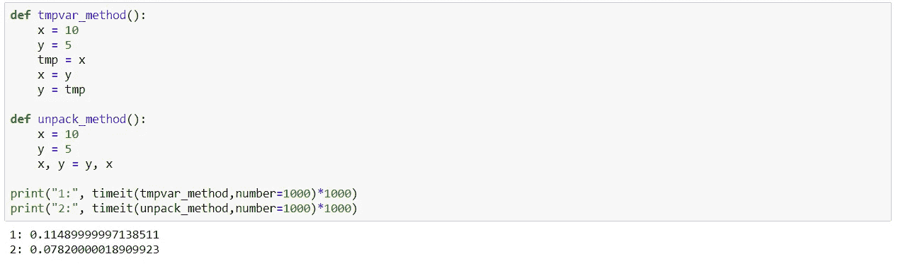

变量交换

## 6) **列表 vs 德格:**

**Deque** 是双端队列，支持内存高效追加和从两边弹出。

**列表:**在列表的末尾插入是有效的，但是，当一个新元素被插入到列表的前面时，所有后面的元素索引都移动 1

这里 deque 派上了用场，它是一个双链表，速度更快。

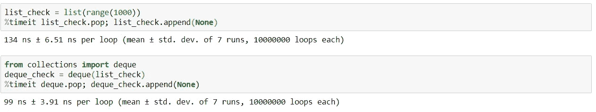

列表与队列

## 7) ' **in '关键字**

“in”关键字是检查元素是否存在的最快、最干净的方法。

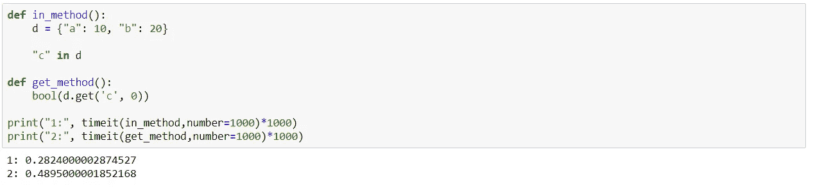

在'与'得到'中

## **8)映射、减少和过滤关键字**

**过滤器**输出包含满足给定条件的元素的新列表。

**Map** 对象用于将给定的函数，在我们下面的例子中，一个指数函数，投射到指定的 iterable 的每一项。

**Reduce** 通过将函数应用于 iterable 返回单个值。它被标记为 reduce，因为它将 iterable 中的元素减少到一个累积值

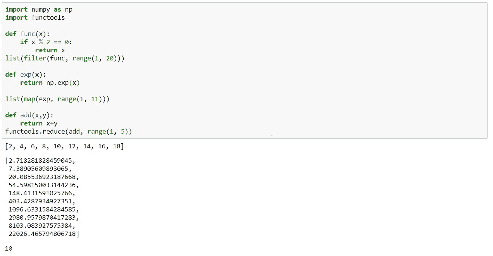

映射、减少和过滤

## 9) **发电机的使用:**

为了理解生成器，让我们首先理解可迭代的。例如，逐个读取列表的元素被称为迭代，其中列表是可迭代的。但是 iterable 的问题是，它将所有可能并不总是需要的值存储在内存中，因此产生了生成器的角色。

> 生成器是迭代器的一个子类，它可以动态生成值。这可以节省内存并提高性能。

例如，在视频流以记录盗窃的情况下，人们不是对每个图像都感兴趣，而是只对可能发生盗窃的图像感兴趣。因此，它就像一个正在进行的过程，其中只有某个事件相关的信息需要分析，而不是整个输入需要预先存储。

也可能是这样的情况，我们最初生成一个数字列表，但是基于算法，只使用了一些元素。这导致了在生成这些数字时 CPU 周期的浪费。不仅如此，大量内存被用来同时存储对象中的这些数字。

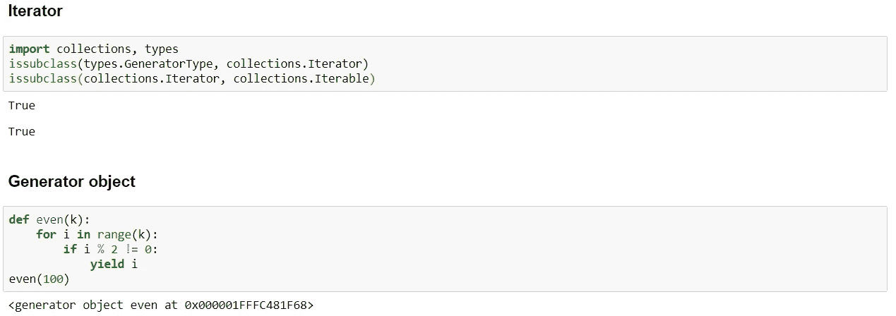

更多关于提高代码效率的提示不言自明:

*   **Python 检索局部变量**比检索全局变量更快。每次需要全局对象时，访问全局对象都要进行一次完整的查找，从而降低了速度。
*   **列表理解**更快，因为它不需要加载 append 并作为函数调用。查找、加载和函数调用是一个耗时的过程，它会增加迭代次数。
*   **在‘if else’之上尝试 except**
*   **交集 vs ' &'运算符:**

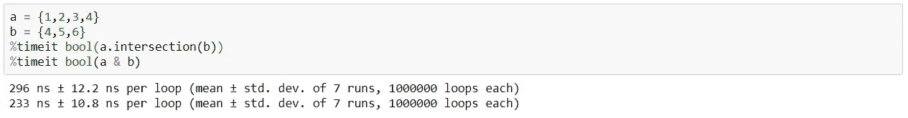

“交叉点”上的“&”

*   **开箱操作员:**

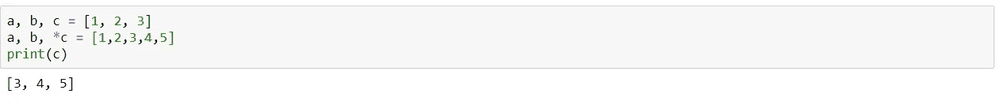

使用*作为解包运算符

而且，还有很多。正如他们所说，学习是永无止境的。我将继续写更多关于 Python 及其海量的文章。

在那之前，继续你的旅程，成为一个狂热的“Pythonista”。

**PS:** 我添加了 python 代码片段来说明概念，而不是创建多个 gists。如果能知道创建多个更小的 gists 来解释每个概念是唯一的演示方式还是有更快的解决方法，那就太好了。

全部代码放在 jupyter 笔记本[这里](https://github.com/vidhi-am/tds_articles/blob/master/python%20everyday/Python.ipynb)。

感谢阅读。

参考资料:

*   [https://stack overflow . com/questions/7165465/optimizing-python-code](https://stackoverflow.com/questions/7165465/optimizing-python-code)