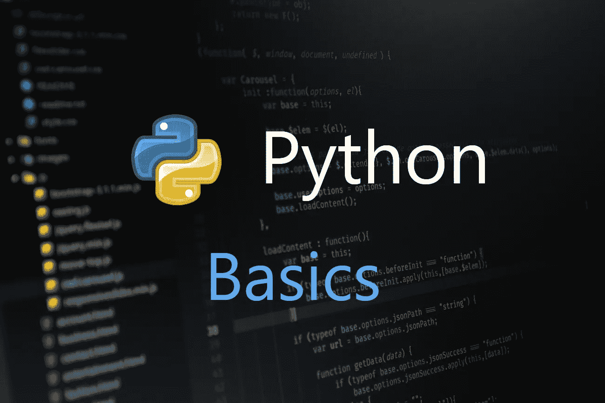

# Python 初学者-基础知识

> 原文：<https://towardsdatascience.com/python-for-beginners-basics-7ac6247bb4f4?source=collection_archive---------33----------------------->

## 了解变量、集合、循环等等



通过 Unsplash 的原始图像

1.  介绍
2.  入门指南
3.  变量
4.  基本操作
5.  收集
6.  经营者
7.  环
8.  条件语句
9.  有用的东西

# 介绍

Python 是一种面向对象的、解释性的高级语言，具有简单的语法和强大的功能。使用 Python，我们可以用更少的努力和更多的可读性来构建复杂的应用程序。

既然我们知道了什么是 Python？我们来探讨一下为什么要用？

*   **高级** 大部分 Python 组件都取自自然语言——我们用来交流的语言。与其他语言相比，这使得 Python 更容易学习。
*   **解释** Python 逐行编译代码——这使得识别错误变得容易，同时，与其他代码相比，速度有点慢。
*   **简单的语法**
    如果你是一名经验丰富的开发人员，现在正试图学习 Python，这将比你已经在学习的语言更加直接和简单。但是如果你是编程新手，我认为你从 Python 开始是幸运的。你找不到比 Python 更简单又强大的语言了。
*   **动态语义**
    如果你是一个典型的传统编码者，你知道我们应该在使用之前初始化任何东西。在 Python 中，这一切都是动态发生的。

# 入门指南

我建议您使用 PyCharm IDE，因为您正在学习 Python，您可以从这里的[下载它。安装和配置 IDE 很简单，但是当涉及到解释器时，不要浪费你的时间试图自己做所有的事情，相反，看这个](https://www.jetbrains.com/pycharm/download/#section=windows)[视频](https://www.youtube.com/watch?v=KLl1tXoaNgk)。它提供了如何正确设置 Python 环境的分步说明。

现在我们已经完成了 IDE 安装，让我们从底层开始编程。

# 变量

变量不过是一个带有值的词。就这么简单；与 java 不同，我们不需要提及变量的数据类型，如`int`、`String`和`Float`。

假设你想在一个变量中存储一个值 10——请看:

声明变量

Python 的动态语义自动将变量视为`Int`。现在我们知道了如何声明一个变量并给它赋值，下一步是探索不同的变量类型。

`Int`、`Float`、`String`和`Boolean` 是 python 支持的基本数据类型。看看如何声明它们并给它们赋值:

Python 中的基本数据类型

多亏了 Python 的简单语法——我们可以用不同的数据类型在单个变量中声明多个变量。看一看:

# 基本操作

既然我们已经学习了如何创建变量，是时候探索基本的功能了——找出字符串的长度，将字符串转换成大写或小写，等等。

*   **字符串长度:** Python 包含一个名为`len()`的函数，返回给定容器中的物品数量。在我们的例子中，容器是字符串，返回值是它的长度。看一看:

寻找字符串的长度

*   **索引:**我们可以使用索引找到字符串中特定位置的值或字符。我们需要记住的主要事情是索引是从零开始的。看一看:

索引演示

*   **连接:**我们可以使用加号(+)在 python 中连接两个字符串。它类似于 Java 和 Kotlin 语法。看一看:

串并置

*   **切片:**切片是 Python 中的一个优秀特性，通过它我们可以使用它们的索引得到字符串的各个部分，如下所示:

分割字符串

*   **Strip:** 使用`strip`我们可以删除字符串中的前导和尾随空格。如果你只想删除前导空白，我们可以使用`lstrip()`或者删除尾随空白；我们可以用`rstrip()`。

条形函数的用法

*   **查找&替换:**这些是任何编程语言中的标准功能— `find`用于验证期望值是否在实际值中，而`replace`用于删除特定值，然后在该位置添加期望值。看一看:

查找和替换用法

*   **转换:**我们可以分别使用`upper()`、`lower()`和`title()`函数将字符串转换成大写、小写或标题大小写。

转换函数的使用

# 收集

到目前为止，我们已经看到了可以保存单个值的变量的不同用法。但是，如果我们想要存储一个值列表，那该怎么办呢——这就是集合的用途。

Python 中有四种集合类型:

## 1)列表

该列表是可以随时更新的值的集合。在 Python 中，列表用方括号表示。看一看:

列出具有相同数据类型的集合

列表可以包含任何数据类型，如下所示:

具有不同数据类型的列表集合

我们可以在列表上执行一些有用的操作，比如添加或删除数据、对列表进行排序以及在特定索引处插入数据。看一看:

对列表的操作

## 2)元组

tuple 类似于 list，但是一旦初始化就不能添加数据，它由圆括号表示，如下所示:

元组演示

我们可能不会添加/删除元组中的数据，但是我们可以做一些有用的事情，比如查找最大/最小值、元组中某个项目的计数以及某个项目的索引。看一看:

元组上的操作

## 3)设置

集合是一个没有索引和无序的集合。In 集合不允许重复值。Set 由大括号表示，如下所示:

简单集合用法

与其他集合类型类似，我们可以添加、删除和更新集合中的数据。看一看:

布景上的操作

## 4) **字典**

与其他类型相比，字典是一种不同的集合类型。集合包含键值对形式的数据。如果你是一个 java 或 Kotlin 程序员，重复的条目是不允许的——就像`hashmap`。

基本词典用法

我们可以分别用两个独特的函数`keys()`和`values()`来获取字典中的所有键或值。看一看:

字典上的操作

# 经营者

## 逻辑运算符

逻辑运算符是任何语言中的基本运算符之一。Python 有三个逻辑运算符，比如`and`、`or`、`not`。

*   **and:** 如果所有状态都为真，则返回真。

和操作员行为

*   **或:**如果任一语句为真，则返回 true。

或者操作员行为

*   **not:** 反转结果，假设为真，则返回 false。

## 标识运算符

python 中有两个标识操作符— `is`和`is not`

*   is:如果两个变量相同，则返回 true。
*   is not:如果两个变量不相同，则返回 true。

标识运算符

# 环

这里我们将探索 Python 中的`while` 和`for` 循环。两者功能相似，但语法不同。

## while 循环

`while` 循环重复执行一系列语句，直到满足给定条件。看一下语法:

```
while condition:
    statement(s)
```

while 循环用法

这里的`i ≤ 5`是条件。最初，I 值为 1，并且在每次迭代中，I 增加 1。在第 5 次迭代时，I 值为 6，条件失败，因此循环终止。

## for 循环

`for` 循环用于顺序迭代。它主要用于迭代集合。

```
for iterator_var in sequence:
    statements(s)
```

这里的序列是一个集合，对于每次迭代，集合中该索引处的值将被赋给`iterator_var`，我们可以在内部语句中访问它。迭代在列表的最后一个索引处终止。

让我们来做一个简单的 for 循环示例——我们有一个编号为 1、2、3、4 的列表，这里的目标是使用 for 循环获得列表中各项的总和。看一看:

对于循环使用

# 条件语句

一些基本的 Python 条件语句有`if`、`elif`、`continue`和`break`。让我们看看如何使用它们:

## 如果

一个`if`语句是用`if`关键字写的，后跟条件，以冒号结尾。如果条件满足，那么里面的语句就会执行。与条件相反，我们可以使用`else`关键字执行另一组语句，如下所示。

if-else 用法

## 否则如果

当我们需要满足两个以上的条件时，关键字就派上了用场。让我们以上面的例子为例，如果`i`是零，它显示为偶数，但 0 既不是偶数也不是奇数——这可以使用如下所示的`elif`来解决:

elif 用法

## 继续

`continue`是循环中派上用场的关键字。有了这个关键字，我们可以跳过当前的迭代。看一看:

继续使用

## 破裂

`break` 类似于`continue`，但是当你调用`break`而不是跳过当前的迭代时，它将终止整个循环。

中断使用

# 有用的东西

## 打印

我们已经看到了使用 print 在控制台中显示数据的两种方法——一种是将值直接传递给打印函数，另一种是传递逗号分隔的参数。看看吧，如果你不记得了:

基本打印用法

我们需要在静态字符串中间打印动态值。这可以通过两种方式实现，比如字符串格式和百分比符号的使用。看一看:

print 语句中的字符串格式

如果您观察清楚，在第一种方法中有额外的尾随零，这是因为 Python 将值显示为浮点数。我们可以限制小数点，如下所示:

## 评论

在使用任何语言时，开发人员都会在代码中加入注释，以便其他开发人员能够理解。Python 提供了两种类型的注释——单行和多行。

*   **单行:**这类评论以#开头，如下图:

单行注释

*   **多行:**这种类型的注释对于编写关于函数的冗长解释或者注释一段代码非常有用。三重引号表示消息开头和结尾的多行注释。看一看:

多行注释

## 范围

`range()`是 Python 中的内置函数。简单来说，`range()`允许用户在给定范围内生成一系列数字。一般来说，它是用来循环的，看看:

范围使用

希望你学到有用的东西，感谢阅读。

你可以在[中](https://medium.com/@sgkantamani)、 [Twitter](https://twitter.com/SG5202) 、 [Quora](https://www.quora.com/profile/Siva-Ganesh-Kantamani-1) 和 [LinkedIn](https://www.linkedin.com/in/siva-kantamani-bb59309b/) 上找到我。