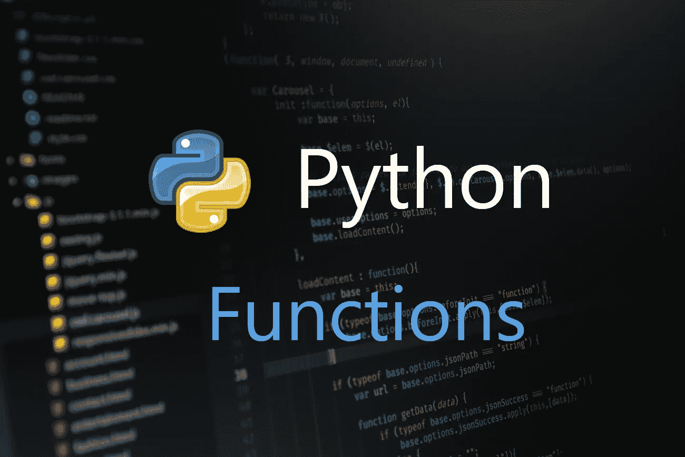

# 面向初学者的 Python 函数

> 原文：<https://towardsdatascience.com/python-for-beginners-functions-2e4534f0ae9d?source=collection_archive---------25----------------------->

## python 中的函数式编程

1.  什么是函数式编程？
2.  Python 中的第一个函数
3.  函数和变量
4.  带参数的函数
5.  有返回值的函数
6.  用作参数和返回值
7.  内部函数
8.  λ函数
9.  地图和过滤功能
10.  装饰者

# #1 什么是函数式编程？

函数式编程是一种编码范式，其中我们定义做什么，而不是执行动作。这个想法最初来自数学——我们定义函数的输入和我们期望的输出。

函数式编程很少依赖于状态管理——这意味着当我们传递相同的参数时，无论输出多少次都是相同的。它可以被解释为数据正在经历一些转换，最终导致所需的输出。

# #2 你在 Python 中的第一个函数

虽然 Python 主要不是函数式语言，但它支持相对简单的函数式编程，因为 Python 中的一切都是对象。这意味着函数可以被赋给变量并传递。

为了简单起见，让我们从打印 *Hello world* 的简单函数开始。看一看:

简单的 python 函数

函数的语法以一个`def`关键字开始，后跟函数名，然后是循环括号。定义函数以冒号(:)结尾。然后在有四个空格缩进的下一行，函数体开始。缩进是我们在使用函数时需要记住的最重要的事情。

# #3 函数和变量

## 全局变量和函数变量

当我们在一个函数中有一个同名的变量时，在全局范围内，当我们试图访问这个变量时，就会产生歧义——无论我们访问的是全局变量还是函数范围内的变量。

所以 Python 提供了一个名为`globals()`的函数，通过它我们可以访问函数内部同名的全局变量。看一看:

在函数内部访问全局变量

## 将函数赋给变量

在 Python 中，我们可以将一个函数赋给一个变量，然后调用它。看一看:

将函数赋给变量并调用

# #4 带参数的函数

现在我们知道了如何定义一个函数，是时候进入下一阶段了，我们将输入传递给函数——参数。为了快速理解它，我们将从一个计算两个数之和的数学函数开始。看一看:

带参数的函数

这是一个简单的函数，就像第一个一样，但是有两个输入— `a`和`b`。

## 调用函数

可以通过两种方式调用带参数的函数，只需调用函数并按照函数中提到的顺序传递参数，或者使用命名参数。看一看:

调用函数

## 具有默认值的参数

在上面的示例中，`a`和`b`是两个强制参数——这意味着开发人员必须传递两个参数来调用函数。在 Python 中，我们可以用默认值指定参数。所以这些参数是可选参数。调用函数时，如果没有传递任何可选参数，Python 会考虑该参数的默认值。看一看:

具有默认值的参数

我们可以通过三种方式调用上述函数，如下所示:

使用默认值参数调用函数

# #5 个具有返回值的函数

我们已经看到了如何将输入传递给函数；是时候实现函数的输出了。这类似于 Java、Kotlin 等大多数语言——我们需要使用 return 关键字并提及值。看一看:

带输出的函数

Python 有一种独特的能力，可以返回多个值作为输出，这是大多数语言都做不到的。看一看:

具有多个输出值的函数

`x`、`y`和`z`变量将分别被赋予加号、减号和乘号的值。

# #6 函数作为参数和返回值

Python 函数式编程能够将函数作为输出返回，或者作为参数传递。

## 作为一个参数

到目前为止，我们已经看到了如何将变量作为参数传递给函数。现在我们将学习如何将函数作为参数传递给其他函数——类似于 Kotlin 中的高阶函数。看一看:

使用函数作为参数

## 用作返回值(输出)

类似于将函数作为参数传递，我们也可以将其作为输出返回——这是 Python 中的一个独特功能。看一看:

使用函数作为返回值

# #7 内部函数

我们可以在另一个函数内部编写一个函数，这是我直到现在才在其他编程语言中看到的。内部函数的作用域是外部函数，只能从外部函数访问内部函数。看一看:

✅访问内部函数的正确方法

内部函数

✖️不能从包装函数的外部访问内部函数:

非法访问内部函数

# # 8λ函数

Lambda 是具有单行表达式的函数的最简单形式，它没有名称。在 Python 中，我们必须使用`lambda`关键字而不是`def`来创建 lambda 函数。看一看:

λ函数

这里变量`f`是一个简单的 lambda 函数，而`a`和`b`是`f`的参数。语法类似于普通函数。唯一的变化是关键字和单行表达式。

下面是一个简单的例子，展示了我们如何使用普通函数和 lambda。看一看:

普通函数和 lambda 函数的功能相同

# #9 映射和过滤功能

到目前为止，我们已经看到了如何创建函数和其他策略。Python 自带的默认功能包括 map 和 filter，这在一些用例中非常方便。

## 地图

`map`是一个函数，它需要另一个函数对象和任意数量的`iterables`，如列表和字典。`map`用提供给它的函数对象迭代列表中的每一项，并返回一个列表。看一看:

地图功能

我们可以向 map 传递多个列表，如下所示:

带有多个列表的地图

## 过滤器

`filter`函数需要两个参数——一个函数对象和一个 iterable。`Filter`通过返回一个`boolean`值的函数对象迭代每一项。最后，`filter`返回一个列表，其中包含从函数对象返回 true 的项目。

滤波函数

# #10 室内装潢师

装饰器是一种设计模式——它接受一个对象并向其添加新的功能，而无需从调用点进行任何更改。正如我前面说过的，Python 中的一切都是对象——所以我们可以将函数用作装饰器，并且可以应用于其他函数。看一看:

装饰者用法

希望你学到有用的东西，感谢阅读。

你可以在 [Medium](https://medium.com/@sgkantamani) 、 [Twitter](https://twitter.com/SG5202) 、 [Quora](https://www.quora.com/profile/Siva-Ganesh-Kantamani-1) 和 [LinkedIn](https://www.linkedin.com/in/siva-kantamani-bb59309b/) 上找到我。