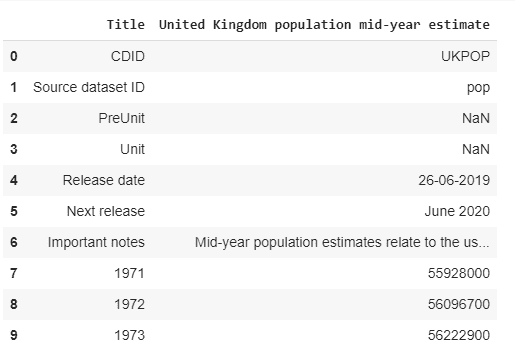
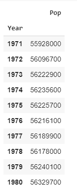
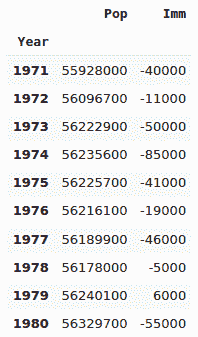
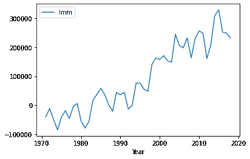
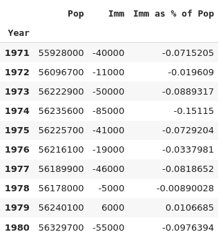
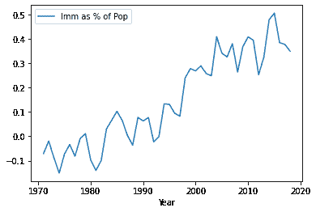
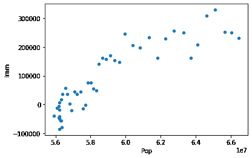

# 面向数据记者的 Python:从网络上获取数据

> 原文：<https://towardsdatascience.com/python-for-data-journalists-get-your-data-from-the-web-c0cee664d17?source=collection_archive---------65----------------------->

## 使用 Python 和 Pandas 在网络上发现、读取和分析 CSV、Excel 电子表格中的数据


[摄于](https://unsplash.com/@claybanks?utm_source=medium&utm_medium=referral) [Unsplash](https://unsplash.com?utm_source=medium&utm_medium=referral) 上的粘土堤岸。所有其他图像由阿兰·琼斯。

作为一名记者，你的工作是讲述一个故事，让你的读者觉得有吸引力、有娱乐性和知识性。作为一名数据记者，你可以从网上的数据中找到这个故事。你找到数据，研究它，并得出结论，告知你的叙述。也许你还会制作一些有趣的图表或插图。

如果你知道去哪里找，并且有检索、处理和分析数据的技能，那么就会有大量的数据存在。

我们将探索如何找到、读取、分析和可视化这些数据。

更准确地说，我们将:

*   *使用 Python 和 Pandas 从网上读取电子表格文件*
*   *提取我们感兴趣的数据*
*   *为我们的特定目的操纵数据*
*   *探索数据中的关系*
*   *画一些说明图*

## 开放数据，什么和哪里？

许多政府和组织开放了他们的数据，任何人都可以访问。例如，美国和英国政府拥有涵盖政府、经济和社会各个方面的公开数据。欧盟也有类似的资源。

大型非政府组织以及私营组织也免费或收费提供数据。其中包括世界银行、世界经济论坛、世界卫生组织和联合国。数据也有学术来源。位于英国牛津大学的“我们的数据世界”就是一个很好的例子，美国约翰·霍普金斯大学的新冠肺炎仪表板提供了疫情的最新数据(尽管这些数据不能直接下载)。

但是，如果你不确定从哪里开始，一个好的地方是谷歌的公共数据浏览器，你可以在那里搜索特定提供商或特定主题的数据。

# 数据格式

你会发现数据有多种格式。最常见的可能是可下载的电子表格。这些通常是 Excel 格式或 CSV 文件。

API(应用程序编程接口)也是有用的数据源，这些数据通常以 CSV 或 JSON 的形式出现。API 有时会限制您可以检索的数据，并且通常要求您注册。API 使用“免费增值”模式并不罕见，在这种模式下，有限的访问是免费提供的，但如果你想访问大量数据，则需要付费。

# 使用 Python 和熊猫

我们将看看如何处理不同类型的数据，以及如何使用 Python 和 Pandas 来整理、分析和可视化这些数据。

为了提供一个焦点，我们来看看英国的人口数据。我们将追踪过去几十年人口的增长情况，以及移民对人口的影响(如果有的话)。我们将使用两个不同的数据源，并将它们连接起来，看看这些数字之间是否有任何关系。

使用网络上的数据只需要很少的编程知识，但是你确实需要对 Python 和 Pandas 的基础有一点熟悉，或者至少愿意学习它们。

在下面的代码中，我将使用 Jupyter 笔记本(您可以使用标准的 Python 编辑器或 IDE，但我发现 Jupyter 更容易构建这些简单例程的原型)。

如果您的计算机上还没有 Python 工具，我建议您安装 Anaconda。有了 Anaconda，你可以在一个包中获得 Python 以及大量有用的库，如 Pandas、Jupyter 笔记本和代码编辑器。有关如何获取它的说明，请参见下面的文章:

[](/setting-up-jupyter-notebooks-for-data-visualisation-e287e2688af6) [## 为数据可视化设置 Jupyter 笔记本

### Jupyter 笔记本是一个伟大的和相当简单的方式来探索数据和创造可视化的互动…

towardsdatascience.com](/setting-up-jupyter-notebooks-for-data-visualisation-e287e2688af6) 

## 入门指南

假设你已经准备好了工具，我们就开始吧。

我将把每一点代码都呈现为一个 Jupyter 笔记本代码单元，我建议你也这样做。

因此，我们需要做的第一件事是输入我们将要使用的 Python 库。

```
import pandas as pd
import matplotlib.pyplot as plt
```

这几乎是我们操作数据和产生可视化所需的一组标准库。

如果由于某种原因你还没有安装这些，你将需要从命令行安装 *conda* 或 *pip* ，例如

```
conda install pandas
```

或者

```
pip install pandas
```

注意，如果您没有使用 Anaconda，您可能需要使用命令 **pip3** 而不是 **pip** 进行安装。

让我们从电子表格数据、CSV 和 Excel 文件开始探索。

# CSV 和 Excel

每当您找到一个为您提供 Excel 文件下载的数据源时，您通常会发现他们也提供了一个 CSV 替代文件。对于简单的电子表格，我们使用哪个并不重要。

尽管如此，CSV 文件更容易被人阅读——它们是纯文本表格，表格中的每个值或标题用逗号(或其他字符)分隔。当然，您可以用电子表格打开它们，但是如果需要，您也可以用简单的文本编辑器编辑它们。

另一方面，Excel 文件是一种专有格式，需要用兼容 Excel 的电子表格程序来查看或编辑。

电子表格文件有时可以直接从 url 中读取，其他的则必须从浏览器中手动下载。

为了使我们这里的目的更容易，我已经将我们将要使用的文件复制到一个存储库中，您可以从您的程序中直接访问它。

首先，我们要看看英国人口在过去 50 年左右的时间里是如何增长的。我们将使用英国国家统计局的数据。

您可以在此下载该文件:

[https://www.ons.gov.uk/generator?format=csv&uri =/peoplepulationandcommunity/populationandmigration/populationestimates/time series/uk pop/pop](https://www.ons.gov.uk/generator?format=csv&uri=/peoplepopulationandcommunity/populationandmigration/populationestimates/timeseries/ukpop/pop)

将其保存在与笔记本或程序相同的目录中。

下面的程序片段将该数据加载到 Pandas 数据帧中。真正的工作由 **pd.read_csv** 完成，它从您的目录中读取文件，第二行显示表格的前 10 行。

当我下载这个文件时，它被命名为 series-100520.csv

然而，当**你**下载文件时，你可能会得到一个反映你下载日期的文件名。所以检查文件名并适当调整代码。

代码如下:

```
data = pd.read_csv(‘series-100520.csv’)
data.head(10)
```



好了，现在我们有了从 CSV 文件加载的数据帧，我们已经执行了命令 *data.head(10)* ，它显示了数据表的前 10 行。它基本上由两列组成:年份和那一年的人口，但是包含了一些关于文件的注释。

这就是问题。这些额外的行可能对人类读者有用，但对我们的分析并不十分有用。此外，我们希望这两列的标题有意义。也许我们可以称它们为“年”和“流行”。

这很容易解决。我们只是跳过头几行，标题和编号为 0 到 6 的行，自己定义标题是什么。

下面是再次读取该文件的代码，但是添加了一些额外的参数，这将完全符合我们的要求。

```
data=pd.read_csv(‘series-100520.csv’,skiprows=8,names=[‘Year’,’Pop’], index_col=0)data.head(10)
```



那更好。一个简单的表，有两列和合理的列标题。我们告诉 Pandas，我们将使用第一列作为数据帧的索引(否则 Pandas 将添加一个额外的编号索引)。

现在我们可以用它做一些有用的事情。例如，我们可以画一个这样的图。

```
data.plot(title=’UK Population in millions, 1970 to 2018', grid=True);
```


这是一个简单的线形图，显示了从 1971 年到 2018 年的人口增长。代码相当简单明了，我们只需调用 *plot* 函数，它会自动使用索引(年份)作为 X 轴，并将“Pop”列绘制为 Y 值。

我们可以看到，在这一时期有一个逐渐上升的增长。

另一件我们很容易做的事情是查看实际的增长是多少。该表有 48 行，标记为 1971 年至 2018 年，因此我们可以像这样访问人口的第一个值:*数据['Pop'][1971]* 和最后一个像这样的*数据['Pop'][2018]* 。所以人口的变化是一个减去另一个。

```
data[‘Pop’][2018]- data[‘Pop’][1971]
```

我们得到的结果是

```
10507600
```

这比 48 年前增加了 1000 多万。或者以百分比表示:

```
percentageIncrease = round((data[‘Pop’][2018]- data[‘Pop’][1971])/data[‘Pop’][1971]*100,2)print(‘The UK population has increased by’, percentageIncrease,’% from 1971 to 2018')
```

从中我们可以得到

从 1971 年到 2018 年，英国人口增长了 18.79%

所以现在我们知道有多少人生活在英国，以及在过去的几十年里人口是如何增长的。

# 移居

现在我们将使用来自下议院图书馆的不同数据源。根据开放议会许可，这些数据可以免费下载，您可以在这里找到:

[https://www . parliament . uk/site-information/copyright/open-parliament-licence/](https://www.parliament.uk/site-information/copyright/open-parliament-licence/)

这次数据是以 Excel 电子表格的形式出现的。这类似于读取 CSV 文件，但是我们可以指定的参数有一些不同。例如，这个电子表格中有许多不同的工作表，为了将它读入熊猫数据帧，我们需要指定哪一个。

我们感兴趣的工作表叫做“摘要”。

所以从这个网址下载文件

[http://research briefings . files . parliament . uk/documents/sn 06077/CBP 06077-data . xlsx](http://researchbriefings.files.parliament.uk/documents/SN06077/CBP06077-data.xlsx)

和以前一样，保存在您的工作目录中。

同样，该文件包含几行没有用的内容，所以我们将标题指定为第 2 行，将索引作为第一列(和前面一样)，并跳过表的最后 10 行(使用 *skipfooter* )。

```
immData=pd.read_excel(‘CBP06077-data.xlsx’,sheet_name=’Summary’,index_col=1,header=2, skipfooter=10)immData.head(10)
```

生成的数据帧如下图所示。还可以，但是有一些我们不需要的列。不过，这没有太大关系，因为我们要做的是将我们感兴趣的数据复制到保存人口数据的原始数据帧中。


本质上，我们将复制用于*净迁移*的列的一部分，并将其粘贴到 dataframe *数据*中的新列中。

为此，我们使用一个名为 *iloc* 的函数。这允许我们使用行和列的位置来选择数据帧的矩形部分。*例如，iloc[x，y]* 会从列 *y* 中选择行 *x* 。

但是 *x* 和 *y* 可以是范围，所以 *iloc[x1:x2，y1:y2* 会为列 *y1* 到 *y2 选择行 *x1* 到 *x2* 。*

更具体地说，代码 *immData.iloc[0:10，2:4]* 将选择 *immData* 的一部分，从第 0 行到第 10 行，从第 2 列到第 4 列。或者 *iloc[0:10，5]* 将选择第 1 行到第 10 行，但只选择第 5 列。

我们想要的是第 5 列的*净迁移*，但是因为我们想要将其粘贴到*数据*数据帧中，所以它需要与*数据*的大小相同，所以我们只想要 1971 年到 2018 年的数字。1971 是第 8 行，2018 是从表格底部向上一行，我们可以将此选择表示为 *[8:-1，5]* ，其中-1 表示“从最后一行向后一行”。

我们将在*数据* calle *Imm* 中创建一个新列，并将 *iloc* ed 副本粘贴到其中，如下所示:

```
data[‘Imm’]=immData.iloc[8:-1,5]*1000data.head(10)
```

结果是添加了新列的原始表。我们将移民数据乘以 1000，得到与人口数据相同的形式。



让我们用图表来描绘移民的增长。这与我们之前看到的非常相似，但是我们将 Y 值指定为“Imm”。

```
data.plot(y=’Imm’)
```



你可以看到，尽管有起有落，但在此期间，英国的净移民一直在增加。

我们可能做的另一件有趣的事情是将移民数字表示为总人口的百分比。在这里，我们创建另一个新列，并用百分比填充它。

```
data[‘Imm as % of Pop’] = data[‘Imm’]/data[‘Pop’]*100data
```



你可以看到，作为总人口的一个百分比，移民增加的百分比相当小。但这一比例也在上升。

```
data.plot(y=’Imm as % of Pop’)
```



所以看起来每年的移民数量和总人口数量之间可能有关系。让我们通过绘制总人口和移民水平的散点图来对此进行研究。

```
data.plot.scatter(x=’Pop’,y=’Imm’)
```



嗯，是的，似乎有一个线性的关系。随着人口的增加，移民也在增加。

由于移民导致的总人口增长看起来很小，所以一定还有其他原因。也许移民越多，移民就越多，因为现在的移民往往会带着他们的家人一起生活。我们没有考虑过这种关系，也不会考虑！

# 我们的目标

我认为我们已经达到了这篇文章的目标。我们已经了解了如何下载和读取 CSV 文件或 Excel 电子表格形式的数据。我们对这些数据进行了处理，以提供一些可能值得研究的信息，我们还研究了不同数据之间的关系。我们还绘制了一些说明性的图表。

我希望这是有用的，你会发现这里使用的技术与你未来的工作相关。感谢阅读。

你可以在这里找到更多关于绘制熊猫图的信息:

[](/plotting-with-pandas-an-introduction-to-data-visualization-8bd7c0831650) [## 用熊猫绘图:数据可视化导论

### 如果您是一名初露头角的数据科学家或数据记者，能够可视化您的数据会让您有能力…

towardsdatascience.com](/plotting-with-pandas-an-introduction-to-data-visualization-8bd7c0831650)