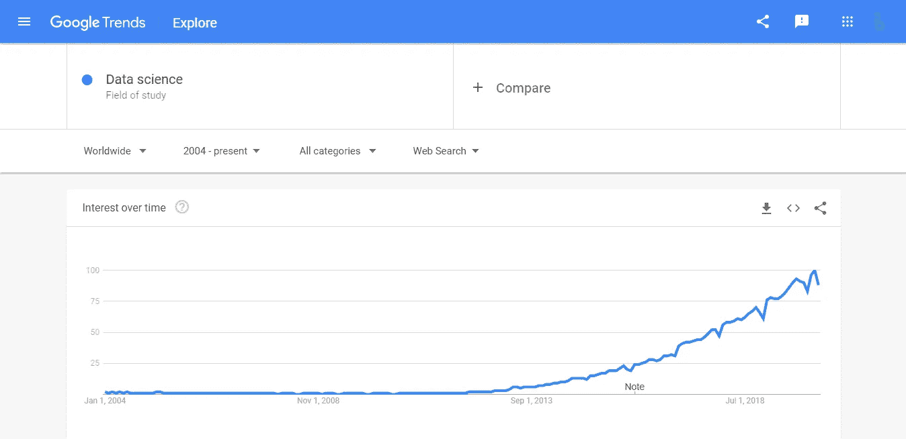
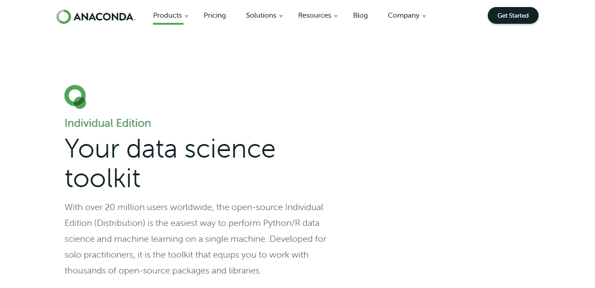
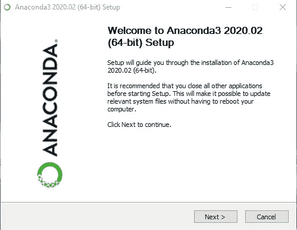
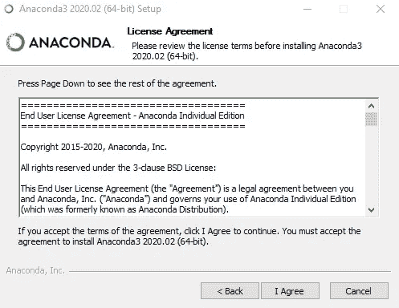
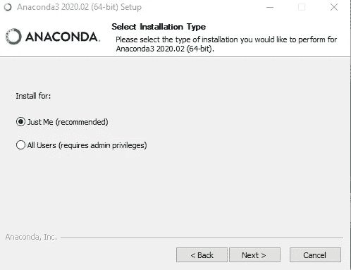
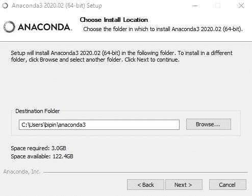

# 面向数据科学的 Python 第一部分

> 原文：<https://towardsdatascience.com/python-for-data-science-66efe1bcc45d?source=collection_archive---------43----------------------->

## 数据科学/ Python 编程语言

## 近距离接触 Python


戴维·克洛德在 [Unsplash](https://unsplash.com?utm_source=medium&utm_medium=referral) 上的照片

## 数据科学

D 数据科学是当今谷歌上搜索次数最多的术语之一。谷歌趋势显示，自 2013 年 9 月以来，人们对“数据科学”一词的兴趣呈上升趋势。数据科学项目在所有主要大学的出现证明了这一学科新的受欢迎程度。对于门外汉来说，熟悉数据科学和数据科学家等术语是非常必要的。“数据科学”是指对数据的创建、验证和转换进行科学研究，以创造意义(定义由数据科学协会给出，这是一个由数据科学家组成的非营利性专业协会)。“数据科学家”是指使用科学方法从原始数据中解放和创造意义的专业人员。

数据科学也可以被认为是统计学与计算机科学和技术的融合。随着我们的社会变得越来越受数据驱动，计算机的处理能力逐年显著增长(以便理解大量数据)，数据成为新的石油，从而引发了数据科学的前所未有的激增。然而，通过数据科学获得有意义的结果，数据的质量与数据的数量同样重要。



图片提供:iambipin

## Python 和数据科学

Python 和数据科学共享一种共生关系(某种程度上)。多年来，Python 已经成为数据科学事实上的编程语言。学习 Python 的简单和容易以及 Python 中大量人工智能(AI)包的可用性是成为数据科学的全部和最终全部的主要因素。Python 在业界的广泛使用使它成为一个显而易见的选择。

## 一段历史

Python 编程语言是由 Guido Van Rossum 于 20 世纪 80 年代末在荷兰的[Centrum wisk unde&Informatica](https://en.wikipedia.org/wiki/Centrum_Wiskunde_%26_Informatica)(CWI)创建的，此前创建一种新的编程语言( [ABC 语言](https://en.wikipedia.org/wiki/ABC_(programming_language)))将淘汰 [BASIC 编程语言](https://en.wikipedia.org/wiki/BASIC)失败。在 2018 年 7 月 12 日选择下台之前，他还是 Python 的终身仁慈独裁者(这是一个授予拥有最终决定权的软件开发领导者的头衔)。

> Van Rossum 认为他需要一个简短、独特且略带神秘的名字，所以他决定将这种语言称为 Python。

你可能会对“Python”这个名字感兴趣。编程语言为什么这么命名？当 Python 的实现开始时，吉多·范·罗苏姆也在阅读来自 20 世纪 70 年代 BBC 喜剧系列[“巨蟒剧团的飞行马戏团”](https://en.wikipedia.org/wiki/Monty_Python)的出版剧本。Van Rossum 认为他需要一个简短、独特且略带神秘的名字，所以他决定将这种语言称为 Python。在他的国王日演讲中，他明确指出他的意图是向巨蟒剧团的飞行马戏团的不敬的喜剧天才致敬。他还提到，谷歌的第一个版本是用 Python 写的，因为拉里·佩奇和谢尔盖·布林认为 Python 是表达他们关于如何索引网络和组织搜索结果的原始想法的正确语言。

Python 是由一群充满激情和主人翁感的志愿者在互联网上开发的。

## Python 安装

Python 可以通过从[这里](https://www.anaconda.com/products/individual)或者从官方网站[Python.org](https://www.python.org/downloads/)下载 Anaconda 个人版(推荐方式)来安装。



图片提供:iambipin

双击下载的。exe 文件，并按照说明进行操作。



图片提供:iambipin



## Pythonic 式的方法

Python 方式(Python 社区对遵循特定方式的代码使用的形容词)是一种非常简约的方法。

> 漂亮总比难看好。
> 显性比隐性好。
> 简单比复杂好。
> 复杂总比复杂好。

先从打印“Hello World！”并且当我们考虑在其他流行的通用语言如 C++和 Java 中做同样的事情时会理解它。

用 C++打印“Hello World ”:

```
#include <iostream>
#include <conio.h>
using namespace std;
int main()
{
    cout<<"Hello World!";
    return 0;
}
```

要用 Java 打印“Hello World ”:

```
class HelloWorld {
    public static void main(String[] args) {
        System.out.println("Hello, World!"); 
    }
}
```

两个字的印刷“你好，世界！”可以通过一行代码在 Python 中完成。它充分说明了 Python 的简单性和极简性。

```
print("Hello World!")
```

Python 简单、强大、优雅。Python 中的编码模仿了我们说英语的方式。假设你要为学校数据库创建一个程序。考虑涉及删除学生数据的模块。记录的删除只能由具有管理权限的人员执行。如果没有它，就会出现认证错误。还必须检查班级中是否存在具有该特定 id 的学生。为了在 Python 中执行此操作，您只需编写几行代码，如下所示:

```
def student_delete:
    """
    To delete a student from student database
    """
    if not user.is_admin():
        raise AuthError("You do not have sufficient privileges")
    if not class.has_student(student_id):
        raise ValueError("Invalid Student ID")
    class.get_student(student_id).delete()
```

上面几行代码几乎不言自明。代码片段展示了 Python 的简单性。对于初学者来说，def 是 Python 中定义函数的关键词。在 Python 系列的后续文章中，我们肯定会详细探讨 Python 编程的本质。

在结束对 Python 编程的介绍之前，有必要熟悉一下 Tim Peters(创建了 Timsort 混合排序算法并对 Python 编程语言做出了重大贡献的软件开发人员)的“Python 之禅”。“Python 之禅”简洁地陈述了用 Python 编写计算机程序时要遵循的 19 条指导原则。您可以通过运行以下命令来查看它:

```
import this
```

然后你会看到“Python 的禅”:

```
The Zen of Python, by Tim Peters

Beautiful is better than ugly.
Explicit is better than implicit.
Simple is better than complex.
Complex is better than complicated.
Flat is better than nested.
Sparse is better than dense.
Readability counts.
Special cases aren't special enough to break the rules.
Although practicality beats purity.
Errors should never pass silently.
Unless explicitly silenced.
In the face of ambiguity, refuse the temptation to guess.
There should be one-- and preferably only one --obvious way to do it.
Although that way may not be obvious at first unless you're Dutch.
Now is better than never.
Although never is often better than *right* now.
If the implementation is hard to explain, it's a bad idea.
If the implementation is easy to explain, it may be a good idea.
Namespaces are one honking great idea -- let's do more of those!
```

在本系列的后续文章中，我们将深入探讨 Python 编程语言的各个方面。希望您学到了一些关于 Python 编程语言的新知识。编码快乐！！！

参考资料:

*   [https://en . Wikipedia . org/wiki/Python _(编程 _ 语言)](https://en.wikipedia.org/wiki/Python_(programming_language))
*   https://gvanrossum.github.io/
*   [https://docs . python . org/2/FAQ/general . html #:~:text =为什么% 20 is % 20 it % 20 call % 20 python % 3F，-% C2 % B6&text = When % 20 he % 20 begin % 20 implementing % 20 python，to % 20 call % 20 language % 20 python](https://docs.python.org/2/faq/general.html#:~:text=Why%20is%20it%20called%20Python%3F,-%C2%B6&text=When%20he%20began%20implementing%20Python,to%20call%20the%20language%20Python)。
*   [http://neopythonic . blogspot . com/2016/04/kings-day-speech . html](http://neopythonic.blogspot.com/2016/04/kings-day-speech.html)