# 用于数据科学的 Python 分类机器学习指南

> 原文：<https://towardsdatascience.com/python-for-data-science-a-guide-to-classification-machine-learning-9ff51d237842?source=collection_archive---------16----------------------->

## 如何正确执行分类机器学习并对其进行评估

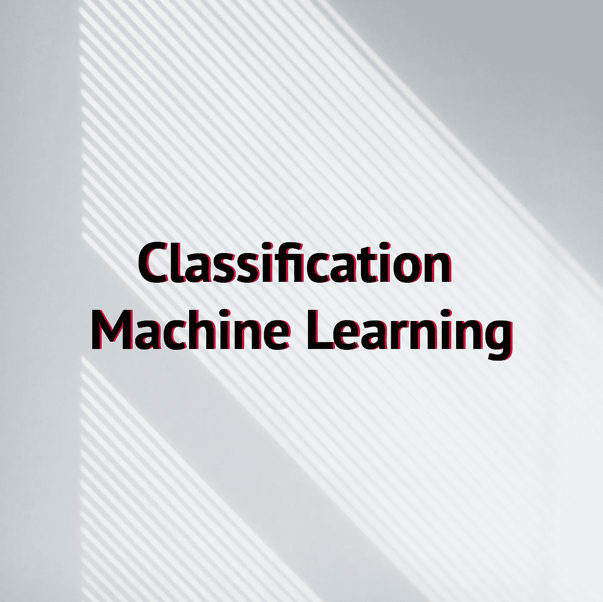

分类机器学习

亲爱的读者们，新年快乐。终于到了 2020 年。
随着数据的上升，
你掌握了 21 世纪最性感的技巧了吗？
它叫做——**机器学习。**

那是什么？你没有时间学习它，但你非常想掌握它？你找不到一篇关于机器学习的好文章，教你如何正确地**执行**和**评估**你的模型？

别担心，我会解决你所有的问题——如果我有足够的数据的话。

今天，我们将谈论所有关于**机器学习的话题。** 是啊，大家最爱的话题，是不是很刺激？

根据 [**薪级表**](https://www.payscale.com/research/US/Job=Machine_Learning_Engineer/Salary) ，一名**机器学习工程师**的平均年薪为**110，000 美元**，不包括绩效奖金。我们都知道机器学习正在兴起，我们也知道你现在就需要学习它。

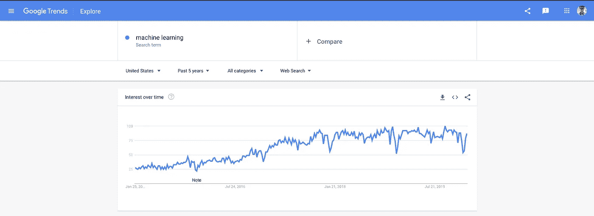

谷歌机器学习趋势

那么，机器学习到底是什么？
机器学习是人工智能(AI)的一个子集，它在机器中引入了“**学习**”的能力。把它想象成机器能够在它们的人工大脑中开发出一个**模式**，给定你提供给它的**数据**。

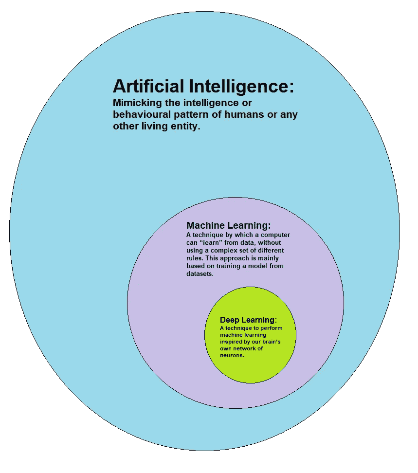

图片来自[维基媒体](https://commons.wikimedia.org/wiki/File:AI-ML-DL.png)

传统上，我们**通过给机器**规则来给它们编程做一些事情，比如一个 **if-else** 语句。现在，我们让机器**通过向它们提供数据来发现**这些规则。这里有一个形象化的例子可以帮助你更好地理解它。

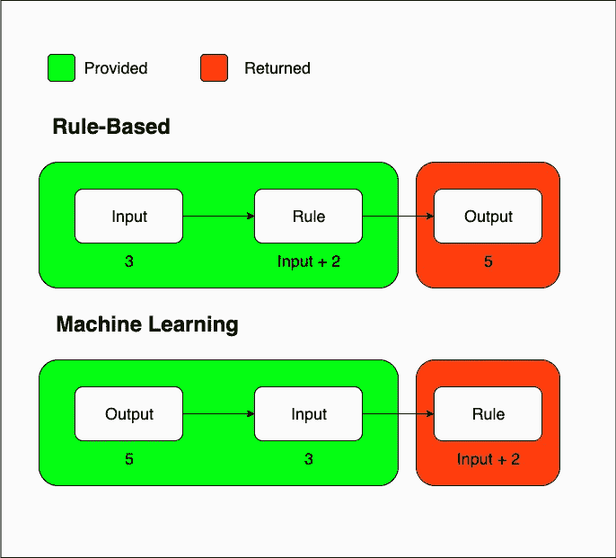

机器能够通过训练过程发现这些规则，在训练过程中，机器尝试不同的规则，并评估每个规则与我们的数据的拟合程度。发现规则后，我们现在可以说机器根据我们的数据造出了一个**模型**。

该过程的一个例子是:

*   将猫的图像**传入机器，并贴上“猫”的标签**
*   传入女孩的数据和她们的**习惯**，同时给她们贴上“女孩”的标签
*   传入每个员工的工资以及他们的**职位**和**资格**

在这个过程之后，机器将能够**预测**:

*   如果**图像**是猫或其他动物
*   如果是女孩或男孩，根据这个人的**习惯**
*   具有某个**职位**和**资格**的员工的工资

机器学习有多种形式。经常提到的有监督、无监督和强化学习。定义您将处理哪种形式的机器学习的主要因素将是您的**数据集，或数据。**

如果你有一组**输入**和**输出**，大多数时候它会被归类为**监督机器学习。**为了简单起见，我们将在本文中只讨论**监督学习**来帮助您入门。

# 分类和回归

监督机器学习处理两个主要问题，
**分类**和**回归**。

如果你注意了，我上面展示的例子是关于—

*   女孩还是男孩——分类
*   员工工资-回归

相当直接。
分类通常有**离散**输出，而
回归有**连续**输出。

# 先决条件

首先，我们需要知道您将如何**收集**您的数据。

今天，大多数现实世界的企业都使用机器学习来优化他们的产品/服务。

*   当您停止使用某项服务一段时间后，您可能会收到一封电子邮件，向您提供**折扣/奖励**以继续使用该服务。
*   当你浏览 Youtube/网飞时，你会得到与你的兴趣相符的推荐，这会让你在这个平台上呆得更久。
*   当你的照片被发布到脸书上时，你会自动被平台识别并被标记。

如果你在这些组织中的一个工作，他们已经建立了适当的数据仓库，包含了大部分的数据。然后，您可以在大多数情况下通过使用 **SQL** 来提取这些数据。因此，您首先需要的是 **SQL** 。

列表上的下一个可能是 **Python** ，带有特定的库。
[**Pandas**](/python-for-data-science-basics-of-pandas-5f8d9680617e) 将是 Python 中用来操作数据的主库，所以那应该是你掌握的第一个库。

[](/python-for-data-science-basics-of-pandas-5f8d9680617e) [## 用于数据科学的 Python 熊猫指南

### 10 分钟内完成数据探索指南

towardsdatascience.com](/python-for-data-science-basics-of-pandas-5f8d9680617e) 

之后，我们将通过本文中的[](/python-for-data-science-a-guide-to-data-visualization-with-plotly-969a59997d0c)**来**可视化**我们的大量数据和发现。没有它，没有人能真正理解我们在做什么。
我已经写了多篇关于[](/python-for-data-science-advance-guide-to-data-visualization-with-plotly-8dbeaedb9724)**的文章，一定要看看它们来刷新你的记忆。****

****[](/python-for-data-science-a-guide-to-data-visualization-with-plotly-969a59997d0c) [## 面向数据科学的 python——Plotly 数据可视化指南

### 现在是 2020 年，是时候停止使用 Matplotlib 和 Seaborn 了

towardsdatascience.com](/python-for-data-science-a-guide-to-data-visualization-with-plotly-969a59997d0c) [](/python-for-data-science-advance-guide-to-data-visualization-with-plotly-8dbeaedb9724) [## 用于数据科学的 Python 使用 Plotly 进行数据可视化的高级指南

### 如何在 Plotly 中添加和自定义滑块、下拉菜单和按钮

towardsdatascience.com](/python-for-data-science-advance-guide-to-data-visualization-with-plotly-8dbeaedb9724) 

继续，知道如何正确地**探索**你的数据也是很好的。
拿到数据集后，很多数据从业者往往不知道该怎么处理。这种情况经常导致我们都想避免的优化较差的机器学习模型。

因此，请阅读我的文章[](/python-for-data-science-what-to-do-before-performing-machine-learning-a30f62465632)****。****

**[](/python-for-data-science-what-to-do-before-performing-machine-learning-a30f62465632) [## 用于数据科学的 Python 在执行机器学习之前要做什么？

### 不要沉迷于机器学习模型，先了解你的数据。

towardsdatascience.com](/python-for-data-science-what-to-do-before-performing-machine-learning-a30f62465632) 

从 Plotly 到熊猫再到机器学习。我掩护你。既然已经出来了，是时候开始了。


由[丹尼尔·里卡洛斯](https://unsplash.com/@ricaros?utm_source=medium&utm_medium=referral)在 [Unsplash](https://unsplash.com?utm_source=medium&utm_medium=referral) 上拍摄的照片** 

# **进口**

**像往常一样，我们将与 [**Jupyter 笔记本**](https://jupyter.org/) 一起工作。**

```
#all plotly
from plotly.offline import init_notebook_mode,iplot
import plotly.graph_objects as go
import cufflinks as cf
init_notebook_mode(connected=True)#others
import pandas as pd
import numpy as np
```

# **导入数据集**

**在本文中，我们将使用一个 [**电信客户流失数据集**](https://www.kaggle.com/blastchar/telco-customer-churn) 。**

```
df = pd.read_csv(filepath)
```

# **机器学习的数据预处理**

**在这个阶段，我们将把数据预处理成机器可读的格式。请记住，机器实际上并不理解文本，因为它们只是将文本作为输入。例如，机器不理解文本“男性”和“女性”之间的**差异**。因此，在我们通过训练过程之前，我们需要正确地处理我们的分类和数字数据。**

## **分类数据**

**将分类数据转换成可理解输入的最常用方法是为每个类别创建**虚拟变量**。例如，我们的合同栏中有 3 种类型的合同，即“逐月”、“一年”和“两年”。然后，合同列被转换为 3 列，每种类型的合同对应一个真或假指示器。这里有一幅图可以帮忙。**

**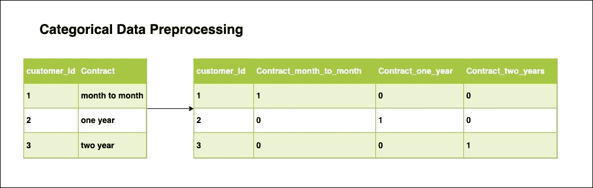**

**分类数据预处理**

**我们可以通过熊猫的 get_dummies 函数很容易地做到这一点。**

```
#Creating Dummy Variables for Categorical Columns
df = pd.get_dummies(data = df,columns = cat_cols )
```

**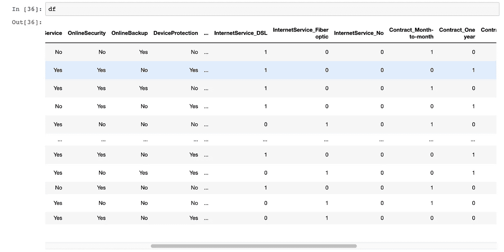**

**我们可以看到分类列已经被处理过了。然而，也有布尔列只包含两个类别，通常是或否。我们可以使用以下公式将这些值编码为 1 和 0:**

```
from sklearn.preprocessing import LabelEncoder
#Encoding bool_cols
le = LabelEncoder()
for i in bool_cols :
    df[i] = le.fit_transform(df[i])
```

**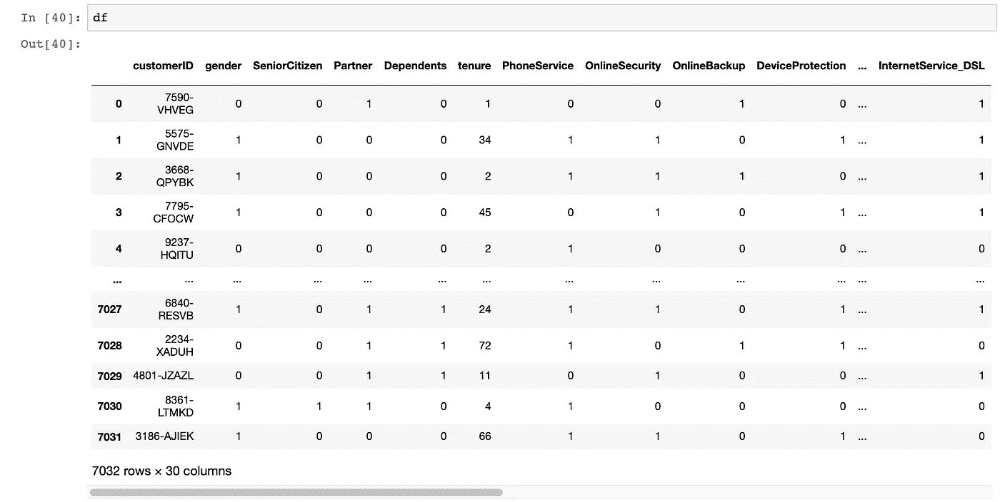**

**现在所有的分类和布尔列都完成了。
我们只剩下—**

## **数字列**

**数字列的预处理包括**缩放**，使得一个量的变化等于另一个量的变化。机器需要理解，仅仅因为一些列(如“总费用”)有很大的值，并不意味着它在预测结果方面起很大作用。为了实现这一点，我们将所有的数字列放在同一个**标度**中，这样它们就不会被另一个支配。**

```
from sklearn.preprocessing import StandardScaler
#Scaling Numerical columns
std = StandardScaler()
scaled = std.fit_transform(df[num_cols])
scaled = pd.DataFrame(scaled,columns=num_cols)df.drop(columns = num_cols,axis = 1, inplace= True)
df = df.merge(scaled,left_index=True,right_index=True,how = "left")
```

**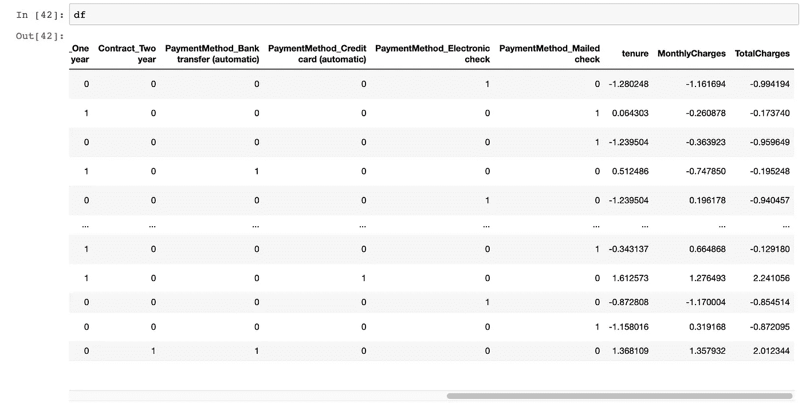**

## **分割训练和测试**

**完美。现在我们的数据已经被完美地缩放和分类了。我们可以将它们分成我们的训练集和测试集。**

**训练集是我们传递到训练过程中的数据，而测试数据用于评估我们的模型。**

```
#splitting train and test data 
train,test = train_test_split(df,test_size = .25 ,random_state = 111)#defining our features and metric
cols    = [i for i in df.columns if i not in Id_col + metric_col]
train_X = train[cols]
train_Y = train[metric_col]
test_X  = test[cols]
test_Y  = test[metric_col]
```

# **取样操作**

**如今，来自现实生活情况的数据经常导致对每个潜在输出的不平衡数量的观察。
通过数据探索，我们做的第一件事是找出流失客户和非流失客户的数量。结果是—**

****

**如您所见，非流失客户的数量**明显高于流失客户的数量**。不需要太多的细节，这将给我们的模型带来一个问题，因为机器正在获得更多关于非流失客户的**信息**，并且可能将流失客户误认为非流失客户。因此，这将降低预测**客户流失**的准确性。**

**换句话说，我们的模型将擅长预测客户是否会**留在**，但在预测客户是否会**流失**时表现不佳。根据业务需求，这显然与我们试图实现的目标相矛盾。我们希望尽可能准确地预测客户流失情况，以便抓住所有客户，并采取额外的商业行动来说服他们留下来。例如，如果我们知道客户即将流失，就发送折扣代码。**

## **过采样**

**也就是说，我们可以通过
过采样来最小化这个问题的影响。过采样是人为增加数据集中某一类的观察次数的方法。通常，我们更喜欢平衡每个类的观察数量，这意味着我们应该有 50%的流失观察和 50%的非流失观察。**

## **重击**

**我们将使用的方法是 SMOTE，代表综合少数过采样技术。在不涉及太多细节的情况下，SMOTE 人为地创造了新的观察结果，而不仅仅是现有少数民族案例的副本。相反，该算法通过涉及向量、随机数和每个样本的最近邻居来创建新的观察值。对我们来说，最主要的收获是，现在公平地创造了更多对**流失**客户的观察。**

**[这里是](https://medium.com/analytics-vidhya/balance-your-data-using-smote-98e4d79fcddb)为了便于理解，对 SMOTE 算法的补充阅读。**

```
from imblearn.over_sampling import SMOTEcols    = [i for i in df.columns if i not in Id_col+metric_col]
smote_X = df[cols]
smote_Y = df[metric_col]#Split train and test data
smote_train_X,smote_test_X,smote_train_Y,smote_test_Y = train_test_split(smote_X,smote_Y,                                                           test_size = .25 ,                                                                         random_state = 111)#oversampling minority class using smote
os = SMOTE(random_state = 0)
os_smote_X,os_smote_Y = os.fit_sample(smote_train_X.to_numpy(),smote_train_Y.to_numpy())
os_smote_X = pd.DataFrame(data = os_smote_X,columns=cols)
os_smote_Y = pd.DataFrame(data = os_smote_Y,columns=metric_col)
```

**现在，我们有 **2** 列车组和 **2** 测试组。
其中一个是原始数据，另一个应用了 SMOTE。
我们稍后会比较他们的表现。**

# **特征选择**

**现在我们有了一组平衡的数据。
我们如何知道**包括**和**不包括**的特征？**

**我们不应该假设所有的特征在预测结果时都起着重要的作用。其中有些可能无关紧要，也可能无关紧要。我们可以在相关图中清楚地观察到这一点。**

```
#correlation
correlation = df.corr()
#tick labels
matrix_cols = correlation.columns.tolist()
#convert to array
corr_array  = np.array(correlation)#Plotting
trace = go.Heatmap(z = corr_array,
                   x = matrix_cols,
                   y = matrix_cols,
                   colorscale = "Magma",
                   colorbar   = dict(title = "Pearson Correlation coefficient",
                                     titleside = "right"
                                    ) ,
                  )layout = go.Layout(dict(title = "Correlation Matrix for variables",
                        autosize = False,
                        height  = 720,
                        width   = 800,
                        margin  = dict(r = 0 ,l = 210,
                                       t = 25,b = 210,
                                      ),
                        yaxis   = dict(tickfont = dict(size = 9)),
                        xaxis   = dict(tickfont = dict(size = 9))
                       )
                  )data = [trace]
fig = go.Figure(data=data,layout=layout)
iplot(fig)
```

**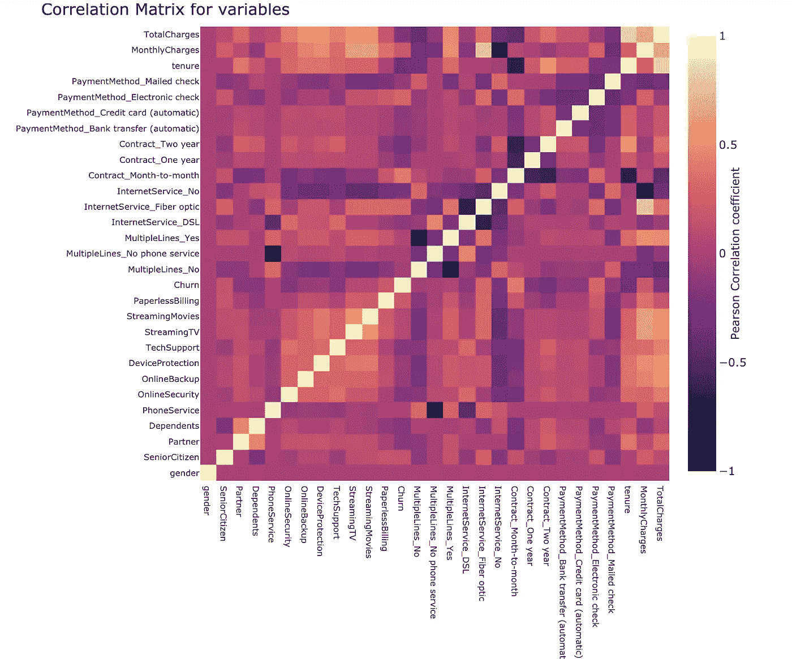**

**相关图表**

**我们可以从关联热图中观察到，不同的特征对客户流失有不同的影响。过多特征的结果是噪声，这会降低我们模型的性能。因此，我们如何确定哪些特征是重要的？— **功能选择****

**特征选择是机器学习中的核心技术之一，它将提高性能，缩短训练时间，并提高模型的简单性。有多种特征选择算法，我们今天将使用的一种被称为—
**递归特征消除**。**

**递归特征消除(RFE)拟合模型并消除最弱的特征，直到达到指定的特征数量。下面是对它的详细解释:**

> **如前所述，递归特征消除(RFE，Guyon 等人( [2002](https://bookdown.org/max/FES/references.html#ref-Guyon) ))基本上是预测器的向后选择。该技术首先在整个预测因子集上建立一个模型，并计算每个预测因子的重要性分数。然后移除最不重要的预测值，重新构建模型，并再次计算重要性分数。在实践中，分析师指定要评估的预测值子集的数量以及每个子集的大小。因此，子集大小是 RFE 的一个调整参数。优化性能标准的子集大小用于基于重要性排名选择预测器。然后，最佳子集用于训练最终模型。[4]**

```
from sklearn.linear_model import LogisticRegressionfrom sklearn.feature_selection import RFE
from sklearn.linear_model import LogisticRegressionlog = LogisticRegression()rfe = RFE(log,10)
rfe = rfe.fit(os_smote_X,os_smote_Y.values.ravel())#identified columns Recursive Feature Elimination
idc_rfe = pd.DataFrame({"rfe_support" :rfe.support_,
                       "columns" : [i for i in df.columns if i not in Id_col + metric_col],
                       "ranking" : rfe.ranking_,
                      })
cols = idc_rfe[idc_rfe["rfe_support"] == True]["columns"].tolist()
```

**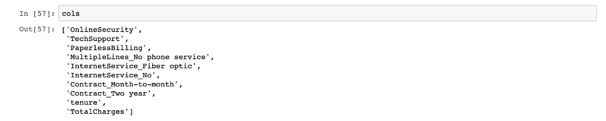**

**在这段代码中，我们选择了 10 个最好的特性来包含在我们的逻辑回归模型中。然后我们可以画出 RFE 的排名。**

```
import plotly.figure_factory as ff
tab_rk = ff.create_table(idc_rfe)
iplot(tab_rk)
```

**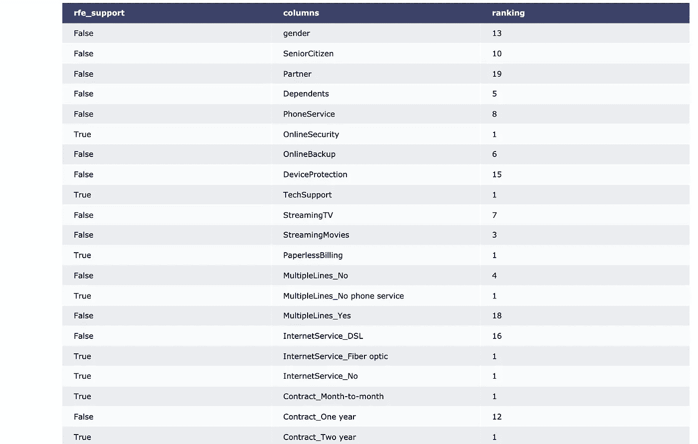**

**这张表显示了 RFE 选择的特性，以及它们各自的排名，这样你就可以衡量某个特性的重要性。
我们现在可以分离数据集了。**

```
#separating train and test data SMOTE
train_rf_X_smote = os_smote_X[cols]
train_rf_Y_smote = os_smote_Y
test_rf_X_smote  = test[cols]
test_rf_Y_smote  = test[metric_col]#separating train and test data Original
train_rf_X = train_X[cols]
train_rf_Y = train_Y
test_rf_X = test_X[cols]
test_rf_Y = test_Y
```

**在这个阶段，我们有 **2** 训练集和 **2** 测试集，其中所有特征都被递归消除。其中一个是原始数据，另一个应用了 SMOTE。**

# **培训模式**

**现在到了我们训练模型的实际阶段。
有多种算法用于训练分类问题。
我们无法判断哪种算法最适合我们的数据，因此我们通常使用多种算法进行训练，并根据精心选择的标准比较它们的性能。今天，我们将只关注**逻辑回归**以及它与我们数据的吻合程度。**

**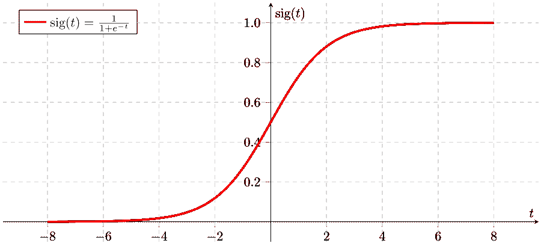**

**维基媒体的 Sigmoid 函数**

****逻辑回归**是最常用的机器学习算法之一，用来预测**二进制**类，在这种情况下**流失**而**不流失。**它的工作原理是将基于 Sigmoid 函数的 0 和 1 之间的**输出概率**附加到每个输入。基于默认为 0.5 的**阈值**，高于该阈值的将被归类为 **1** (流失)，低于该阈值的将被归类为 **0** (非流失)。**

**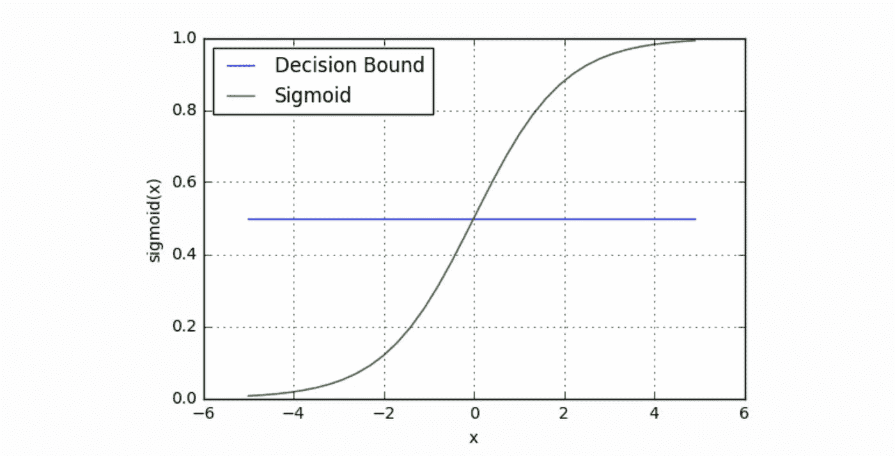**

**由 [ML-Cheatsheet](https://ml-cheatsheet.readthedocs.io/en/latest/logistic_regression.html#decision-boundary) 决定边界**

****

**决策阈值**

**例如，如果我们的阈值是 0.5，而我们对一组特征的预测概率是 0.7，那么在我们的例子中，我们会将这个观察结果归类为**变动**。**

**理解了这一点，让我们训练我们的数据。**

```
#training for dataset without smote
logit_ori_rfe = LogisticRegression(C=1.0, class_weight=None, dual=False, fit_intercept=True,
          intercept_scaling=1, max_iter=100, multi_class='ovr', n_jobs=1,
          penalty='l2', random_state=None, solver='liblinear', tol=0.0001,
          verbose=0, warm_start=False)
logit_ori_rfe.fit(train_rf_X,train_rf_Y)#training for dataset with smote
logit_smote_rfe = LogisticRegression(C=1.0, class_weight=None, dual=False, fit_intercept=True,
          intercept_scaling=1, max_iter=100, multi_class='ovr', n_jobs=1,
          penalty='l2', random_state=None, solver='liblinear', tol=0.0001,
          verbose=0, warm_start=False)
logit_smote_rfe.fit(train_rf_X_smote,train_rf_Y_smote)
```

**差不多就是这样，我们的模型已经训练好了。如你所见，训练一个模特并没有你想象的那么复杂。
大多数时候，将数据转换成“好的”格式进行训练，以及评估您的模型，这是非常耗时的部分。**

# **评估您的模型**

**我们有两种型号。一个用 **SMOTE** 数据集训练，一个用**原始**数据集训练。我们可以开始使用这些模型进行预测，但我们想首先**评估**这些模型的准确程度。
为了评估模型，我们需要考虑一些标准。**

**对于分类，我们用来评估模型的几个常用指标是**

*   **准确(性)**
*   **精确**
*   **召回**
*   **f1-分数**
*   **ROC 曲线**

**让我解释一下每一个的意思。**

**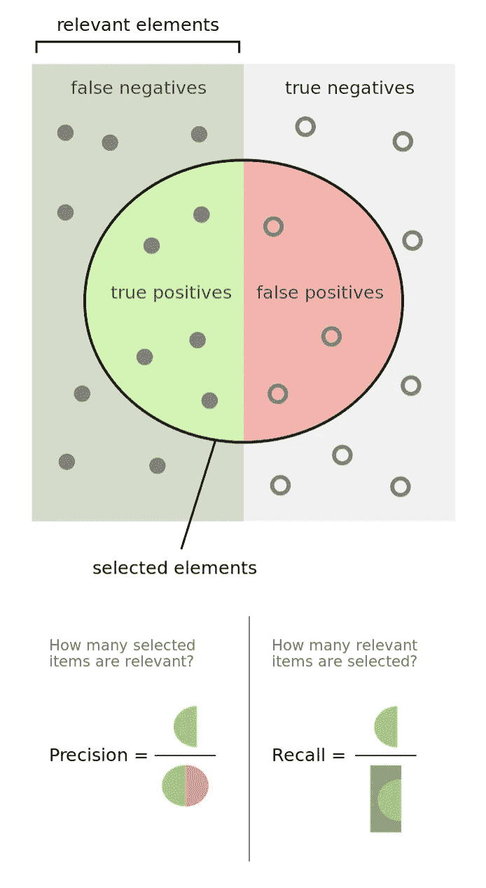**

**精确度和召回由[维基媒体](https://en.wikipedia.org/wiki/Precision_and_recall)**

**在讨论召回率和精确度之前，我们需要了解什么是误报、漏报以及它们的对应情况。**

**这可以通过左边的图表更好地解释，想象完整的图表是我们的数据集，圆圈是我们模型的预测。图的左边是实际的正值(1)，图的右边是实际的负值(0)。**

**看左边的圆圈，圆圈内的所有点都被我们的模型预测为正，而圆圈外的所有点都被我们的模型预测为负。我们还知道，在图的左边，圆圈外的所有点都是正的。因此，它被错误地预测，指示一个**假阴性。**图表左侧圆圈中的所有点都被正确预测，表明**真阳性**。**

**反之亦然适用于图的右侧。**

## **精确度和召回率**

**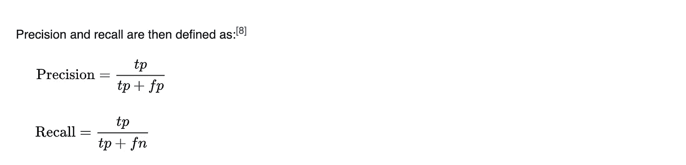**

**维基百科的精确度和召回率**

**精确度和召回率使我们对模型有了更深入的理解。
精度定义为相关结果的百分比，
召回定义为正确分类的相关结果的百分比。**

**在不涉及太多细节的情况下，我们模型中的精度指的是被正确分类的**预测流失客户**的百分比。**

**召回措施为正确分类的**实际流失客户**的百分比。**

## **F1 分数**

**在许多情况下，我们可以根据您试图解决的问题来优先考虑精度或回忆。在我们的案例中，我们肯定希望**优先考虑** **尽可能准确地预测实际客户流失**，这样我们就可以说服他们留下来。**

**在一般情况下，有一个指标可以协调精确度和召回率，这就是 F1 分数。总体目标是最大化 F1 分数，使你的模型更好。**

**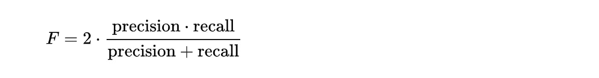**

**F1 分数公式**

## **ROC 曲线和 AUC**

**在调整多个变量以最大化我们的精确度、召回率和 F1 分数之后，我们还可以调整模型的阈值。**

**例如，阈值默认为 0.5，高于该值的任何输出概率都将被归类为 1。我们可以**将阈值**更改为更低/更高的值，以进一步增加我们的首选指标。**

**为了形象化这种变化，我们可以画出每个阈值对假阳性率和真阳性率的影响。曲线看起来会像这样。**

**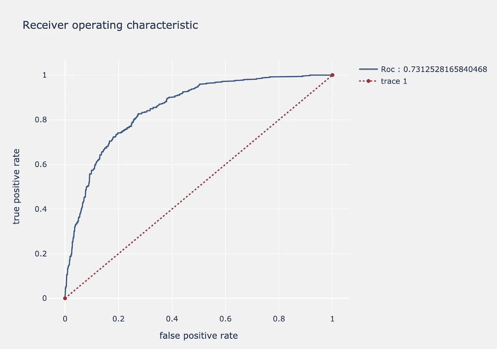**

**受试者工作特征曲线**

**再说一次，不要涉及太多的细节，你的模型越好，曲线(蓝色)就越靠近图的左上角。相反，一个在分类方面做得很差的模型会向直线(红色)收敛，这不比随机猜测好。**

**使用 ROC 曲线，我们可以正确地确定一个模型是否优于另一个模型。我们也可以根据我们是否应该**最大化真阳性率**，或者**最小化假阳性率**来选择我们的分类阈值。在我们的情况下，我们应该以最大化真实阳性率为目标。因此，这也将增加我们的**召回**指标。**

## **准确(性)**

**准确性是衡量模型性能的最基本的标准。它基本上是根据测试集正确预测的输出的百分比。**

**因此，我们确实应该考虑将**召回**、**准确性**和 **F1** **得分**作为这个特定模型的重要指标。**

**让我们开始吧。**

```
#perfoming evaluation for original dataset
predictions   = logit_ori_rfe.predict(test_rf_X)
probabilities = logit_ori_rfe.predict_proba(test_rf_X)print(classification_report(test_rf_Y,predictions))#confusion matrix
conf_matrix = confusion_matrix(test_rf_Y,predictions)
conf_matrix#roc_auc_score
model_roc_auc = roc_auc_score(test_rf_Y,predictions) 
print ("Area under curve : ",model_roc_auc,"\n")
fpr,tpr,thresholds = roc_curve(test_rf_Y,probabilities[:,1])
```

**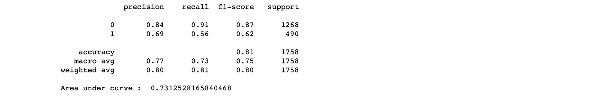**

**评估指标**

**从我们在原始数据集上训练的模型来看，总体准确率相当高，为 **81%** 。然而，我们可以看到代表**流失客户**的**类别 1** 的所有指标都相当低。**

*   **精度为 69%**
*   **召回率为 56%**
*   **F1 为 62%**

**由于观察值数量的不平衡，我们得到了一个相当高的加权平均值，因为与类别 1 相比，类别 0 的观察值要多得多。这是一个危险信号的迹象，因为我们的首要任务是能够准确预测 1 级。**

```
#plot roc curve
trace2 = go.Scatter(x = fpr,y = tpr,
                    name = "Roc : " + str(model_roc_auc),
                    line = dict(color = ('rgb(22, 96, 167)'),width = 2))
trace3 = go.Scatter(x = [0,1],y=[0,1],
                    line = dict(color = ('rgb(205, 12, 24)'),width = 2,
                    dash = 'dot'))data = [trace2,trace3]layout = go.Layout(dict(title = "Receiver operating characteristic",
                        autosize = False,
                        height = 700,width = 800,
                        plot_bgcolor = 'rgba(240,240,240, 0.95)',
                        paper_bgcolor = 'rgba(240,240,240, 0.95)',
                        margin = dict(b = 195),
                        xaxis = dict(title = "false positive rate"),
                        yaxis = dict(title = "true positive rate"),
                       )
                  )#defining figure and plotting
fig = go.Figure(data,layout=layout)
iplot(fig)
```

**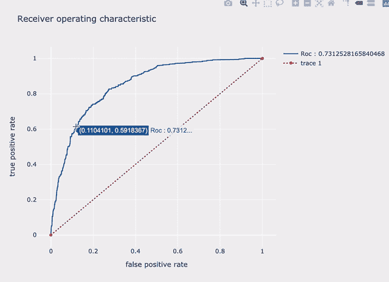**

**受试者工作特征曲线**

**从 ROC 曲线上我们看到 AUC 是 73%，后面可以对比其他模型。**

```
visualizer = DiscriminationThreshold(logit_ori_rfe)
visualizer.fit(train_X,train_Y)
visualizer.poof()
```

**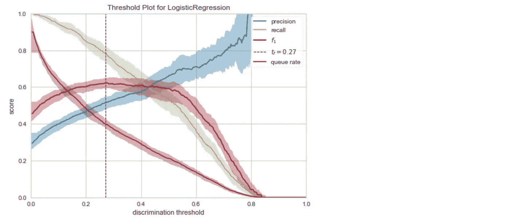**

**阈值图**

**阈值图对于我们确定**阈值**也很有用。正如我们所知，我们正试图**最大化** **召回**，同时不牺牲太多其他指标。阈值图帮助我们准确地做到这一点。
看起来接近 0.3 的阈值将允许我们最大限度地提高召回率，同时保持其他指标不变。**

**这就是我们迄今为止对第一个模型的理解，让我们评估一下由 SMOTE 数据集训练的模型。**

```
#perfoming evaluation for original dataset
predictions   = logit_smote_rfe.predict(train_rf_X_smote)
probabilities = logit_smote_rfe.predict_proba(train_rf_X_smote)print(classification_report(train_rf_Y_smote,predictions))#confusion matrix
conf_matrix = confusion_matrix(train_rf_Y_smote,predictions)
conf_matrix#roc_auc_score
model_roc_auc = roc_auc_score(train_rf_Y_smote,predictions) 
print ("Area under curve : ",model_roc_auc,"\n")
fpr,tpr,thresholds = roc_curve(train_rf_Y_smote,probabilities[:,1])
```

**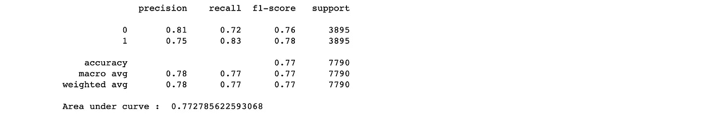**

**评估指标**

**很快，您可以观察到**第 1 类(流失客户)**的所有指标都显著增加。不利的一面是，整体精度会略有下降。**

*   **精度为 75%**
*   **召回率为 83%(几乎增加了 30%)**
*   **F1 为 78%**

**作为一名专业的数据科学家，您应该在一天中的任何时候推荐这个模型而不是第一个模型。因为当务之急是准确预测****的客户流失，所以你必须明白这个模型比之前的模型做得好得多，即使整体准确性略有下降。这就是真正的数据科学家与平庸的数据科学家的区别。******

```
****#plot roc curve
trace2 = go.Scatter(x = fpr,y = tpr,
                    name = "Roc : " + str(model_roc_auc),
                    line = dict(color = ('rgb(22, 96, 167)'),width = 2))
trace3 = go.Scatter(x = [0,1],y=[0,1],
                    line = dict(color = ('rgb(205, 12, 24)'),width = 2,
                    dash = 'dot'))data = [trace2,trace3]layout = go.Layout(dict(title = "Receiver operating characteristic",
                        autosize = False,
                        height = 700,width = 800,
                        plot_bgcolor = 'rgba(240,240,240, 0.95)',
                        paper_bgcolor = 'rgba(240,240,240, 0.95)',
                        margin = dict(b = 195),
                        xaxis = dict(title = "false positive rate"),
                        yaxis = dict(title = "true positive rate"),
                       )
                  )#defining figure and plotting
fig = go.Figure(data,layout=layout)
iplot(fig)****
```

******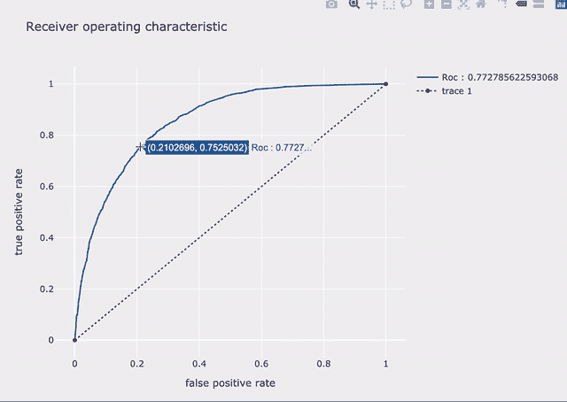******

******受试者工作特征曲线******

******从 ROC 曲线中，我们观察到 AUC 约为 78%,比我们之前的模型高出约 5%。这表明我们的 SMOTE 模型优于以前的模型。******

```
****visualizer = DiscriminationThreshold(logit_smote_rfe)
visualizer.fit(train_rf_X_smote,train_rf_Y_smote)
visualizer.poof()****
```

******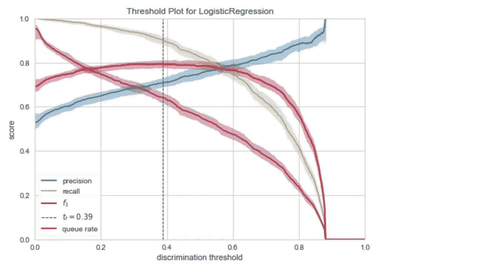******

******阈值图******

******阈值图也表明了我们当前模型的性能优势。请注意，我们如何在这里将阈值调得更高，以获得相对较高的召回率、精确度和准确度。******

******当前模型，阈值=0.4:******

*   ******约 90%的召回率******
*   ******F1 分数约为 80%******
*   ******大约 70%的精度******

******以前的模型，阈值= 0.3:******

*   ******约 80%的召回率******
*   ******F1 分数约为 60%******
*   ******大约 50%的精度******

******请注意，我们希望**避免**设置太低的阈值，否则我们会以过多的误报而告终。看起来我们有一个明显的赢家。******

****总的来说，我们用两个不同的数据集使用逻辑回归训练了两个模型，一个使用 SMOTE 采样，一个不使用。基于几个标准，SMOTE 模型在预测流失客户方面表现**明显更好。现在，您可以使用该模型来预测未来的客户流失。******

# ****结论****

********

****照片由[阿齐兹·阿查基](https://unsplash.com/@acharki95?utm_source=medium&utm_medium=referral)在 [Unsplash](https://unsplash.com?utm_source=medium&utm_medium=referral) 上拍摄****

****做得好，我知道这是一个漫长的，但它是值得的。
机器学习是一个复杂的过程，有许多因素决定你的模型的性能，从而决定你的技能组合。****

****在本文中，您已经了解到:****

*   ****什么是机器学习****
*   ****数据预处理(数值和分类)****
*   ****取样操作****
*   ****特征选择****
*   ****培训模型****
*   ****评估模型****

****这些技术只是机器学习的开始，
我们还有更多的内容要介绍。****

## ****在你走之前****

****我们的数据之旅还没有结束。随着数据行业人才的缺乏，用机器学习的适当知识来教育自己将使你在获得数据角色方面具有优势。请继续关注，我将在下一篇文章中讨论如何为您的数据集选择正确的模型，以及更多关于数据行业的故事、指南和经验。与此同时，请随意查看我的其他文章，以暂时满足您对数据的渴望。****

****一如既往，我引用一句话作为结束。****

> ****在机器学习和人工智能领域，我们需要迎头赶上。——**克劳斯·弗罗利希******

## ****[订阅我的时事通讯，保持联系。](https://www.nicholas-leong.com/sign-up-here)****

****也可以通过 [**我的链接**](https://nickefy.medium.com/membership) 注册中等会员来支持我。你将能够从我和其他不可思议的作家那里读到无限量的故事！****

****我正在撰写更多关于数据行业的故事、文章和指南。你绝对可以期待更多这样的帖子。与此同时，可以随时查看我的其他 [**文章**](https://medium.com/@nickmydata) 来暂时填补你对数据的饥渴。****

*******感谢*** *的阅读！如果你想与我取得联系，请随时联系我在 nickmydata@gmail.com 或我的* [*LinkedIn 个人资料*](https://www.linkedin.com/in/nickefy/) *。也可以在我的*[*Github*](https://github.com/nickefy)*中查看之前写的代码。*********