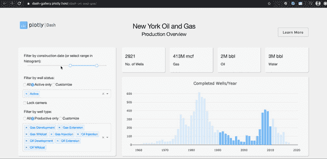
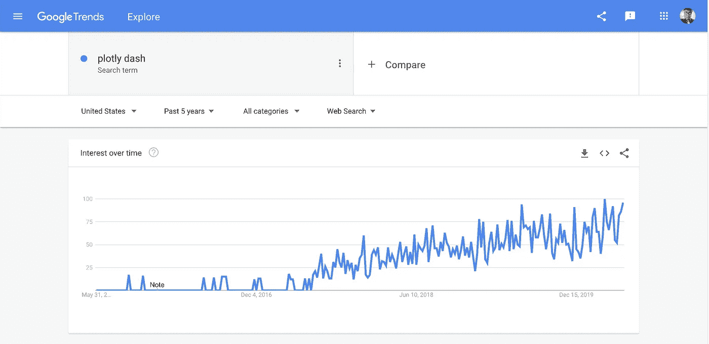
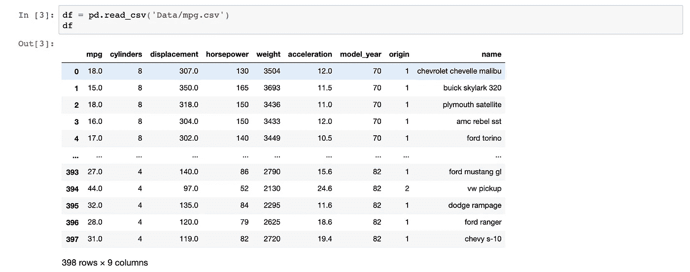
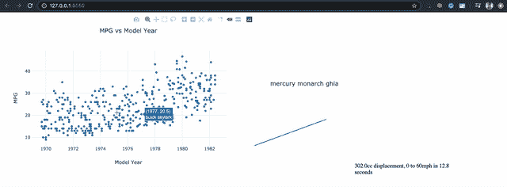
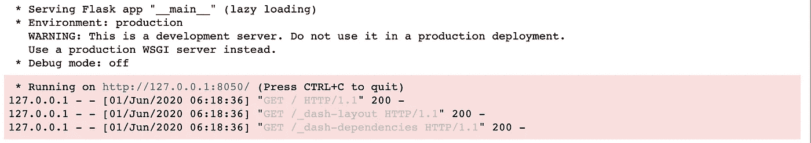
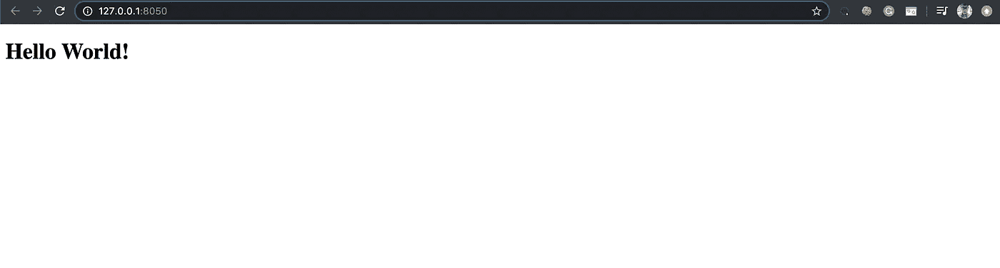
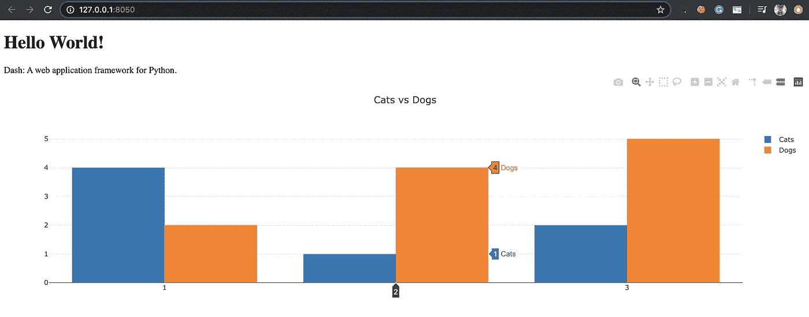
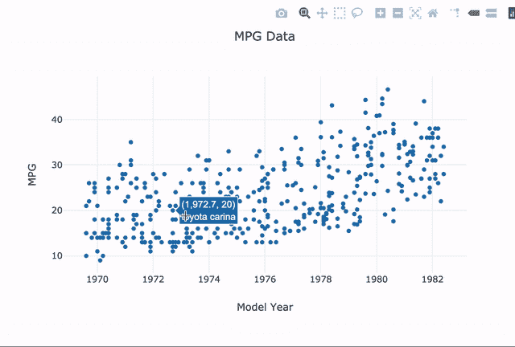
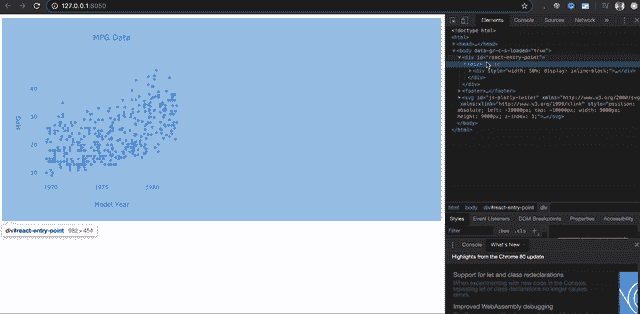
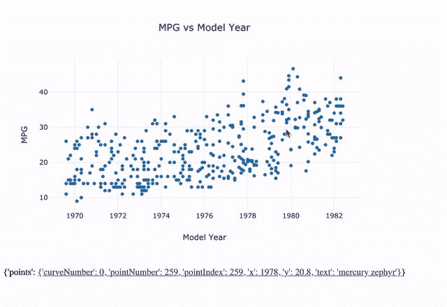

# 面向数据科学的 python——Plotly Dash 交互式可视化指南

> 原文：<https://towardsdatascience.com/python-for-data-science-a-guide-to-plotly-dash-interactive-visualizations-66a5a6ecd93e?source=collection_archive---------9----------------------->

## 构建您的第一个 web 应用程序！


卢克·切瑟在 [Unsplash](https://unsplash.com?utm_source=medium&utm_medium=referral) 上的照片

问候读者，
如果你像我一样，**你喜欢数据**。当数据被恰当地呈现时，它可以讲述很多故事。

我们生活在一个人们依赖数据进行商业决策的时代，这就是为什么专业地展示数据会让你领先于他人。

> 想象给了你一些你不知道的问题的答案。
> —本·施奈德曼

我们可以通过使用惊人的可视化技术来实现这一点。我们已经讨论过如何利用我们目前在 **Python** 中拥有的强大库。

[](/python-for-data-science-a-guide-to-data-visualization-with-plotly-969a59997d0c) [## 面向数据科学的 python——Plotly 数据可视化指南

### 现在是 2020 年，是时候停止使用 Matplotlib 和 Seaborn 了

towardsdatascience.com](/python-for-data-science-a-guide-to-data-visualization-with-plotly-969a59997d0c) [](/python-for-data-science-advance-guide-to-data-visualization-with-plotly-8dbeaedb9724) [## 用于数据科学的 Python 使用 Plotly 进行数据可视化的高级指南

### 如何在 Plotly 中添加和自定义滑块、下拉菜单和按钮

towardsdatascience.com](/python-for-data-science-advance-guide-to-data-visualization-with-plotly-8dbeaedb9724) 

在这篇文章中，我们将会更进一步。我们将讨论**如何使用 Python 中的 Plotly Dash 构建一个交互式仪表盘。仪表板甚至可以作为 web 应用程序托管。**

# 破折号



纽约石油和天然气由 [Dash 应用程序库](https://dash-gallery.plotly.host/dash-oil-and-gas/)

达什是这个街区新的性感男孩。

这是一个 Python 框架，允许你使用 **Flask、Plotly.js 和 React.js** 创建惊人的 web 应用。Dash 在构建具有高度定制用户界面的数据可视化应用程序方面效率极高，无需了解任何 HTML、CSS 或 Javascript。

基本上，如果你已经掌握了 Python，它会很快，很漂亮，也很容易学。

Dash 消除了所有需要了解 web 开发的担忧，包括部署应用程序的头痛问题。它易于维护，跨平台，并且可以随时移动。

现在你可以只用纯 python 来构建你的移动响应网络应用。

## 但是说够了

我开始听起来像 Dash 的推销员了。

spiro 的 gif 图片

同样令人欣慰的是，近年来对 Plotly Dash 的需求正在增加。以下是 Plotly Dash 在过去 5 年的谷歌趋势中的结果。



[谷歌趋势](https://trends.google.com/trends/?geo=US)

现在那已经不碍事了。让我们开始吧。

# 先决条件

Dash 可视化基于 Plotly。
因此，请确保你在继续阅读这个提前指南之前，已经对**和**的基础知识有了**扎实的理解**。你可以在这里参考我写的关于 Plotly 的 [**基础的文章**](/python-for-data-science-a-guide-to-data-visualization-with-plotly-969a59997d0c) 。

为了和 Plotly 一起工作，你也应该掌握熊猫。
真巧。我碰巧也写了一本熊猫指南。
如需刷新记忆，请过一遍。

[](/python-for-data-science-basics-of-pandas-5f8d9680617e) [## 用于数据科学的 Python 熊猫指南

### 10 分钟内完成数据探索指南

towardsdatascience.com](/python-for-data-science-basics-of-pandas-5f8d9680617e) 

# 进口

## 装置

```
pip install dash
```

使用 Jupyter 笔记本电脑…

```
import dash
import dash_core_components as dcc
import dash_html_components as html
import plotly.graph_objs as go
import pandas as pd
import numpy as np
from dash.dependencies import Input, Output
```

[链接到本指南中使用的数据集](https://gist.github.com/omarish/5687264)。

```
df = pd.read_csv('mpg.csv')
```



作者图片

# 第一部分。布局



作者图片

Dash 框架分为两部分。第一部分是应用程序的**布局**，它定义了应用程序的外观和感觉。这涉及到你应用程序上所有东西的风格、定位和大小。

Dash 使用组件来定义布局。

*   **dash_core_components** —用于交互**用户界面**的组件。这些组件由 Dash 团队开发和维护，包括像**搜索栏**、**范围滑块**和任何你能想到的用于**交互式图形体验的东西**。
*   **dash_html_components** —表示 **HTML** 、 **CSS** 和 **Javascript** 代码的组件。你可以使用这个组件来声明标签，比如 **div** 和 **img
    和**，就像你开发一个网站一样。

让我们建立一个简单的“Hello World”布局来热身。

```
#initiating the app
app = dash.Dash()#defining the layout
app.layout = html.Div(children=[
    html.H1(children='Hello World!')
])#running the app
if __name__ == '__main__':
    app.run_server()
```

在这个应用程序中，我们简单地定义了一个 [**H1 HTML**](https://www.w3schools.com/tags/tag_hn.asp) 标签为“Hello World”。
不管你在哪里运行代码，你都应该像这样。



作者图片

点击链接访问您的应用程序。



作者图片

这就是你的第一个“Hello World”应用程序。这很酷，但让我们在应用程序中展示一个真实的图表。

```
#initiating the app
app = dash.Dash()#defining the layout
app.layout = html.Div(children=[
    html.H1(children='Hello World!')
    html.Div(children='Dash: A web application framework for Python.'),dcc.Graph(
        id='graphid',
        figure={
            'data': [
                {'x': [1, 2, 3], 'y': [4, 1, 2], 'type': 'bar', 'name': 'Cats'},
                {'x': [1, 2, 3], 'y': [2, 4, 5], 'type': 'bar', 'name': 'Dogs'},
            ],
            'layout': {
                'title': 'Cats vs Dogs'
            }
        }
    )
])#running the app
if __name__ == '__main__':
    app.run_server()
```



作者图片

在这段代码中，我们引入了 Div 标签(最常用的标签之一)和 **dcc。图形组件**。

## dcc。图形组件

图形组件用于显示一个**图形**图形。图形参数用来表示 **go。图，**你可以在这里[刷新一下关于它的记忆](/python-for-data-science-a-guide-to-data-visualization-with-plotly-969a59997d0c)。

```
fig = go.Figure(data = data,layout = layout)#**data can be any type of plotly graphs (pie chart,scatter, etc)**
```

基本上，您可以通过 **dcc 传递任何类型的 Plotly 图。要在您的应用程序上显示的图形**组件。然后，您可以进一步**定制**Plotly 和 Dash 中该图形的样式。

现在让我们为从 [Github](https://gist.github.com/omarish/5687264) 导入的数据做一个布局。

```
app = dash.Dash()
df['year'] = random.randint(-4,5,len(df))*0.10 + df['model_year']app.layout = html.Div([
                html.Div([
                    dcc.Graph(id='mpg-scatter',
                              figure={
                                  'data':[go.Scatter(
                                      x=df['year']+1900,
                                      y=df['mpg'],
                                      text=df['name'],
                                      mode='markers'
                                  )],
                                  'layout':go.Layout(
                                      title='MPG vs Model Year',
                                      xaxis={'title':'Model Year'},
                                      yaxis={'title':'MPG'},
                                      hovermode='closest'
                                   )}
                    )
                ],style={'width':'50%','display':'inline-block'}),
])if __name__ == '__main__':
    app.run_server()
```



作者图片

在这个应用程序中，我们只是将数据集中的车型年的每加仑**英里数可视化。**另外，随着车型年的增加，我们可以清楚地看到 MPG 略有增加。

使用 style 参数，我们可以声明我们希望图表在仪表板中的外观。通过**检查**web 应用程序的元素，您可以进一步深入到样式中。



作者图片

我们可以看到这个内部 div 的宽度是其父 div 的一半。这是因为我们在代码中声明了以下内容。

```
style={'width':'50%'}
```

我认为到目前为止，在 Dash we 中制作一个简单的仪表板是非常简单的。

*   像你在绘图时那样绘制图表
*   将图表作为 **dcc 插入。图**仪表板中的部件
*   根据我们的需要调整风格
*   运行应用程序

# 第二部分。互动回访

这就是有趣的地方。

在声明了我们的基本布局之后，Dash 允许我们在应用程序中添加复杂的交互。这个组件也将允许我们实时更新我们的数据。

*   当用户悬停在您的图表上时，进行某些更改
*   当用户在搜索栏中键入内容时更新可视化效果
*   在用户刷新时或在**实时**更新数据

**是的，你没听错。**
如果需要，仪表板将能够在**中实时更新自身**，但稍后会详细介绍。让我们来讨论如何使用回调来更新特定用户操作的数据。

## 回调函数

我们通过在布局之后定义**回调函数**来实现这一点。回调函数，像其他函数一样，有—

*   一个输入
*   一个输出
*   如何处理输入

```
[@app](http://twitter.com/app).callback(Output('<component-id>','<what to update>'),
             [Input('<component-id>','<what to take in as Input>')])
def callback_graph(<random name for inputs>):
    x = do something with x
    return x
```

使用我们在 Dash 中声明的组件 id，我们能够**精确定位**我们想要什么作为我们函数的输入，以及更新什么。

## Hoverdata

例如，我们将使用包含在 **dcc 中的一个属性。图形**组件默认为，**悬停数据**。它会返回一个 JSON 字符串，其中包含您所悬停的数据的相关信息。让我展示给你看。

```
html.Div([
   dcc.Markdown(id='hoverdata-text')
])[@app](http://twitter.com/app).callback(Output('hoverdata-text','children'),
             [Input('mpg-scatter','hoverData')])
def callback_stats(hoverData):
    return str(hoverData)#children is the default property that a component will display
```



作者图片

在这一节中，我们在图表下面添加了一个 Div 来显示我们所悬停的内容。如您所见，当我们将鼠标悬停在图中的不同点上时，Div 的内容会立即更新。我们通过以下方式实现这一目标—

*   将 HoverData 作为输入
*   将 Div 声明为输出
*   将 HoverData 显示为纯文本

*额外注意:HoverData 中的 **pointIndex** 代表当前引用数据的 DataFrame 的索引。这在以后会很有用。

也就是说，我们可以利用接收到的输入做各种事情。**天空才是极限。**

## 回去工作

让我们展示一些关于我们导入的数据集的有趣内容。
对于我们的第一款网络应用，我们希望展示每个数据点—

*   汽车型号名称
*   加速
*   达到 0 到 60 英里/小时所需的时间


作者图片

通过利用 HoverData 中的数据，我们可以参考我们的 **pandas dataframe，mpg.csv** 中的实际数据。然后，我们可以基于它进行计算，并显示我们想要显示的各种指标。

我希望您现在意识到了，Dash 框架有多强大。

# 结论


[布鲁克·卡吉尔](https://unsplash.com/@brookecagle?utm_source=medium&utm_medium=referral)在 [Unsplash](https://unsplash.com?utm_source=medium&utm_medium=referral) 上的照片

**恭喜你，**

您已经掌握了 Plotly Dash 的基本概念。

在这篇文章中，你学到了—

**1。仪表板—布局**

**2。破折号—回调**

这两者对于构建你的第一个 web 应用程序都是必不可少的。

**现在去吧，数据从业者，**

去造一个你感兴趣的东西，展示给全世界。

如果你遇到困难，请随时联系我。你可以在下面找到我的信息。

# 在你走之前

我们的数据之旅还没有结束。我正在撰写更多关于数据行业的故事、文章和指南。你绝对可以期待更多这样的帖子。与此同时，请随意查看我的其他[文章](https://medium.com/@nickmydata)来暂时填补您对数据的渴望。

像往常一样，我引用一句话作为结束。

> 学习如何做数据科学就像学习滑雪一样。你必须做这件事。 *—* [*克劳迪娅·珀里奇*](https://www.linkedin.com/in/cperlich/) *，首席科学家，d stilley*

## [订阅我的简讯，保持联系。](https://www.nicholas-leong.com/sign-up-here)

也可以通过 [**我的链接**](https://nickefy.medium.com/membership) 注册一个中等会员来支持我。你将能够从我和其他不可思议的作家那里读到无限量的故事！

我正在撰写更多关于数据行业的故事、文章和指南。你绝对可以期待更多这样的帖子。与此同时，可以随时查看我的其他 [**文章**](https://medium.com/@nickmydata) 来暂时填补你对数据的饥渴。

***感谢*** *的阅读！如果你想和我取得联系，请随时通过 nickmydata@gmail.com 联系我或者我的* [*LinkedIn 个人资料*](https://www.linkedin.com/in/nickefy/) *。也可以在我的*[*Github*](https://github.com/nickefy)*中查看之前写的代码。*