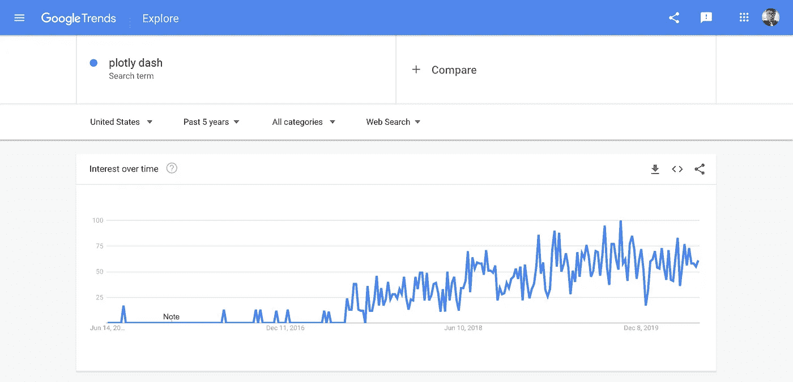
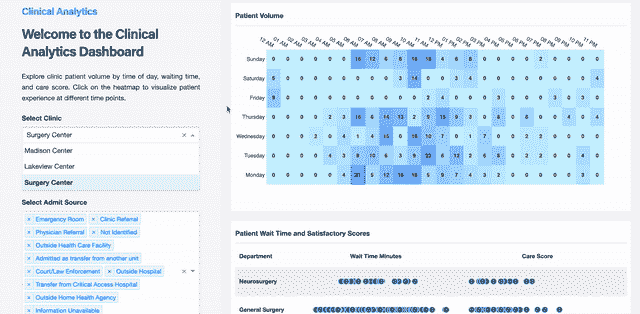
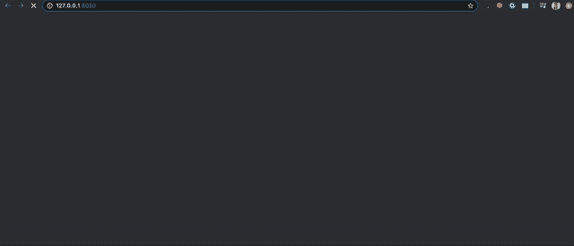
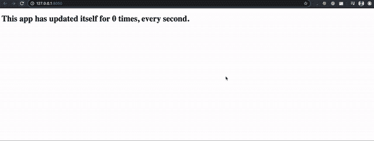
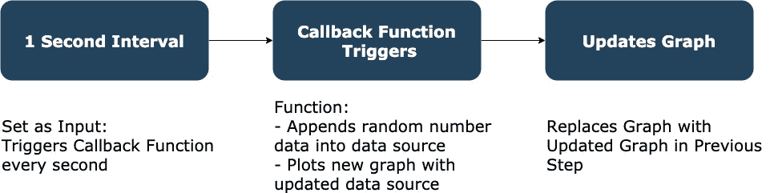
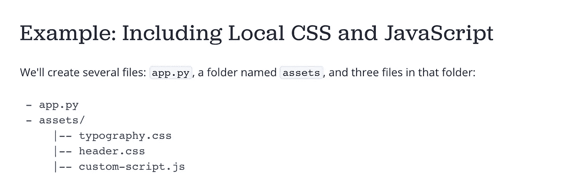

# 用于数据科学的 python-Plotly Dash 交互式可视化高级指南

> 原文：<https://towardsdatascience.com/python-for-data-science-advanced-guide-to-plotly-dash-interactive-visualizations-8586b0895032?source=collection_archive---------14----------------------->

## 构建您的第一个实时仪表板！不，真的！


斯蒂芬·道森在 [Unsplash](https://unsplash.com?utm_source=medium&utm_medium=referral) 上拍摄的照片

**问候数据从业者，**
我想你已经意识到对懂得如何**交流**数据的人的需求在增加。这正是我们应该在数据科学行业中不断寻求改进、学习更多知识和提高技能的原因。

即使围绕机器学习大肆宣传，**数据可视化也没有失去其重要性。**在规划任何机器学习之前，通常需要进行探索性数据分析。

大型科技公司经常需要交流他们拥有的数据。
我们是**执行**的人。

一个很好的例子就是**谷歌**和他们已知的**谷歌趋势**。



作者截图

因此，构建干净的**和漂亮的**T21 可视化是一项有价值的技能，它绝对会让你脱颖而出。****

# 破折号



[Dash 应用程序库](https://dash-gallery.plotly.host/dash-oil-and-gas/)的临床分析仪表板

你听说过**神出鬼没**吗？

达什是这个街区的新成员。我在这里写了一下。

[](/python-for-data-science-a-guide-to-plotly-dash-interactive-visualizations-66a5a6ecd93e) [## 面向数据科学的 python——Plotly Dash 交互式可视化指南

### 构建您的第一个 web 应用程序！

towardsdatascience.com](/python-for-data-science-a-guide-to-plotly-dash-interactive-visualizations-66a5a6ecd93e) 

基本上， **Dash** 是新的 **Python 库**，它允许你在不需要了解任何 **HTML、CSS 或 Javascript 的情况下，构建具有高度定制化用户界面的惊人的数据可视化应用。**

它消除了部署应用程序的麻烦，使其移动响应和易于维护。

但是你已经知道我在想什么了。

gif 由 [thelonelyisland](https://giphy.com/channel/thelonelyisland)

你不是为这个来的，你想知道更多。

在本文中，我们将讨论如何将更多的**定制**添加到 Dash web 应用程序中。我们还将深入探讨如何在没有任何交互的情况下实时更新仪表盘，**。**

# 先决条件

Dash 可视化基于 Plotly。理解构建简单的 **Plotly 图**的基本原理很重要。我在这里 **，**写了构建基本的 Plotly 图 [**，涵盖了构建任何类型的图时需要理解的概念。**](/python-for-data-science-a-guide-to-data-visualization-with-plotly-969a59997d0c)

[](/python-for-data-science-a-guide-to-data-visualization-with-plotly-969a59997d0c) [## 面向数据科学的 python——Plotly 数据可视化指南

### 现在是 2020 年，是时候停止使用 Matplotlib 和 Seaborn 了

towardsdatascience.com](/python-for-data-science-a-guide-to-data-visualization-with-plotly-969a59997d0c) 

为了使用 Plotly，您需要使用 **Pandas** 对您的数据执行一些**软转换**。

我掩护你。我碰巧也写了一本熊猫指南。
如果你需要刷新关于熊猫的记忆，请去翻阅一下。

[](/python-for-data-science-basics-of-pandas-5f8d9680617e) [## 用于数据科学的 Python 熊猫指南

### 10 分钟内完成数据探索指南

towardsdatascience.com](/python-for-data-science-basics-of-pandas-5f8d9680617e) 

# 进口

## 装置

```
pip install dash
```

使用 Jupyter 笔记本电脑…

```
import dash
import dash_core_components as dcc
import dash_html_components as html
import plotly.graph_objs as go
import pandas as pd
from dash.dependencies import Input, Output
```

# 实时更新



作者图片

在这一部分，我们将讨论如何让您的仪表板**实时运行**。

**是的，你没听错。**

Dash 允许其用户通过更新其数据源来实时自动化仪表板，而无需任何交互。这是通过实现**间隔**组件来实现的。

## 仪表板核心部件—间隔

dash 核心组件中的 interval 组件是一个**触发器，它将定期触发回调**。要在应用程序上实现这一点，只需将间隔连接到您需要更新的标签或图表，然后让奇迹发生。

我们将通过一个简单的例子来探讨这个问题。

```
app = dash.Dash()app.layout = html.Div([
    html.H1(id='live-counter'),
    dcc.Interval(
        id='1-second-interval',
        interval=1000, 
        n_intervals=0
    )
])[@app](http://twitter.com/app).callback(Output('live-counter', 'children'),
              [Input('1-second-interval', 'n_intervals')])
def update_layout(n):
    return 'This app has updated itself for {} times, every second.'.format(n)if __name__ == '__main__':
    app.run_server()
```



作者图片

在本节中，我们简单地定义了一个 H1 标签和一个区间组件。然后我们定义了一个回调函数，将区间组件作为输入，将 H1 标签作为输出。

组件中的一个重要属性是 **interval** 属性，它定义了组件触发的频率。在这里，我们采取 1 秒钟的间隔。

**这意味着回调函数会每 1 秒自动触发一次。**

最后，我们可以利用 interval 组件中的 n 属性，它会根据我们定义的时间间隔自动更新。只需插入 **n** 作为我们显示的文本的一部分，以显示实时变化。

## 向上拉平

让我们把它提高一个档次，好吗？
我们如何为实际的**图**实现这一点？

很简单，我们更新图表本身。

作者代码


作者图片

在这个代码块中，我们简单地定义了一个图形组件和一个区间组件。然后我们定义了一个回调函数，将 **interval 组件作为输入，图形的数字作为输出。**

在我开始解释之前，一个好的流程图总是有帮助的。



作者图片

每秒钟，带有随机数的新数据被**追加**到我们的数据源中。然后基于那个**更新的数据源绘制一个新的图表。**应用程序上的图形随后会被更新后的图形替换为**。**

这里，我们只是将随机数作为数据插入到数据源中。但是，如果您正在跟踪，您将知道您可以基于您的管道轻松地追加/覆盖您的数据源**。**

**你在实时搜集数据吗？**

**您是否在为您的网站可视化交易数据？**

**您可以轻松地将它声明为您的数据源，并每一秒/每一分/每一天都将其可视化。**

我希望你现在意识到 Dash 有多强大。如何利用它取决于你的想象力。

*注意:注意更新图表的时间间隔太小。拥有实时数据而没有真正的用例是不明智的，因为在更新数据源时可能会有极其繁重的计算，更不用说绘制极其繁重的图形了。*

# 高级定制

所以现在你已经能够建立图表并自动化它们了。下一步是什么？

你需要**设计**和**定制**你的网络应用，让它对用户来说看起来很漂亮。从颜色到定位，Dash 让你只用一行代码就能轻松做到。

## 半铸钢ˌ钢性铸铁(Cast Semi-Steel)

CSS 代表层叠样式表，它是设计 HTML 标签样式的主要语言。如果你希望美化你的网络应用，学习 CSS 是必须的。

## 如何添加 CSS

Dash 允许您在 Python 代码本身中添加 CSS。
**对于 Dash** 中几乎每一个 **组件，都有一个名为‘style’的属性，允许你通过 **Python 字典**为那个组件声明 CSS。**

```
html.H1(children='Hello World!',
style={'width':'20%','display':'inline-block'})
```

那很酷。然而，如果您的 web 应用程序可伸缩，有一种更好的方法来声明您的 CSS。

专门为每个组件声明 CSS 是低效的，它还会降低应用程序的加载时间。

因此，我们可以在 Dash 中使用 **Classname** 解决方案，它本质上是 HTML 元素的 class 属性。



截图来自[剧情](https://dash.plotly.com/external-resources)

在开始 Dash 代码的同一个文件夹中，创建另一个名为 **assets** 的文件夹，并将所有 CSS 和 Javascript 代码放入其中。默认情况下，最新的 Dash 版本将**读取所有以。css 和。js** **从资产文件夹**并将其应用到 web 应用程序。

**app.py:**

```
app = dash.Dash(__name__)app.layout = html.H1(children='Hello World!', 
className= 'H1-Text H1-Text-Display')if __name__ == '__main__':
    app.run_server()
```

**app.css:**

```
.H1-Text{
 width:20%;
}.H1-Text-Display{
 display:inline-block;
}
```

这样，您可以在 Dash 代码中为不同的组件重用类。
让它更干净更快捷。

*注意:为了让 Dash 默认读取 assets 文件夹，请在声明 app = dash 时包含 __name__ in。破折号(__name__)。*

# 结论


照片由 [YTCount](https://unsplash.com/@ytcount?utm_source=medium&utm_medium=referral) 在 [Unsplash](https://unsplash.com?utm_source=medium&utm_medium=referral) 上拍摄

**祝贺你，** 你在短跑方面又上了一个台阶。

在这篇文章中，你学到了—

1.  **Dash —实时更新**
2.  **破折号—添加 CSS**

极限是天空。现在去吧，做点东西，和我分享。我等着呢。

# 在你走之前

我们的数据之旅还没有结束。我正在撰写更多关于数据行业的故事、文章和指南。你绝对可以期待更多这样的帖子。与此同时，请随意查看我的其他[文章](https://medium.com/@nickmydata)来暂时填补您对数据的渴望。

像往常一样，我引用一句话作为结束。

> 数据是新的科学。大数据掌握着答案*。
> —*VMware 首席执行官帕特·基尔辛格

## [**订阅我的简讯保持联系。**](https://www.nicholas-leong.com/sign-up-here)

也可以通过 [**我的链接**](https://nickefy.medium.com/membership) 注册一个中等会员来支持我。你将能够从我和其他不可思议的作家那里读到无限量的故事！

我正在撰写更多关于数据行业的故事、文章和指南。你绝对可以期待更多这样的帖子。与此同时，你可以随时查看我的其他 [**文章**](https://medium.com/@nickmydata) 来暂时填补你对数据的渴望。

***感谢*** *的阅读！如果你想和我联系，请随时通过 nickmydata@gmail.com 联系我或者我的* [*LinkedIn 个人资料*](https://www.linkedin.com/in/nickefy/) *。你也可以在我的*[*Github*](https://github.com/nickefy)*中查看之前写的代码。*