# 用于数据科学的 Python 在执行机器学习之前要做什么？

> 原文：<https://towardsdatascience.com/python-for-data-science-what-to-do-before-performing-machine-learning-a30f62465632?source=collection_archive---------24----------------------->

## 不要沉迷于机器学习模型，先了解你的数据。


你好，读者，
欢迎来到另一集“数据会让你变得富有”,在这里我将分享我的经验、指南和我的数据之旅的故事。
如果你是来学习新东西的，请继续阅读，我保证你会从我的所有文章中有所收获，因为我的主要动机是为我的观众提供**价值**。这就是我介绍自己的方式，即使是在面试中。

本周，我们将谈论**机器学习**。
对，大家都感兴趣的话题。每个数据科学家都在展示他们的模型，比较他们的准确度分数，而他们中的一些人甚至不知道这些数据是关于什么的。

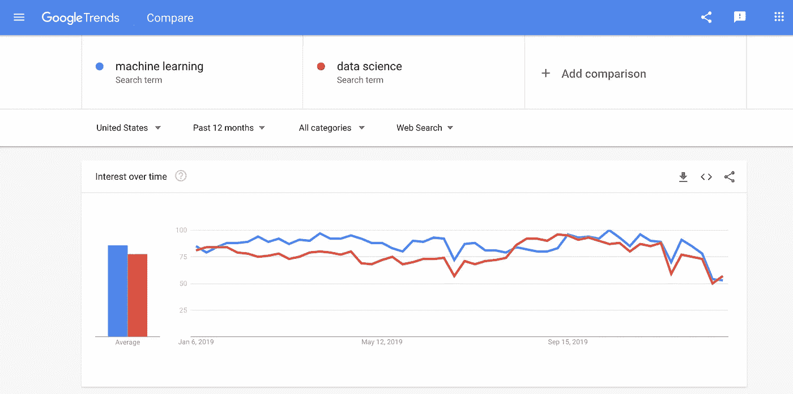

谷歌趋势的机器学习趋势

机器学习正在兴起。我们都知道。
基于 Google Trends，它甚至与数据科学本身作为一个话题不相上下，
我们都知道数据科学有多热门。

我经常看到，当谈到数据时，初级数据从业者脑海中闪现的第一件事是机器学习……而且不仅仅是他们。

最近，我参加了公司内部的**黑客马拉松**。
由组织的**最高管理层**决定的进入前 3 名的想法，都与机器学习有关。在这一点上，很难忽视机器学习，因为每个人都在学习。
然而，只有极小比例的数据从业者能做好。

> 忘记人工智能吧——在大数据这个勇敢的新世界里，我们应该提防的是人工白痴。—汤姆·查特菲尔德

不要误解我。我不是来攻击机器学习的。相反，我在这里指导你如何做得更好。不要在没有首先了解什么是**业务需求**的情况下盲目地投入机器学习。在**了解你的数据集**之前，不要开始考虑用什么算法。如果你没有完全掌握你的**问题陈述，又是什么影响了它**，你怎么知道应该包括哪些栏目？

我们很多人都被细节所困扰，但最终，这完全取决于我们能为我们工作的组织提供多少价值。为了提供这样的影响，我们必须完全理解我们的数据集，这就引出了我的下一个话题。

# 数据探索


照片由[威利安·贾斯登·德·瓦斯康塞洛斯](https://unsplash.com/@willianjusten?utm_source=medium&utm_medium=referral)在 [Unsplash](https://unsplash.com?utm_source=medium&utm_medium=referral) 上拍摄

在决定对数据集执行何种技术之前，您必须首先完全理解它。你可以通过**探索**数据集来实现。

> **探索**是以发现[信息](https://en.wikipedia.org/wiki/Information)或资源——维基百科为目的的搜索行为

下面是维基百科(100%可信)在 **Exploration 上提供的定义。现在把它应用到你的数据集中。**

就像上面的图像一样，您现在处于数据集中的陌生区域。你可以通过问这样的问题来更好地理解它:

*   数据集的目标是什么？
*   我们试图衡量的指标是什么？
*   每列是什么意思？

为了回答这些问题，我们通过使用**熊猫**来彻底检查数据。如果我们能够**可视化**某些点，那就更清楚了。

# 先决条件

数据探索大量使用**熊猫**。
因此，你应该可以轻松地浏览它。你可以通读一下我写的关于**熊猫基础知识**的文章来刷新你的记忆。

[](/python-for-data-science-basics-of-pandas-5f8d9680617e) [## 用于数据科学的 Python 熊猫指南

### 10 分钟内完成数据探索指南

towardsdatascience.com](/python-for-data-science-basics-of-pandas-5f8d9680617e) 

除了熊猫之外，我们也将视觉化我们的发现。我对自己的可视化感到自豪，因为它让我有能力绘制出交互式图形。这在探索过程中非常有用，因为我可以流畅地浏览图表。如果你是 Plotly 的新手，请仔细阅读我关于如何使用 Plotly 的文章。

[](/python-for-data-science-a-guide-to-data-visualization-with-plotly-969a59997d0c) [## 面向数据科学的 python——Plotly 数据可视化指南

### 现在是 2020 年，是时候停止使用 Matplotlib 和 Seaborn 了

towardsdatascience.com](/python-for-data-science-a-guide-to-data-visualization-with-plotly-969a59997d0c) [](/python-for-data-science-advance-guide-to-data-visualization-with-plotly-8dbeaedb9724) [## 用于数据科学的 Python 使用 Plotly 进行数据可视化的高级指南

### 如何在 Plotly 中添加和自定义滑块、下拉菜单和按钮

towardsdatascience.com](/python-for-data-science-advance-guide-to-data-visualization-with-plotly-8dbeaedb9724) 

我几乎涵盖了你在这里需要的一切。不客气

现在你已经设置好了，剩下的就是进入代码了。让我们直入主题吧。

# 进口

像往常一样，我们将与 [**Jupyter 笔记本**](https://jupyter.org/) 一起工作。

```
#all plotly
from plotly.offline import init_notebook_mode,iplot
import plotly.graph_objects as go
import cufflinks as cf
init_notebook_mode(connected=True)#others
import pandas as pd
import numpy as np
```

# 导入数据集

在本文中，我们将使用一个 [**电信客户流失数据集**](https://www.kaggle.com/blastchar/telco-customer-churn) 。

```
df = pd.read_csv(filepath)
```

# 数据集摘要

```
df.head(5)
df.info()
```

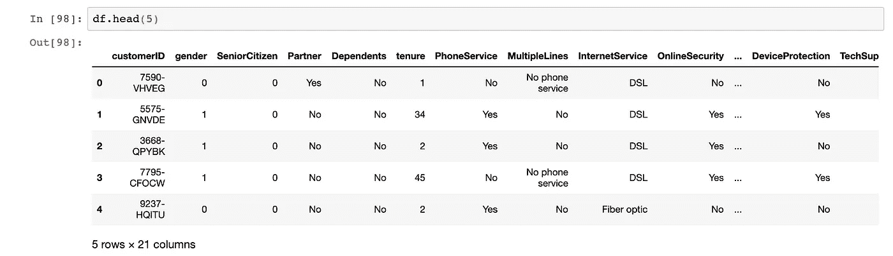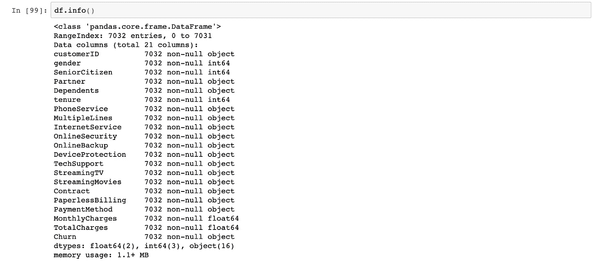

df.head()和 df.info()是获得数据集良好感觉的一种极其快速和简单的方法。从这里，我们可以通过查看数据集的前 5 行来大致了解数据集。

然而，我们看到有 21 列，Jupyter 不能提前显示所有内容。因此，我们还没有一个清晰的图像。

查看 df.info()，我们可以看到有 7032 行和 21 列。我们还可以看到所有列的名称、数据类型以及有多少非空值。巧合的是，所有的列都有 7032 个非空值，这意味着在我们的数据集中没有任何**缺失数据**。通常情况下，情况并非如此。我们可以通过以下方式检查缺失的数据:

```
df.isnull().sum()
```

这将返回所有的列以及每一列有多少 null 值。

之后，我们希望了解所有列的含义。
既然这是一个已发布的数据集，你可以在 [**数据集上找到**](https://www.kaggle.com/blastchar/telco-customer-churn) 本身的链接。
再说一遍，通常不是这样。我们可以通过以下方式进一步了解我们的专栏:

```
df.nunique()
```

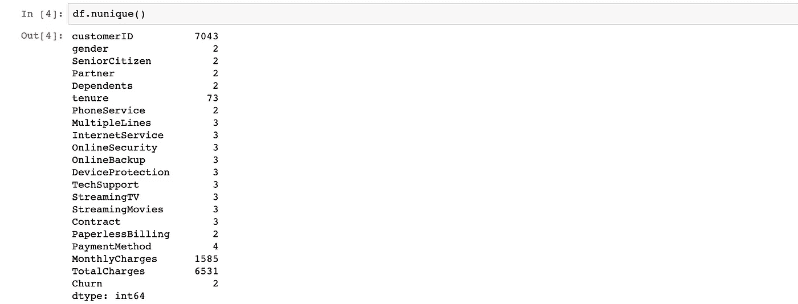

这将返回所有列及其唯一值的数量。

我们首先定义我们的度量。
为什么首先要创建这个数据集？
它是为了研究(和预测)某个电信公司的**流失**而创建的。
因此，很明显这里的列 **Churn** 是我们的度量列。

我们观察到 **customerID** 有 7032 个唯一值，这与数据集中的行数相同。这意味着 customerID 是我们的唯一行标识符。

对于**月费用**、**总费用**和**任期**列，我们可以根据它们拥有的**唯一值**和它们的**数据类型推断出它们是**数值**列。**

对于**剩余的**列，我们看到它们有 2、3 和 4 个唯一值。这可能意味着它们是**分类**列。

为了总结我们刚刚获得的信息并充分利用它们，我们可以为它们创建变量:

```
#defining all our columns
Id_col     = ['customerID']
metric_col = ["Churn"]
cat_cols   = df.nunique()[df.nunique() <= 4][df.nunique() > 2].keys().tolist()
cat_cols   = [x for x in cat_cols if x not in metric_col]
bool_cols = df.nunique()[df.nunique() == 2].keys().tolist()
bool_cols = [x for x in bool_cols if x not in metric_col]
num_cols   = [x for x in df.columns if x not in cat_cols + metric_col + Id_col + bool_cols]
```

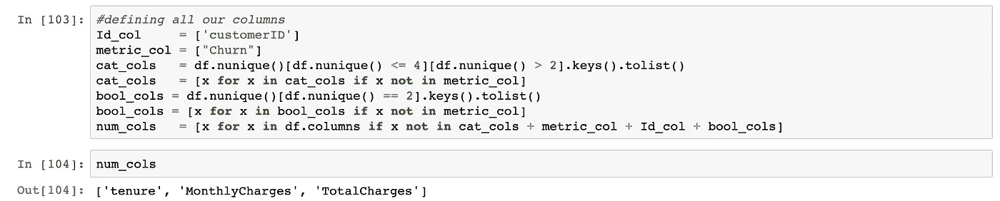

# 探索数据集

探索数据集有不同的方式。我个人的做法是首先围绕**指标**栏，因为这是我们试图研究的内容。

到现在为止，你可能已经明白，这是一个包含 7032 名**客户**的数据集，以及他们所有的**属性**，如果他们已经停止使用该公司的服务。因此，我们可以研究他们拥有的**属性**和他们的**流失率**之间的关系。

一个简单的例子就是**性别**列。
基本问题比如—
离职的**男性**还是**女性**多？

我们肯定可以通过探索我们的数据集来回答这个问题。

让我们先来看看有多少真正的客户被**搅了。**

```
#defining data
trace = go.Pie(labels=df["Churn"].value_counts().keys().tolist(), 
                values=df["Churn"].value_counts().values.tolist(), 
                marker=dict(colors=['red']), 
                # Seting values to 
                hoverinfo="value"
              )
data = [trace]#defining layout
layout = go.Layout(title="Churn Distribution")#defining figure and plotting
fig = go.Figure(data = data,layout = layout)
iplot(fig)
```

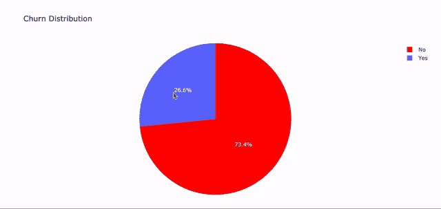

看起来大约有 27%的顾客放弃了他们的服务。

由于我们的**客户流失**列仅包含 **2 个**唯一值，即“是”或“否”。
我们可以将数据集分为流失的**客户和停留**的**客户**。这样我们可以更深入地研究数据。****

```
#Separating customers who churned and customers who stayed
churn     = df[df["Churn"] == "Yes"]
not_churn = df[df["Churn"] == "No"]
```

别在我面前睡着了，我们才刚刚开始。

让我们首先处理所有的**分类**列以及它们与我们的度量标准的关系。我们进一步将我们的分类列分为**布尔型**和**分类型**，布尔型本身只有两个唯一值。

让我们来看看所有的分类列及其实际的唯一值。

```
#all categorical columns and thier unique values
for i in cat_cols:
    for j in df[i].unique().tolist():
        print(i + ' unique values are ' + j)
```

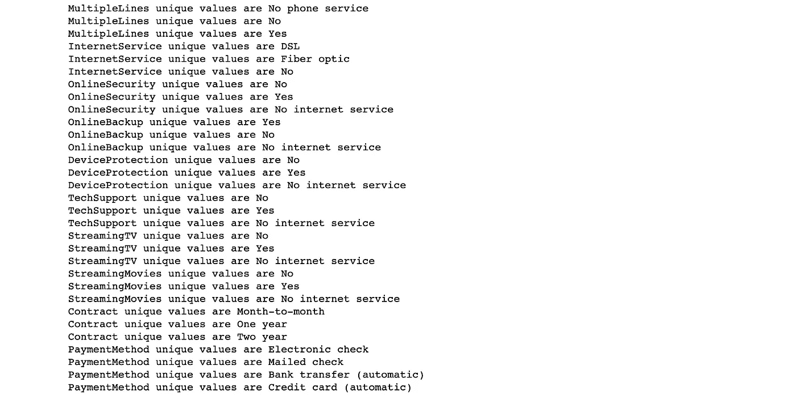

有几列像**在线备份**和**在线安全**同时包含值**否**和**无互联网服务**。对我们来说，这本质上意味着同样的事情，那就是他们没有那个**特征**。因此，我们可以将所有**无互联网服务**转换为**无**。

```
columns_to_be_replaced = [ 'OnlineSecurity', 'OnlineBackup', 'DeviceProtection',
                'TechSupport','StreamingTV', 'StreamingMovies']for i in columns_to_be_replaced : 
    df[i]  = df[i].replace({'No internet service' : 'No'})
```

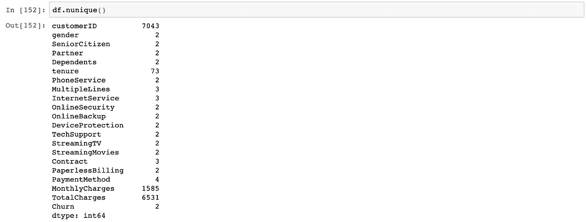

我们的数据现在更清晰了，更容易处理。

# 形象化

下一步是对照我们的**指标**来可视化我们所有的**特性**。重要的是以一种你的观众容易阅读的方式来形象化它。

## 分类列:

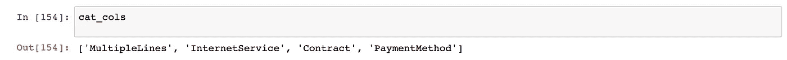

我绘制了多个支线剧情来展示**分类**特征相对于**变动**的分布，从而实现了这种可视化。

如果你觉得很难理解，刷新我的[文章](/python-for-data-science-a-guide-to-data-visualization-with-plotly-969a59997d0c):

```
#defining data
data = {}
for i in cat_cols:
    for j in df[i].unique().tolist():
        data[i + '_' + j] = go.Bar(
    x=['churn','not churn'],
    y=[(churn[i][churn[i] == j].value_counts().values.tolist()[0]/churn[i].value_counts().values.sum())*100,(not_churn[i][not_churn[i] == j].value_counts().values.tolist()[0]/not_churn[i].value_counts().values.sum())*100],
    name = j,width=0.4)
```

对于上面的代码块，我们为**的每个唯一值**定义了一个条形图，该值出现在**的每个列**中。结果我们总共有 **13** 个痕迹。

```
#defining layout
layout = go.Layout(
    title = 'Distribution of Categorical Columns in customer attrition',
    barmode='stack',
    showlegend= False
)#defining figure and plotting
fig = tools.make_subplots(rows=2, cols=2, subplot_titles = ('MultipleLines', 'InternetService', 'Contract', 'PaymentMethod'))
fig.append_trace(data['MultipleLines_No phone service'], 1,1)
fig.append_trace(data['MultipleLines_No'], 1,1)
fig.append_trace(data['MultipleLines_Yes'], 1,1)
fig.append_trace(data['InternetService_DSL'], 1,2)
fig.append_trace(data['InternetService_Fiber optic'], 1,2)
fig.append_trace(data['InternetService_No'], 1,2)
fig.append_trace(data['Contract_Month-to-month'], 2,1)
fig.append_trace(data['Contract_One year'], 2,1)
fig.append_trace(data['Contract_Two year'], 2,1)
fig.append_trace(data['PaymentMethod_Electronic check'], 2,2)
fig.append_trace(data['PaymentMethod_Mailed check'], 2,2)
fig.append_trace(data['PaymentMethod_Bank transfer (automatic)'], 2,2)
fig.append_trace(data['PaymentMethod_Credit card (automatic)'], 2,2)
fig.layout.update(layout)
iplot(fig)
```

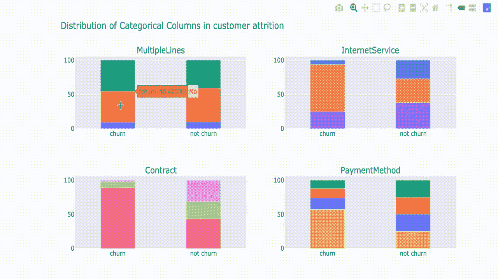

从图中，我们可以清楚地观察到流失客户与非流失客户的某些模式。首先，大部分流失客户订阅了按月合同，而留下来的客户分享了几乎相同的 T2 分布。这可能表明逐月订阅本身存在**产品缺陷**。我不会在这里进入所有的细节，但我们可以有效地得出某些**结论**，这将有助于我们以后的机器学习模型。

让我们对布尔列做同样的事情。

```
#defining data
data = {}
for i in bool_cols:
    for j in df[i].unique().tolist():
        data[i + '_' + j] = go.Bar(
    x=['churn','not churn'],
    y=[(churn[i][churn[i] == j].value_counts().values.tolist()[0]/churn[i].value_counts().values.sum())*100,(not_churn[i][not_churn[i] == j].value_counts().values.tolist()[0]/not_churn[i].value_counts().values.sum())*100],
    name = j,width=0.4)
trace = list(data.keys())#defining layout, fig and plotting
fig = tools.make_subplots(rows=4, cols=3, subplot_titles = ('Partner','SeniorCitizen','Partner', 'Dependents',
       'PhoneService', 'OnlineSecurity', 'OnlineBackup', 'DeviceProtection',
       'TechSupport', 'StreamTV','StreamingMovies','PaperlessBilling'))
fig.append_trace(data[trace[0]], 1,1)
fig.append_trace(data[trace[1]], 1,1)
fig.append_trace(data[trace[2]], 1,2)
fig.append_trace(data[trace[3]], 1,2)
fig.append_trace(data[trace[4]], 1,3)
fig.append_trace(data[trace[5]], 1,3)
fig.append_trace(data[trace[6]], 2,1)
fig.append_trace(data[trace[7]], 2,1)
fig.append_trace(data[trace[8]], 2,2)
fig.append_trace(data[trace[9]], 2,2)
fig.append_trace(data[trace[10]], 2,3)
fig.append_trace(data[trace[11]], 2,3)
fig.append_trace(data[trace[12]], 3,1)
fig.append_trace(data[trace[13]], 3,1)
fig.append_trace(data[trace[14]], 3,2)
fig.append_trace(data[trace[15]], 3,2)
fig.append_trace(data[trace[16]], 3,3)
fig.append_trace(data[trace[17]], 3,3)
fig.append_trace(data[trace[18]], 4,1)
fig.append_trace(data[trace[19]], 4,1)
fig.append_trace(data[trace[20]], 4,2)
fig.append_trace(data[trace[21]], 4,2)
fig.append_trace(data[trace[22]], 4,3)
fig.append_trace(data[trace[23]], 4,3)
fig.layout.update(layout)
iplot(fig)
```

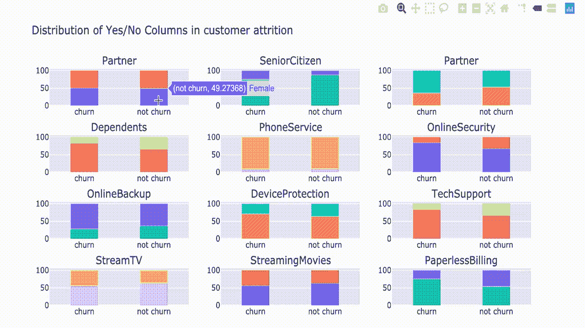

太美了。从这里，我们可以判断某个特性在流失客户和非流失客户之间的分布是否有很大差异。首先，我们可以看到像**无纸化记账**和**合作伙伴**这样的功能有很大的不同。再说一遍，我不想深入讨论，但你会意识到，你可以在这里做出某些结论。

## 数字列:

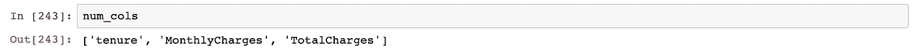

让我们想象一下流失客户和非流失客户的每个**数字**特征的分布。我们先从任期开始。

```
#defining data
trace1 = go.Histogram(x  = churn['tenure'],
                          histnorm= "percent",
                          name = "Churn Customers",
                          marker = dict(line = dict(width = .5,
                                                    color = "black"
                                                    )
                                        ),
                         opacity = 1
                         ) 

trace2 = go.Histogram(x  = not_churn['tenure'],
                      histnorm = "percent",
                      name = "Non churn customers",
                      marker = dict(line = dict(width = .5,
                                          color = "black"
                                         )
                             ),
                      opacity = .7
                     )
data = [trace1,trace2]#defining layout
layout = go.Layout(dict(title ='tenure' + " distribution in customer attrition ",
                        plot_bgcolor  = "rgb(243,243,243)",
                        paper_bgcolor = "rgb(243,243,243)",
                        xaxis = dict(gridcolor = 'rgb(255, 255, 255)',
                                         title = 'tenure',
                                         zerolinewidth=1,
                                         ticklen=5,
                                         gridwidth=2
                                        ),
                        yaxis = dict(gridcolor = 'rgb(255, 255, 255)',
                                         title = "percent",
                                         zerolinewidth=1,
                                         ticklen=5,
                                         gridwidth=2
                                        )
                       ),barmode = 'overlay'
                  )#defining figure and plotting
fig  = go.Figure(data=data,layout=layout)
iplot(fig)
```

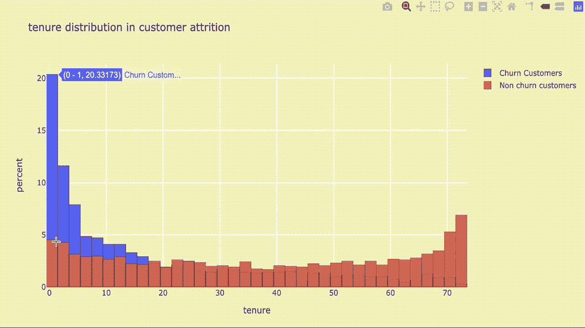

很快我们就能看到分布的巨大差异。
具体来说，在**流失**的客户中，大约有**一半**只在电信公司呆了不到 **3 个月**。另一方面，**留下来的客户在任期上分享了一个相当平均的分配，稍微偏向于更长的任期。**

让我们对**总费用**和**月费用做同样的事情。**

```
#defining data
trace1 = go.Histogram(x  = churn['MonthlyCharges'],
                          histnorm= "percent",
                          name = "Churn Customers",
                          marker = dict(line = dict(width = .5,
                                                    color = "black"
                                                    )
                                        ),
                         opacity = 1
                         )trace2 = go.Histogram(x  = not_churn['MonthlyCharges'],
                      histnorm = "percent",
                      name = "Non churn customers",
                      marker = dict(line = dict(width = .5,
                                          color = "black"
                                         )
                             ),
                      opacity = .7
                     )
data = [trace1,trace2]#defining layout
layout = go.Layout(dict(title ='MonthlyCharges' + " distribution in customer attrition ",
                        plot_bgcolor  = "rgb(243,243,243)",
                        paper_bgcolor = "rgb(243,243,243)",
                        xaxis = dict(gridcolor = 'rgb(255, 255, 255)',
                                         title = 'monthlycharges',
                                         zerolinewidth=1,
                                         ticklen=5,
                                         gridwidth=1
                                        ),
                        yaxis = dict(gridcolor = 'rgb(255, 255, 255)',
                                         title = "monthlycharges",
                                         zerolinewidth=1,
                                         ticklen=5,
                                         gridwidth=1
                                        )
                       ),barmode = 'overlay'
                  )#defining figure and plotting
fig  = go.Figure(data=data,layout=layout)
iplot(fig)
```

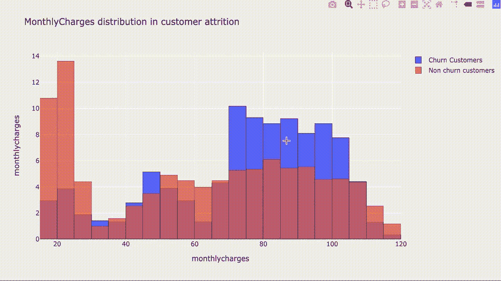

类似地，我们看到大多数购买了的顾客每月花费了 **70 到 110** 的费用。另一方面，大多数入住的顾客每月花费少于 30 美元。作为一名数据从业者，您可以与企业沟通，进一步了解这些客户将钱花在了什么产品/服务上，并进一步分析该产品/服务。

```
#defining data
trace1 = go.Histogram(x  = churn['TotalCharges'],
                          histnorm= "percent",
                          name = "Churn Customers",
                          marker = dict(line = dict(width = .5,
                                                    color = "black"
                                                    )
                                        ),
                         opacity = 1
                         )trace2 = go.Histogram(x  = not_churn['TotalCharges'],
                      histnorm = "percent",
                      name = "Non churn customers",
                      marker = dict(line = dict(width = .5,
                                          color = "black"
                                         )
                             ),
                      opacity = .7
                     )
data = [trace1,trace2]#defining layout
layout = go.Layout(dict(title ='TotalCharges' + " distribution in customer attrition ",
                        plot_bgcolor  = "rgb(243,243,243)",
                        paper_bgcolor = "rgb(243,243,243)",
                        xaxis = dict(gridcolor = 'rgb(255, 255, 255)',
                                         title = 'TotalCharges',
                                         zerolinewidth=1,
                                         ticklen=5,
                                         gridwidth=1
                                        ),
                        yaxis = dict(gridcolor = 'rgb(255, 255, 255)',
                                         title = "TotalCharges",
                                         zerolinewidth=1,
                                         ticklen=5,
                                         gridwidth=1
                                        )
                       ),barmode = 'overlay'
                  )#defining figure and plotting
fig  = go.Figure(data=data,layout=layout)
iplot(fig)
```

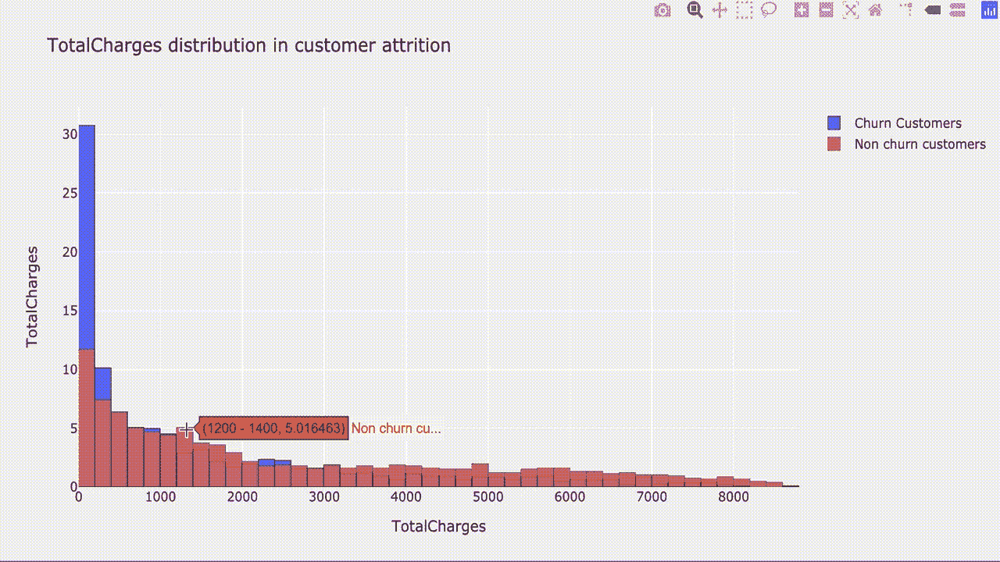

总费用是**而不是**一个很好的特征来做出结论。想想吧。
客户的任期越长，客户花费的总费用越高。因此，总费用**直接受到该客户的租期和月费用**的影响。我们看到，大多数流失客户的总支出少于 **100，**这是有道理的，因为我们知道，大多数流失客户在前 3 个月就退出了。

也就是说，让我们想象一下**任期**和**每月** **费用**之间的关系，同时了解这两个特征对**总费用**的影响。当我们这样处理多个变量时，我会想到泡沫图。

```
#defining data
trace1 = go.Scatter(x=churn['MonthlyCharges'],y=churn['tenure'],mode = "markers",marker = dict(line = dict(color = "blue"),
                                                                   size=churn['TotalCharges']/180,
                                                        color = 'blue',

                                                      ),
                        opacity = .9
                       ,name='churn',showlegend=True)trace2 = go.Scatter(x=not_churn['MonthlyCharges'],y=not_churn['tenure'],mode = "markers",marker = dict(line = dict(color = "red"),
                                                                   size=not_churn['TotalCharges']/180,
                                                       color = 'red',

                                                      ),
                        opacity = 0.5
                       ,name='not_churn',showlegend=True)
data = [trace1, trace2]

#defining layout
layout = go.Layout(dict(title = 'Monthly Charges vs Tenure (radius = total charges)',
                            plot_bgcolor  = "rgb(243,243,243)",
                            paper_bgcolor = "rgb(243,243,243)",
                            xaxis = dict(gridcolor = 'rgb(255, 255, 255)',
                                         title = "monthly charges",
                                         zerolinewidth=1,ticklen=5,gridwidth=2),
                            yaxis = dict(gridcolor = 'rgb(255, 255, 255)',
                                         title = "tenure",
                                         zerolinewidth=1,ticklen=5,gridwidth=2),
                            height = 600
                           )
                      )#defining figure and plotting
fig = go.Figure(data,layout=layout)
iplot(fig)
```

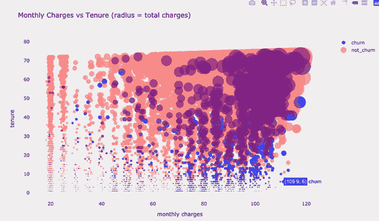

从图中，我们可以看到，代表总电荷**的气泡**在图的右上角变大。这实质上意味着总费用**直接取决于**每月费用和客户的使用期限。

至此，您已经对数据集有了相对**扎实的** **理解**。我将在这里停止我的探索，但这只是我自己。您可以从不同角度进一步研究数据集，例如了解要素之间的关系。天空是极限。

您还可以在这里找到本文的完整代码:

[](https://github.com/nickefy/what-to-do-before-machine-learning/blob/master/What%20To%20Do%20Before%20Machine%20Learning.ipynb) [## 机器学习之前做什么

### 此时您不能执行该操作。您已使用另一个标签页或窗口登录。您已在另一个选项卡中注销，或者…

github.com](https://github.com/nickefy/what-to-do-before-machine-learning/blob/master/What%20To%20Do%20Before%20Machine%20Learning.ipynb) 

# 恭喜


照片由[阿里·叶海亚](https://unsplash.com/@ayahya09?utm_source=medium&utm_medium=referral)在 [Unsplash](https://unsplash.com?utm_source=medium&utm_medium=referral) 上拍摄

我赞扬你坚持到最后，因为这可能意味着你对数据充满热情**。你应该担心，它正在接管。**

简而言之，这里是你在这里学到的东西:

*   数据探索
*   拆分不同类型的数据
*   在数据中定义行标识符、度量和功能
*   可视化数据以帮助探索

你现在更愿意建立一个机器学习模型来预测客户的流失，这也是我下一篇文章要做的。

# 在你走之前

我们还没有完成这个数据集。我将对这个数据集执行分类机器学习，以预测客户下次是否会流失。我还在撰写更多关于数据行业的故事、文章和指南。你绝对可以期待更多这样的帖子。与此同时，请随意查看我的其他[文章](https://medium.com/@nickmydata)来暂时填补您对数据的渴望。

最后，我总是会引用一句话。

> 数据是新的科学。大数据掌握着答案。— 安吉拉·阿伦茨

## 订阅我的时事通讯，保持联系。

***感谢*** *的阅读！如果你想与我取得联系，请随时通过 nickmydata@gmail.com 或我的* [*linkedIn 个人资料*](https://www.linkedin.com/in/nickefy/) *联系我。也可以在我的*[*Github*](https://github.com/nickefy)*中查看代码。*