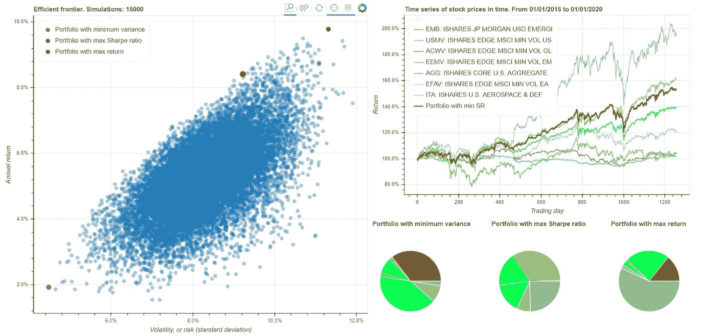

# 金融 Python:现代投资组合理论的实现

> 原文：<https://towardsdatascience.com/python-for-finance-an-implementation-of-the-modern-portfolio-theory-39cdbaeefbd4?source=collection_archive---------41----------------------->

## 现代投资组合理论和有效边界概念在 Python 中的实现。



该脚本的输出是一个用散景创建的交互式仪表板。有 3 个主要区域:代表有效边界的图，股票价格的时间序列，以及具有最小风险、最大夏普比率和最大回报的投资组合的组成。

**现代投资组合理论**

现代投资组合理论(MPT)是一种用数学术语描述诸如多样化和风险管理等概念的金融理论。MPT 为投资者提供了建立多元化投资组合的工具，在给定的风险水平下，投资组合的回报最大化。风险通常用标准差来衡量。

这个理论是由经济学家哈里·马科维茨提出的，他因为这项研究获得了 1990 年的诺贝尔经济学奖。该理论的数学公式涉及方差和协方差等概念。*如有兴趣了解详情，请访问* [*维基百科专用页面*](https://en.wikipedia.org/wiki/Modern_portfolio_theory#:~:text=Modern%20portfolio%20theory.%20Modern%20portfolio%20theory%20%28MPT%29%2C%20or,is%20maximized%20for%20a%20given%20level%20of%20risk.) *。*

**有效边界**

有效边界的概念可以正式定义为在任何给定风险下具有最高回报的投资组合集合，它与 MPT 密切相关。该边界通常呈“C”形，如下图所示，可以区分三个点:

*   风险最小的投资组合。
*   回报最大的投资组合。
*   具有最大[夏普比率](https://en.wikipedia.org/wiki/Sharpe_ratio)的投资组合，这通常是投资者的首选，因为它被认为是风险水平和预期回报之间的良好折衷。


**MPT 的 Python 实现**

下面介绍的 Python 笔记本使用户能够通过模拟定制数量的投资组合，轻松探索投资机会的设计空间，并创建一个可用于选择所需交易策略的交互式仪表盘。

完整的代码可以在下面的链接中找到，在我的 GitHub 页面上，还有“python for finance”系列的其他脚本。

[](https://github.com/r-poli/ModernPorfolioTheory) [## 里坡/现代警察理论

### 现场脚本执行数值模拟，并找到最佳的投资组合构成符合现代…

github.com](https://github.com/r-poli/ModernPorfolioTheory) 

实现是用 Python 3 实现的，数据的下载是通过 FINNHUB 应用编程接口(API)完成的。用户需要注册(注册是免费的)来获得个人 API 密钥。

该脚本由 3 部分组成:输入部分，主体和绘图部分。用户必须指定以下输入:

*   感兴趣的股票或交易所交易基金(ETF)的符号列表(例如，特斯拉公司的“TSLA”；“VOO”为先锋 500 指数基金 ETF 等。)，包括每只股票或 ETF 的简短描述。
*   她/他想要模拟的投资组合数量。
*   她/他希望用来执行回溯测试的日期范围。
*   API 密匙，很容易免费获得[这里](https://rapidapi.com/Finnhub/api/finnhub-realtime-stock-price)。

```
*## DEFINE INPUTS*  
**ticks** = ["EMB", "AGG", "VGT", "TSLA", "AMZN"] 
**line_name** = ["Emerging countries debt", "US debt", "S&P 500 Vanguard ETF", "Tesla", "Amazon"] 
**num_port** = 1000 
**start_date** = '01/06/2015' 
**end_date** = '27/06/2020' 
**api_key** = "YOUR API KEY"
```

你可以在我的 [GitHub 页面](https://github.com/r-poli)的笔记本中找到关于代码的更多评论和其他细节。在那里，您还可以找到“Python for finance”系列的其他工具。

享受，快乐交易！

https://www.linkedin.com/in/riccardopoli/里卡多**里坡
T6**

**免责声明:**投资股市有风险，可能导致金钱损失。这篇文章的内容不能作为财务建议。