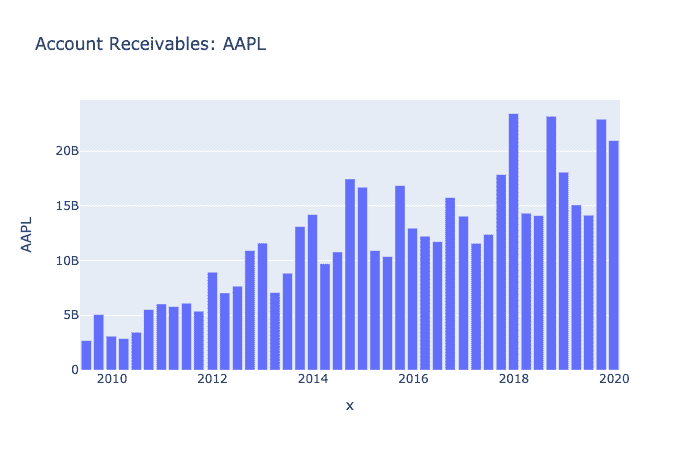
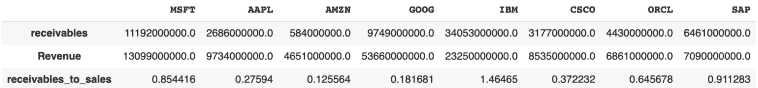
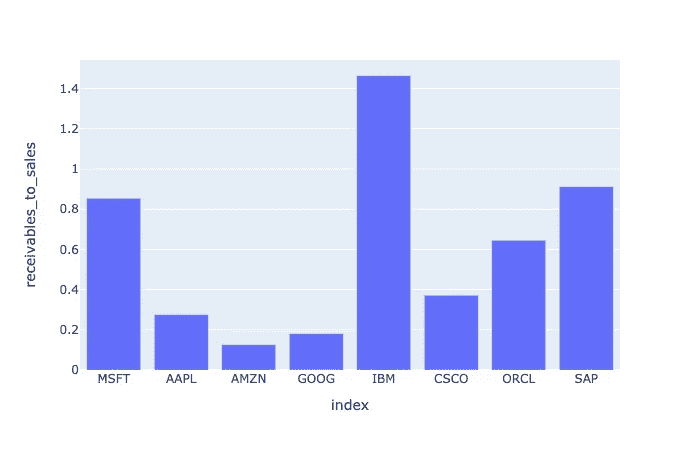

# Python for Finance —分析应收账款

> 原文：<https://towardsdatascience.com/python-for-finance-analysing-account-receivables-35d3d809c769?source=collection_archive---------35----------------------->

## 分析应收账款对于识别潜在的公司收款问题非常重要。

应收账款是客户欠公司的金额。在这个故事中，我们将使用 Python 来分析科技行业公司的应收账款。这个故事将分成两部分。首先，**我们将开始分析苹果公司**的应收账款。然后，**我们将分析科技行业中一组可比公司的应收账款与销售比率。**


照片由 [**卢卡斯**](https://www.pexels.com/@goumbik?utm_content=attributionCopyText&utm_medium=referral&utm_source=pexels) 发自 [**Pexels**](https://www.pexels.com/photo/macbook-pro-beside-papers-669619/?utm_content=attributionCopyText&utm_medium=referral&utm_source=pexels)

# 如何阅读应收账款

**应收账款是公司的金融资产，因为它们代表公司因销售商品或服务而拥有的金额。**

投资者经常用来比较公司间应收账款的比率之一是应收账款对销售比率。就销售额而言，应收账款的高比率表明一个公司有很大比例的赊销。高比率会给公司带来一定的风险，因为债务人可能无法偿还债务。

每个公司都需要估计有多少应收账款无法收回。这些被称为坏账应收账款，会减少公司的利润和应收账款总额。因此，保持较低的应收账款水平可能被视为一个好迹象，因为公司计提的坏账准备将因此减少。

另一方面，非常低的应收账款与销售比率可能表明一个公司对其客户过于积极。因此，积极的收集方法可能会影响公司与客户的关系，从而影响销售。

# 使用 Python 进行应收账款趋势分析

首先，我们将使用 Python 为 Apple 执行应收款趋势分析。这将向我们展示应收账款在过去几个季度的绝对值是如何变化的。

我们将使用免费的财务 API[financialmodelingprep](https://financialmodelingprep.com/developer/docs/#Company-Financial-Ratios)来检索财务数据。如果您已经阅读了我之前的文章，那么下面的代码对您来说会很熟悉。因此，我不会详细介绍它的功能。

基本上，我们向 API 端点发出 get 请求来检索资产负债表数据。然后，我们解析响应以提取*应收款*数据并将其添加到 Python 字典中。

最后，我们将字典转换成熊猫数据框架。

```
import requests
import pandas as pd

all_Receivables = {} 
stock = 'AAPL'

balanceSheet = requests.get(f'https://financialmodelingprep.com/api/v3/financials/balance-sheet-statement/{stock}?period=quarter')

balanceSheet = balanceSheet.json()

all_Receivables[stock] = {}

for item in balanceSheet['financials']:
  receivables = item['Receivables']
  period = item['date']
  all_Receivables[stock][period] = receivables
all_Receivables

receivables_apple = pd.DataFrame.from_dict(all_Receivables, orient='index')
receivables_apple = receivables_apple.T 
```

一旦我们有了 Pandas 数据框架，我们就可以使用库 [Plotly](https://plotly.com/python/) 来绘制条形格式的应收账款:

```
import plotly.express as px

fig = px.bar(receivables_apple, x=receivables_apple.index,y =receivables_apple[stock],title='Account Receivables: ' + stock)

fig.show()
```



# 使用 Python 比较公司间的应收账款

在上一节中，我们绘制了苹果公司的应收账款趋势。我们可以看到应收账款随着时间的推移在增加。这可能是由于销售额的增长转化为更高水平的应收账款。

因此，仅仅关注应收账款可能不足以帮助投资者。在本节中，我们将进一步分析这两种情况:

*   **应收账款对销售比率**。这将表明销售方面的应收账款水平。这将非常有助于将一家公司与可比较的公司进行比较。
*   **同行业不同公司的应收账款对比**。

首先，正如你在下面的代码部分看到的，我们有一个在技术领域运营的公司列表。在我之前的一篇文章中，[我向你展示了如何通过程序提取一个行业中所有公司的报价。](https://codingandfun.com/evaluate-companies-liquidity-with-python/)

接下来，我们遍历列表中的每个公司，以便 ***提取应收账款和收入来计算应收账款与销售额的比率。*** 接下来，我们将这三个变量添加到一个 Python 字典中。最后，正如我们在上一节中所做的，我们将字典转换成熊猫数据帧。

```
technological_companies = ['MSFT','AAPL','AMZN','GOOG','IBM','CSCO','ORCL','SAP','IBM']
all_Receivables = {} 

for company in technological_companies:
  try:
#Retrieve Balance Sheet Data for each of the companies in the list
    balanceSheet = requests.get(f'https://financialmodelingprep.com/api/v3/financials/balance-sheet-statement/{company}?period=quarter')
    balanceSheet = balanceSheet.json()
    all_Receivables[company] = {}
    for item in balanceSheet['financials']:
      receivables = item['Receivables']
      all_Receivables[company]['receivables'] = receivables

    IS = requests.get(f'https://financialmodelingprep.com/api/v3/financials/income-statement/{company}?period=quarter')
    IS = IS.json()
    for item in IS['financials']:
      revenues = item['Revenue']
      all_Receivables[company]['Revenue'] = revenues

    all_Receivables[company]['receivables_to_sales'] = float(receivables)/float(revenues)
  except:
    pass

receivables_companies = pd.DataFrame.from_dict(all_Receivables, orient='index')
receivables_companies = receivables_companies.T
print(receivables_companies)
```



然后，我们执行一些数据操作，只保留行 *receivables_to_sales* ，因为这是我们想要绘制的信息。

```
#keep only receivables to sales
receivables_companies = receivables_companies[receivables_companies.index =='receivables_to_sales'] 
receivables_companies = receivables_companies.T.reset_index()
```

最后，在清理数据框架后，我们可以使用 Plotly 绘制不同公司的应收账款与销售比率:

```
import plotly.express as px

fig = px.bar(receivables_companies, x=receivables_companies['index'],y =receivables_companies['receivables_to_sales'])

fig.show()
```



应收账款比较

# 包扎

我们已经看到了两种简单的方法来分析单个公司以及一组可比公司的应收账款。

在我们的例子中，我们可以看到，与同行公司相比，IBM 的应收账款与销售额比率非常高。作为完成我们分析的下一步，我们需要查看公司财务报告的财务注释，以了解高比率的原因。是因为 IBM 向客户提供长期付款吗？或者可能是公司没有足够的能力来管理应收账款的回收？

另一个极端，我们有比率非常低的亚马逊。这可能是因为亚马逊业务的一部分是直接销售给即时付款的客户。

[在 Twitter 上关注我，了解更多关于 Python for Finance 的信息](https://twitter.com/CodingandF)。

*原载于 2020 年 4 月 16 日*[*【https://codingandfun.com】*](https://codingandfun.com/account-receivables-analysis/)*。*