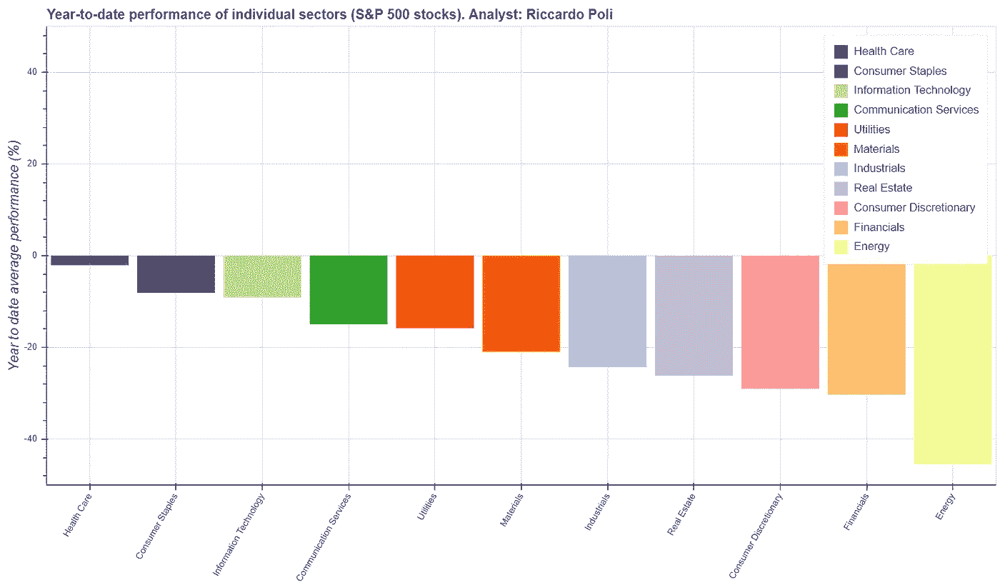
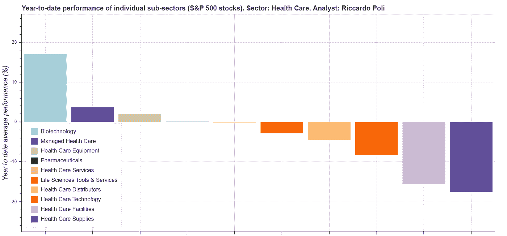
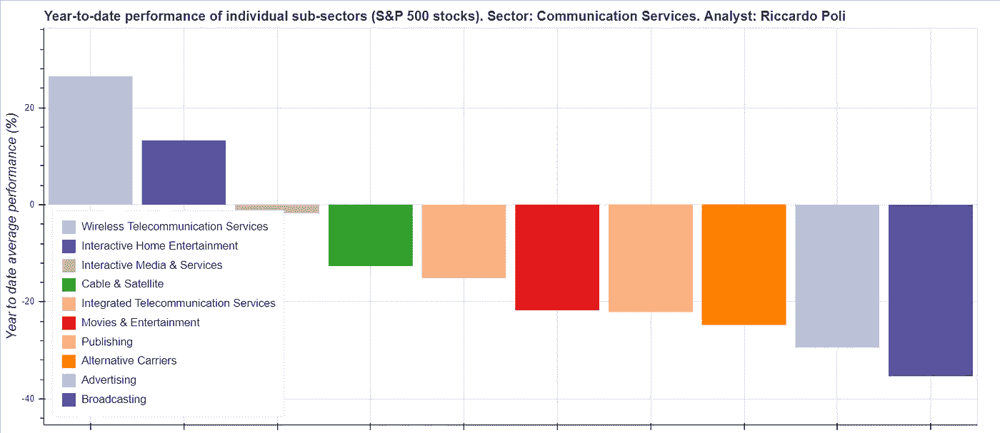

# 金融 Python:金融市场的自动化分析

> 原文：<https://towardsdatascience.com/python-for-finance-automated-analysis-of-the-financial-markets-f649375bf8b2?source=collection_archive---------31----------------------->

## 一种高度自动化的方法，用于按业务部门分析金融市场的表现。

本文中介绍的 Python 脚本已经被用于分析新冠肺炎对标准普尔 500 指数的各个业务部门的影响，但是也可以很容易地适用于任何其他的金融市场分析。

代码是用 Python 编程语言开发的，可以在我的 GitHub 存储库(下面的链接)中找到，作为一个 Jupyter 笔记本。

[](https://github.com/r-poli/FinancialMarketAnalysis) [## 里坡/金融市场分析

### 这款 Jupyter 笔记本使用户能够对以下行业或子行业进行自动股票市场分析

github.com](https://github.com/r-poli/FinancialMarketAnalysis) 

该脚本使用标准的 Python 包(即 pandas、bokeh、math)以及用于下载标准普尔 500 股票价格的 yfinance API(应用程序编程接口)。该 API 可以免费使用，并且是公共的，这意味着用户不需要单独的 API 密钥。

```
***# Import libraries***
import **yfinance** as yf
import **pandas** as pd
from **bokeh**.plotting import figure
import **bokeh**.models as bmo
from **bokeh**.palettes import Paired11
from **bokeh**.io import show
from **bokeh**.models import ColumnDataSource, HoverTool
import **math**
```

在脚本的第一部分，用户需要定义名为 **"depth"** 的变量来定义分析的详细程度。这可以设置为“*扇区*或“*子扇区*”。选择“*扇区*将产生如图 1 所示的图，而“*子扇区*将产生类似于图 2 和图 3 所示的图。在最后一种情况下，用户还必须指定**“过滤器”**，即感兴趣的部分。过滤器的可用值有:*通信服务*、*非必需消费品*、*消费品*、*能源*、*金融*、*医疗*、*工业*、*信息技术*、*材料*、*房地产*和*公用事业。*

```
***# Example of input definition***
**depth** = '*sub_sector*'
**filter** = '*Information Technology*'
```

所有其他输入，如标准普尔 500 股票列表，以及当前市场表现的比较日期(2020 年初)都是自动设置的。

```
index_name = 'SP_500'
companies = pd.read_html('https://en.wikipedia.org/wiki/List_of_S%26P_500_companies', flavor='bs4')[0]
```

此时，数据被下载，所有的计算被执行。正如预期的那样，yfinance API 用于收集财务数据。

```
df_all = pd.DataFrame()
color_df = pd.DataFrame({0})**for** stock **in** companies_codes:
  stock_data = yf.Ticker(stock.replace(".",""))
  stock_name = companies[company_label].loc[companies[code_label] == stock].values[0]
  df_all[stock_name] = stock_data.history(start="2020-01-01")['Close']
```

最后一部分是创建所有图的地方。

```
if depth == 'sector':df_sector = df_summary.groupby(['Sector']).mean()
    df_sector = df_sector.sort_values(by=['YTD_performance'], ascending=False)source2 = ColumnDataSource(data=dict(cum_sum_ytd=df_sector.YTD_performance.to_list(), sector=df_sector.index.to_list()))p = figure(plot_height=700, plot_width=1200, x_range=df_sector.index.to_list(), toolbar_location='right', y_range=[-50, 50],
               title='Year-to-date performance of individual sectors (S&P 500 stocks)', tools="save")color_map = bmo.CategoricalColorMapper(factors=df_summary['Sector'].unique(), palette=Paired11)p.vbar(x='sector', top='cum_sum_ytd', width=0.9, source=source2, fill_color={'field': 'sector', 'transform': color_map},
            legend='sector', line_width=0)p.xaxis.major_label_orientation = math.pi/3
    p.yaxis.axis_label = 'Year to date average performance (%)'p.title.text_font_size = '12pt'
    p.yaxis.axis_label_text_font_size = '12pt'show(p)
```

您可以在 GitHub 页面上的笔记本中找到对代码的进一步评论和其他细节。

# 新冠肺炎对金融市场的影响

在本节中，图 1、图 2 和图 3 总结了上述代码的输出。

> 新冠肺炎对我们的生活、习惯、实体经济和金融市场产生了前所未有的影响。疫情造成的金融冲击并不一致，各商业部门对危机的反应也不同。

从图 1 中可以看出，总的来说，所有部门都受到了疫情的负面影响，能源部门的损失最大。事实上，由于世界人口的很大一部分被封锁，对石油和天然气的需求大幅下降。工业部门也经历了重大损失，特别是在“航空航天和国防”以及“航空”分部门。主要原因是对这些服务的需求减少，这是由于现有的限制和对新冠肺炎病毒传播的恐惧。



**医疗保健**

医疗保健是受影响最小的行业，生物技术子行业的一些公司股价平均上涨了 16%，见图 2。这是因为许多公司正在新冠肺炎疫苗上投入资源。赢得这场竞赛的公司可能会有丰厚的利润。



图二。新冠肺炎对标准普尔 500“医疗保健”股的影响

**通信服务**

在这个前所未有的时代，智能工作以及人们对讲话和看望亲人的渴望增加了对视频会议应用程序和软件的需求。由于人们在许多国家被隔离，他们倾向于在流媒体服务上花费更多时间。因此，家庭娱乐和电信服务在疫情期间表现良好(分别增长 12%和 23%)，图 3。



图 3。新冠肺炎对标准普尔 500“通讯服务”股票的影响

如果你想阅读更多关于该主题的内容，请参考[我在几周前(2020 年 5 月)写的这篇文章](https://www.linkedin.com/pulse/impact-covid-19-sp-500-stocks-riccardo-poli/)，解释新冠肺炎对每个业务部门和子部门的影响。

注意安全，交易愉快！

**https://www.linkedin.com/in/riccardopoli/** [里坡](https://www.linkedin.com/in/riccardopoli/)

**免责声明:**投资股票市场有风险，可能导致金钱损失。这篇文章的内容不能作为财务建议。