# 面向金融的 Python 完全初学者指南

> 原文：<https://towardsdatascience.com/python-for-finance-the-complete-beginners-guide-764276d74cef?source=collection_archive---------6----------------------->

## 使用亚马逊股票数据的简单实践


照片由 [Serpstat](https://www.pexels.com/@serpstat-177219?utm_content=attributionCopyText&utm_medium=referral&utm_source=pexels) 从 [Pexels](https://www.pexels.com/photo/apple-devices-books-business-coffee-572056/?utm_content=attributionCopyText&utm_medium=referral&utm_source=pexels) 拍摄

*欢迎阅读面向金融的 Python 完全入门指南。*

在这篇文章中，我将带你完成一些很棒的实践练习，帮助你了解如何使用 Python 进行金融。首先，我将把你介绍给我们的朋友 Pyhton，然后我们将进入有趣的部分，即编程。正如副标题中提到的，我们将使用亚马逊股票数据。如果你想知道是否可以免费获得这些数据，答案是肯定的。股票数据可以在纳斯达克官方网站上找到。纳斯达克(全美证券交易商自动报价协会)是一个电子股票交易所，拥有 3300 多家上市公司。

亚马逊股票数据可以从[这里](https://www.nasdaq.com/market-activity/stocks/amzn/historical)下载。在这个网站上，你可以找到不同公司的股票数据，并使用这些数据集练习你的技能。我等不及了，让我们开始吧！

目录:

*   计算机编程语言
*   了解亚马逊股票数据
*   数据清理
*   数据可视化

# 计算机编程语言

Python 是一种通用编程语言，在分析数据方面越来越受欢迎。Python 还能让您快速工作，更有效地集成系统。世界各地的公司都在利用 Python 从他们的数据中收集知识。官方 Python 页面如果你想[了解更多](https://www.python.org/about/)。

# 理解数据

当您第一次将数据加载到 dataframe 中时，在开始操作它之前查看它是一个好习惯。这有助于理解你有正确的数据和一些关于它的见解。如前所述，在这个练习中，我们将使用一家纳斯达克公司的历史数据。我认为亚马逊是个不错的选择。在和我一起完成这个练习后，你将会学到一些技巧，让你能够使用不同的数据集来练习。

我们将使用的数据框架包含过去一个月(2020 年 6 月 24 日至 7 月 23 日)亚马逊股票的收盘价。

## 读出数据

```
import pandas as pd amzn = pd.read_csv('amzn_data.csv')
```

## 头部方法

为了对数据有所了解，我们要做的第一件事是使用 head 方法。当您在 dataframe 上调用 head 方法时，它会显示 dataframe 的前五行。运行这个方法后，我们还可以看到我们的数据是按日期索引排序的。

```
amzn.head()
```

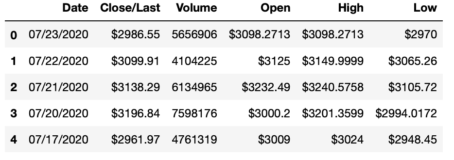

结果

## 尾部法

另一个有用的方法我们称之为尾部方法。它显示数据帧的最后五行。假设您想查看最后三行，您可以在括号之间输入整数 3。

```
amzn.tail()
```

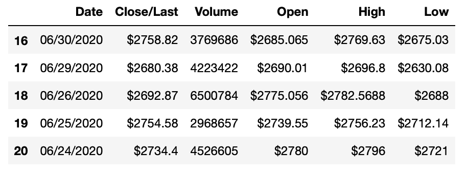

结果

## 描述方法

在深入之前，我们要调用的最后一个方法是 describe 方法。它返回给我们数据的统计摘要。默认情况下，describe 方法将返回所有数字列的汇总统计信息，例如在我们的示例中，所有列都是数字。汇总将包括以下项目:行数、平均值、标准偏差、最小值和最大值，最后是百分位数。

```
amzn.describe()
```

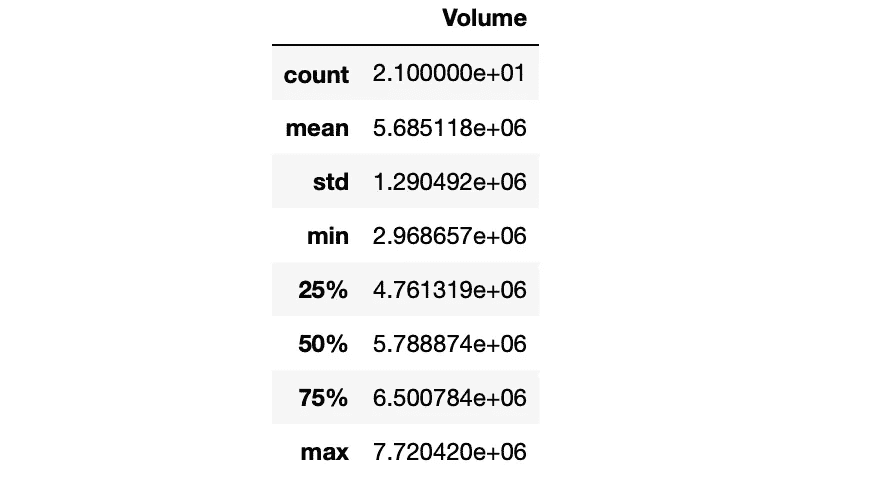

描述方法

为什么我们只得到 Volume 列的值，而没有得到其他列的值？这就是我们所说的数据准备。清理数据并为分析做好准备是一个主要步骤。在我们进行下一步之前，有几件事我们必须注意。请随意查看下面的帖子，了解更多关于使用不同列数据类型时的数据清理。

[](https://medium.com/python-in-plain-english/cleaning-data-in-python-data-types-46f9ebf2feef) [## 清理 Python 中的数据(数据类型)

### 使用 pandas 操作数据类型的简单说明

medium.com](https://medium.com/python-in-plain-english/cleaning-data-in-python-data-types-46f9ebf2feef) 

# 数据清理

我们前面提到 describe 方法专门处理数值，这意味着 Volume 列是我们的数据帧中唯一的数值。让我们检查列的数据类型。

```
amzn.dtypes
```

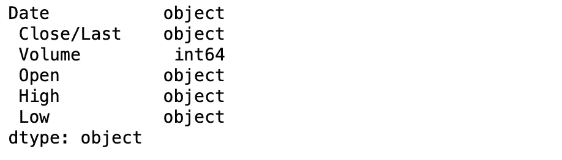

列数据类型

正如您在上面看到的，Volume 列是唯一的整数类型，其余的是对象类型。所以我们必须注意数据类型。但是在转换它们之前，我们已经清理了美元符号，否则，当我们试图将美元符号转换成数值时，我们的程序将会混乱。

```
amzn = amzn.replace({'\$':''}, regex = True) amzn.head()
```

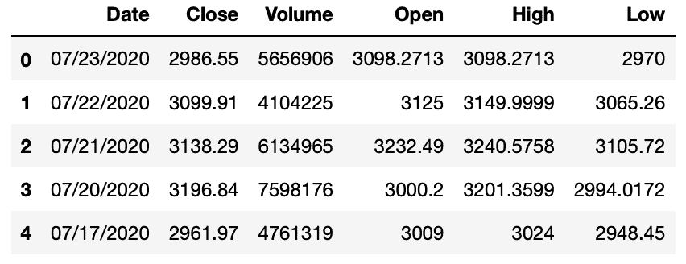

去掉美元符号后

很好，现在我们可以转换数据类型了。我们不需要对日期和数量列做任何修改。我们将把 rest 列转换成一个数值，对于这个练习，我们可以使用 float 数值类型。

```
# Renaming column names and converting the data typesdf = amzn df.columns = ['Date', 'Close', 'Volume', 'Open', 'High', 'Low'] # Converting data types
df = df.astype({"Close": float, "Volume": int, "Open": float, "High": float, "Low": float}) df.dtypes
```

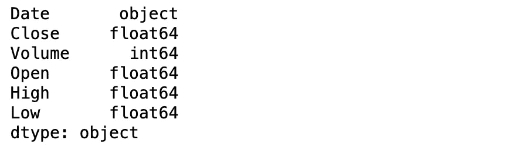

更改后的数据类型

太好了，我们解决了数据类型问题。现在，让我们尝试运行 describe 方法，看看它是如何工作的。

```
df.describe()
```


结果

干得好！现在，正如您在上面看到的，describe 方法与我们所有的数字列配合得非常好。我们还可以通过使用不同的参数来定制 describe 方法的结果。Describe 有三个我们将在本例中使用的参数:include、percentiles 和 exclude。

```
df.describe(include = "float")
```

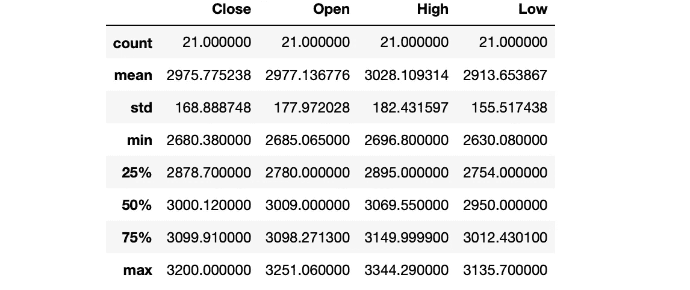

结果

```
df.describe(include = "object")
```


结果

```
df.describe(exclude = "int")
```

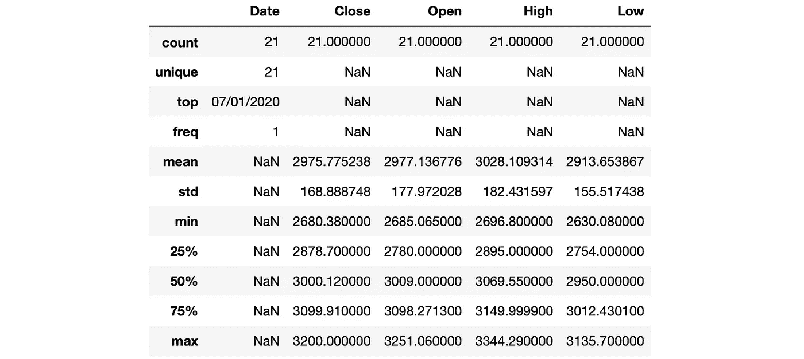

结果

```
df.describe(percentiles = [0.1, 0.5, 0.9])
```

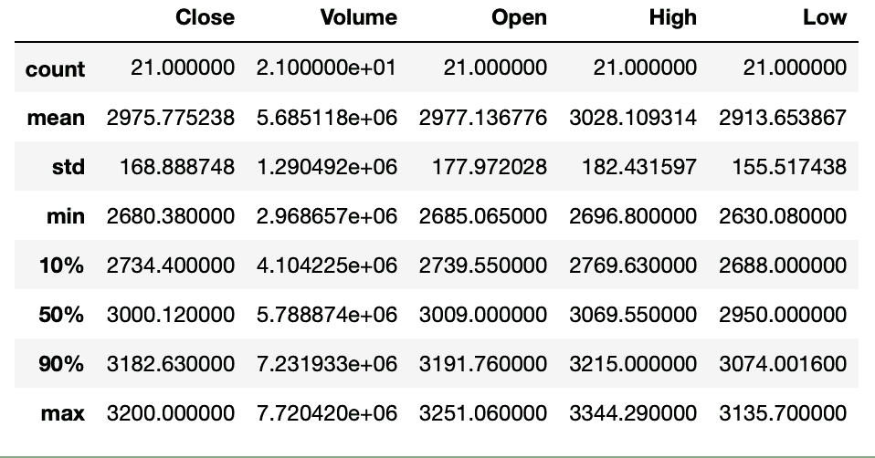

结果

# 过滤数据

## **比较运算符**

*   <
*   >
*   <=
*   >=
*   ==
*   !=

我们将使用这些运算符将特定值与列中的值进行比较。结果将是一系列的布尔值:真和假。如果比较正确，则为真，如果比较不正确，则为假。

## **被收盘价掩盖**

当我们使用 loc[]运算符将一个布尔序列传递给一个数据帧时，将返回一个只包含真值的新数据帧。

```
# Closing price more than 3000mask_closeprice = df.Close > 3000 high_price = df.loc[mask_closeprice] high_price.head()
```


结果

Pandas 提供了运算符来组合布尔比较的不同结果。这些运算符是:And、Or、Not。我们可以使用这些运算符来创建更复杂的条件。例如，假设我们要查看收盘价超过 3000 且成交量超过 500 万的 AMZN 股票数据。我们是这样做的:

```
# Closing price more than 3000 and traded volume more than 5mask_closeprice = df.Close > 3000 
mask_volume = df.Volume > 5000000millionhigh_price_volume = df.loc[mask_closeprice & mask_volume]

high_price_volume.head()
```

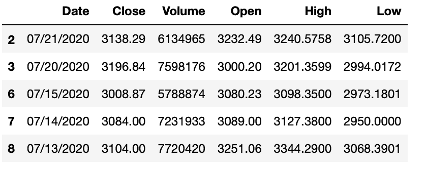

结果

# 数据可视化

可视化数据是理解数据的重要一步。它帮助我们看到的不仅仅是一行行的值，它让我们对数据有了更好的了解。当我们想要在不同的数据值之间进行比较时，它也是有帮助的。

可视化数据也是理解和查看不同列之间关系的好方法。

## **Matplotib**

最常用的 2D 绘图库叫做 Matplotlib。这个库非常强大，它也有一个学习曲线。在这个学习曲线的帮助下，围绕这个库建立了其他库。

让我们画出过去一个月的股票价格。我们的 x 轴是日期，y 轴是每天的收盘价。这将向我们展示股票价格在一个月内的变化。从商业角度来说，这种线图被称为价格波动图，它有助于检测股价的季节性模式。

```
df.plot(x='Date', y='Close')
```

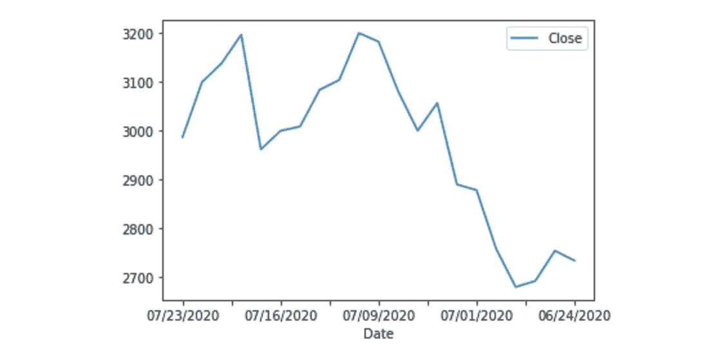

线形图

## **旋转**

plot 方法提供了许多有趣的参数，您可以尝试一下。其中一个是旋转参数，使用这个参数我们可以旋转图的标签。下面是一个将日期标签旋转 90 度以便于阅读的例子。

```
df.plot(x='Date', y='Close', rot=90)
```

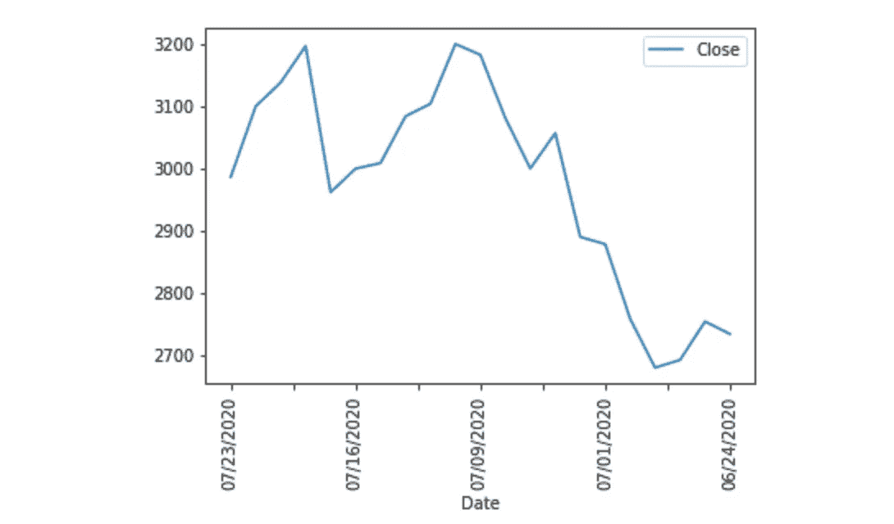

线形图

## **标题**

如果你想给你的情节一个标题，这是使用的方法。我们将传递一个字符串到我们的标题参数中。

```
df.plot(x='Date', y='Close', rot=90, title="AMZN Stock Price")
```

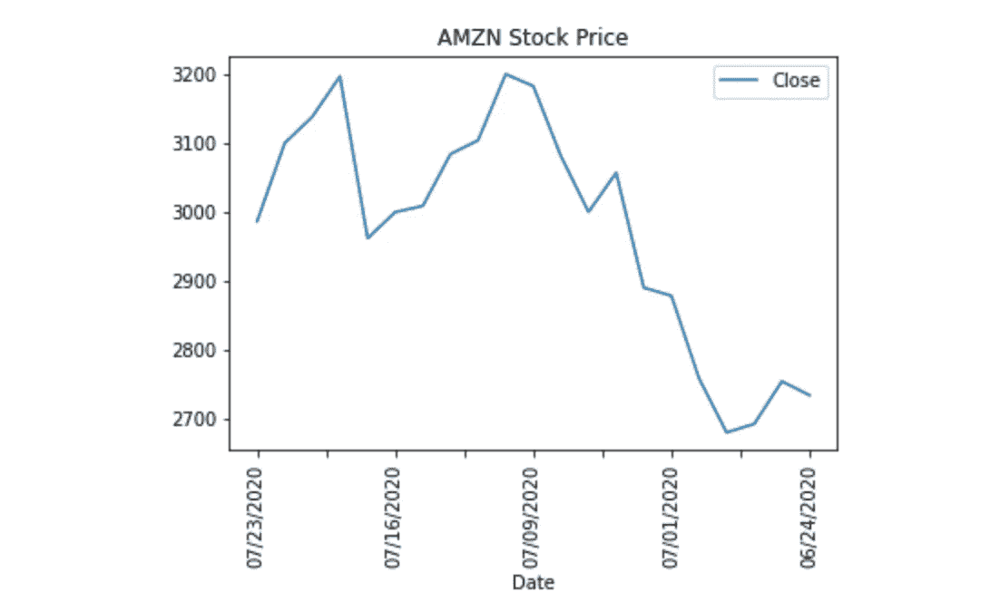

线形图

## **更多绘图类型**

绘图方法的默认类型是折线图，但是根据我们的使用情况，还有许多其他绘图类型可供使用。其他一些绘图类型可以列举如下:

*   线条
*   酒吧
*   馅饼
*   分散
*   柱状图

我们来做一个散点图的例子。我们将在我们的方法中添加一个名为 kind 的新参数。是的，就是这么简单。

```
df.plot(x='Date', y='Close', kind='scatter', rot=90, title="AMZN Stock Price")
```

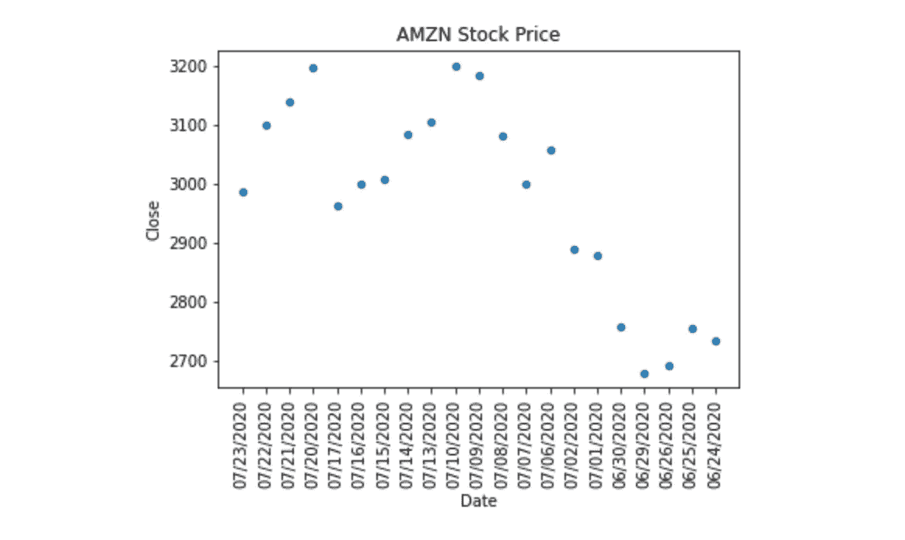

散点图

现在我们来做一个直方图的例子。直方图是查看数值分布的好方法。

```
df.plot(x='Date', y='Volume', kind='hist', rot=90, title="AMZN Stock Price")
```

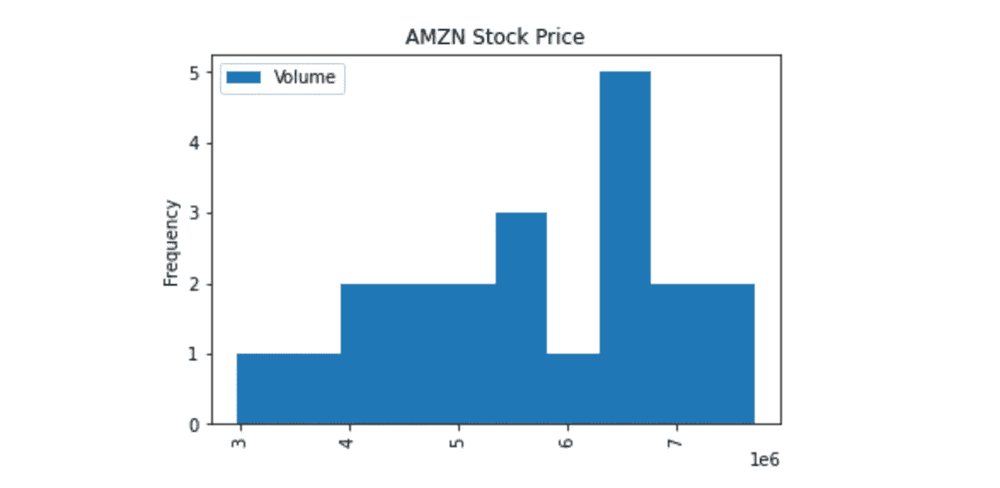

直方图

感谢你阅读这篇文章，我希望你喜欢并且今天学到了一些新的东西。如果您在执行代码时有任何问题，请随时通过我的博客联系我。我非常乐意帮忙。你可以找到更多我发表的与 Python 和机器学习相关的帖子。保持安全和快乐的编码！

*我是贝希克·居文，我喜欢分享关于创造力、编程、动力和生活的故事。*

*跟随* [*我的博客*](https://medium.com/@lifexplorer) *和* [*走向数据科学*](https://towardsdatascience.com/) *留下灵感。*

[](/introduction-to-python-for-data-science-6d1dba7c305c) [## 面向数据科学的 Python 简介

### 面向初学者的简单交互式教程

towardsdatascience.com](/introduction-to-python-for-data-science-6d1dba7c305c) [](/building-a-speech-recognizer-in-python-2dad733949b4) [## 用 Python 构建语音识别器

### 使用谷歌云语音 API 将您的音频文件转换为文本

towardsdatascience.com](/building-a-speech-recognizer-in-python-2dad733949b4)