# Python 为 FPL(！)数据分析

> 原文：<https://towardsdatascience.com/python-for-fpl-data-analytics-dadb414ccefd?source=collection_archive---------23----------------------->

## 使用 Python 和 Matplotlib 进行虚拟足球数据分析和可视化

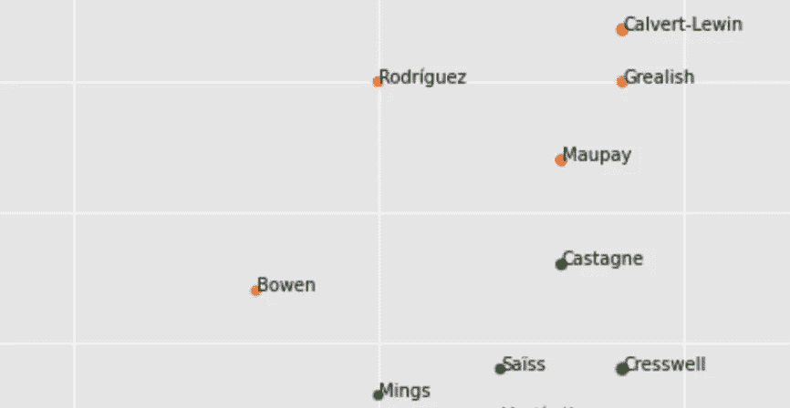

作者图表

# 介绍

这个作品有两个原因:(1)我想用 Python 自学一些数据分析和可视化技术；(2)我需要阻止我的梦幻足球队下滑几个排行榜。但首先，感谢大卫·艾伦提供了关于访问梦幻英超 API 的有用指南，[可以在这里找到](/fantasy-premier-league-value-analysis-python-tutorial-using-the-fpl-api-8031edfe9910#99db)。

首先，我们需要设置我们的笔记本以使用 Pandas 和 Matplotlib(为此我使用 Jupyter)，并连接到 Fantasy Premier League API 以访问分析所需的数据。

```
#Notebook Config
import requests
import pandas as pd
import numpy as np
%matplotlib inline
import matplotlib.pyplot as plt
plt.style.use('ggplot')#API Set-Up
url = '[https://fantasy.premierleague.com/api/bootstrap-static/'](https://fantasy.premierleague.com/api/bootstrap-static/')
r = requests.get(url)
json = r.json()
```

然后，我们可以建立我们的熊猫数据框架(想想数据表),它将被查询以获得有价值的见解——希望如此。我们创建的每个数据帧(_df)都与一个可通过 FPL API 访问的 JSON 数据结构相关。要获得完整的列表，运行 **json.keys()** 。我们对“元素”(球员数据)、“元素类型”(位置参考)和“球队”感兴趣。

```
elements_df = pd.DataFrame(json['elements'])
element_types_df = pd.DataFrame(json['element_types'])
teams_df = pd.DataFrame(json['teams'])
```

默认情况下， *elements_df* 包含许多我们现在不感兴趣的列(关于每个数据帧的概述，请参阅 David 的[文章](/fantasy-premier-league-value-analysis-python-tutorial-using-the-fpl-api-8031edfe9910#99db))。我创建了一个新的 DataFrame — *main_df —* ，其中包含我可能想要使用的列。

```
main_df = elements_df[['web_name','first_name','team','element_type','now_cost','selected_by_percent','transfers_in','transfers_out','form','event_points','total_points','bonus','points_per_game','value_season','minutes','goals_scored','assists','ict_index','clean_sheets','saves']]
```

需要注意的是 *elements_df* 使用键来引用球员的位置和球队等信息。例如，在' element_type *'* 列中，值为“1”=守门员，在 *'* 列中，值为“1”=阿森纳。这些是对我们创建的另外两个数据帧的引用( *element_types_df，*和 *teams_df)*

如果我们预览 *element_types_df* ，我们会看到这里的每个“id”号对应一个位置:

```
element_types_df.head()
```

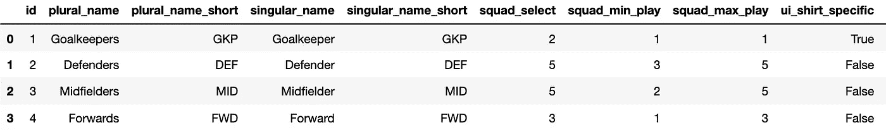

作者的表格输出

在 *teams_df* 中，“id”对应每个团队名称:

```
teams_df.head()
```

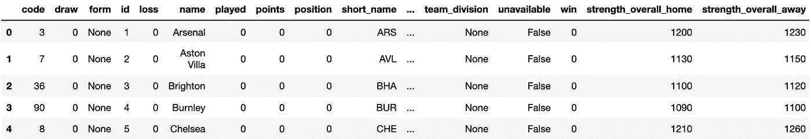

作者的表格输出

在这一点上，我们还可以看到没有一个团队的统计数据被更新，这可能是一个稍后的问题——我特别希望每个团队玩的游戏。为了节省时间和/或缺乏更好的解决方案，我通过以下方式手动添加数据:(1)创建一个新字典，(2)将其转换为两列数据帧，(3)用我创建的数据覆盖 *teams_df* 中的“已播放”列。

```
#create new dictionary
games_played = [['Arsenal','4'], ['Aston Villa','3'], ['Brighton','4'], ['Burnley','3'], ['Chelsea','4'], ['Crystal Palace','4'], ['Everton','4'], ['Fulham','4'], ['Leicester','4'], ['Leeds','4'], ['Liverpool','4'], ['Man City','3'], ['Man Utd','3'], ['Newcastle','4'], ['Sheffield Utd','4'], ['Southampton','4'], ['Spurs','4'], ['West Brom','4'], ['West Ham','4'], ['Wolves','4']]#turn into a DataFrame
played_df = pd.DataFrame(games_played,columns=['team','games_played'])#overwrite existing DataFrame column
teams_df['played'] = played_df['games_played'].astype(str).astype(int)#voila
teams_df.head()
```

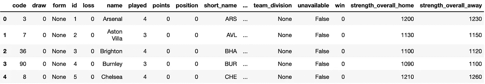

作者的表格输出

出于我们分析的目的，我们将使用实际的位置和团队名称，而不是数字标识符。为了避免以后引用不同地方的数据，我们现在可以将我们的数据帧合并在一起，形成一种“主”表。我们将使用 *main_df* 作为基础，使用 **pd.merge** 来执行到其他数据帧、 *elements_types_df* 和 *teams_df* 的连接。

这里有三个要素:

1.  使用 **pd.merge** ，其中 *"* left_on *="* 获取我们要加入的 *main_df* 中的唯一标识符。 *"* right_on *="* 是我们要连接的目标数据帧中的等效列(在这两种情况下， *'* id *'* )。例如 main _ df[' element _ type ']= element _ types _ df[' id ']，但我们实际上想在 display 中使用 element _ types _ df[' singular _ name ']。我们使用 *"* 右 *="* 来列出我们正在跨越的每一列。

```
#merging elements_types_df onto main_df
main_df = pd.merge(left=main_df,right=**elements_types_df**[['id','singular_name']],left_on='element_type', right_on='id', how='left')
```

2.使用 **df.drop** ，删除合并后不需要的列。虽然我们需要使用“id”列来连接，但我们不希望它们出现在最终的数据帧中。我们也不再需要原来的*'*element _ type*'*和 *'* team *'* 列，因为我们现在已经将用户友好的数据合并到了 *main_df 中。*使用“轴=1”指定我们正在删除一列而不是一行。

```
main_df = main_df.drop(["id", "element_type"],axis=1)
```

3.使用 **df.rename** ，清理我们的数据帧。在 *element_types_df 中，*位置名称存储在‘singular _ name’下。我们将把它重命名为“位置”,使它更直观。

```
main_df = main_df.rename(columns = {'singular_name': 'position'})
```

要合并 *teams_df* 数据，我们可以调整上面的内容:

```
#merging teams_df onto main_df
main_df = pd.merge(left=main_df,right=**teams_df**[['id','name','played','strength_overall_away','strength_overall_home']],left_on='team', right_on='id', how='left')
main_df = main_df.drop(["id", "team"],axis=1)
main_df = main_df.rename(columns = {'name': 'team'})
```

最后，我们先发制人地将一些现有列转换为**浮点数**，以避免运行计算和排序值的潜在问题，我们创建了一个新列“total_contribution”(进球和助攻的总和):

```
#Additional columns stored as floats
main_df['value'] = main_df.value_season.astype(float)
main_df['ict_score'] = main_df.ict_index.astype(float)
main_df['selection_percentage'] = main_df.selected_by_percent.astype(float)
main_df['current_form'] = main_df.form.astype(float)#Total Goals Contribution column = Goals + Assists
main_df['total_contribution']= main_df['goals_scored'] + main_df['assists']
```

*main_df* 的设置，我们可以使用**。loc()** 过滤掉所有值为< 0 的玩家，以避免我们的结果被那些没有获得游戏时间的玩家歪曲:

```
main_df = main_df.loc[sel_df.value > 0]#preview of current state
main_df.head(3)
```

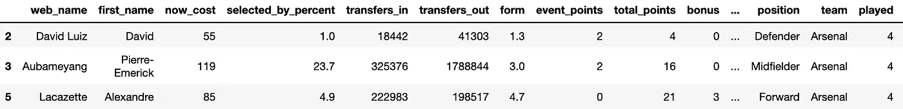

作者的表格输出

# 位置

现在，使用 **groupby()** 函数，我们可以按位置快速查看数据。第一个参数“position”选择要分组的列，而“as_index=False”防止该列被删除并用作索引。使用**聚合**函数，我们可以找到每个位置的平均值和总分。我已经用一个 **roundby()** 到把小数限制到两位。

```
position_group = np.round(main_df.groupby('position', as_index=False).aggregate({'value':np.mean, 'total_points':np.sum}), 2)position_group.sort_values('value', ascending=False)
```

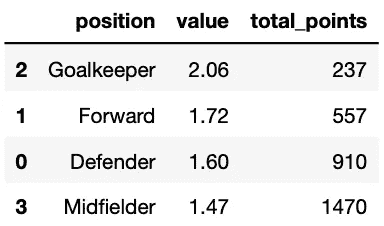

作者的表格输出

从花费来看，守门员目前返还了最多的分数，但是他们也只占球队总分数的很小一部分。由于游戏中很多门将都是 0 分钟出场，这里就不算了(因为他们的值= 0)。许多外场球员如果在比赛还剩 5 到 10 分钟的时候替补上场，将会得到 1 分的回报，拉低了平均得分。

# 组

球队层面的统计数据可以给出一个大致的指示，表明哪支球队打得好，或者哪里的球员可能被低估/高估。

```
team_group = np.round(main_df.groupby('team', as_index=False).aggregate({'value':np.mean, 'total_points':np.sum}), 2)
team_grp_df = team_group.sort_values('value', ascending=False)
team_grp_df['games_played'] = teams_df['played']
team_grp_df.head(5)
```

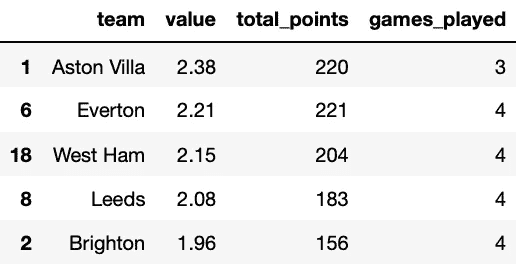

作者的表格输出

我个人并不认为西汉姆和布莱顿的资产在这个阶段(或任何阶段)价值会排名前五。然而，我们知道有些球队——包括曼联和曼城——比其他球队少打了一场比赛。让我们通过创建一些每场价值和每场得分指标来调整这一点:

```
team_group = np.round(main_df.groupby('team', as_index=False).aggregate({'value':np.mean, 'total_points':np.sum}), 2)
team_grp_df = team_group
team_grp_df['games_played'] = teams_df['played']
team_grp_df['value_adjusted'] = np.round(team_grp_df['value']/teams_df['played'],2)
team_grp_df['points_adjusted'] = np.round(team_grp_df['total_points']/teams_df['played'],2)
team_grp_df.sort_values('points_adjusted',ascending=False).head(5)
```

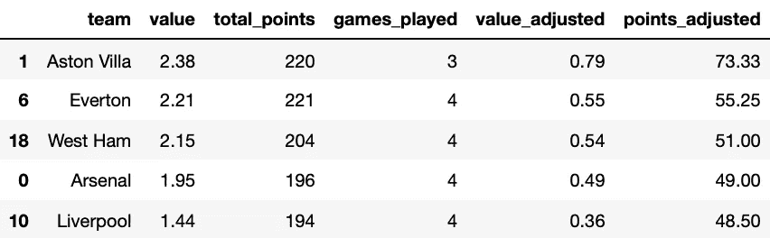

作者的表格输出

即使调整了比赛，曼联和曼城也没有进入前 5 名。鉴于他们最近对热刺和莱斯特的表现，这并不奇怪。阿森纳和利物浦都在每场比赛中获得大量的分数，但他们的价值分数表明你必须为此付出代价。

让我们使用 Matplotlib 来创建这些数据的一些更好的图形表示。使用 subplot 函数，我们可以并排绘制两个图形，以便于比较。我们会将团队“价值”和“总积分”与我们根据所玩游戏创建的调整数字进行比较。

```
fig,axes = plt.subplots(nrows=1, ncols=2, figsize=(20,7))
plt.subplots_adjust(hspace=0.25,  wspace=0.25)
team_grp_df.sort_values('value').plot.barh(ax=axes[0],x="team", y="value", subplots=True, color='#0087F1')
team_grp_df.sort_values('value_adjusted').plot.barh(ax=axes[1],x="team", y="value_adjusted", subplots=True, color='#2BBD00')
plt.ylabel("")fig,axes = plt.subplots(nrows=1, ncols=2, figsize=(20,7))
plt.subplots_adjust(hspace=0.25,  wspace=0.25)
team_grp_df.sort_values('total_points').plot.barh(ax=axes[0],x="team", y="total_points", subplots=True, color='#EB2000')
team_grp_df.sort_values('points_adjusted').plot.barh(ax=axes[1],x="team", y="points_adjusted", subplots=True, color='#FF8000')
plt.ylabel("")
```

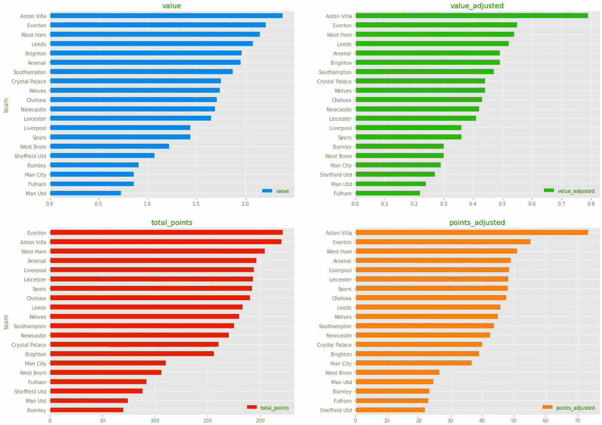

作者的图表:价值和总点数根据所玩游戏进行调整

阿斯顿维拉在调整了他们只打了三场比赛的事实后更加突出。看看他们的结果，不难看出为什么:1 比 0(对谢夫联特)，3 比 0(对富勒姆)，7 比 2(对利物浦！).显然，我们正在寻找小规模的样本，但在我们决定装载维拉的资产之前，也许要考虑到他们的两场胜利和零失球都来自于这两支本赛季场均得分最差的球队。我们能对去年冠军利物浦的比赛结果赋予多大的意义呢？

球队层面的数据只能告诉我们这么多——毕竟我们每队最多有三名球员——所以让我们缩小关注范围。我们将使用**。再次锁定** 以过滤每个位置并创建更多数据帧:

```
gk_df = main_df.loc[main_df.position == 'Goalkeeper']
gk_df = gk_df[['web_name','team','selection_percentage','now_cost','clean_sheets','saves','bonus','total_points','value']]def_df = main_df.loc[main_df.position == 'Defender']
def_df = def_df[['web_name','team','selection_percentage','now_cost','clean_sheets','assists','goals_scored','total_contribution','ict_score','bonus','total_points','value']]mid_df = main_df.loc[main_df.position == 'Midfielder']
mid_df = mid_df[['web_name','team','selection_percentage','now_cost','assists','goals_scored','total_contribution','ict_score','current_form','bonus','total_points','value']]fwd_df = main_df.loc[main_df.position == 'Forward']
fwd_df = fwd_df[['web_name','team','selection_percentage','now_cost','assists','goals_scored','total_contribution','ict_score','current_form','minutes','bonus','total_points','value']]
```

# 守门员

从守门员开始，我们将绘制一个简单的散点图，显示成本 v 点(“价值”指标)。Matplotlib 允许我们很容易地定制一些东西，比如绘图透明度(alpha=)、大小(figsize=)和线型(ls=)。出于本文的目的，我将保持一切一致。

```
ax = gk_df.plot.scatter(x='now_cost',y='total_points', alpha=.5, figsize=(20,9), title="goalkeepers: total_points v cost")
for i, txt in enumerate(gk_df.web_name):
    ax.annotate(txt, (gk_df.now_cost.iat[i],gk_df.total_points.iat[i]))
plt.grid(which='both', axis='both', ls='-')
plt.show()
```

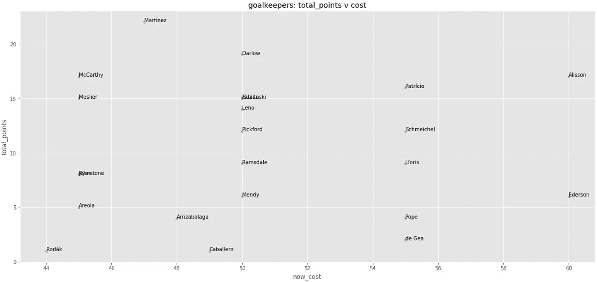

作者图表

在赛季初期，门将价格和总积分之间没有任何关系。麦卡锡是大量球员的季前赛价值选择，到目前为止，这一点得到了回报。马丁内斯在季前赛中被低估了，因为他是阿森纳的第二选择——他最近转会维拉给了那些把他带进来的人回报。纽卡斯尔的达洛目前在 500 万选秀权中得分最高，这令人惊讶，因为他们在四场比赛中只保持了一场零失球。还有什么解释？知道守门员每三次扑救也能得一分，我们可以用“扑救”数据重新绘图。

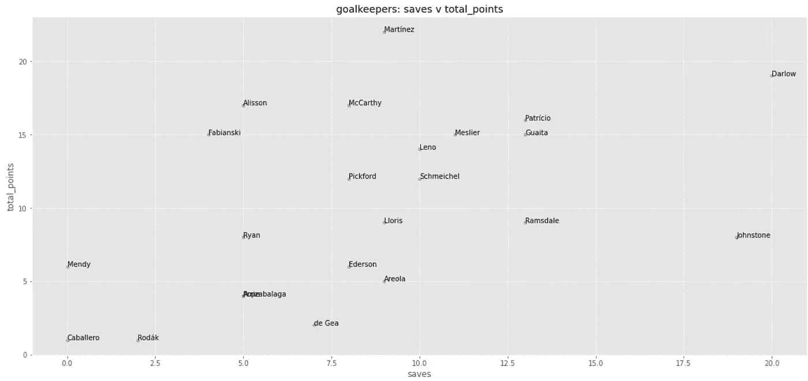

作者图表

看来达洛的扑救次数是大多数守门员的两倍多，这有助于解释他的总得分。这也表明他的辩护人没有给他提供多少保护。在任何情况下，不失球通常会带来更多的分数，所以我宁愿选择一个更有潜力的门将。马丁内斯和麦卡锡以更低的成本提供了更多的平衡。切尔西新签下的门迪在他的处子秀不失球中不需要任何扑救，500 万的身高有着长期的价值，如果你相信他们的防线会继续改善的话。

*他的举动没有回报那些把他带进来，让他坐冷板凳的人。我敢肯定，如果他们换成皮克福德，这些人会更加自责——皮克福德是一个竭尽全力帮助对方球队将球送入自己球门的守门员。

结论:皮克福德出局，麦卡锡/梅斯利尔进。

# **防守**

至于后卫，我们想要不失球或者进攻威胁——理想的是两者都要。亚历山大-阿诺德和罗伯逊去年在防守方面的期望达到了顶峰，但给利兹联进了 3 个球，给阿斯顿维拉进了 7 个球，这表明了问题的存在。那么哪些后卫赛季开局不错呢？

```
def_df.sort_values('total_points',ascending=False).head(5)
```

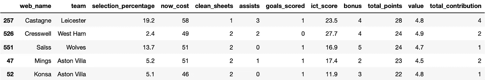

作者的表格输出

很多人都注意到了卡斯塔涅本赛季的梦幻开局(现在有 19.2%的球队)。另一方面，西汉姆的克雷斯韦尔仍然在很大程度上被忽视了——尽管他的总得分仅为 490 万。他的 ICT 指数得分也高达 27.7，对于任何不熟悉的人来说，这代表着影响力、创造力和威胁。这本质上是衡量球员在球场两端重要时刻的投入程度。这有助于评估一名球员是否为他人创造了好机会，或者进入了他们可能得分的位置。

为了快速查看与价格相关的最高表现后卫，我将制作一个新的数据框架 *topdef_df* ，仅选择值>为 3 且至少有 1 个进球贡献(进球或助攻)的后卫。

```
topdef_df = def_df = def_df.loc[def_df.value > 3]
topdef_df = topdef_df = topdef_df.loc[def_df.total_contribution > 0]
```

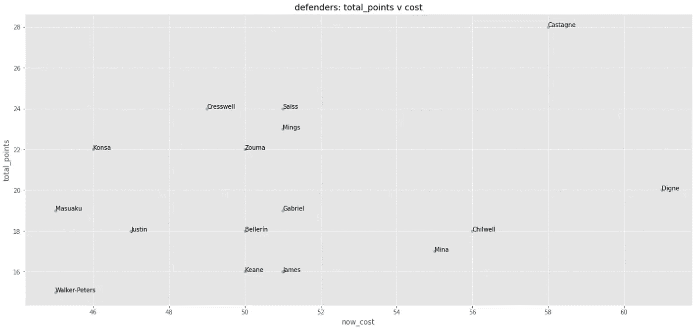

作者图表

ICT 分数高但总分数低的球员可能运气不好，如果机会转换得更早而不是更晚，那些从分数角度看“表现不佳”的球员现在可能仍然是一支球队有价值的补充。我们能知道是否有“不幸的”防守者存在吗？我们可以尝试为 ICT 得分> 10 的捍卫者创建一个数据框架，看看谁得到了奖励，谁没有。

```
unluckydef_df = def_df.loc[def_df.ict_score > 10]
unluckydef_df.sort_values('ict_score', ascending=False).head(5)
```

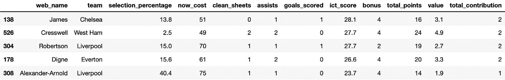

作者的表格输出

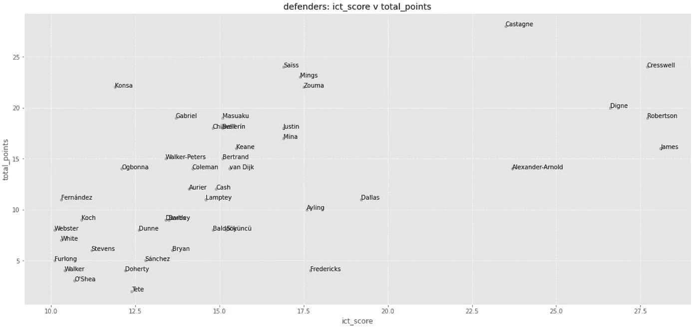

作者图表

亚历山大-阿诺德(7.5 米)和罗伯逊(7.0 米)没有出现在之前的图中，因为我们过滤了值> 3。鉴于他们本赛季的缓慢开局，拥有其中任何一个的球员都会高兴地看到他们仍然是游戏中最具威胁的球员之一，应该坚持下去——尽管他们付出了代价。切尔西的詹姆斯凭借他的进攻价值进入了很多人的球队，尽管他最近在排名上落后于阿兹皮里库塔。迪格内并不便宜(6.1 米)，但他在一支强大的埃弗顿队中为理查德森和卡尔弗特-勒温服务——期待他的助攻数继续增加。在“不幸”的一面，弗雷德里克斯(440 万)、艾林(450 万)和达拉斯(450 万)到目前为止都相当严重地卷入了他们的比赛，没有分数显示出来。在这样的价格下，这三个人都是很好的替补人选。

结论:迪格内和奇尔威尔看起来都比我现在的多赫蒂(590 万)更好。我还听从了一个朋友的坏建议，把斯特鲁克(4.0 米)作为替补——弗雷德里克斯/艾林/达拉斯中的任何一个都是可以承受的升级。

# **中场**

中场球员:很可能是球队得分最多的地方。为了立即关注高水平球员，我们可以像对待后卫一样，创建另一个新的数据框架——这一次，只选择 ICT 得分> 25 且总得分> 15 的中场球员。

```
topmid_df = mid_df.loc[mid_df.ict_score > 25]
topmid_df = topmid_df.loc[mid_df.total_points > 15]
topmid_df.sort_values('total_points',ascending=False).head(5)
```

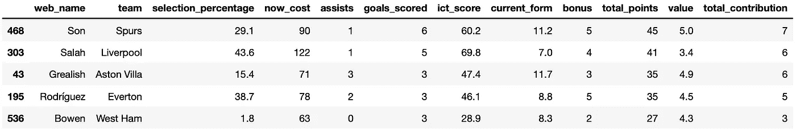

作者的表格输出

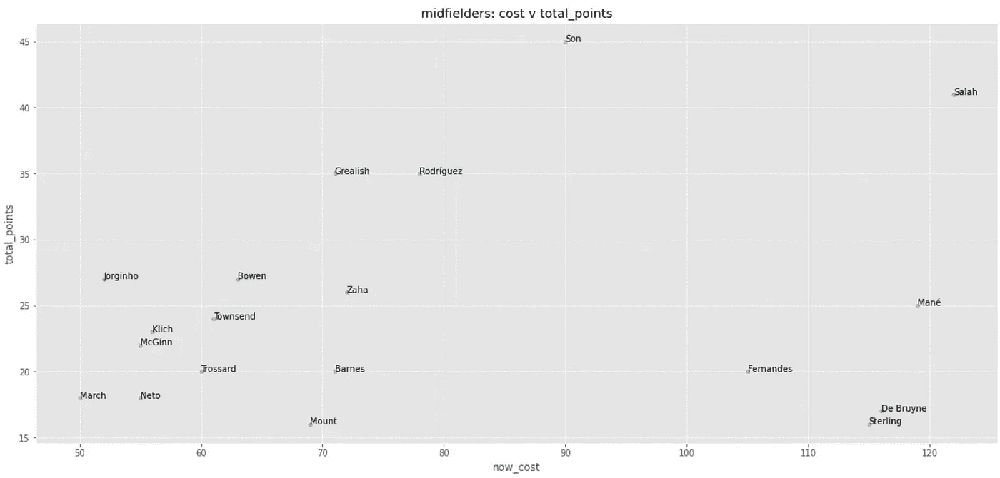

作者图表

萨拉赫(1220 万英镑)和孙正义(900 万英镑)是迄今为止仅有的证明其价格合理的大牌资产。德布鲁因和斯特林有一场比赛在手，但他们的前三场比赛没有太多表现。格里利什(710 万英镑)和罗德里格斯(780 万英镑)是目前的中层价值选择，鉴于阿斯顿维拉和埃弗顿的攻击性比赛有多少是通过他们进行的，你会期望这种情况继续下去。鲍文(6.3 米)和若日尼奥(5.2 米)看起来很有价值，尽管后者在四场比赛中进了三个点球，增加了他早期的得分回报。

但是 FPL 球员喜欢(或者忽略)哪些中场球员呢？我保持了> 15 个总点数参数不变，但是按照总体选择百分比而不是成本来绘制结果。

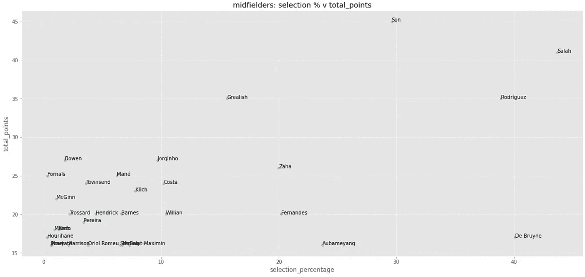

作者图表

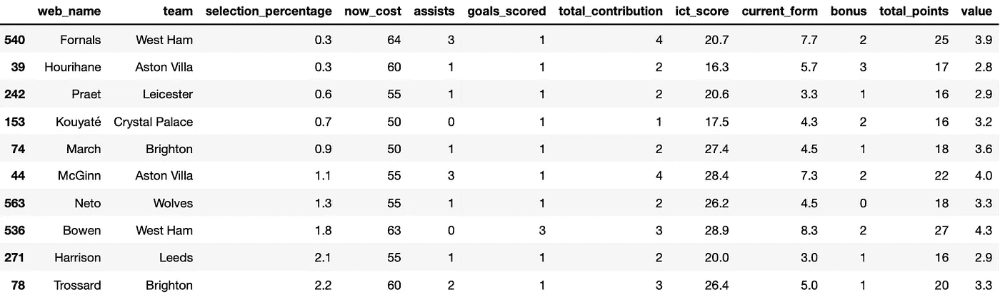

作者的表格输出

鲍文再次脱颖而出——在赛季开局相当强劲之后，只有不到 2%的球员选择了他。在 FPL 语中，他实际上是一个“与众不同”的选择。拥有足够低的所有权百分比的人，如果他回报良好，他会帮助你获得排行榜位置(因为很少其他人也会获得这些分数)。很多人希望优质资产奥巴姆扬和德·布鲁因能尽快开拍。

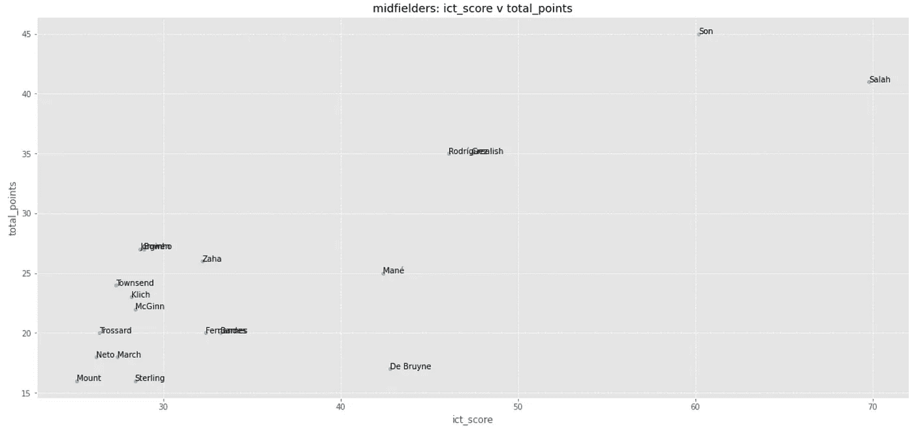

作者图表

根据 ICT 的判断，德布鲁因的持有者可以放松一点，因为他的开局很好——伤病意味着曼城缺少一名彻头彻尾的前锋，他本可以奖励他的机会创造。如果你选择了斯特林，你可能会稍微担心他会像汤森或麦吉恩一样有威胁性(费用加倍)。在另一端，儿子和萨拉赫看起来像必须的。

结论:萨拉赫和德布鲁因可能会在本赛季余下的比赛中保持领先。我会尽快让儿子回来，在他因为一个不存在的伤被转移出去之后。引进巴恩斯和佩雷拉还没有奏效——如果他们的贡献不能迅速提高，我将根据我的预算为格里利什/罗德里格斯转会。

# 向前

在球场的顶端，有一些更多的惊喜，看看早期的价值来自哪里。我已经排除了每个人还没有贡献一个目标来整理剧情:

```
topfwd_df = fwd_df[fwd_df.total_contribution > 0]
```

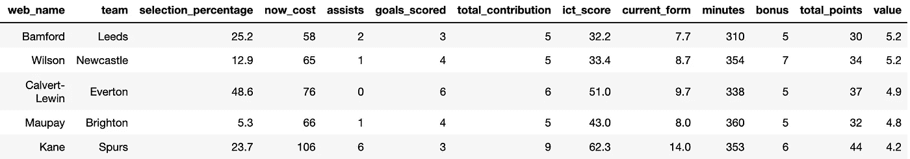

作者的表格输出

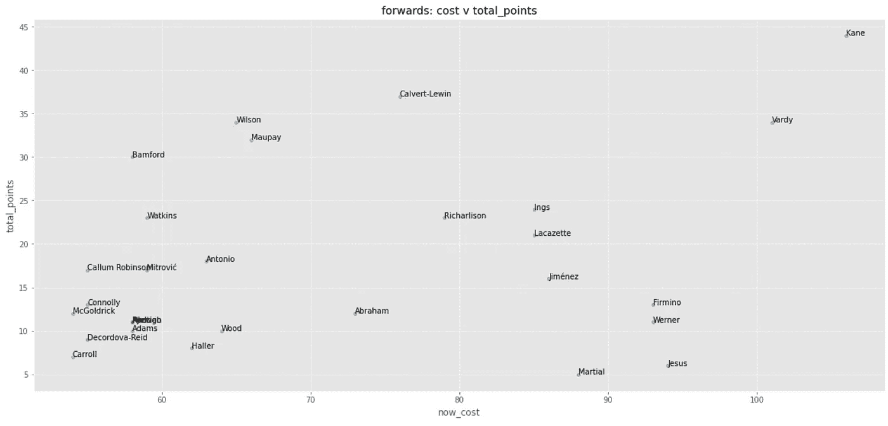

作者图表

价格和积分之间仍然没有太大的关联。像英格斯和吉米内兹这样的中等价值球员做得还可以，不算伟大。大部分的分数似乎来自 6.0-6.5 米的关口，或者 10.0 米以上。卡尔弗特-勒温本赛季的开局令人印象深刻，他的身价从 700 万英镑稳步上升到 760 万英镑。与瓦迪、威尔逊和穆佩不同，卡尔弗特-勒温的进球也没有一个来自点球。48%的玩家现在让他加入——另外 52%的玩家不会承认他们错了，即使这会让他们付出代价(我以前见过这种情况……)。

在其他地方，即使是 1060 万，凯恩仍然提供了很多价值——直接促成了本赛季迄今为止的最多进球(9)。马夏尔和沃纳可能是最大的失望，沃纳不知何故被亚伯拉罕得分超过，这是他签约取代的前锋。

以稍微不同的东西来结束，我们可以看看 FPL 球员对球员状态的反应。每个人都提到“此刻不能错过”的状态良好的前锋。理论上，人们会希望在状态正佳的球员状态正佳的时候抓住他们。在 FPL，形式=三十天内每场比赛的平均总分数。

```
#Add the 'transfers_in' column from our original main_dffwd_df['transfers_in'] = main_df['transfers_in']
informfwd_df = fwd_df[fwd_df.current_form > 5]
```

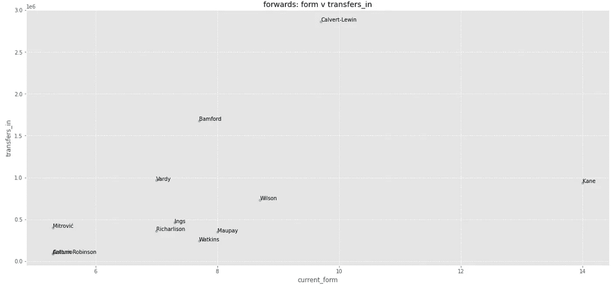

作者图表

在一个小样本量的状态良好的球员中存在一定程度的相关性(其中状态> 5)。凯恩的低转会数量可能只是反映了他已经在许多球队开始了这个赛季的事实。基于前几场比赛，很多人选择了巴福特、瓦迪和威尔森，但仍然没有多少人喜欢西布朗的卡勒姆·罗宾逊——尽管他在对切尔西的比赛中进了两个球。人们在卡尔弗特-勒温上发言，在过去几周增加了近 300 万个团队。

结论:我一直很固执，紧紧抓住理查德·里森不放，但很明显，明智的选择是他的搭档。吉米内兹有一个不错的赛程，所以他可以暂时留下来。布鲁斯特(4.5 米)很可能会坐上我的板凳，如果他在谢菲尔德联队开局不错的话。否则，我会考虑重新平衡我的团队，引进沃特金斯或巴福特。

# 全部的

最后，这里是按位置排列的前 5 名价值(价值=点数/成本)玩家的视图。尽管值得记住的是，由最高“价值”球员组成的球队不会在许多排行榜上名列前茅，但这都是为了在总体预算限制下最大化积分。找到好的价值可以让你在那些能打出最大比分的球员(萨拉赫，凯恩)身上花更多的钱。

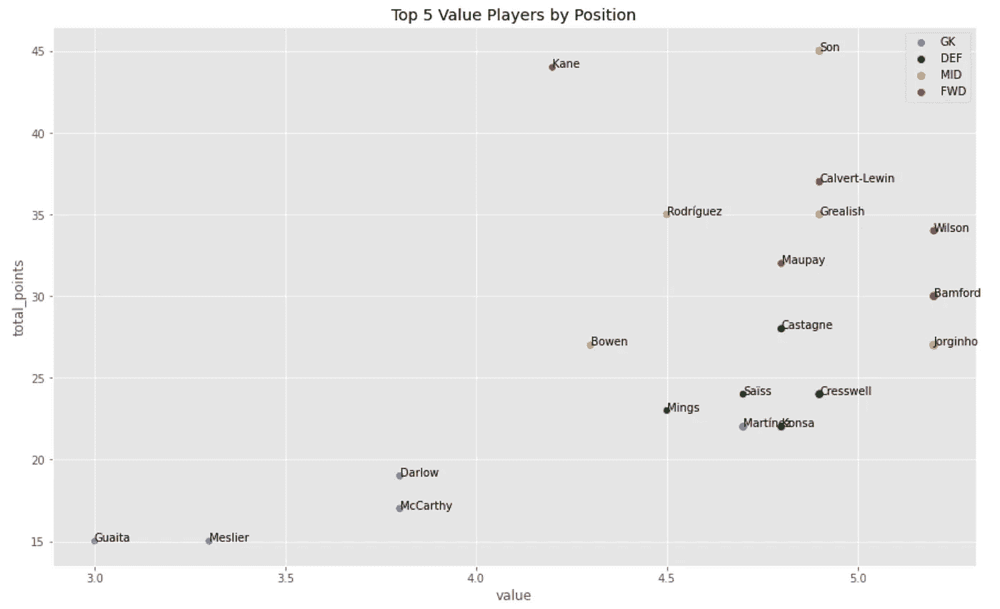

作者图表

为了绘制这个图，我使用 **nlargest()** 按位置制作了一个前 5 名的数据框架

```
top5_gk_df = gk_df.nlargest(5, 'value')
top5_def_df = def_df.nlargest(5, 'value')
top5_mid_df = mid_df.nlargest(5, 'value')
top5_fwd_df = fwd_df.nlargest(5, 'value')
```

通过将第一个图定义为“ax ”,然后在第二个、第三个和第四个图中引用“ax=ax ”,在同一图形上对每个数据帧进行分层之前:

```
ax = top5_gk_df.plot.scatter(x='value', y='total_points', color='DarkBlue', label='GK', s=top5_gk_df['value']*10, alpha=.5, figsize=(15,9), title="Top 5 Value Players by Position")
for i, txt in enumerate(top5_gk_df.web_name):
    ax.annotate(txt, (top5_gk_df.value.iat[i],top5_gk_df.total_points.iat[i]))top5_def_df.plot.scatter(x='value', y='total_points', color='DarkGreen', label='DEF', s=top5_gk_df['value']*10, ax=ax)
for i, txt in enumerate(top5_def_df.web_name):
    ax.annotate(txt, (top5_def_df.value.iat[i],top5_def_df.total_points.iat[i]))top5_mid_df.plot.scatter(x='value', y='total_points', color='DarkOrange', label='MID', s=top5_gk_df['value']*10, ax=ax)
for i, txt in enumerate(top5_mid_df.web_name):
    ax.annotate(txt, (top5_mid_df.value.iat[i],top5_mid_df.total_points.iat[i]))top5_fwd_df.plot.scatter(x='value', y='total_points', color='DarkRed', label='FWD', s=top5_gk_df['value']*10, ax=ax)
for i, txt in enumerate(top5_fwd_df.web_name):
    ax.annotate(txt, (top5_fwd_df.value.iat[i],top5_fwd_df.total_points.iat[i]))
```

“s=top5_gk_df['value']*10”参数使每个散点图气泡的大小成为“value”列的函数。也就是说，‘价值’越大，泡沫越大。然而，鉴于规模较小，上述结果几乎可以忽略不计。

# 结论

以上主要是使用 Python 掌握数据帧创建、操作和图形表示的练习，但是在可视化和定制方面还有很多工作要做。从数据的角度来看，不可否认，一个赛季有三到四场比赛还为时过早，但分析数据的工具/方法将在很大程度上保持一致。随着赛季的进行，不断重新运行代码来观察事情的发展会很有趣。只需不到 1 秒钟的时间，就可以重新运行生成这里所有内容的所有代码——在 FPL 应用程序上，这无疑节省了大量时间。