# Python 投资:一月晴雨表策略

> 原文：<https://towardsdatascience.com/python-for-investing-january-barometer-strategy-25812ba9a904?source=collection_archive---------48----------------------->

## **深入分析。**

## 一月气压计真的有用吗？

投资时，市场时机至关重要。一种市场理论是一月份的晴雨表，它表明一月份的表现决定了今年剩余时间的市场表现。换句话说，如果 1 月份的回报是正的，那么今年剩下的时间很可能也会是正的。我想在指数水平和部门水平上检验这个理论。这个假设在标准普尔 500、纳斯达克综合指数或罗素 2000 指数上行得通吗？这个理论在某些领域比其他领域更成功吗？此外，2020 年，我们能期待什么？该指标能应对冠状病毒爆发的影响吗？

让我们潜心研究数据，找出答案！

# 数据源

Python 使得获取我分析所需的数据变得非常容易。我用来获取财务数据的两个包是 Quandl 和 pandas_datareader。

Quandl 是一个包含许多数据集的金融图书馆，如果你注册的话，你可以免费访问其中的一些。通过在 Python 中安装这个包，可以直接将数据调用到 dataframe 中。以下是我如何检索 S&P 综合数据。

```
import pandas as pd
import numpy as np
import datetime 
#For graphing
import matplotlib.pyplot as plt
%matplotlib inline# quandl for financial data
import quandl# Retrieve SP500 data from Quandl
sp = quandl.get(“YALE/SPCOMP”, authtoken=unqiue_token, collapse=”daily”)
```

我还使用 pandas_datareader 来获取 Yahoo Finance 数据，因为 Quandl 没有太多我要寻找的历史数据。Pandas_datareader 是一个简洁的库，允许你从网站中提取数据。下面是一个例子，我如何检索历史 NASQAD 综合价格。

```
import pandas_datareader as dr
df = dr.data.get_data_yahoo('^IXIC', start='1971-12-31', end = '2019-12-31')
```

# 一月份标准普尔 500 晴雨表的表现

使用耶鲁大学经济系从 1872 年至今的 S&P 综合数据，我计算了每年 1 月和 2 月到 12 月的回报率。在这 148 年中，1 月回报率为正的有 98 次。在这 98 次中，从 2 月到 12 月的回报也是正的 65 次。总体而言，一月回报成功预测全年回报的次数有 91 次，成功率为 61.49%。

下面的图 1 显示了假设成功的 91 次。根据 1 月份的数据，1933 年和 1879 年的 2-12 月回报率最高，分别为 40.6%和 37.4%。晴雨表也有助于避免市场损失。例如，在 2008 年、1907 年和 1917 年，该指标为负，暗示不要投资。在那几年，市场实际上跌幅最大，2 月至 12 月的回报率分别为-36.4%、-31.3%和-28.9%。

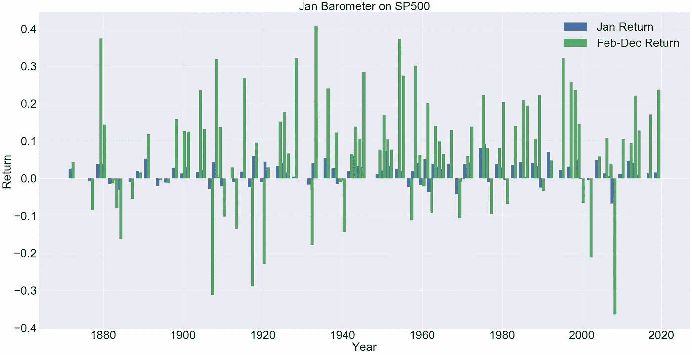

**图 1:一月晴雨表正确预测全年表现的实例**

这是我如何制作图 1 的:

```
sp3 = sp2[sp2['jan_sign'] == sp2['FebDec_sign']][['spreturn','FebDecreturn']]
width = 0.75  # the width of the barsfig, ax = plt.subplots(figsize=(40,20))
rects1 = ax.bar(sp3.index - width/2, sp3['spreturn'], width, label='Jan Return')
rects2 = ax.bar(sp3.index + width/2, sp3['FebDecreturn'], width, label='Feb-Dec Return')ax.set_ylabel('Return', fontsize=40)
ax.set_xlabel('Year', fontsize=40)
ax.set_title("Jan Barometer on SP500",fontsize=40)
ax.legend(fontsize=40)
ax.tick_params(axis='both', which='major', labelsize=40)
```

下面的图 2 显示了一月份气压计失灵的 57 次。当跟随指标时，投资者可能会错过大的市场收益。例如，明智的做法是不要在 1927 年和 2009 年遵循这一理论，当时晴雨表预测今年为负，但当年剩余时间的回报率实际上为正，分别为 30.3%和 28.3%。另一方面，晴雨表也可能有风险，它预测一个积极的一年，但最终却是消极的一年。例如，在 1931 年，1 月份的回报率为正 3.1%，但当年剩余时间的收益率大幅下跌-47.1%。

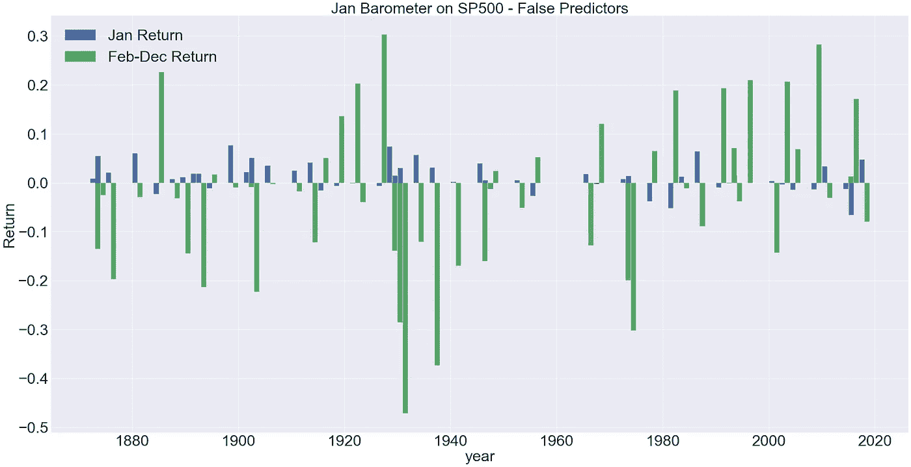

**图 2:一月份的晴雨表错误预测全年表现的实例**

**气压计在其他指标上的表现**

我使用雅虎财经的纳斯达克综合指数、道琼斯指数和罗素 2000 指数的每日收盘价数据，应用晴雨表来观察它的表现。在图 3 中，如果忽略晴雨表，总回报代表在数据中所有年份都保持投资的年化回报。如果投资者仅在 1 月份回报率为正的年份投资(假设 1 月份没有投资)，则晴雨表回报率是年化回报率。有趣的是，通过遵循一月晴雨表理论，投资者将获得比忽视该指标更大的回报。每个指数的成功率都比抛硬币要好，其中纳斯达克综合指数的成功率最高(67%)。无论 30 种证券或 500 种证券或大型技术公司或小型公司的指数，1 月份的晴雨表表现良好。

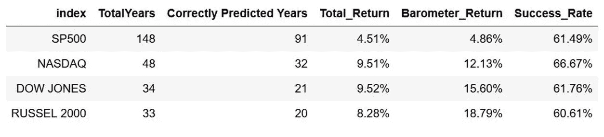

**图 3**

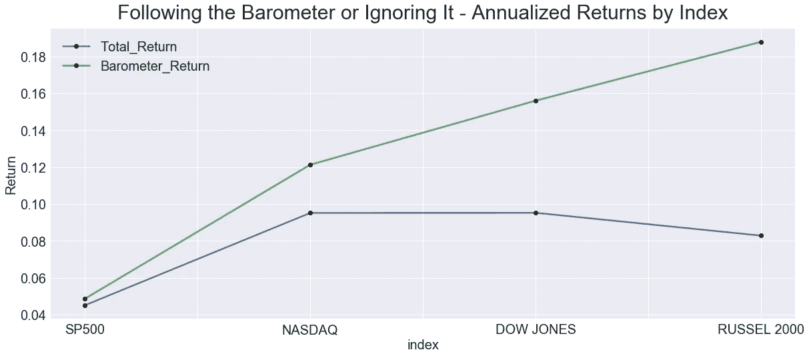

**图 4**

**气压计在行业层面的表现**

利用雅虎财经 21 年的 S&P500 板块数据，我发现了每个板块的晴雨表强度。该理论在医疗保健和公用事业领域的效果最好，成功率分别为 67%和 62%。金融部门表现最差，只有 38%的成功率。

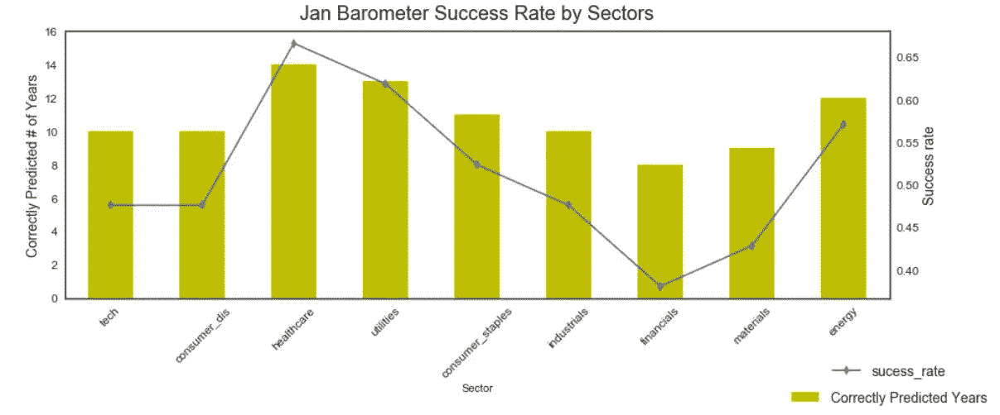

**图 4**

下面的代码是我如何制作组合条形图和折线图的，它清楚地显示了正确预测的年份和成功率之间的趋势和关系:

```
fig, ax1 = plt.subplots(figsize=(15, 5))
plt.style.use('seaborn-white')
ax2 = ax1.twinx()
chart = df_sector.set_index('Sector')['Correctly Predicted Years'].plot(kind='bar',color = 'y', ax=ax1)
df_sector.set_index('Sector')['sucess_rate'].plot(kind='line', marker='d', ax=ax2)ax1.set_ylabel("Correctly Predicted # of Years",fontsize=14)
ax2.set_ylabel("Success rate",fontsize=14)
ax1.set_ylim([0,16])
chart.set_xticklabels(chart.get_xticklabels(), rotation=45,fontsize=16)
ax2.legend(loc=9, bbox_to_anchor=(1, -0.2),fontsize=14)
ax1.legend(loc=9, bbox_to_anchor=(1, -0.3),fontsize=14)
plt.title("Jan Barometer Success Rate by Sectors", y=1.02, fontsize=20)
plt.tick_params(axis='both', which='major', labelsize=12)
ax1.tick_params(axis='both', which='major', labelsize=12)
```

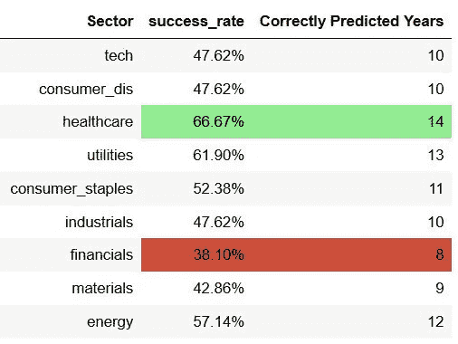

**图 5**

如果忽略该指标，并投资所有 21 年，非必需消费品行业的年化回报率最高(6.6%)。非必需消费品板块是唯一一个在忽略晴雨表(6.6%)时表现好于遵循理论(6.1%)的板块。当投资于晴雨表预测为正年的年份时，所有其他行业都有较高的回报。公用事业部门的平均回报率最高，为 10.1%，而金融行业的平均回报率最低，为-1.8%。

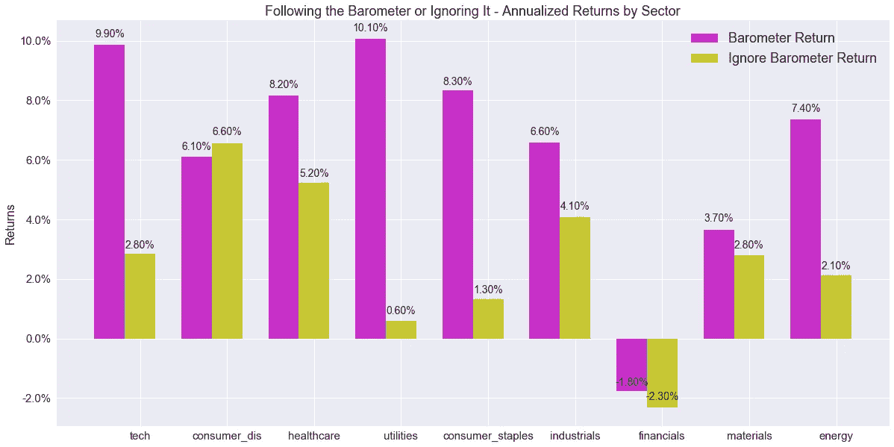

**图 6**

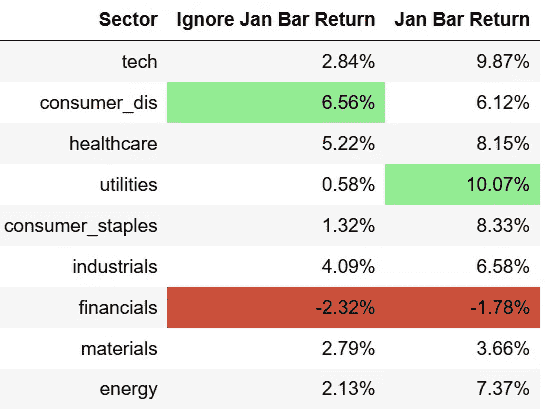

**图 7**

从统计学的角度来说，混淆矩阵是显示预测模型错误的一种直观方式。我计算了四个指标:真阳性、假阳性、假阴性和真阴性。真正的积极是当气压计正确预测一个积极的一年。假阳性是指气压计错误地预测了一个正年份，导致投资者亏损。假负是指一月份的回报为负，但一年中的其他时间回报为正，因此投资者错过了一项有利可图的投资。真正的负值是当晴雨表正确地预测到一个不利的年份，帮助投资者避免一个糟糕的投资。真正的积极和真正的消极衡量一月晴雨表理论的成功。假阳性和假阴性衡量指标的误差。材料行业的假阴性案例最多，投资者错过了好的投资机会。当投资者在投资组合中失去收益时，金融类股的误判率最高。

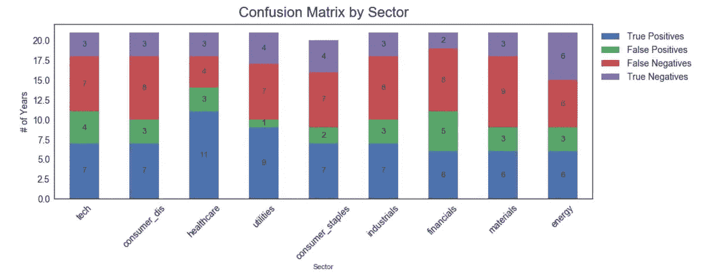

**图 8**

## 一月气压计和过去的流行病

随着当前 COVID 19 疫情的爆发，我很想看看 1 月份关于以往流行病和大流行的晴雨表的表现。以 LiveScience.com 为参照，我选取了最近的 8 次疫情，发现标准普尔 500 1 月和 2 月至 12 月为疫情爆发的第一年。一月晴雨表对 8 次爆发中的 5 次有效，成功率为 62.5%。2020 年，1 月份的回报率为负(-0.99%)，因此，如果遵循该指标，今年剩余时间的回报率也可能为负。2009 年，当猪流感出现时，1 月份的回报是负的，但与其他疫情相比，当年其余时间的回报是最高的。然而，这在很大程度上是由于央行非常规的量化宽松货币政策。这与今天美联储使用同样的货币工具的情况相当。尽管晴雨表预测，随着美联储在 2020 年的干预，市场可能会经历一场繁荣。

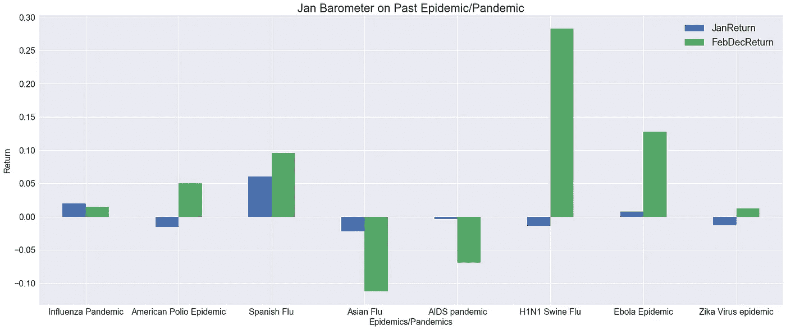

**图九**

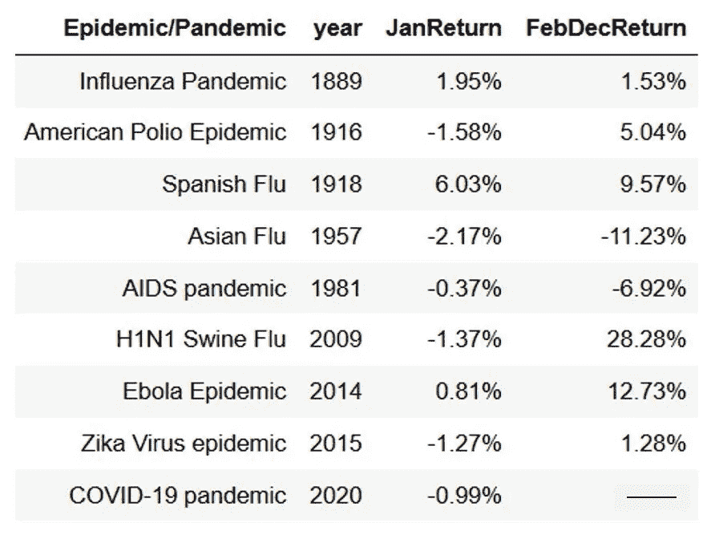

图 10

总的来说，一月晴雨表确实有效，跟踪它，回报比忽略它要高。然而，投资者应谨慎使用，因为许多其他因素，如美联储的货币政策和地缘政治因素也会影响市场。

Git Hub Repo:

[https://github . com/joohirana/mediu article _ januarybarometer 2020 . git](https://github.com/joohirana/MediumArticle_JanuaryBarometer2020.git)

参考:

[](https://www.livescience.com/worst-epidemics-and-pandemics-in-history.html) [## 历史上 20 次最严重的流行病和大流行

### 纵观历史，疾病爆发蹂躏人类，有时会改变历史进程…

www.livescience.com](https://www.livescience.com/worst-epidemics-and-pandemics-in-history.html) 

[1] O. Jarus，历史上 20 次最严重的流行病和大流行(2020 年)，《生活科学》。