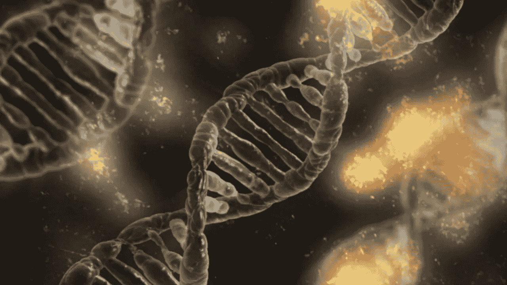
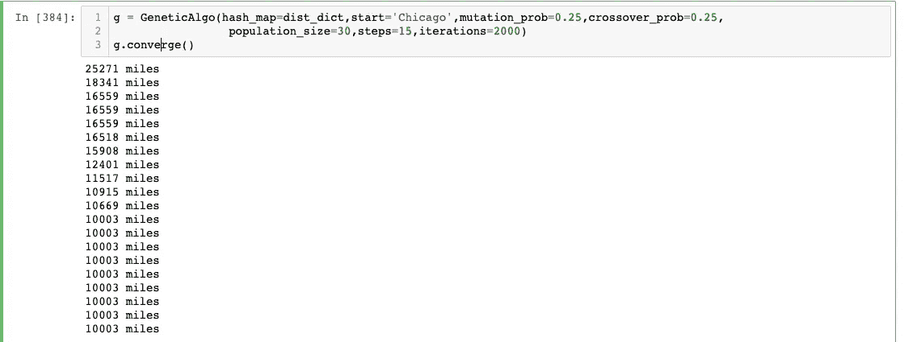
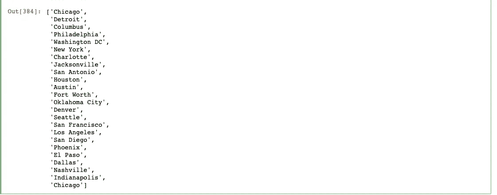

# Python:遗传算法和旅行推销员问题

> 原文：<https://towardsdatascience.com/python-genetic-algorithms-and-the-traveling-salesman-problem-f65542fae5d?source=collection_archive---------10----------------------->

## 当分类和回归…没用的时候怎么办！

信用:Pixabay

在过去的 5 年里，数据科学受到了疯狂的复仇者级别的炒作。但是你知道运筹学也同样有趣、有益和具有挑战性吗？然而，与数据科学不同的是， *OR 并不是 100%专注于将分类和回归技术应用于任何和所有问题。*

**我说这话有点言不由衷。**

不过是~真的。很少有任务不能被强制成分类或回归问题。但是今天让我们换个话题，讨论其中的一些问题。两个高度影响的问题包括“旅行推销员问题”和“车辆路径问题”后者要复杂得多，涉及到时间因素，而且常常涉及到几辆车。但是在这篇介绍性的文章中，让我们关注两者中更容易的一个。

## 什么是旅行推销员问题？(TSP)

考虑一个推销员，他离开任何给定的地点(我们说是芝加哥)，在回家之前必须在其他 x 个城市停留。维基百科方便地列出了美国前十大城市，所以我们只关注前 25 个。

像任何可以优化的问题一样，必须有一个代价函数。在 TSP 的上下文中，必须尽可能地减少总行驶距离。一个强力的解决方案对于 25 个城市来说是 100%可能的，然而，它比你想象的要复杂的多。25 个城市有 15，511，210，043，330，985，984，000，000 种不同的排列。这大约是 15.5 亿英镑。你知道七月是一个词吗？

有了这么多可能的组合，*找到全局最优解有点像在针堆里找一根干草。是的，你没看错。作为回应，我们的目标不是找到全局最优解——而是找到无数个近似最优解中的一个，并避免无数个中等好的(和绝对糟糕的)解。这是遗传算法的一大进步。*

## 什么是遗传算法？

遗传算法是一类从遗传学中获取灵感的算法。更具体地说，“基因”通过交叉(繁殖)和突变经过多次迭代而进化。这可能有点乱伦，但请原谅我。在最简单的情况下，我们从两个基因开始，这些基因相互作用(交叉),产生一个新基因，从一个基因获得一些属性，从另一个基因获得其余属性。然后，随机变化(突变)被引入新基因。现在有三个基因，两个父母和一个孩子；所有这三个都根据成本函数进行评估。如果孩子是最弱的，我们删除它，重新开始。否则，我们去掉双亲中较弱的一个，然后用剩下的两个基因重复整个过程。从概念上讲，这就是全部。

它基本上是进行 x 猜测，创建 y 混合猜测，评估基因库的适应性并做一些修剪。冲洗并重复，直到你收敛于一个解决方案。(你会收敛到一个解，它很可能是全局最优解**而不是**。)*是的，因为计算机正在从遗传学中汲取灵感，但并没有受到遗传学特性的内在限制，所以算法在每次迭代中可以有任意数量的父母和子女。*

## 变异和交叉起什么作用？

早期，变异是王道。这是“探索-利用”范式中的**探索**(在强化学习术语中很常见。)突变学习什么“管用”。然而，随着系统开始学习什么是有效的，什么是无效的，重要的是改变方式，开始很好地利用我们的知识——通过交叉——并利用我们所学的知识。有几种方法可以做到这一点。它可以是突然的转变，也可以是逐渐的变化。但关键是以科学家的思维开始，从环境中学习，以商人的思维结束，从学到的经验中获利。

## 好吧，但这在实践中意味着什么？

在 TSP 的上下文中，每个“基因”将是一个城市序列，以芝加哥开始和结束。任何给定基因的“适应度”是其往返总距离。我们从随机产生的 x 基因开始。如果我们只是偶然发现了全局最优解，那将是不可思议的，但这是不可能的；同样，任何起始基因都不太可能是字面上最糟糕的旅行。但是，有些基因会比其他基因更“适合”。注意我们只随机生成基因**一次。** 过了这一点，每一个新的基因都是交叉和突变的函数。在 TSP 的上下文中，这意味着*随机地*从先前的基因中继承城市*和它们各自的索引*。例如，我们可能从一个父母基因中继承“达拉斯”作为第五个元素，从另一个父母基因中继承“纳什维尔”作为第六个元素。请注意，我们随机选择了这些城市及其指数；我们不知道这是否有益。我们只是简单地去做，然后抱最大的希望。如果这不是有利的，新的基因被丢弃，我们重新开始。但是如果这个随机选择 ***是*** 有益的，我们就丢弃较弱的亲代基因并继续。我们仍然不知道达拉斯获得第五个指数是否有什么神奇之处，但在当时它似乎是有利的，所以最新的基因进化来保持它。

这个过程一遍又一遍地重复。

最终，一个基因将会“非常好”,并且在随后的迭代中不会被替换。我们的基因将很有可能陷入局部最优。但这是可以接受的，因为有超过 1570 亿种选择，而绝大多数都非常糟糕。但这是普遍生活的真实情况。种类繁多，谁说老虎进化*对*而狮子进化错了？当然，一只古代通灵串联战象会胜过这两者(谷歌一下)，但是这种可能性还没有*在我们的物理宇宙中*实现，而且(可悲的是)它可能永远不会实现。

## 现在是代码！

一对夫妇注意，(A)我已经包括了一个小功能，将查询谷歌地图之间的距离位置。(B)我从这里得到了[排名前 25 的城市](https://en.wikipedia.org/wiki/List_of_United_States_cities_by_population)，以及(C)我*是否使用了作为迭代函数逐渐减少的ε参数，有利于早期探索和后期开发。*

现在让我们来看看结果。我们开始时总持续时间超过 25，000 英里，后来减少到大约 10，000 英里。(对于一个运行了~3 秒的算法来说，已经不错了！)

如你所见，我们*和*被卷入了我几乎可以肯定是局部最优的情况，但是公路旅行实际上是有意义的，这真的很酷！您需要对这段代码进行大量的修改，以适应不同的目的，但是市场上有更健壮的遗传算法实现。我只希望这篇文章扩展了您对分类和回归世界之外的可能性的认识。

感谢阅读！如果你认为我的内容没问题，请订阅:)