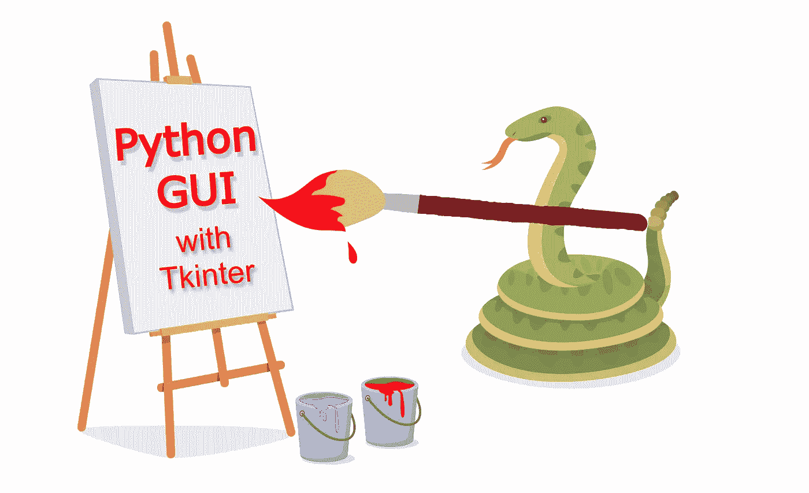
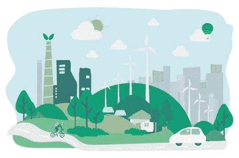
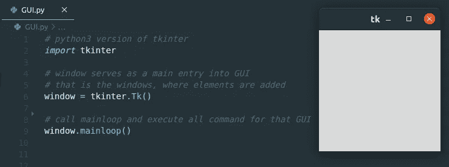
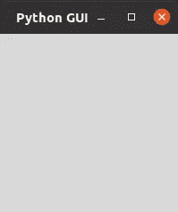
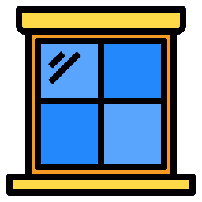
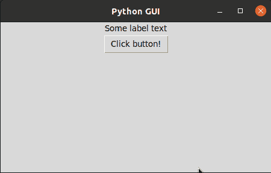
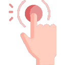
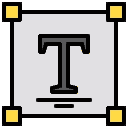
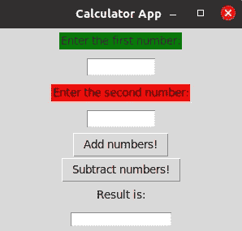

# Python 图形用户界面应用

> 原文：<https://towardsdatascience.com/python-gui-app-in-no-time-ea7282e33024?source=collection_archive---------8----------------------->

## Tkinter 图书馆的近距离观察

当今应用程序最重要的部分之一是图形用户界面本身。

这是因为市场竞争激烈，已经饱和，甚至不再关注功能，而是谁能让它看起来更漂亮，使用起来更简单。

今天我们将学习如何用最流行的编程语言之一 **Python** 创建和构建 GUI 应用程序。

这个简短的教程将会逐行解释，并且非常容易理解，尽管你可能没有太多 Python 或编程的经验。



# 环境

对于这个应用程序的开发，你不会需要太多，如果你已经熟悉 Python，你可以跳到本文的下一章。

代码和软件开发我个人选择的是 [**Visual Studio 代码**](https://code.visualstudio.com/) 。

接下来，我们需要安装 Python，所以如果你使用的是 Ubuntu 或类似的 Linux 发行版，Python 是预装的。

如果不是这样，您可以像这样安装它:

```
sudo apt-get install software-properties-common
sudo add-apt-repository ppa:deadsnakes/ppa
sudo apt-get update
sudo apt-get install python3.8
```

> *在撰写本文时，Python 3.8 是最新的稳定版本，建议 PPA 使用 deadsnakes。

在其他操作系统上，如 [windows](https://www.python.org/downloads/windows/) 或 [mac](https://www.python.org/downloads/mac-osx/) ，您将通过下载可执行安装并运行它来安装它。

## Tkinter 库

我们还必须安装用于开发的 Tkinter 库:

```
sudo apt-get install python3-tk
```

`[tkinter](https://docs.python.org/3/library/tkinter.html#module-tkinter)`包(“Tk 接口”)是 Tk GUI 工具包的标准 Python 接口。



# 编码

在我们开始导入所需库的编码时:

```
import tkinter
```

一旦我们导入了它们，我们就能够在我们的代码中使用它们，通常，您的代码编辑器将能够从那些库中识别出**关键字**，并尽可能地使您的输入更容易。

接下来是创建窗口，我们将使用它来添加元素并作为 GUI 应用程序的主窗口。

```
window = tkinter.Tk()
```

> Tk 的顶层小部件，主要代表应用程序的主窗口。它有一个相关的 Tcl 解释器。

初始化**窗口**后，你所要做的就是调用 Tk 的主循环，它将执行你为 GUI 设置的所有命令。

```
window.mainloop()
```

主循环负责任何**事件**，比如按钮点击或者文本框输入，从运行到窗口关闭。

使用以下命令运行 Python 文件:

```
python3 GUI.py
```



**这里是我们的第一个窗口！**

这只是我们应用程序的开始，我们接下来要做的是**定制**我们的窗口！

## 标题

向我们的窗口添加标题非常简单:

```
window.title("Python GUI")
```



“Python GUI”主窗口

*这里需要注意的一件重要事情是，我们希望为我们的窗口执行的每一条* ***命令*** *都必须在“window.mainloop()”之前，因为否则它不会显示在 GUI 中。*

## 窗口大小

设置一个特定的窗口大小是相当重要的，因为你可能需要更多的空间来放置我们稍后将要添加的元素！

方法是:

```
window.geometry("450x250")
```

第一部分是**宽度**，后面是分隔为“x”和**高度**的数字。

设置完基本的窗口设置后，我们就可以向 GUI 应用程序添加元素了。



# 元素

这里我们可以使用不同种类的元素，它们是由 Tkinter 库提供给我们的，但是我们将把重点放在对每个 GUI 应用程序最重要的四个元素上。
分别是:**标签**、**按钮**、**条目(输入**)、**和文本**

## 标签

在每一个 GUI 中，为使用程序的用户创建某种文本显示是很重要的。

```
label = tkinter.Label(window, text="Some label text",width = 50)
```

我们将标签保存在名为“变量”的变量下，并将其定义为属于我们的主“窗口”，包含一些文本，并且可以定义额外的参数，如宽度等。

定义标签后的一个重要步骤是，我们必须将它打包并设置到窗口中。有一个名为 pack()的函数正好可以做到这一点:

```
label.pack()
```

该几何管理器在将微件放入父微件之前，将微件组织成块。


## 纽扣

我们使用按钮来执行某种类型的命令或我们的应用程序可能需要的后端功能。

因为我们需要某种功能，所以我们定义‘clicked’来在每次按钮被点击时创建一个新标签。

```
def clicked():
  label = tkinter.Label(window, text="Button label",width = 50)
  label.pack()butt = tkinter.Button(window, text="Click button!", command=clicked,width = 10)butt.pack()
```



每次**点击**按钮，都会创建一个带有类型标签的新对象，显示在前一个对象的下方。



## 条目(文本框)

这个元素在 Tkinkter 库中被称为**条目**，但对于许多其他编程语言来说，它在术语**文本框**下也很常见。

让我们看看如何实现它:

```
entry = tkinter.Entry(window, width=10)entry.pack()
```

Entry 元素的有用功能是我们可以检索用户在里面写了什么，但是在**二进制转换器**的例子中有更多的内容。


## 文本

专门的文本框，比常规条目更具可定制性。

我们是这样使用它的:

```
text = tkinter.Text(window, width=20, height=5)text.insert(tkinter.INSERT, "Hello")text.insert(tkinter.END, "World")text.pack()
```

我们有像 INSERT 和 END 这样的参数，所以我们可以指定我们想要的文本的位置。欲了解更多信息，请点击[这里](http://effbot.org/tkinterbook/text.htm)。



一旦我们完成了所有必要的元素，让我们用刚刚学到的知识来构建一个实际的应用程序。

# 从头开始构建我们自己的应用程序

我们应该创造一些对我们有意义和有用的东西。

我的第一个想法是**简单的计算器**，这样我们可以利用我们在教程中谈到的所有元素。



让我们来看看我在这里写的完整代码:

我们基本上使用了我们讨论过的所有元素，我在 **add** 和 **sub** 函数中创建了简单的文本和条目操作。

每次单击添加两个数字时，文本元素都会被清除，并插入新值。
还有 ValueError 处理，它将捕捉除数字之外的任何内容，这很好。

以下是教程和计算器示例的完整代码。

[](https://github.com/lazargugleta/Python-Gui) [## lazargugleta/Python-Gui

### 在 GitHub 上创建一个帐户，为 lazargugleta/Python-Gui 开发做出贡献。

github.com](https://github.com/lazargugleta/Python-Gui) 

今天就到这里吧，我美丽的人们。

# 结论和后续步骤

这只是一个非常简单的 Python 图形用户界面，在我看来，如果每个人都跟着做，他们就能做到！

虽然简单，但它是一个非常强大的软件，可以用来创建现实世界的应用程序！

保持创意，关注我以获得更多像这样的教程！

[](http://medium.com/@lazar.gugleta)[](https://twitter.com/LazarGugleta)[](https://www.linkedin.com/in/lazargugleta/)