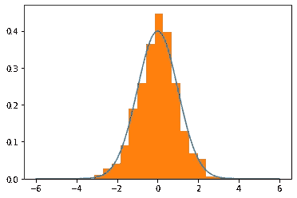

# Python:从头开始的哈密顿蒙特卡罗

> 原文：<https://towardsdatascience.com/python-hamiltonian-monte-carlo-from-scratch-955dba96a42d?source=collection_archive---------10----------------------->

## 物理学和统计学即将发生碰撞，这并不像你想象的那么可怕


信用:Pixabay

如果你对马尔可夫链蒙特卡罗(MCMC)方法的体验和我一样，那就是无止境的寻找答案。每当你得到一个问题的答案，就会有十几个问题冒出来！你不断地学习你不知道的东西。我最近接受了一份全职工作，在一个组织担任数据科学家，该组织广泛使用贝叶斯统计，并通过扩展使用 MCMC 方法。所以我决定和这个数学分支一战到底！关于 Metropolis，Metropolis-Hastings，*和*哈密顿蒙特卡罗的详细回顾，请访问我的[公共 Google Colab 笔记本](https://colab.research.google.com/drive/1YQBSfS1Nb8a9TAMsV1RjWsiErWqXLbrj#scrollTo=wKD7ltATG588):)

在深入研究新材料之前，我将重温 Metropolis-Hastings (MH)背后的关键思想，因为哈密顿蒙特卡罗(HMC)是 MH 的扩展。

## 大都会黑斯廷斯

大都会-黑斯廷斯是一个美化的随机漫步。你需要四个要素:一个起点，一个目标分布，一个提案分布，一个公正的评委(随机事件。)目标分布可以是您想要从中取样的任何分布；你需要的只是概率密度函数(PDF)。同样，建议分布可以是任何 PDF(尽管如果分布是对称的，数学会更简单。)整个想法是从使用建议分布的随机点开始。将其追加到数组中。将这一点输入目标的 PDF 以获得概率密度(也称为可能性)。现在，通过建议分布生成一个扰动，将它添加到当前位置，为这个变量指定一个新名称，并通过目标的 PDF 评估它的可能性。比较可能性

`acceptance = target_PDF(proposed)/target_PDF(current)`

这个数字将落在[0，inf 范围内的任何地方。如果小于 1，你有 x%的机会移动。任何高于 1 的都是保证运动。这就是“公正的法官”的用武之地。观察一个随机事件(通常是从均匀分布中抽取的[0，1]中的一个数。)如果这个数字小于或等于接受度，您就移动到建议点。否则，你留在原来的位置。将获胜者追加到数组中。这就是大都会算法。

如果提案分布不对称，事情会稍微复杂一些*。如果你从正态分布、均匀分布等中抽取运动样本，这一步是不必要的。但是，如果使用分布，如伽玛、泊松、指数、对数正态等。那么你需要考虑固有的偏见。在我在开头链接的 Colab 笔记本中，我使用了一个β建议分布，带有一个(-0.5 常数项)，偏向 1(与对称或偏向 0 相反。)需要注意两件事:**首先**，Beta 分布被定义为[0，1]意味着我们将永远不会观察到负扰动，这意味着我们的建议将越来越多地只向一个方向移动。我增加了-0.5 的偏置，这样正负样本就可以对扰动进行采样。**第二个**，不过，分布还是偏向 1，也就是说它只会在*一个方向慢慢蠕动。我们需要对此做出解释。我们通过获得扰动和*反向*扰动的可能性来做到这一点。**

```
def correct(prop,curr,a=3,b=2):
    x0 = curr - prop + 0.5
    x1 = prop - curr + 0.5
    b0 = beta.pdf(x=x0, a=a, b=b)
    b1 = beta.pdf(x=x1, a=a, b=b)
    return b0/b1
```

这个修正项(你将在 Colab 笔记本中看到)乘以似然比；它解释了提议分布的不对称性。(注意，这个比率被称为黑斯廷斯比率，因为它是 Metropolis 和 MH 算法之间的唯一区别。)

您可以使用 MH 算法从大多数分布中进行采样。然而，在一天结束时，它基本上是一次随机漫步。没有逻辑告诉我们在当前位置应该有多大的跳跃。当对 1 变量分布进行采样时，这不是问题。但是随着维度的增加，高可能性区域仅构成总面积的一小部分，而中等和低可能性区域构成(指数地)总面积的更多部分。当对低维分布进行采样时，这种效应对 MH 仅造成轻微的低效。但是随着维数的增加，MH 冒着返回不代表目标分布的样本的风险。

> 原因是在峰值附近进行小幅度跳跃是合适的，因为相对于其可能性而言，过度勘探该区域的风险较低；然而，当我们向尾部移动时，相对于它们的可能性，对这些区域的过度勘探会成为一个相当大的风险。(从上下文来看，一条尾巴上有许多样本而另一条尾巴上没有样本是不可取的。)那么…我们如何在考虑可能性的情况下提出跳跃呢？

## 哈密顿蒙特卡罗

物理学有答案——万岁！在这篇文章的剩余部分，我们不会把地点看成是随机漫步。相反，我们将把分布的绝对峰值视为一个行星。一颗卫星将环绕这颗行星运行，收集样本。哈密顿力学使用微分方程将动能和势能联系起来。这些微分方程有非常棘手的精确解，但使用蛙跳积分友好的近似解。微分方程的积分将给出我们的卫星将遵循的路径。这些微分方程(或哈密顿方程)根据动能和势能定义了系统的能量。当你把球抛向空中时，它的动能被势能所代替。当球下落时，它的势能被动能所代替。哈密尔顿方程定义了位置和动量之间的关系:

```
T = time
Q = position 
P = momentum 
K = kinetic energy
V = potential energydQ/dT = P
dP/dT = dV/dQ 
```

*请注意，上述等式是在统计学背景下推导出来的。物理世界必然要复杂得多。*

值得注意的是，我们的微分方程是 dQ/dT，位置 wrt(相对于)时间的变化，和 dP/dT，动量 wrt 时间的变化，其评估为势能 wrt 位置的变化。我们可以根据 PDF 本身来定义位置。因此，动量的变化是 PDF 中位置*的函数，也就是离峰值的距离。请注意，正态分布的梯度分别在峰值和尾部之间的拐点处最陡。相反，负对数正态分布的梯度在尾部最陡，接近峰值时接近(并达到)0。正如我们之前讨论的:我们希望我们的跳跃大小 ro 与分布中的位置成比例。在接近顶峰时，我们想进行小幅度的跳跃。当我们接近尾部时，我们希望跳跃越来越大。事实证明，负对数正态分布梯度完美地实现了这一效果。(*而正态分布梯度会从峰值* ***和尾部*** *提出小的跳跃，这是我们不想要的！)**


分布与梯度

## 该算法

该算法分为四个部分:

1.  **设置**:取前一个位置复制，这样你就有了 q0 和 q1。从 N(0，1)中随机采样一个动量，然后复制，这样你就有了 p0 和 p1。对于单变量高斯，求 PDF 相对于位置`-(x-mu)/sigma^2`的梯度。
2.  **蛙跳**:使用蛙跳积分更新 q1 和 p1(即哈密顿运动或一个质点。)实际上，这是最敏感的部分；小的调整会导致不稳定的行为。
3.  **MH Dance** :最后，将 p1 乘以(-1)，这保证了可逆性(即**给定动量 p0 可以从 q0 到达 q1，给定动量-p1** 可以从 q1 到达 q0)。这给了我们大都会-黑斯廷斯“舞蹈”所需要的信息。请记住，我们使用的是负对数概率，所以数学就是加法和减法。然后接受/拒绝移动。
4.  重复固定次数的迭代。

你可能已经注意到，在第一步中，我们从一个高斯样本中抽取动量。这是怎么回事？使用我们之前的卫星比喻，哈密顿运动将引导我们围绕特定可能性的轨道路径(访问与相同可能性相关的位置)。)然而，我们对探索一种可能性不感兴趣，我们想探索所有的可能性。为了实现这种效果，我们对动量“踢”进行采样，这可能导致我们的卫星跳跃或坠落轨道距离(也称为访问不同的可能性。)

## 代码

再来看看性能！



N(0，1) HMC 采样器输出

## 扩展ˌ扩张

如果你想运行我的代码，请从头跳到 Google Colab 链接。您只有查看权限，没有编辑权限——但是您可以复制到您自己的 Google Drive 进行实验，下载 iPython 笔记本文件，等等。如果您仔细研究代码，您会注意到路径长度和步长是非常敏感的超参数。最轻微的调整可能会导致无意义的样本。这是基于梯度的 MCMC 采样器的诅咒。然而，还有希望——更新的方法，如无 U 形转弯采样器(NUTS ),通过动态选择路径长度和步长来构建 HMC。

但是为什么这是一个问题呢？从我们假设的卫星轨道示例来看，哈密尔顿方程将指导卫星的运动，“围绕”特定的可能性，这意味着它提出了类似可能性附近的新位置。但是围绕任何给定可能性的轨道长度是不同的。在较高的可能性下，圆周很小，但是当环绕较低的可能性(更接近尾部)时，圆周更大。)我们可以通过简单地观察高斯分布来直观地证实这一点。当 me 围绕给定的可能性做 360°轨道运动时会发生什么？我们提出我们目前的相同观点。在 HMC 的行话中，这被称为“U 型转弯”，意思是我们回到我们刚刚去过的地方。对路径长度和步长的动态调整控制了整合的程度(轨道路径。)如果你稍微摆弄一下代码，你就会发现，这些超参数非常敏感——因此在实践中你很可能会使用[螺母](https://arxiv.org/abs/1111.4246)而不是 HMC。

我必须给它应得的荣誉。谷歌的软件工程师科林·卡罗尔写了一个更具伸缩性的 HMC 实现。(我的只能用来采样一元高斯。)可扩展性是有代价的——可解释性。我发现要真正“理解”这个概念，我必须把它变得愚笨，然后从头开始构建一个。希望你喜欢这本书！

感谢您的阅读——如果您认为我的内容没问题，请订阅！:)