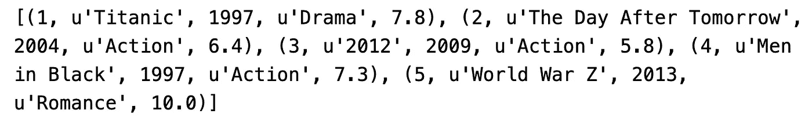
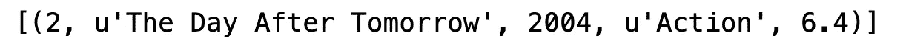
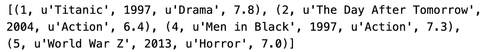

# Python 有一个内置的数据库——下面是如何使用它

> 原文：<https://towardsdatascience.com/python-has-a-built-in-database-heres-how-to-use-it-47826c10648a?source=collection_archive---------2----------------------->

## 如何利用内置数据库进行数据存储和操作

数据库是存储数据的一种伟大、安全和可靠的方式。所有主要的关系数据库都有一个共同点——SQL——一种操作数据库、表和数据的语言。SQL 是一个涉及面很广的话题，尤其是在与不同的数据库供应商打交道时，比如 Microsoft、IBM 或 Oracle，所以让我们从 SQLite 开始，它是最轻量级的数据库系统。


克里斯蒂娜@ wocintechchat.com 在 [Unsplash](https://unsplash.com/s/photos/server?utm_source=unsplash&utm_medium=referral&utm_content=creditCopyText) 上的照片

*那么，SQLite 是什么？很高兴你问了这个问题。它是一个为我们提供数据库或关系数据库管理系统的库。术语“Lite”的意思是“轻量级”，这意味着它对于数据库领域的设置和管理来说是轻量级的。*

我为什么要关心？因为你不需要下载软件或创建云数据库，然后弄清楚如何与 Python 连接，就可以获得数据库体验。当然，这不是最安全的选择，但它仍然远远胜过 CSV 和 Excel 文件，因为每个人都不能更改数据。

今天的文章结构如下:

*   问题概述
*   创建表格
*   创建、读取、更新、删除
*   测试时间
*   结论

因此，我们将介绍一些基础知识——如何创建表、插入数据、更新数据、删除数据、获取所有数据以及根据条件获取数据。它是构建应用程序所需的一切。

# 问题概述

你喜欢电影吗？是啊，我也是。今天，我们将通过创建一个数据库和一个表来存储电影标题和附加信息，来关注这一点。在我们制作好表格之后，我们需要声明几个函数:

*   要插入电影
*   获取所有电影
*   去买一部电影
*   若要更新单部电影
*   若要删除单部电影

听起来很多，其实不是。我们将使用 Python 与 SQLite 数据库通信，并且我们将从[IMDB.com](https://www.imdb.com/)获取电影信息。

厉害！我们开始吧！

# 创建表格

我们不能直接在数据库中存储数据，我们需要表格。数据库存储表，表存储数据。我们的过程如下——仅当 **movies** 表不存在时才创建它。这将需要两个 SQL 查询，一个检查具有给定名称的表是否存在，另一个创建一个表。

首先，我们需要导入 *SQLite 库*，建立一个数据库连接，并创建一个游标。下面的代码片段可以做到这一点:

```
import sqlite3 conn = sqlite3.connect('movies.db') 
c = conn.cursor()
```

如果 **movies.db** 数据库不存在，它将被创建，如果存在，只建立一个连接。

接下来，我们将声明一个函数来检查一个表是否存在。表名作为函数参数传递，如果表存在，则返回 *True* ，否则返回 *False* :

```
def table_exists(table_name): 
    c.execute('''SELECT count(name) FROM sqlite_master WHERE TYPE = 'table' AND name = '{}' '''.format(table_name)) 
    if c.fetchone()[0] == 1: 
        return True 
    return False
```

新的 f-strings 由于某种原因不能工作，所以我们必须使用旧的语法——这不是问题，但是请记住这一点。下一步是使用声明的函数检查一个表是否存在，如果不存在就创建它。下面的代码片段可以做到这一点:

```
if not table_exists('movies'): 
    c.execute(''' 
        CREATE TABLE movies( 
            movie_id INTEGER, 
            name TEXT, 
            release_year INTEGER, 
            genre TEXT, 
            rating REAL 
        ) 
    ''')
```

厉害！这部分到此结束，我们接下来将进入有趣的内容。

# 创建、读取、更新、删除

好了，我们已经配置好了一切，现在是处理数据的时候了。首先，我们需要一个向表中插入电影的函数(创建部分)。这很容易编写，因为我们需要执行一个 INSERT 语句并提交事务。代码如下:

```
def insert_movie(movie_id, name, release_year, genre, rating): 
    c.execute(''' INSERT INTO movies (movie_id, name, release_year, genre, rating) VALUES(?, ?, ?, ?, ?) ''', (movie_id, name, release_year, genre, rating)) 
    conn.commit()
```

就是这样！我们将测试部分留到以后，现在我们将继续进行*读取*部分。

我们将在这里声明两个函数——第一个获取所有电影，第二个只获取一个电影，由电影 ID 指定。您可以轻松地将逻辑浓缩到一个函数中，但是我选择了这种方法。

下面是获取所有电影的函数:

```
def get_movies(): 
    c.execute('''SELECT * FROM movies''') 
    data = [] 
    for row in c.fetchall(): 
        data.append(row) 
    return data
```

获取一部电影的代码片段:

```
def get_movie(movie_id): 
    c.execute('''SELECT * FROM movies WHERE movie_id = {}'''.format(movie_id)) 
    data = [] 
    for row in c.fetchall():  
        data.append(row) 
    return data
```

太好了！接下来是*更新*部分。这个比较棘手。我们希望根据给定的电影 ID 更新元素，但是我们将更新什么呢？我们是否为每个字段声明了一个特定的函数？听起来不太对劲。我们将使用字典来执行更新。

我来详细说明一下。我们的更新函数将接受两个参数:

*   电影 ID —您要更新的电影的 ID
*   更新字典—要更新的键/值对

更新字典中的键必须根据表列命名，否则会引发异常。此外，我们需要处理数字和文本字段的更新。这是迄今为止最棘手的函数，但是您可以处理它:

```
def update_movie(movie_id, update_dict): 
    valid_keys = ['name', 'release_year', 'genre', 'rating'] 
    for key in update_dict.keys():  
        if key not in valid_keys: 
            raise Exception('Invalid field name!')     for key in update_dict.keys(): 
        if type(update_dict[key]) == str: 
            stmt = '''UPDATE movies SET {} = '{}' WHERE movie_id = {}'''.format(key, update_dict[key], movie_id) 
        else: 
            stmt = '''UPDATE movies SET {} = '{}' WHERE movie_id = {}'''.format(key, update_dict[key], movie_id)         c.execute(stmt) 
    conn.commit()
```

看到了吗？没那么难。让我们完成*删除*部分。它比前一个简单得多，因为我们只需要执行一条语句并提交事务。代码如下:

```
def delete_movie(movie_id): 
    c.execute('''DELETE FROM movies WHERE movie_id = {}'''.format(movie_id)) 
    conn.commit()
```

这部分到此结束。接下来我们将测试我们的函数。

# 测试时间

首先，让我们插入几部电影:

```
insert_movie(1, 'Titanic', 1997, 'Drama', 7.8) 
insert_movie(2, 'The Day After Tomorrow', 2004, 'Action', 6.4) 
insert_movie(3, '2012', 2009, 'Action', 5.8) 
insert_movie(4, 'Men in Black', 1997, 'Action', 7.3) 
insert_movie(5, 'World War Z', 2013, 'Romance', 10)
```

执行这五行代码不会像预期的那样向控制台输出任何内容——我们只是向表中插入数据。接下来，我们将使用预定义的函数来抓取所有电影:

```
print(get_movies())
```



厉害！现在让我们只看一部电影:

```
print(get_movie(2))
```



这很简单。现在我们来看看如何更新电影。最后一个插入的是*世界大战 Z* ，故意给了 10 分和一个*爱情*类型，所以让我们改变一下:

```
update_movie(5, {'genre': 'Horror', 'rating': 7.0})
```


现在事情说得通了。剩下要做的唯一一件事就是删除一部电影——让我们看看如何做:

```
delete_movie(3)
```

这不会像预期的那样返回任何内容。我们可以快速获取所有电影，看看删除功能是否有效:



这就做到了——一切都像广告宣传的那样。让我们在下一部分总结一下。

# 在你走之前

我希望这很容易理解。我们讨论了基础知识，留下了许多未触及的东西。构建基本的、数据库驱动的应用程序或 API 已经足够了，但是以后可以更多地使用 API。

请随意扩展它，添加新的函数或表，或者提高整体代码质量。

感谢阅读。

[**加入我的私人邮件列表，获取更多有用的见解。**](https://mailchi.mp/46a3d2989d9b/bdssubscribe)

*喜欢这篇文章吗？成为* [*中等会员*](https://medium.com/@radecicdario/membership) *继续无限制学习。如果你使用下面的链接，我会收到你的一部分会员费，不需要你额外付费。*

[](https://medium.com/@radecicdario/membership) [## 通过我的推荐链接加入 Medium-Dario rade ci

### 作为一个媒体会员，你的会员费的一部分会给你阅读的作家，你可以完全接触到每一个故事…

medium.com](https://medium.com/@radecicdario/membership) 

*原载于 2020 年 10 月 1 日 https://betterdatascience.com*[](https://betterdatascience.com/python-has-a-built-in-database-heres-how-to-use-it/)**。**